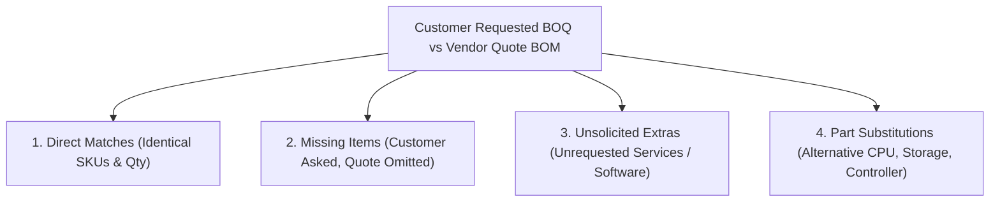

# BOM Reconciliation & Vendor Quote Difference Analyzer (`bom-reconciliation-skill`)

When sales engineers receive both a customer's original specification and an official vendor partner quote (or need to audit a quote before submitting to CLIC/OCA), this skill directs the agent to perform an automated, forensic line-by-line reconciliation.

---

## 🔍 The 4 Reconciliation Audit Dimensions

Every BOM comparison audits 4 distinct categories of variances:



### 1. Direct Part Number & Quantity Alignment
- Validates identical part numbers across both documents.
- Checks quantity multipliers ($N$-node tender multiplication vs single-node base configuration).
- Flags fractional anomalies or quantity discrepancies.

### 2. Omitted / Missing Customer Hardware
- Flags critical customer requirements that the vendor omitted from the quote (e.g. customer specified 2x 100GbE NICs, but vendor only quoted 1x 25GbE NIC).
- Explains the operational risk to the customer's intended workload.

### 3. Unsolicited Extras & Gold-Plating (`INV-32`)
- **Strict Invariant Check**: Partner portal quotes frequently bundle unrequested high-margin services:
  - `HA114A1` (Installation and Startup Service)
  - `HA114A1 5A6` (Onsite Startup Service)
  - `S1A05A` (Unsolicited SaaS Software Subscriptions)
- The reconciliation engine flags these as `[UNSOLICITED_EXTRA_COST]` and calculates the exact CapEx savings achieved by stripping them.

### 4. Component Substitutions & Pivots
- Identifies where the vendor swapped a customer part:
  - **Legitimate Technical Pivots (`INV-39`)**: Swapping an OCP controller to PCIe standup (`MR416i-p`) to preserve customer's requested OCP networking.
  - **Supply Chain Substitutions**: Swapping an obsolete or restricted CPU (e.g. Xeon 8480+ to Xeon 8580).
  - **Downgrades**: Swapping NVMe Mixed-Use (MU) SSDs to Read-Intensive (RI) SSDs without customer consent.

---

## 📑 Financial & Contractual Compliance Check

1. **Unit List Price & Historical Drift (`INV-33`, `INV-34`)**:
   - Cross-references quoted unit list prices against certified `catalog.json` and `price_history.json`.
   - Flags quotes rendering unbundled temporary `$0.00` items or artificial markups.
2. **CTO Container Tree Tagging (`INV-25`)**:
   - Verifies that all internal server components (memory, CPU, drives, controllers) include the `#0D1` / `-F21` FIO suffix.
   - BTO parts (`-B21` without `#0D1`) placed inside CTO base chassis containers will fail vendor configurator compile with CLIC Rules 81354490 & 91001655.
3. **Automated Subtotal & Separator Contract (`INV-37`)**:
   - Formats outputs into the standardized 7-column schema:
     `['Part No', 'Qty', 'Set', ' Description', 'Unit List Price (USD)', 'Extended Price (USD)', 'Portal / CLIC Status']`
   - Inserts `CONFIG #N SUBTOTAL:` rows and 2-line separator gaps between distinct server clusters.

---

## 💻 CLI Reconciliation Tools & Commands

```bash
# Cross-verify vendor BOM against evaluated Rank 1 baseline
node -e "
  const { verifyVendorBOM } = require('./scripts/lib/boq/bom_verifier.js');
  const quote = JSON.parse(require('fs').readFileSync('quote_items.json', 'utf-8'));
  const baseline = JSON.parse(require('fs').readFileSync('rank1_items.json', 'utf-8'));
  console.log(verifyVendorBOM(quote, baseline, 'outputs/ProLiant/Gen12/DL380_Gen12'));
"

# Generate standardized 7-column Partner Upload workbook
node scripts/catalogs/generate_tender_partner_bom.js
```
