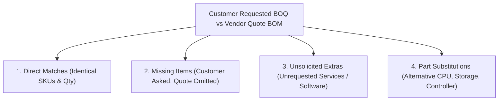

# BOM Reconciliation & Vendor Quote Difference Analyzer (`bom-reconciliation-skill`)

When sales engineers receive both a customer's original specification and an official vendor partner quote (or need to audit a quote before submitting to CLIC/OCA), this skill directs the agent to perform an automated, forensic line-by-line reconciliation.

---

## 🔍 The 4 Reconciliation Audit Dimensions

Every BOM comparison audits 4 distinct categories of variances:



### 1. Direct Part Number & Quantity Alignment (`INV-117`)
- **Quantity as Physical Anchor (Rule 6)**: The CTO base chassis quantity serves as the cluster node multiplier anchor ($N = \text{serverCount}$).
- **Pre-Multiplied BOQ Normalization (Rule 38)**: Decomposes pre-multiplied cluster tenders into single-node base configurations ($Q_{\text{node}} = Q_{\text{total}} / N$) to enable 1-to-1 reconciliation against vendor per-node quotes.
- **Hardware Spec Neutralization (Rules 5 & 43)**: Neutralizes embedded hardware specification strings (`x8`, `x16`, `4x`, `#`, `Gen5`) so regex extractors do not misinterpret them as quantity multipliers.
- **Service Quarantining (Rule 44)**: Filters out service SKUs and install descriptions (e.g. `HA113A1 5A6` "HPE Proliant DL/ML Install SVC") to prevent false detection as server chassis.
- **Spares & Services Immunity (Rules 4 & 36)**: Protects order-level services (`HA113A1`), warranties (`HU4B2A3`), spares, and bulk accessories (`804943-B21` lift handles) from division/multiplication (`nodeMult = 1`).
- **Section Breakdown Pricing Invariant (Rules 15 & 33)**: Extended totals are derived strictly formulaically ($\sum Q_{\text{node}} \times N \times \text{UnitPrice}$) rather than copied from raw text.
- Flags fractional anomalies, missing multipliers, or quantity discrepancies.

### 2. Omitted / Missing Customer Hardware
- Flags critical customer requirements that the vendor omitted from the quote (e.g. customer specified 2x 100GbE NICs, but vendor only quoted 1x 25GbE NIC).
- Explains the operational risk to the customer's intended workload.

### 3. Unsolicited Extras & Gold-Plating (`INV-32`)
- **Strict Invariant Check**: Partner portal quotes frequently bundle unrequested high-margin services:
  - `HA114A1` (Installation and Startup Service)
  - `HA114A1 5A6` (Onsite Startup Service)
  - `S1A05A` (Unsolicited SaaS Software Subscriptions)
- The reconciliation engine flags these as `[UNSOLICITED_EXTRA_COST]` and calculates the exact CapEx savings achieved by stripping them.

### 4. Component Substitutions & Pivots
- Identifies where the vendor swapped a customer part:
  - **Legitimate Technical Pivots (`INV-39`)**: Swapping an OCP controller to PCIe standup (`MR416i-p`) to preserve customer's requested OCP networking.
  - **Supply Chain Substitutions**: Swapping an obsolete or restricted CPU (e.g. Xeon 8480+ to Xeon 8580).
  - **Downgrades**: Swapping NVMe Mixed-Use (MU) SSDs to Read-Intensive (RI) SSDs without customer consent.

---

## 📑 Financial & Contractual Compliance Check

1. **Unit List Price & Historical Drift (`INV-33`, `INV-34`)**:
   - Cross-references quoted unit list prices against certified `catalog.json` and `price_history.json`.
   - Flags quotes rendering unbundled temporary `$0.00` items or artificial markups.
2. **CTO Container Tree Tagging (`INV-25`)**:
   - Verifies that all internal server components (memory, CPU, drives, controllers) include the `#0D1` / `-F21` FIO suffix.
   - BTO parts (`-B21` without `#0D1`) placed inside CTO base chassis containers will fail vendor configurator compile with CLIC Rules 81354490 & 91001655.
3. **Automated Subtotal & Separator Contract (`INV-37`)**:
   - Formats outputs into the standardized 7-column schema:
     `['Part No', 'Qty', 'Set', ' Description', 'Unit List Price (USD)', 'Extended Price (USD)', 'Portal / CLIC Status']`
   - Inserts `CONFIG #N SUBTOTAL:` rows and 2-line separator gaps between distinct server clusters.

---

## 💻 CLI Reconciliation Tools & Commands

```bash
# Reconcile two BOMs (customer request vs vendor quote) — primary entry point
node scripts/lib/boq/vendor_bom_verifier.js --customer customer_boq.xlsx --vendor vendor_quote.xlsx --catalog outputs/ProLiant/Gen12/DL380_Gen12

# Programmatic reconciliation via Node.js
node -e "
  const { verifyVendorBOM } = require('./scripts/lib/boq/vendor_bom_verifier.js');
  const quote = JSON.parse(require('fs').readFileSync('quote_items.json', 'utf-8'));
  const baseline = JSON.parse(require('fs').readFileSync('rank1_items.json', 'utf-8'));
  console.log(JSON.stringify(verifyVendorBOM(quote, baseline, 'outputs/ProLiant/Gen12/DL380_Gen12'), null, 2));
"

# Generate standardized 7-column Partner Upload workbook from reconciliation output
node scripts/catalogs/generate_tender_partner_bom.js
```

> **Note**: The actual verifier module is [`vendor_bom_verifier.js`](file:///home/vinodh/vendorNotebookSolution/scripts/lib/boq/vendor_bom_verifier.js) located in `scripts/lib/boq/`, not `scripts/evaluators/verify_vendor_bom.js`.

---

## 📊 Reconciliation Output Schema

The verifier produces a structured JSON with these 4 audit dimensions:

```json
{
  "reconciliation": {
    "directMatches": [
      { "sku": "P73289-B21", "description": "Xeon Platinum 8580", "customerQty": 2, "vendorQty": 2, "status": "MATCH" }
    ],
    "missingItems": [
      { "sku": "P10115-B21", "description": "25GbE OCP3 NIC", "customerQty": 1, "risk": "CRITICAL — primary network adapter omitted" }
    ],
    "unsolicitedExtras": [
      { "sku": "HA114A1", "description": "Installation and Startup Service", "vendorQty": 1, "unitPrice": 1500.00, "capExImpact": 1500.00, "flag": "UNSOLICITED_EXTRA_COST" }
    ],
    "substitutions": [
      { "customerSku": "P73289-B21", "vendorSku": "P73299-B21", "type": "SUPPLY_CHAIN", "rationale": "Xeon 8580 → Gold 6548Y downgrade without customer consent" }
    ],
    "summary": {
      "totalDirectMatches": 12,
      "totalMissing": 1,
      "totalExtras": 2,
      "totalSubstitutions": 1,
      "customerCapEx": 45230.00,
      "vendorCapEx": 47890.00,
      "netCapExDelta": 2660.00,
      "savingsFromStrippingExtras": 2150.00
    }
  }
}
```

---

## 🔗 Execution Trace Integration

When BOM reconciliation runs through the agent harness, it records these steps in the execution trace (per `execution-trace-skill`):

| Step | Name | Verification Gates |
|------|------|-------------------|
| 1 | Dual Document Ingestion | ✅ Both BOMs loaded · ✅ ≥5 items each · ✅ SKU format valid |
| 2 | Line-by-Line SKU Alignment | ✅ All 4 dimensions populated |
| 3 | Financial & Compliance Audit | ✅ Prices cross-referenced · ✅ FIO tags checked · ✅ Extras flagged |
| 4 | Report Assembly | ✅ Net CapEx delta calculated · ✅ 7-column schema compliance |

