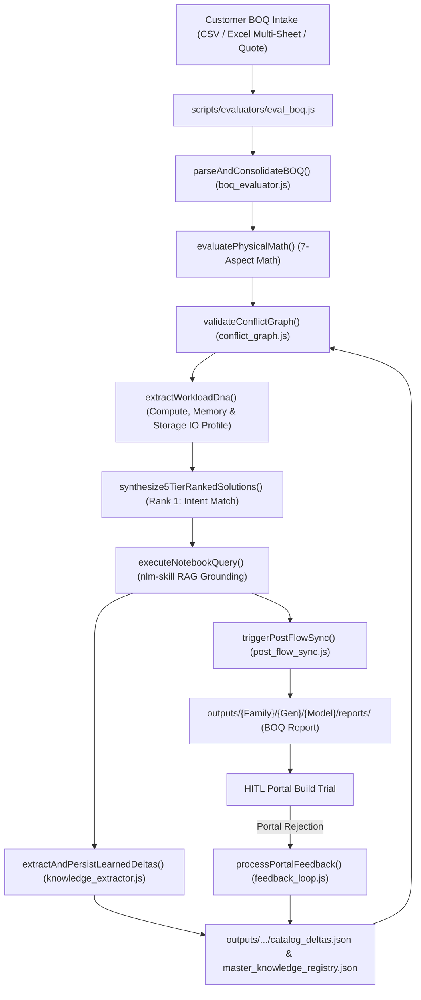

# Pre-Flight BOQ Evaluation & Closed-Loop Feedback Skill (`boq-eval-skill`)

---

## 1. Overview & Workflow Lifecycle (Workflow 2)

This skill provides an automated, agentic workflow representing **Workflow 2 (Pre-Flight Evaluation)** of the dual-workflow paradigm. It ingests raw customer BOQs, pre-cleans input data, runs deterministic 6-aspect physical math assertions, executes 5-level dependency conflict graph validation, profiles Workload DNA, dynamically routes to Gemini Notebook RAG via `notebooks.json`, and outputs the results to the dashboard and a dynamically generated **Corrected BOQ Excel workbook**.



---

## 2. Phase-by-Phase Execution Engine

### Phase 1: Ingestion & Multi-Sheet Multi-Config Engine
- **Module**: [`scripts/lib/boq/boq_evaluator.js`](file:///home/vinodh/vendorNotebookSolution/scripts/lib/boq/boq_evaluator.js), [`scripts/lib/boq/boq_preprocessor.js`](file:///home/vinodh/vendorNotebookSolution/scripts/lib/boq/boq_preprocessor.js) & [`scripts/lib/boq/boq_parser.js`](file:///home/vinodh/vendorNotebookSolution/scripts/lib/boq/boq_parser.js)
- **Functions**: `parseAndConsolidateBOQ(rawContent, filePath)`, `preprocessAndGroupBOQ(rawInput, filePath, options)`, `parseSkuLines(lines)`, `detectAndNormalizeAtomicCto(items)`
- **Capabilities**:
  - **Multi-Unit CTO Normalization**: Resolves $N$-unit multiplied quotes (e.g. 5x DL380 server orders) into atomic 1-unit server profiles, normalizing CPU, RAM, storage, and accessory counts.
  - **5-Stage Preflight Cleansing Workflow**:
    1. *Stage 1*: Base Chassis & CTO Multiplier Detection
    2. *Stage 2*: Atomic Integer Division & Fractional Anomaly Check
    3. *Stage 3*: Scraped Category & Subcategory Limits Check
    4. *Stage 4*: Physical Aspect Math Guardrails
    5. *Stage 5*: Pre-Validation NotebookLM & Local RAG Grounding
  - Multi-sheet Excel workbook inspection using `xlsx-js-style` with automatic section extraction.
  - Multi-Config Parallel Evaluation (`npm run eval:multi`) using `scripts/evaluators/eval_multi_boq.js` for massive enterprise scale.
  - Multi-part inline SKU extraction via `isValidHpeSKU()` filtering.

### Phase 2: Modular 7-Aspect Physical Math Pre-Checks & 10-Step Progress Streaming
- **Module**: [`scripts/lib/boq/boq_evaluator.js`](file:///home/vinodh/vendorNotebookSolution/scripts/lib/boq/boq_evaluator.js)
- **Functions**: `evaluatePhysicalMath(consolidatedItems)`
- **10-Step Live Visual Execution Sequence**:
  1. *Step 1*: Workload DNA & BOQ Items Extraction
  2. *Step 2*: Compute & Thermal Profiling
  3. *Step 3*: Memory Channel Math (1DPC / 2DPC symmetry)
  4. *Step 4*: Storage Tri-Mode Validation (NVMe/SAS/SATA drive cages, controllers)
  5. *Step 5*: Networking & PCIe Constraints (OCP NICs, Riser slot math)
  6. *Step 6*: Power & Infrastructure Checking (-48VDC Lug Kits, redundancy)
  7. *Step 7*: Conflict Graph Validation & Dependency Resolution
  8. *Step 8*: Grounded Gemini Notebook Validation (RAG Payload dispatch)
  9. *Step 9*: 5-Tier Strategic Resolution Matrix Synthesis
  10. *Step 10*: Generation Complete & Output Audit
- **Streaming Output Protocol**: Structured results are enclosed within `\n__EVAL_RESULT_JSON__...__EVAL_RESULT_JSON__\n` delimiters to guarantee uncorrupted extraction over chunked streams.

### Phase 2.5: 5-Level Dependency Conflict Graph & Closed-Loop Delta Auto-Injection
- **Module**: [`scripts/lib/conflict/conflict_graph.js`](file:///home/vinodh/vendorNotebookSolution/scripts/lib/conflict/conflict_graph.js) & [`scripts/lib/catalog/catalog_rules.js`](file:///home/vinodh/vendorNotebookSolution/scripts/lib/catalog/catalog_rules.js)
- **Functions**: `validateConflictGraph()`, `loadLearnedKnowledgeDeltas()`, `extractWorkloadDna()`, `synthesize5TierRankedSolutions()`, `analyzeCascadingImpact()`, `introspectSku()`
- **Dynamic SKU Capability Introspection**: Introspects component capabilities across cores, GHz, TDP wattage, storage controller cache sizes, power supply capacity, and networking throughput directly from catalog descriptions without hardcoded strings.
- **4-Degree Cascading Ripple Analysis (`analyzeCascadingImpact`)**:
  - *Degree 1 (Immediate Companions)*: Auto-detects required controller cables (`P48832-B21`), flash-backed write cache batteries (`P01366-B21`), and heatsinks when swapping controllers or CPUs.
  - *Degree 2 (Contested Form-Factor Slot Unlocking)*: Calculates slot freeing (e.g. pivoting storage to PCIe standup frees OCP Slot 1 for customer's OCP3 networking card).
  - *Degree 3 (Thermal & Power Envelope Recalculation)*: Recalculates total TDP and system draw, adjusting fan kits (`P48820-B21`) and redundant PSU sizing.
  - *Degree 4 (Licensing Multipliers)*: Recalculates core-based hypervisor/OS licenses (Windows Server / VMware) matching total physical cores.
- **Multi-Node Cluster Infrastructure Sizing Matrix (`clusterSizing`)**:
  - Computes Total Rack Units (`totalNodes * RU`), Standard 42U Rack Count (`ceil(RU / 42)`), Peak Facility Power draw in kW, Rail Kit coverage (`P52341-B21`), and High-line 220V utility power derating advisories when node wattage exceeds 800W.
- **Chassis Default & Redundant Accessory Intelligence (`chassisDefaults` & `redundantDefaults`)**:
  - Automatically identifies pre-included chassis parts (e.g. 6 standard fans, internal cables) and flags redundant standalone accessory lines in customer tenders to eliminate duplicate spend.
- **Presales Divergent Opinion Discrepancy Protocol (`opinionDiscrepancies`)**:
  - When NotebookLM RAG advice diverges from deterministic rule engine logic, flags an `OPINION_DISCREPANCY_FLAG` for presales engineer review rather than silently dropping constraints.
- **Closed-Loop Delta Auto-Injection**: `loadLearnedKnowledgeDeltas()` scans `master_knowledge_registry.json` and `catalog_deltas.json` during evaluation, automatically merging learned portal rejection rules into pre-checks.
- **Dual Safety Net**: Loads `<prefix>_Catalog_Rules.json` (with `chassisVariantMatrix`) first, falls back to `<prefix>_Catalog.json`.
- **5 Rule Levels**: `VENDOR`, `CHASSIS`, `CATEGORY`, `SUBCATEGORY`, `SKU` + `LEARNED_DELTA`.
- **Workload DNA Extraction**: Infers `VDI_AI_GRAPHICS`, `DATABASE_IN_MEMORY`, `STORAGE_HIGH_IOPS`, or `VIRTUALIZATION_DENSE` profile.
- **Top 5 Resolution Matrix**:
  - **Rank 1**: Customer Workload Intent Preserved (Optimal Match, 0 unnecessary alterations)
  - **Rank 2**: Standardized CTO Baseline & Factory Default Accessories
  - **Rank 3**: High-IOPS & Storage Performance Optimized (PCIe Storage + OCP Slot Retention)
  - **Rank 4**: Maximum Density & Future Scalability Expansion
  - **Rank 5**: Budget & CapEx Minimized Buildable Baseline

### Phase 3: Gemini Notebook RAG Payload Generation (Decoupled Architecture)
- **Module**: [`scripts/evaluators/eval_boq.js`](file:///home/vinodh/vendorNotebookSolution/scripts/evaluators/eval_boq.js)
- **Functions**: `formatNotebookQueryPayload(items, evalResults)`
- **Dynamic Routing**: Dynamically derives the target Notebook ID via `scripts/config/notebooks.json` to prevent cross-pollination of vendor constraints.
- **Asynchronous Execution**: `eval_boq.js` does **not** block or execute the query directly. It embeds the `notebookPayload` in the output JSON. The frontend (`App.jsx`) intercepts this and fires a non-blocking background request to `/api/notebook-query-async`.
- **RAG Second Opinion**: The `ResolutionMatrix` UI renders a "Pending Verification" badge, which smoothly updates with the real RAG certification once the background polling completes.

### Phase 4: Budget Optimization & Golden Rule Assurance
- **Module**: [`scripts/lib/boq/budget_optimizer.js`](file:///home/vinodh/vendorNotebookSolution/scripts/lib/boq/budget_optimizer.js)
- Enforces the Golden Rule: Mandatory buildability fixes take precedence over budget caps.

### Phase 5 & 6: Dual Outputs, Telemetry & Closed-Loop Feedback Learning
- **Output 1 (Dashboard API & Telemetry)**: Submissions sent via `/api/eval-boq` display in React frontend and automatically log execution metrics to `pipeline_telemetry.json` via [`scripts/lib/system/telemetry.js`](file:///home/vinodh/vendorNotebookSolution/scripts/lib/system/telemetry.js).
- **Output 2 (Corrected BOQ Excel & Partner Portal Upload BOM)**:
  - Generates multi-sheet **Corrected BOQ Excel** output (`/api/export-boq`) containing NotebookLM Rationale Summary and finalized BOM.
  - Generates flat **Partner Portal Upload BOM** workbook strictly adhering to `INV-37` (7-column schema, per-cluster subtotal rows, and 2-line separator gaps).
- **Feedback Module**: [`scripts/lib/feedback/feedback_loop.js`](file:///home/vinodh/vendorNotebookSolution/scripts/lib/feedback/feedback_loop.js)
- **Command**: `npm run eval:boq <boq_file> --simulate-portal-error "<error_text>"` or Dashboard modal.
- Logs permanent `KnowledgeDeltas` in `outputs/history/catalog_deltas.json` and updates `_Catalog_Rules.json`.

---

## 3. Anti-Hallucination Guardrails & Double Safety Net Protocol

To guarantee 100% precision and zero ungrounded drift, the evaluation pipeline enforces strict anti-hallucination guardrails:

1. **Zero-Hallucination SKU Validation (`isValidHpeSKU`)**:
   - Every SKU emitted in solutions must exist in certified `catalog.json` or `price_history.json`.
   - Never invent, guess, or hallucinate part numbers.
2. **Double Safety Net (Deterministic Math + Grounded RAG + Local Fallback)**:
   - **Tier 1**: Deterministic Rule Engine evaluates physical aspect math at $O(1)$ speed.
   - **Tier 2**: Agentic Guardrail queries Cloud NotebookLM RAG grounded exclusively in official QuickSpecs PDFs and 22-sheet master catalogs.
   - **Tier 3**: Local RAG Dual-Layer Search (`local_rag_search.js`) acts as an instant fallback if cloud APIs hit timeouts or rate limits.
3. **Decisive Human Escalation on Unresolvable Ambiguities**:
   - If a customer requirement is ambiguous or fundamentally contradictory (e.g. asking for 128 cores on a 32-core maximum socket platform without budget for 4-socket), the engine surfaces the conflict clearly with explicit trade-off options rather than making silent assumptions.

---

## 4. Minimum Edit Distance & Form-Factor Bus Pivoting (Path B Principle)

When a customer's requested parts cannot be directly built as drafted, the engine computes alternative substitutions with **Minimum Disruption**:

1. **Form-Factor Bus Pivoting**:
   - Rather than dropping customer options, the engine pivots conflicting components to equivalent form-factors (e.g. moving an OCP controller `MR408i-o` to PCIe standup `MR416i-p` `P47777-B21` to preserve 100% of customer requested OCP networking adapters).
2. **5-Tier Strategy Ranking by Exact Intent SKU Overlap**:
   - Solutions are ranked dynamically by **Exact Intent Overlap** ($100 \times \frac{\text{matching customer SKUs}}{\text{total customer SKUs}}$).
   - **Rank 1** is strictly guaranteed to be the build closest to the customer's drafted part numbers with zero unsolicited services or software licenses (`INV-32`).

---

## 5. Enterprise Invariants & Physical Rules Reference (`INV-24` through `INV-38`)

* **`INV-24`**: Ground-truth isolation — customer BOQs are never uploaded to NotebookLM knowledge sources.
* **`INV-25`**: Container tree option placement — internal CTO components must carry `#0D1` / `-F21` Smart FIO tagging.
* **`INV-26`**: Storage expander math — SAS expander `P48835-B21` is mandatory for $>8$ drives on a single 8-port controller.
* **`INV-27`**: GPU auxiliary power cabling — high-draw GPUs mandate `P48816-B21` / `P76450-B21` and high-perf fan kits.
* **`INV-28`**: OS physical core multiplier licensing — 16 cores per server/socket minimum base + add-on packs.
* **`INV-29`**: Multi-node infrastructure matrix — total RU, 42U rack counts, peak kW, rail kit coverage, and 220V utility derating advisories.
* **`INV-30`**: EU Ecodesign Lot 9 Platinum PSU enablement — auto-injects CE Mark Removal Kit `P35876-B21` ($1 list) for non-EU deployments.
* **`INV-31`**: PCIe Riser Slot 1 power delivery — mandates Primary Cable Kit `P56073-B21` when $\ge 5$ physical PCIe cards are populated.
* **`INV-32`**: Zero unsolicited services/SaaS in Rank 1 BOMs; standardized 7-column reconciliation schema.
* **`INV-33`**: Single source of pricing truth via `getHistoricalSkuPrice` without hardcoded standalone arrays.
* **`INV-34`**: Dynamic GPL price baseline preservation across unbundled configurator views.
* **`INV-35`**: Obsolete vendor description badge and error prefix regex sanitization.
* **`INV-36`**: Strict 3-tier product generation hierarchy `{Family}/{Gen}/{Model}/` without form-factor fragmentation.
* **`INV-37`**: Automated multi-cluster tender subtotal rows (`CONFIG #N SUBTOTAL:`) and 2-line separator gaps.
* **`INV-38`**: Dynamic chassis directory path resolution in sku versioning across the 3-tier hierarchy.


---

## 💻 CLI Commands & Usage Examples

```bash
# Run BOQ evaluation with default chassis report auto-derived
npm run eval:boq tests/fixtures/test_boq_dl380_gen12.csv

# Run BOQ evaluation with explicit chassis variant override
node scripts/evaluators/eval_boq.js tests/fixtures/test_boq_dl380_gen12.csv --chassis-variant LFF

# Run Multi-Cluster Tender Split & Parallel Evaluation
node scripts/evaluators/eval_multi_boq.js /path/to/tender_rfq.xlsx

# Generate Partner Portal BOM with Merged Multiplier Spans & 2-Line Separation
node scripts/catalogs/generate_tender_partner_bom.js

# Simulate partner portal rejection and log KnowledgeDelta
npm run eval:boq tests/fixtures/test_boq_dl380_gen12.csv --simulate-portal-error "ERR_STORAGE_CABLE: Controller MR416i-p requires Cable Kit P76453-B21"
```

---

## 3. Multi-Cluster Tender Mathematical Partitioning Engine

When enterprise tenders (e.g. `GID-RFQS-HPE-2026-006.xlsx`) arrive with multiple server models or mixed CPU/PSU types collapsed into a single 60-node total quantity, [`scripts/lib/boq/multi_cluster_splitter.js`](file:///home/vinodh/vendorNotebookSolution/scripts/lib/boq/multi_cluster_splitter.js) automatically solves the partitioning:

1. **Multi-Line Bundled Cell Parsing**: Extracts individual SKUs and descriptions embedded inside multi-line cell blocks (e.g. 13 bundled accessory SKUs in a single row) using `isValidHpeSKU()` regex filtering.
2. **Diophantine Processor Node Allocation**:
   - Formulates the system of integer equations: $2 \cdot N_A = Q_{\text{CPU}_A}$ and $2 \cdot N_B = Q_{\text{CPU}_B}$, where $N_A + N_B = N_{\text{Total}}$.
   - Partitions mixed configurations (e.g. 40x Platinum 8580 $\rightarrow$ 20x Nodes; 80x Gold 6530 $\rightarrow$ 40x Nodes).
3. **Thermal & Electrical Matching**: Matches high-TDP CPUs (350W) with Titanium PSUs (1800W-2200W) and standard CPUs (270W) with Platinum PSUs (1600W).
4. **Proportional Accessory & Riser Distribution**: Allocates PCIe NICs, transceivers, risers, and drive cages per node ratio without fractional remainders.

---

## 4. Partner Portal BOM Excel Generation & Formatting Standard

When exporting finalized multi-cluster configurations for loading into the vendor Partner Portal / OCA tool:
- **Columns**: `Part Number (SKU)`, `Category`, `Description`, `Qty (Per Node)`, `Set / Multiplier`, `Total Order Qty`.
- **Vertical Multiplier Merge Spans**: The `Set / Multiplier` column spans the entire configuration vertically (e.g. `20x Server Nodes (Multiplier: 20)` merged across rows 6–29).
- **2-Line Configuration Separation**: Exactly 2 blank rows are inserted between distinct server configurations to allow automated portal table ingest engines to separate BOM sections cleanly.
- **INV-24 Compliance**: Customer BOQs and generated tender BOMs are never uploaded to NotebookLM sources directly. Only verified ground-truth knowledge deltas are synced.

---

## 5. Enterprise CLIC Validation Invariants (`INV-25` through `INV-31`)

When evaluating or auto-remediating BOQs across any product family:
1. **CTO Container Option Tagging (`INV-25`)**: Internal components (memory, CPUs, controllers) within CTO base servers MUST carry the `#0D1` (FIO) option tag (e.g. `P64707-B21 0D1` / `P64707-F21`). Standalone `-B21` memory without `#0D1` fails CLIC Rules 81354490 & 91001655.
2. **Storage Controller Cabling & SAS Expander (`INV-26`)**:
   - Standard 8SFF cages with OCP RAID controllers (`MR408i-o`) require Controller Enablement Cable `P48918-B21`.
   - Configurations exceeding 8 drives on an 8-port controller require SAS Expander `P48835-B21` or Tri-Mode Switch `P55806-B21`.
3. **GPU Accelerator Auxiliary Power (`INV-27`)**: PCIe GPUs (NVIDIA L40S/A100/H100) require GPU Aux Power Cable Kit (`P48816-B21` / `P76450-B21`), High-Perf Fan Kits (`P48820-B21`), and >=1600W PSUs.
4. **OS Core Licensing Multipliers (`INV-28`)**: Microsoft Windows Server requires 16 physical cores minimum per server; additional cores require 2-core / 4-core / 16-core add-on packs.
5. **Cluster Infrastructure Sizing Matrix (`INV-29`)**: Emits total Rack Units, standard 42U rack counts, peak facility power (kW), and rail kit coverage (`P52341-B21` 1 per node) in `evalSummary.clusterSizing`.
6. **EU Ecodesign Lot 9 & Regulatory Platinum PSU Enablement (`INV-30`)**: Dual-socket servers with high-draw TDP configurations default to ErP Lot 9 in HPE OCA, requiring 96% Titanium PSUs. When ordering 94% Platinum PSUs (`P38997-B21`), `P35876-B21` (CE Mark Removal FIO Enablement Kit, $1 list) is injected to satisfy regulatory prompts without altering requested hardware.
7. **PCIe Riser 5th Slot Power Delivery Cable Protocol (`INV-31`)**: When 5 or more physical PCIe expansion cards are populated across risers (e.g. 2x FC HBAs + 3x PCIe NICs), physical Slot 1 on Primary Riser `P48803-B21` requires the dedicated Primary Cable Kit `P56073-B21` to supply power and PCIe lanes (Rules 81016755 & 81354683).
8. **Zero Unsolicited Software, Startup Services & Standardized Reconciliation BOM Protocol (`INV-32`)**:
   - Optional software (`S1A05A`) and on-site startup/installation services (`HA114A1`, `HA114A1 5A6`) MUST NEVER be automatically injected into BOMs or Rank 1 intent builds unless explicitly requested by the customer.
   - Support services default to standard 3-year basic care (`HU4B2A3` / `HU4B2A300DK` or base Tech Care) without bundling unrequested installation services.
   - All partner portal upload and tender workbooks conform to the standardized 7-column header contract required by `ReactVendorSolution`: `['Part No', 'Qty', 'Set', ' Description', 'Unit List Price (USD)', 'Extended Price (USD)', 'Portal / CLIC Status']`.
9. **Single Source of Pricing Truth & Zero Standalone Price Hardcoding (`INV-33`)**:
   - All SKU prices must resolve dynamically via `getHistoricalSkuPrice()` reading from `catalog.json` and `price_history.json`.
   - Never use static mock prices or standalone price dictionaries in generator scripts.
10. **Multi-Cluster Architectural Partitioning & Form-Factor Pivot (`INV-39`)**:
    - `multi_cluster_splitter.js` partitions mixed CPU tenders into homogeneous 100% buildable clusters (e.g. 20-node Platinum 8580 + 40-node Gold 6530).
    - When raw customer RFPs bundle an OCP storage controller with dual OCP NICs, the engine pivots the controller to PCIe standup (`MR416i-p`, `P47777-B21`), freeing OCP Slot 1 so both OCP NICs (`P10115-B21` in Slot 1 and `P51181-B21` in Slot 2) remain 100% functional.
11. **Continuous Knowledge Auto-Sync (`INV-40`)**:
    - Automatically triggers background knowledge synchronization on live scrape completion, BOQ evaluation, vendor quote reconciliation, and HITL feedback submissions.
12. **Dual-Brain RAG Headroom & 24-Hour TTL Cache Invalidation (`INV-41`)**:
    - Default RAG query timeout is set to 120s, Guardrail timeout is set to 180s (3 minutes) with a 3-query budget cap, and disk cache enforces a 24-hour TTL with automatic startup and lookup eviction.

