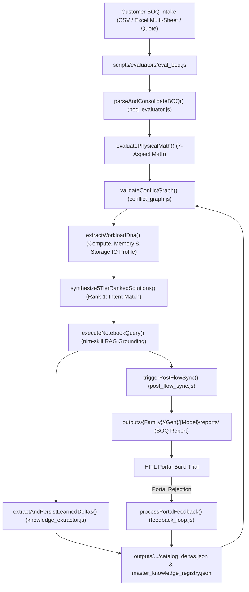

# Pre-Flight BOQ Evaluation & Closed-Loop Feedback Skill (`boq-eval-skill`)

---

## 1. Overview & Workflow Lifecycle (Workflow 2)

This skill provides an automated, agentic workflow representing **Workflow 2 (Pre-Flight Evaluation)** of the dual-workflow paradigm. It ingests raw customer BOQs, pre-cleans input data, runs deterministic 6-aspect physical math assertions, executes 5-level dependency conflict graph validation, profiles Workload DNA, dynamically routes to Gemini Notebook RAG via `notebooks.json`, and outputs the results to the dashboard and a dynamically generated **Corrected BOQ Excel workbook**.



---

## 2. Phase-by-Phase Execution Engine

### Phase 1: Ingestion & Multi-Sheet Multi-Config Engine
- **Module**: [`scripts/lib/boq/boq_evaluator.js`](file:///home/vinodh/vendorNotebookSolution/scripts/lib/boq/boq_evaluator.js), [`scripts/lib/boq/boq_preprocessor.js`](file:///home/vinodh/vendorNotebookSolution/scripts/lib/boq/boq_preprocessor.js) & [`scripts/lib/boq/boq_parser.js`](file:///home/vinodh/vendorNotebookSolution/scripts/lib/boq/boq_parser.js)
- **Functions**: `parseAndConsolidateBOQ(rawContent, filePath)`, `preprocessAndGroupBOQ(rawInput, filePath, options)`, `parseSkuLines(lines)`, `detectAndNormalizeAtomicCto(items)`
- **Capabilities**:
  - **Multi-Unit CTO Normalization**: Resolves $N$-unit multiplied quotes (e.g. 5x DL380 server orders) into atomic 1-unit server profiles, normalizing CPU, RAM, storage, and accessory counts.
  - **5-Stage Preflight Cleansing Workflow**:
    1. *Stage 1*: Base Chassis & CTO Multiplier Detection
    2. *Stage 2*: Atomic Integer Division & Fractional Anomaly Check
    3. *Stage 3*: Scraped Category & Subcategory Limits Check
    4. *Stage 4*: Physical Aspect Math Guardrails
    5. *Stage 5*: Pre-Validation NotebookLM & Local RAG Grounding
  - Multi-sheet Excel workbook inspection using `xlsx-js-style` with automatic section extraction.
  - Multi-Config Parallel Evaluation (`npm run eval:multi`) using `scripts/evaluators/eval_multi_boq.js` for massive enterprise scale.
  - Multi-part inline SKU extraction via `isValidHpeSKU()` filtering.

### Phase 2: Modular 7-Aspect Physical Math Pre-Checks & 10-Step Progress Streaming
- **Module**: [`scripts/lib/boq/boq_evaluator.js`](file:///home/vinodh/vendorNotebookSolution/scripts/lib/boq/boq_evaluator.js)
- **Functions**: `evaluatePhysicalMath(consolidatedItems)`
- **10-Step Live Visual Execution Sequence**:
  1. *Step 1*: Workload DNA & BOQ Items Extraction
  2. *Step 2*: Compute & Thermal Profiling
  3. *Step 3*: Memory Channel Math (1DPC / 2DPC symmetry)
  4. *Step 4*: Storage Tri-Mode Validation (NVMe/SAS/SATA drive cages, controllers)
  5. *Step 5*: Networking & PCIe Constraints (OCP NICs, Riser slot math)
  6. *Step 6*: Power & Infrastructure Checking (-48VDC Lug Kits, redundancy)
  7. *Step 7*: Conflict Graph Validation & Dependency Resolution
  8. *Step 8*: Grounded Gemini Notebook Validation (RAG Payload dispatch)
  9. *Step 9*: 5-Tier Strategic Resolution Matrix Synthesis
  10. *Step 10*: Generation Complete & Output Audit
- **Streaming Output Protocol**: Structured results are enclosed within `\n__EVAL_RESULT_JSON__...__EVAL_RESULT_JSON__\n` delimiters to guarantee uncorrupted extraction over chunked streams.

### Phase 2.5: 5-Level Dependency Conflict Graph & Closed-Loop Delta Auto-Injection
- **Module**: [`scripts/lib/conflict/conflict_graph.js`](file:///home/vinodh/vendorNotebookSolution/scripts/lib/conflict/conflict_graph.js) & [`scripts/lib/catalog/catalog_rules.js`](file:///home/vinodh/vendorNotebookSolution/scripts/lib/catalog/catalog_rules.js)
- **Functions**: `validateConflictGraph()`, `loadLearnedKnowledgeDeltas()`, `extractWorkloadDna()`, `synthesize5TierRankedSolutions()`
- **Closed-Loop Delta Auto-Injection**: `loadLearnedKnowledgeDeltas()` scans `master_knowledge_registry.json` and `catalog_deltas.json` during evaluation, automatically merging learned portal rejection rules into pre-checks.
- **Dual Safety Net**: Loads `<prefix>_Catalog_Rules.json` (with `chassisVariantMatrix`) first, falls back to `<prefix>_Catalog.json`.
- **5 Rule Levels**: `VENDOR`, `CHASSIS`, `CATEGORY`, `SUBCATEGORY`, `SKU` + `LEARNED_DELTA`.
- **Workload DNA Extraction**: Infers `VDI_AI_GRAPHICS`, `DATABASE_IN_MEMORY`, `STORAGE_HIGH_IOPS`, or `VIRTUALIZATION_DENSE` profile.
- **Top 5 Resolution Matrix**:
  - **Rank 1**: Customer Workload Intent Preserved (Optimal Match, 0 unnecessary alterations)
  - **Rank 2**: Standardized CTO Baseline & Factory Default Accessories
  - **Rank 3**: High-IOPS & Storage Performance Optimized
  - **Rank 4**: Maximum Density & Future Scalability Expansion
  - **Rank 5**: Budget & CapEx Minimized Buildable Baseline

### Phase 3: Gemini Notebook RAG Payload Generation (Decoupled Architecture)
- **Module**: [`scripts/evaluators/eval_boq.js`](file:///home/vinodh/vendorNotebookSolution/scripts/evaluators/eval_boq.js)
- **Functions**: `formatNotebookQueryPayload(items, evalResults)`
- **Dynamic Routing**: Dynamically derives the target Notebook ID via `scripts/config/notebooks.json` to prevent cross-pollination of vendor constraints.
- **Asynchronous Execution**: `eval_boq.js` does **not** block or execute the query directly. It embeds the `notebookPayload` in the output JSON. The frontend (`App.jsx`) intercepts this and fires a non-blocking background request to `/api/notebook-query-async`.
- **RAG Second Opinion**: The `ResolutionMatrix` UI renders a "Pending Verification" badge, which smoothly updates with the real RAG certification once the background polling completes.

### Phase 4: Budget Optimization & Golden Rule Assurance
- **Module**: [`scripts/lib/boq/budget_optimizer.js`](file:///home/vinodh/vendorNotebookSolution/scripts/lib/boq/budget_optimizer.js)
- Enforces the Golden Rule: Mandatory buildability fixes take precedence over budget caps.

### Phase 5 & 6: Dual Outputs, Telemetry & Closed-Loop Feedback Learning
- **Output 1 (Dashboard API & Telemetry)**: Submissions sent via `/api/eval-boq` display in React frontend and automatically log execution metrics to `pipeline_telemetry.json` via [`scripts/lib/system/telemetry.js`](file:///home/vinodh/vendorNotebookSolution/scripts/lib/system/telemetry.js).
- **Output 2 (Corrected BOQ Excel)**: Generates a multi-sheet **Corrected BOQ Excel** output (`/api/export-boq`) containing NotebookLM Rationale Summary and finalized BOM.
- **Feedback Module**: [`scripts/lib/feedback/feedback_loop.js`](file:///home/vinodh/vendorNotebookSolution/scripts/lib/feedback/feedback_loop.js)
- **Command**: `npm run eval:boq <boq_file> --simulate-portal-error "<error_text>"` or Dashboard modal.
- Logs permanent `KnowledgeDeltas` in `outputs/history/catalog_deltas.json` and updates `_Catalog_Rules.json`.

---

## 💻 CLI Commands & Usage Examples

```bash
# Run BOQ evaluation with default chassis report auto-derived
npm run eval:boq tests/fixtures/test_boq_dl380_gen12.csv

# Run BOQ evaluation with explicit chassis variant override
node scripts/evaluators/eval_boq.js tests/fixtures/test_boq_dl380_gen12.csv --chassis-variant LFF

# Run Multi-Cluster Tender Split & Parallel Evaluation
node scripts/evaluators/eval_multi_boq.js /path/to/tender_rfq.xlsx

# Generate Partner Portal BOM with Merged Multiplier Spans & 2-Line Separation
node scripts/catalogs/generate_tender_partner_bom.js

# Simulate partner portal rejection and log KnowledgeDelta
npm run eval:boq tests/fixtures/test_boq_dl380_gen12.csv --simulate-portal-error "ERR_STORAGE_CABLE: Controller MR416i-p requires Cable Kit P76453-B21"
```

---

## 3. Multi-Cluster Tender Mathematical Partitioning Engine

When enterprise tenders (e.g. `GID-RFQS-HPE-2026-006.xlsx`) arrive with multiple server models or mixed CPU/PSU types collapsed into a single 60-node total quantity, [`scripts/lib/boq/multi_cluster_splitter.js`](file:///home/vinodh/vendorNotebookSolution/scripts/lib/boq/multi_cluster_splitter.js) automatically solves the partitioning:

1. **Multi-Line Bundled Cell Parsing**: Extracts individual SKUs and descriptions embedded inside multi-line cell blocks (e.g. 13 bundled accessory SKUs in a single row) using `isValidHpeSKU()` regex filtering.
2. **Diophantine Processor Node Allocation**:
   - Formulates the system of integer equations: $2 \cdot N_A = Q_{\text{CPU}_A}$ and $2 \cdot N_B = Q_{\text{CPU}_B}$, where $N_A + N_B = N_{\text{Total}}$.
   - Partitions mixed configurations (e.g. 40x Platinum 8580 $\rightarrow$ 20x Nodes; 80x Gold 6530 $\rightarrow$ 40x Nodes).
3. **Thermal & Electrical Matching**: Matches high-TDP CPUs (350W) with Titanium PSUs (1800W-2200W) and standard CPUs (270W) with Platinum PSUs (1600W).
4. **Proportional Accessory & Riser Distribution**: Allocates PCIe NICs, transceivers, risers, and drive cages per node ratio without fractional remainders.

---

## 4. Partner Portal BOM Excel Generation & Formatting Standard

When exporting finalized multi-cluster configurations for loading into the vendor Partner Portal / OCA tool:
- **Columns**: `Part Number (SKU)`, `Category`, `Description`, `Qty (Per Node)`, `Set / Multiplier`, `Total Order Qty`.
- **Vertical Multiplier Merge Spans**: The `Set / Multiplier` column spans the entire configuration vertically (e.g. `20x Server Nodes (Multiplier: 20)` merged across rows 6–29).
- **2-Line Configuration Separation**: Exactly 2 blank rows are inserted between distinct server configurations to allow automated portal table ingest engines to separate BOM sections cleanly.
- **INV-24 Compliance**: Customer BOQs and generated tender BOMs are never uploaded to NotebookLM sources directly. Only verified ground-truth knowledge deltas are synced.
