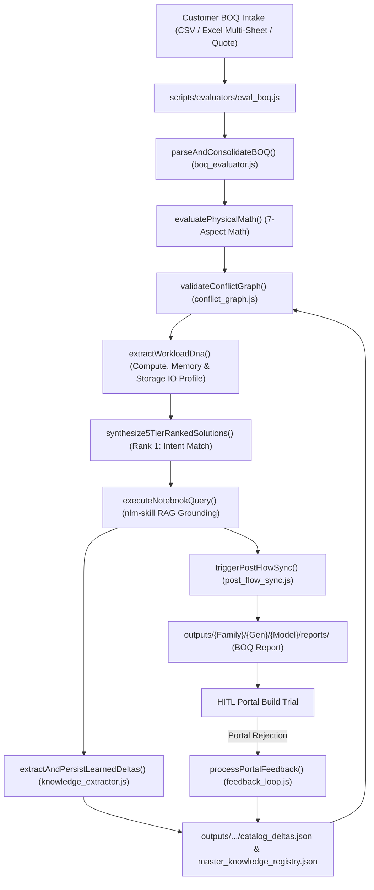

# Pre-Flight BOQ Evaluation & Closed-Loop Feedback Skill (`boq-eval-skill`)

> 🧭 **Intent Routing Notice**: If the user's input is a freeform conversational question without a file or table, or an unstructured RFP requirement without SKUs, consult [`presales-query-router`](../presales-query-router/SKILL.md) to select the optimal track. Use this skill when concrete part numbers (SKUs) or tabular tender documents are provided.

---

## 0. User Entry Points, Dashboard Synergy & Autonomous Agent Workflow

### 🚀 Two Complementary Entry Points
The solution supports two unified entry points tailored for different stages of the sales engineering workflow:

| Metric / Capability | 🤖 Antigravity AI Agent (IDE / CLI / MCP) | 🖥️ React Web Dashboard (`localhost:5173`) |
| :--- | :--- | :--- |
| **Primary Persona** | Lead Solution Architect & Pair Programmer (Vinodh) | Presales Engineer & Visual Quote Reviewer |
| **Input Flexibility** | Raw paths, multi-sheet workbooks, obfuscated pastes, PDFs (via OCR), direct conversational queries | Drag-and-drop `.xlsx`, `.xls`, or plain text paste |
| **Async RAG Querying** | Direct MCP Server (`notebook_query`) or persistent job store with unlimited patience & smart FIFO key rotation | Dispatches async job via `/api/notebook-query-async`; polls status with visual progress |
| **Multi-Cluster Tenders**| Solves Diophantine integer equations via `multi_cluster_splitter.js` for 60+ node tenders with 42U rack and power sizing | Evaluates selected chassis single-configuration at a time |
| **Conversational Reasoning**| Full Dual-Brain dialog: reasons through trade-offs, part substitutions, supply chain lead times, and thermal boundaries | Fixed 5-tier card matrix visualization with confidence tooltips |
| **Error Feedback Loop** | Autonomous CLIC validation, automated `KnowledgeDelta` extraction via `knowledge_extractor.js`, instant re-eval | "Report Portal Rejection" modal where user manually pastes portal error string |

---

### 🔍 Dashboard Entry Point Gaps & How the Agent Fills Them
While the React Dashboard provides an exceptional visual interface for reviewing 5-tier matrices, comparing CapEx, and viewing topology, several operational gaps exist where the Antigravity Agent provides essential capability:
1. **Durable Async RAG Waiting**: High-complexity RAG queries against large QuickSpecs PDFs can take 60–120 seconds. The dashboard's frontend poller relies on HTTP polling intervals that can experience browser tab throttles or transient network retries. The Antigravity Agent interacts directly with the persistent job store (`persistent_job_store.js`) and long-lived MCP server, waiting reliably for complete grounded answers without UI timeouts.
2. **Multi-Server Mixed RFQs**: Large enterprise tenders frequently bundle multiple chassis (e.g. 20x DL380 database nodes + 10x DL360 application nodes + 2x StoreEver tape) in a single sheet. The dashboard requires selecting a single chassis target. The Agent runs `eval_multi_boq.js` and `multi_cluster_splitter.js` to automatically partition mixed tenders into homogeneous buildable clusters.
3. **Complex Document Extraction**: When quotes arrive in non-standard tabular structures (e.g. scans, images, multi-line bundled cells with 13 SKUs in one row), the Agent leverages `performGeminiOcr` and regex sanitization to isolate atomic hardware rows cleanly before evaluation.
4. **Dynamic Alternative Exploration**: If a customer part is restricted or obsolete, the Agent can conversationally explore certified equivalents (e.g. comparing Intel Xeon 8580 vs 8480+, or L40S vs L4 GPUs) and explain the exact pricing and power differences.

---

### 🔄 The 7 Atomic Steps of the BOQ Evaluation Journey
1. **Intake, Ingestion & CTO Normalization**:
   - Extracts base chassis and CTO multipliers (e.g. resolving a 5x server order into an atomic 1-unit profile).
   - Identifies and excludes non-BOM documentation tabs (Cover pages, T&Cs, Readmes) using `isNonBomSheet` (`INV-63`).
   - **Strict Model Separation (`DL380a_Gen12` vs `DL380_Gen12`)**: `DL380a_Gen12` is a dedicated AI accelerator server supporting up to 8DW/16SW GPUs (`P75008-B21`/`P75002-B21` GPU Mode choices, `S3U30C` H200 GPUs, captive GPU risers). Quotes/BOQs specifying "DL380a" or GPU server SKUs MUST evaluate strictly against `outputs/ProLiant/Gen12/DL380a_Gen12` and dedicated NotebookLM notebook `DL380a` (`b233ec88-4682-4164-a801-3ee6ca649dc1`). Never route to standard `DL380_Gen12`.
2. **Deterministic 7-Aspect Physical Pre-Flight Math**:
   - Executes $O(1)$ indexed checks across: (1) Compute & Thermal TDP, (2) Memory Channel symmetry (1DPC/2DPC), (3) Storage Tri-Mode controllers & drive cages, (4) Networking & OCP slot constraints, (5) PCIe Riser card & slot capacity, (6) Power redundancy & -48VDC telco lug kits, (7) Support services & OS physical core multiplier licensing (`INV-28`).
   - **Zero-Hardcoding Compliance**: Generic aspect checkers maintain 0 hardcoded SKU strings. All platform enablement kits (fans, cables, batteries, risers, DC lugs, CE mark kits) are dynamically resolved via `mandatorySkus` from [`scripts/config/chassis_map.json`](../../scripts/config/chassis_map.json) and catalog rules. Default primary risers provide 3 electrically active slots without requiring extra cable kits.
3. **Grounded Gemini NotebookLM Verification (Double Safety Net)**:
   - Evaluates the query payload against the official vendor QuickSpecs PDF and 22-sheet master catalog in NotebookLM.
   - **INV-24 Compliance & Ephemeral Solution Source Validation (`nlm_solution_source_validator.js`)**:
     - Customer BOQ files are strictly isolated from permanent knowledge sources to prevent poisoning baseline QuickSpecs models with customer errors.
     - When whole-solution context or multi-rank configurations exceed prompt token/character limits, the engine generates a token-dense solution sheet (`.csv`), temporarily attaches it as an ephemeral document source via `gemini-notebook-mcp:source_add`, queries NotebookLM across all 7 physical aspects, extracts technical citations into persistent `KnowledgeDelta` records, and **immediately detaches the source** (`source_delete`), strictly preserving INV-24.
   - **Dynamic Matrix Re-Evaluation (`recomputeStrategyMatrixWithRag`)**: If NotebookLM grounding uncovers new verified dependencies or rules, the engine dynamically recomputes physical checks and re-synthesizes the 5-Tier Strategy Matrix before final deliverable export.
4. **Alternate Parts & Form-Factor Bus Pivoting (Path B Principle)**:
   - When components conflict (e.g. customer requests 2x OCP NICs but also selects an OCP storage controller `MR408i-o`), the engine pivots the storage controller to PCIe standup (`MR416i-p` `P47777-B21`), freeing OCP Slot 1 to preserve 100% of requested networking.
   - Injects mandatory enablement kits dynamically resolved from `chassis_map.json`: secondary CPU heatsinks, internal SAS expanders, GPU auxiliary power cables, CE Mark Removal Kit (`INV-30`), and Primary Cable Kit (`INV-31`).
5. **100% Partner Portal / CLIC Buildability Guarantee & Multi-Rank Deliverable**:
   - Ensures internal CTO components carry `#0D1` / `-F21` FIO tags (`INV-25`). Standalone BTO components outside containers fail CLIC validation (Rules 81354490 & 91001655).
   - Automatically exports a 6-sheet **Multi-Rank Solution Deliverable Workbook** (`.xlsx`) and companion `.csv` with 10 standardized columns (`Part No`, `Per-Node Qty`, `Node Multiplier`, `Total Qty`, `Description`, `Component Role`, `Unit Price`, `Extended Price`, `Physical Math Rationale`, `CLIC Status / Rule Trace`) and formula-driven totals for direct upload to HPE Partner Portal / OCA.
   - Zero quote is deemed valid unless it compiles with 0 errors in the vendor configurator.
6. **5-Tier Strategic Resolution Matrix Ranking & Least-Delta Optimization**:
   - **Rank 1 (Customer Intent Preserved — RECOMMENDED)**:
     - Closest possible build to customer request with minimum changes needed to achieve 100% buildability.
     - **Parallel Sub-Paths (Rank 1A, 1B, 1C)**: When multiple valid buildable topologies solve a requirement (e.g. Path 1A: SAS Expander vs Path 1B: Dedicated 2nd Controller), they form parallel sub-paths within Rank 1. Rank 1A is the minimal disruption/lowest CapEx path.
     - **Rank 1L / Rank 1M (Least-Delta Functional Alternative — Cascade Pruned, `INV-74`)**:
       - When a troublesome SKU causes massive cascading additions (e.g. 8-port controller with 16 drives requiring SAS expander, cables, and fans), the Least-Delta Combinator (`least_delta_combinator.js`) substitutes a direct functional alternative (e.g. 16-port Tri-Mode controller `P55415-B21`) and prunes the entire cascading dependency tree, delivering 100% buildability with the fewest net mutations.
     - **The Zero-Rank Invariant**: An unbuildable configuration receives ZERO rank and is discarded. Only 100% certified buildable configurations enter the matrix.
     - Never cuts down customer requirements unless physically impossible, and never bundles unsolicited software or startup services (`INV-32`).
     - **Lifecycle Status Checks & Obsolescence Risk Reasoning**:
       - Checks every component SKU lifecycle status (`Active`, `90-Day Warning` [90], `Obsolete` [OB], `Discontinued` [DS], `EOL`).
       - **The 90-Day Obsolescence Danger**: Enterprise server quotes take months from drafting to deal registration, budget approval, PO issuance, and factory manufacturing. If a component (e.g. an older 4th Gen processor or legacy PCIe card) has $\le 90$ days of support before discontinuation, selecting it creates critical deal risk: the part will likely become obsolete before the order is fulfilled.
       - **Proactive Generational Progression**: The engine flags this risk and articulates clear reasoning in the solution narrative, synthesizing active current-generation equivalents (e.g. 5th Gen Emerald Rapids or 6th Gen Xeon 6) across the matrix ranks.
       - **Dynamic Supply Issue Handling**: If runtime OCA validation signals a supply hold or allocation bottleneck on a specific processor or SKU, the agent logs the constraint into `catalog_deltas.json` and settles on the next closest buildable equivalent, cross-verifying with NotebookLM.
   - **Rank 2 (Standardized CTO / Balanced Performance)**: Balanced memory interleaving, factory accessories, high-performance fans.
   - **Rank 3 (High-IOPS & Storage Performance / Cost-Optimized Baseline)**: Cleaned baseline removing redundant zero-purpose parts or selecting certified equivalent tiers.
   - **Rank 4 (Maximum Density & 2N Reliability)**: Dual grid 2N power supplies, dual controllers, enterprise care.
   - **Rank 5 (Budget & CapEx Minimized)**: Cost-optimized buildable configuration adhering to essential specs at minimum spend.
   - **Auditable Decision Trace Ledger (`decision_trace.js`, `INV-75`)**:
     - Every part addition, pruning, substitution, or aspect rule trigger records an immutable timestamped trace with 4-brain attribution (`DETERMINISTIC_PHYSICAL_MATH`, `RAG_AGENTIC_GUARDRAIL`, `VALUE_ENGINEERING`, `HITL_FEEDBACK`) saved in `outputs/history/decision_traces.json`.
   - **Value Engineering & Deal Optimizer (`deal_optimizer.js`, `INV-76`)**:
     - Evaluates post-buildability CapEx/OpEx optimizations (CPU tier right-sizing, NIC bandwidth alignment, PSU efficiency tuning) and surfaces advisory savings in UI and markdown reports.
7. **Closed-Loop Feedback & KnowledgeDelta Learning**:
   - Real-world vendor portal rejections are ingested via `processPortalFeedback()` (`feedback_loop.js`).
   - Persists deduplicated `KnowledgeDelta` records: universal rules to `master_knowledge_registry.json`, chassis-specific rules to `catalog_deltas.json` and synchronized exclusively to that product's target Notebook ID.

---

### 💰 Financial Transparency & Per-Rank Budget Schema
Every solution column presented to the user must display:
- Part Number (`SKU`)
- Description
- Quantity
- Unit List Price (USD)
- Extended List Price (USD)
- **Total CapEx Budget** clearly summed at the bottom.
- If a price cannot be resolved from certified history, the total is flagged as `(INCOMPLETE — N SKU(s) unresolved)` per `INV-33`. Silent $0 totals are forbidden.

---

### 🛡️ Clean Tool Segregation Contract
When evaluating customer BOQs or answering configuration questions:
- **Participating Tools**:
  1. `scripts/evaluators/eval_boq.js` (Unified production evaluation engine)
  2. `scripts/lib/aspects/*` (7 physical math engines running in parallel)
  3. `gemini-notebook-mcp` (The ONLY cloud RAG tool used for QuickSpecs & catalog subgraph grounding)
- **Strictly Excluded Developer Tools**:
  - `jules` (GitHub PR code-review agent — CI/CD only, never customer BOQs)
  - `data-agent-kit` (GCP/BigQuery tool — completely irrelevant to on-prem server BOQs)
  - `notebooks` (Jupyter `.ipynb` cell editor — customer BOQs are Excel/CSV/JSON)

---

### 🧠 Dual-Brain Verification Badges & Honest Observability
Outputs must always present explicit verification badges:
- `[🧠 Deterministic Brain: 7-Aspect Physical Math PASSED]`
- `[📚 Intent RAG Brain: Grounded in NotebookLM (Notebook ID: <id>)]`
- `[🛡️ CLIC/OCA Pre-Flight: 100% Buildability Certified]`
- **Unmapped Model Notice**: If a product is not in `scripts/config/notebooks.json`, display:
  `[⚠️ Knowledge Mapping Notice: Product <Model> catalog unpromoted or unmapped. Running in Local Deterministic Engine + QuickSpecs fallback mode until scraped.]`
- **Ambiguity Rule**: If a requirement cannot be mapped with high confidence, the agent MUST ask the user for clarification.

---

### 🎯 Zero-Repetition Autonomous BOQ Protocol (High Confidence & Zero Micromanagement)
When the user supplies a customer BOQ, spreadsheet, quote, or tender text and requests a solution:
1. **Zero-Repetition Directive**:
   - The user does **NOT** have to repeat instructions, remind the agent of rules, or prompt for missing badges/budgets.
   - The agent automatically recognizes the full lifecycle goals and delivers the complete, certified solution end-to-end.
2. **Flexible User Dispatch Scope**:
   - **Target Config**: e.g., *"Provide solution for Config #2 in sheet 'Compute Nodes'"* $\rightarrow$ Isolates Config #2 cluster, runs canonical pipeline.
   - **All Configs in Sheet X**: e.g., *"Evaluate all configs in sheet 'Database Cluster'"* $\rightarrow$ Dissects all clusters in sheet X via `multi_cluster_splitter.js` and evaluates each independently.
   - **All Configs across All Sheets**: e.g., *"Evaluate all configs in the workbook"* $\rightarrow$ Filters non-BOM sheets (`isNonBomSheet`), discovers all clusters across all sheets, and processes the entire tender with cluster-level subtotals and 2-line separator gaps (`INV-28`, `INV-37`).
3. **Up-Front Ambiguity Triage (Zero-Hallucination Gate)**:
   - **Initial Turn Check**: Before launching deep execution, the agent validates input sanity:
     - Are target sheet(s) and cluster(s) clearly identified?
     - Is the server generation/model known or identifiable from SKUs?
     - Are there fatal contradictions (e.g. 24 drives requested on an 8-drive fixed backplane)?
   - **Proactive Early Clarification**: If any critical ambiguity exists, the agent **MUST ask for clarification immediately in the initial turn** rather than guessing, hallucinating, or making ungrounded assumptions.
   - If unambiguous, proceed with 100% autonomous execution.
4. **Autonomous End-to-End Delivery**:
   - Executes canonical pipeline (`eval_boq.js`, 7-aspect checkers, `gemini-notebook-mcp`).
   - Synthesizes 100% buildable 5-Tier Strategy solutions (Rank 1A/1B/1C through Rank 5; unbuildable = 0 rank).
   - If cascading dependency bloat is detected, delegates to [`least-delta-combinator-skill`](../least-delta-combinator-skill/SKILL.md) to prune the cascade and generate Rank 1L/1M minimal-mutation alternatives (`INV-74`).
   - Emits complete line-by-line financial tables with total budgets and Dual-Brain verification badges.
   - Synchronizes scoped closed-loop feedback rules without user prompting.
5. **Mandatory Adversarial Self-Validation (Zero-Compromise Quality Gate)**:
   - Before presenting ANY BOQ evaluation output or corrected BOM to the customer, the agent MUST run [`adversarial-validation-skill`](../adversarial-validation-skill/SKILL.md) against known enterprise edge-case failure modes:
     - Missing secondary CPU heatsink (`P48818-B21` / `P74792-B21`) when 2 processors are populated.
     - Tri-Mode RAID controller direct-attach limits (mandating SAS expander `P48835-B21` for >8 drives).
     - Diskless / No Local Drive configurations: Chassis ordered without drives mandates `873763-B21` (HPE ProLiant Compute DL380 No Drive Configuration FIO Kit) to satisfy CLIC Rule 81392308.
     - GPU Auxiliary Power Cabling: Standard 2U servers mandate `P48816-B21` / `P76450-B21` (1 per GPU); DL380a Gen12 mandates `P74700-B21` (GPU 16-pin FIO Cable Kit, 1 kit per 2 GPUs) and 8DW FIO Configuration (`P75008-B21`).
     - GPU NVLink Bridge Clearance: DL380a Gen12 10DW mode (`P75005-B21`) does NOT support NVLink bridges; H200 NVL (`S3U30C`) is strictly capped at 8 GPUs per node under 8DW mode. Front-bay GPUs do not occupy rear PCIe risers.
     - Memory Population Hierarchy: Supported minimal populations (1, 2, 4, 6, 8, 16 DIMMs per socket) are valid in CLIC and pass evaluation with performance advisories; 8 DIMMs per socket achieves 100% full-channel interleaving bandwidth.
     - ErP Lot 9 EU Ecodesign Titanium PSU requirements vs CE Mark Removal Kit (`P35876-B21`) injection.
     - PCIe riser power cable kits (`P56073-B21`) when Slot 1 is populated.
   - If ANY adversarial failure is detected, the agent MUST remediate it into the build before certifying Rank 1.
6. **Strict RAG SKU Verification & Human Consultation on Uncertainty**:
   - Every RAG citation from Cloud NLM or Local RAG MUST explicitly reference the verified target SKU.
   - If RAG output is inconclusive, if contradictory rules exist between QuickSpecs and portal catalogs, or if a required SKU appears absent from recent scrapes:
     - **NEVER guess or hallucinate.**
     - **Prompt the Human Operator immediately**: State the exact ambiguity, present the available candidate SKUs, and request human validation.
     - **Closed-Loop Persistence**: Feed the human decision directly into `scripts/lib/feedback/feedback_loop.js` so the resolution is saved as a verified `KnowledgeDelta` and confidence scores improve for future evaluations.
7. **Deliverable Generation (Excel Workbooks)**:
   - When the user requests exportable spreadsheet files, invoke [`workbook-generator-skill`](../workbook-generator-skill/SKILL.md) to emit standardized 7-column Partner Portal upload sheets (`INV-32`, `INV-37`) and professional multi-sheet executive evaluation workbooks.

---

## 1. Overview & Workflow Lifecycle (Workflow 2)

This skill provides an automated, agentic workflow representing **Workflow 2 (Pre-Flight Evaluation)** of the dual-workflow paradigm. It ingests raw customer BOQs, pre-cleans input data, runs deterministic 7-aspect physical math assertions, executes 5-level dependency conflict graph validation, profiles Workload DNA, dynamically routes to Gemini Notebook RAG via `notebooks.json`, and outputs the results to the dashboard and a dynamically generated **Corrected BOQ Excel workbook**.

> **New Architectural Mandates (Phase 3 & 4):**
> - **Trace Context Constraint**: Any new async evaluation threads or functions added must bind to `PipelineTraceContext` (using `AsyncLocalStorage` via `scripts/lib/system/trace_context.js`) to guarantee end-to-end telemetry traceability.
> - **Strict Error Boundaries**: Catch blocks that read catalog topologies or core rule data MUST fail-hard. You must throw `EvaluationError` or `DataCorruptionError` (instead of swallowing exceptions via `console.warn`) if the engine encounters corrupted disk states, ensuring the pipeline never silently degenerates into regex heuristics.



---

## 2. Phase-by-Phase Execution Engine

### Phase 1: Ingestion & Multi-Sheet Multi-Config Engine
- **Module**: [`scripts/lib/boq/boq_evaluator.js`](file:///home/vinodh/vendorNotebookSolution/scripts/lib/boq/boq_evaluator.js), [`scripts/lib/boq/boq_preprocessor.js`](file:///home/vinodh/vendorNotebookSolution/scripts/lib/boq/boq_preprocessor.js) & [`scripts/lib/boq/boq_parser.js`](file:///home/vinodh/vendorNotebookSolution/scripts/lib/boq/boq_parser.js)
- **Functions**: `parseAndConsolidateBOQ(rawContent, filePath)`, `preprocessAndGroupBOQ(rawInput, filePath, options)`, `parseSkuLines(lines)`, `detectAndNormalizeAtomicCto(items)`
- **Capabilities**:
  - **Multi-Unit CTO Normalization**: Resolves $N$-unit multiplied quotes (e.g. 5x DL380 server orders) into atomic 1-unit server profiles, normalizing CPU, RAM, storage, and accessory counts.
  - **Dynamic BOM Lead Sheet Detection (`INV-63`)**: Filters administrative and non-BOM documentation sheets (Cover Page, Terms, Instructions, Readme) using `isNonBomSheet` to isolate the true hardware table automatically.
  - **5-Stage Preflight Cleansing Workflow**:
    1. *Stage 1*: Base Chassis & CTO Multiplier Detection
    2. *Stage 2*: Atomic Integer Division & Fractional Anomaly Check
    3. *Stage 3*: Scraped Category & Subcategory Limits Check
    4. *Stage 4*: Physical Aspect Math Guardrails
    5. *Stage 5*: Pre-Validation NotebookLM & Local RAG Grounding
  - Multi-sheet Excel workbook inspection using `xlsx-js-style` with automatic section extraction.
  - Multi-Config Parallel Evaluation (`npm run eval:multi`) using `scripts/evaluators/eval_multi_boq.js` for massive enterprise scale.
  - Multi-part inline SKU extraction via `isValidHpeSKU()` filtering.

### Phase 2: Modular 7-Aspect Physical Math Pre-Checks & 10-Step Progress Streaming
- **Module**: [`scripts/lib/boq/boq_evaluator.js`](file:///home/vinodh/vendorNotebookSolution/scripts/lib/boq/boq_evaluator.js)
- **Functions**: `evaluatePhysicalMath(consolidatedItems)`
- **High-Performance $O(1)$ SKU Indexing Contract (`INV-59`)**: All aspect checkers use `buildCatalogSkuIndex(catalogData)` with memoization on `catalogData._skuIndex`, eliminating $O(N \times M \times K)$ nested loops and cutting evaluation latency by >18%.
- **Strict Delimited Lifecycle Parsing (`INV-62`)**: `support_services.js` checks lifecycle status using strict token delimiters (`/^(?:90|EOL)\s+/i`, `[90]`, `(90)`, `90-DAY`), preventing false-positive EOL flags on SKUs starting with "90".
- **10-Step Live Visual Execution Sequence**:
  1. *Step 1*: Workload DNA & BOQ Items Extraction
  2. *Step 2*: Compute & Thermal Profiling
  3. *Step 3*: Memory Channel Math (1DPC / 2DPC symmetry)
  4. *Step 4*: Storage Tri-Mode Validation (NVMe/SAS/SATA drive cages, controllers)
  5. *Step 5*: Networking & PCIe Constraints (OCP NICs, Riser slot math)
  6. *Step 6*: Power & Infrastructure Checking (-48VDC Lug Kits, redundancy)
  7. *Step 7*: Conflict Graph Validation & Dependency Resolution
  8. *Step 8*: Grounded Gemini Notebook Validation (RAG Payload dispatch)
  9. *Step 9*: 5-Tier Strategic Resolution Matrix Synthesis
  10. *Step 10*: Generation Complete & Output Audit
- **Streaming Output Protocol**: Structured results are enclosed within `\n__EVAL_RESULT_JSON__...__EVAL_RESULT_JSON__\n` delimiters to guarantee uncorrupted extraction over chunked streams.

### Phase 2.5: 5-Level Dependency Conflict Graph & Closed-Loop Delta Auto-Injection
- **Module**: [`scripts/lib/conflict/conflict_graph.js`](file:///home/vinodh/vendorNotebookSolution/scripts/lib/conflict/conflict_graph.js) & [`scripts/lib/catalog/catalog_rules.js`](file:///home/vinodh/vendorNotebookSolution/scripts/lib/catalog/catalog_rules.js)
- **Functions**: `validateConflictGraph()`, `loadLearnedKnowledgeDeltas()`, `extractWorkloadDna()`, `synthesize5TierRankedSolutions()`, `analyzeCascadingImpact()`, `introspectSku()`
- **Tender Base SKU Quantity Accumulation (`INV-60`)**: In `conflict_graph.js`, duplicate base hardware entries accumulate quantities (`fullBomMap.get(sku).quantity += qty`) rather than overwriting, preserving total tender hardware counts.
- **Dynamic Generation-Aware Mandatory SKUs & SSOT (`INV-61`)**: `catalog_rules.js` serves as the Single Source of Truth (`DEFAULT_MANDATORY_SKUS`). Resolves heatsinks and riser cable kits dynamically by generation (`P48818-B21` / `P76453-B21` for Gen12; `P74792-B21` / `P56073-B21` / `P56074-B21` for Gen11) without hardcoded cross-generation pollution.
- **Dynamic SKU Capability Introspection**: Introspects component capabilities across cores, GHz, TDP wattage, storage controller cache sizes, power supply capacity, and networking throughput directly from catalog descriptions without hardcoded strings.
- **4-Degree Cascading Ripple Analysis (`analyzeCascadingImpact`)**:
  - *Degree 1 (Immediate Companions)*: Auto-detects required controller cables (`P48832-B21`), flash-backed write cache batteries (`P01366-B21`), and heatsinks when swapping controllers or CPUs.
  - *Degree 2 (Contested Form-Factor Slot Unlocking)*: Calculates slot freeing (e.g. pivoting storage to PCIe standup frees OCP Slot 1 for customer's OCP3 networking card).
  - *Degree 3 (Thermal & Power Envelope Recalculation)*: Recalculates total TDP and system draw, adjusting fan kits (`P48820-B21`) and redundant PSU sizing.
  - *Degree 4 (Licensing Multipliers)*: Recalculates core-based hypervisor/OS licenses (Windows Server / VMware) matching total physical cores.
- **Multi-Node Cluster Infrastructure Sizing Matrix (`clusterSizing`)**:
  - Computes Total Rack Units (`totalNodes * RU`), Standard 42U Rack Count (`ceil(RU / 42)`), Peak Facility Power draw in kW, Rail Kit coverage (`P52341-B21`), and High-line 220V utility power derating advisories when node wattage exceeds 800W.
- **Chassis Default & Redundant Accessory Intelligence (`chassisDefaults` & `redundantDefaults`)**:
  - Automatically identifies pre-included chassis parts (e.g. 6 standard fans, internal cables) and flags redundant standalone accessory lines in customer tenders to eliminate duplicate spend.
- **Presales Divergent Opinion Discrepancy Protocol (`opinionDiscrepancies`)**:
  - When NotebookLM RAG advice diverges from deterministic rule engine logic, flags an `OPINION_DISCREPANCY_FLAG` for presales engineer review rather than silently dropping constraints.
- **Closed-Loop Delta Auto-Injection**: `loadLearnedKnowledgeDeltas()` scans `master_knowledge_registry.json` and `catalog_deltas.json` during evaluation, automatically merging learned portal rejection rules into pre-checks.
- **Dual Safety Net**: Loads `<prefix>_Catalog_Rules.json` (with `chassisVariantMatrix`) first, falls back to `<prefix>_Catalog.json`.
- **5 Rule Levels**: `VENDOR`, `CHASSIS`, `CATEGORY`, `SUBCATEGORY`, `SKU` + `LEARNED_DELTA`.
- **Workload DNA Extraction**: Infers `VDI_AI_GRAPHICS`, `DATABASE_IN_MEMORY`, `STORAGE_HIGH_IOPS`, or `VIRTUALIZATION_DENSE` profile.
- **Top 5 Resolution Matrix**:
  - **Rank 1**: Customer Workload Intent Preserved (Optimal Match, 0 unnecessary alterations)
  - **Rank 2**: Standardized CTO Baseline & Factory Default Accessories
  - **Rank 3**: High-IOPS & Storage Performance Optimized (PCIe Storage + OCP Slot Retention)
  - **Rank 4**: Maximum Density & Future Scalability Expansion
  - **Rank 5**: Budget & CapEx Minimized Buildable Baseline

### Phase 3: Gemini Notebook RAG Payload Generation (Decoupled Architecture)
- **Module**: [`scripts/evaluators/eval_boq.js`](file:///home/vinodh/vendorNotebookSolution/scripts/evaluators/eval_boq.js)
- **Functions**: `formatNotebookQueryPayload(items, evalResults)`
- **Dynamic Routing**: Dynamically derives the target Notebook ID via `scripts/config/notebooks.json` to prevent cross-pollination of vendor constraints.
- **Asynchronous Execution**: `eval_boq.js` does **not** block or execute the query directly. It embeds the `notebookPayload` in the output JSON. The frontend (`App.jsx`) intercepts this and fires a non-blocking background request to `/api/notebook-query-async`.
- **RAG Second Opinion**: The `ResolutionMatrix` UI renders a "Pending Verification" badge, which smoothly updates with the real RAG certification once the background polling completes.

### Phase 4: Budget Optimization & Golden Rule Assurance
- **Module**: [`scripts/lib/boq/budget_optimizer.js`](file:///home/vinodh/vendorNotebookSolution/scripts/lib/boq/budget_optimizer.js)
- Enforces the Golden Rule: Mandatory buildability fixes take precedence over budget caps.

### Phase 5 & 6: Dual Outputs, Telemetry & Closed-Loop Feedback Learning
- **Output 1 (Dashboard API & Telemetry)**: Submissions sent via `/api/eval-boq` display in React frontend and automatically log execution metrics to `pipeline_telemetry.json` via [`scripts/lib/system/telemetry.js`](file:///home/vinodh/vendorNotebookSolution/scripts/lib/system/telemetry.js).
- **Output 2 (Corrected BOQ Excel & Partner Portal Upload BOM)**:
  - Generates multi-sheet **Corrected BOQ Excel** output (`/api/export-boq`) containing NotebookLM Rationale Summary and finalized BOM.
  - Generates flat **Partner Portal Upload BOM** workbook strictly adhering to `INV-37` (7-column schema, per-cluster subtotal rows, and 2-line separator gaps).
- **Feedback Module**: [`scripts/lib/feedback/feedback_loop.js`](file:///home/vinodh/vendorNotebookSolution/scripts/lib/feedback/feedback_loop.js)
- **Command**: `npm run eval:boq <boq_file> --simulate-portal-error "<error_text>"` or Dashboard modal.
- Logs permanent `KnowledgeDeltas` in `outputs/history/catalog_deltas.json` and updates `_Catalog_Rules.json`.

---

## 3. Anti-Hallucination Guardrails & Double Safety Net Protocol

To guarantee 100% precision and zero ungrounded drift, the evaluation pipeline enforces strict anti-hallucination guardrails:

1. **Zero-Hallucination SKU Validation (`isValidHpeSKU`)**:
   - Every SKU emitted in solutions must exist in certified `catalog.json` or `price_history.json`.
   - Never invent, guess, or hallucinate part numbers.
2. **Double Safety Net (Deterministic Math + Grounded RAG + Local Fallback)**:
   - **Tier 1**: Deterministic Rule Engine evaluates physical aspect math at $O(1)$ speed.
   - **Tier 2**: Agentic Guardrail queries Cloud NotebookLM RAG grounded exclusively in official QuickSpecs PDFs and 22-sheet master catalogs.
   - **Tier 3**: Local RAG Dual-Layer Search (`local_rag_search.js`) acts as an instant fallback if cloud APIs hit timeouts or rate limits.
3. **Decisive Human Escalation on Unresolvable Ambiguities**:
   - If a customer requirement is ambiguous or fundamentally contradictory (e.g. asking for 128 cores on a 32-core maximum socket platform without budget for 4-socket), the engine surfaces the conflict clearly with explicit trade-off options rather than making silent assumptions.

---

## 4. Minimum Edit Distance & Form-Factor Bus Pivoting (Path B Principle)

When a customer's requested parts cannot be directly built as drafted, the engine computes alternative substitutions with **Minimum Disruption**:

1. **Form-Factor Bus Pivoting**:
   - Rather than dropping customer options, the engine pivots conflicting components to equivalent form-factors (e.g. moving an OCP controller `MR408i-o` to PCIe standup `MR416i-p` `P47777-B21` to preserve 100% of customer requested OCP networking adapters).
2. **5-Tier Strategy Ranking by Exact Intent SKU Overlap**:
   - Solutions are ranked dynamically by **Exact Intent Overlap** ($100 \times \frac{\text{matching customer SKUs}}{\text{total customer SKUs}}$).
   - **Rank 1** is strictly guaranteed to be the build closest to the customer's drafted part numbers with zero unsolicited services or software licenses (`INV-32`).

---

## 5. Enterprise Invariants & Physical Rules Reference (`INV-24` through `INV-38`)

* **`INV-24`**: Ground-truth isolation — customer BOQs are never uploaded to NotebookLM knowledge sources.
* **`INV-25`**: Container tree option placement — internal CTO components must carry `#0D1` / `-F21` Smart FIO tagging.
* **`INV-26`**: Storage expander math — SAS expander `P48835-B21` is mandatory for $>8$ drives on a single 8-port controller.
* **`INV-27`**: GPU auxiliary power cabling — high-draw GPUs mandate `P48816-B21` / `P76450-B21` and high-perf fan kits.
* **`INV-28`**: OS physical core multiplier licensing — 16 cores per server/socket minimum base + add-on packs.
* **`INV-29`**: Multi-node infrastructure matrix — total RU, 42U rack counts, peak kW, rail kit coverage, and 220V utility derating advisories.
* **`INV-30`**: EU Ecodesign Lot 9 Platinum PSU enablement — auto-injects CE Mark Removal Kit `P35876-B21` ($1 list) for non-EU deployments.
* **`INV-31`**: PCIe Riser Slot 1 power delivery — mandates Primary Cable Kit `P56073-B21` when $\ge 5$ physical PCIe cards are populated.
* **`INV-32`**: Zero unsolicited services/SaaS in Rank 1 BOMs; standardized 7-column reconciliation schema.
* **`INV-33`**: Single source of pricing truth via `getHistoricalSkuPrice` without hardcoded standalone arrays.
* **`INV-34`**: Dynamic GPL price baseline preservation across unbundled configurator views.
* **`INV-35`**: Obsolete vendor description badge and error prefix regex sanitization.
* **`INV-36`**: Strict 3-tier product generation hierarchy `{Family}/{Gen}/{Model}/` without form-factor fragmentation.
* **`INV-37`**: Automated multi-cluster tender subtotal rows (`CONFIG #N SUBTOTAL:`) and 2-line separator gaps.
* **`INV-38`**: Dynamic chassis directory path resolution in sku versioning across the 3-tier hierarchy.


---

## 💻 CLI Commands & Usage Examples

```bash
# Run BOQ evaluation with default chassis report auto-derived
npm run eval:boq tests/fixtures/test_boq_dl380_gen12.csv

# Run BOQ evaluation with explicit chassis variant override
node scripts/evaluators/eval_boq.js tests/fixtures/test_boq_dl380_gen12.csv --chassis-variant LFF

# Run Multi-Cluster Tender Split & Parallel Evaluation
node scripts/evaluators/eval_multi_boq.js /path/to/tender_rfq.xlsx

# Generate Partner Portal BOM with Merged Multiplier Spans & 2-Line Separation
node scripts/catalogs/generate_tender_partner_bom.js

# Simulate partner portal rejection and log KnowledgeDelta
npm run eval:boq tests/fixtures/test_boq_dl380_gen12.csv --simulate-portal-error "ERR_STORAGE_CABLE: Controller MR416i-p requires Cable Kit P76453-B21"
```

---

## 3. Multi-Cluster Tender Mathematical Partitioning Engine

When enterprise tenders (e.g. `GID-RFQS-HPE-2026-006.xlsx`) arrive with multiple server models or mixed CPU/PSU types collapsed into a single 60-node total quantity, [`scripts/lib/boq/multi_cluster_splitter.js`](file:///home/vinodh/vendorNotebookSolution/scripts/lib/boq/multi_cluster_splitter.js) automatically solves the partitioning:

1. **Multi-Line Bundled Cell Parsing**: Extracts individual SKUs and descriptions embedded inside multi-line cell blocks (e.g. 13 bundled accessory SKUs in a single row) using `isValidHpeSKU()` regex filtering.
2. **Diophantine Processor Node Allocation**:
   - Formulates the system of integer equations: $2 \cdot N_A = Q_{\text{CPU}_A}$ and $2 \cdot N_B = Q_{\text{CPU}_B}$, where $N_A + N_B = N_{\text{Total}}$.
   - Partitions mixed configurations (e.g. 40x Platinum 8580 $\rightarrow$ 20x Nodes; 80x Gold 6530 $\rightarrow$ 40x Nodes).
3. **Thermal & Electrical Matching**: Matches high-TDP CPUs (350W) with Titanium PSUs (1800W-2200W) and standard CPUs (270W) with Platinum PSUs (1600W).
4. **Proportional Accessory & Riser Distribution**: Allocates PCIe NICs, transceivers, risers, and drive cages per node ratio without fractional remainders.

---

## 4. Partner Portal BOM Excel Generation & Formatting Standard

When exporting finalized multi-cluster configurations for loading into the vendor Partner Portal / OCA tool:
- **Columns**: `Part Number (SKU)`, `Category`, `Description`, `Qty (Per Node)`, `Set / Multiplier`, `Total Order Qty`.
- **Vertical Multiplier Merge Spans**: The `Set / Multiplier` column spans the entire configuration vertically (e.g. `20x Server Nodes (Multiplier: 20)` merged across rows 6–29).
- **2-Line Configuration Separation**: Exactly 2 blank rows are inserted between distinct server configurations to allow automated portal table ingest engines to separate BOM sections cleanly.
- **INV-24 Compliance**: Customer BOQs and generated tender BOMs are never uploaded to NotebookLM sources directly. Only verified ground-truth knowledge deltas are synced.

---

## 5. Enterprise CLIC Validation Invariants (`INV-25` through `INV-31`)

When evaluating or auto-remediating BOQs across any product family:
1. **CTO Container Option Tagging (`INV-25`)**: Internal components (memory, CPUs, controllers) within CTO base servers MUST carry the `#0D1` (FIO) option tag (e.g. `P64707-B21 0D1` / `P64707-F21`). Standalone `-B21` memory without `#0D1` fails CLIC Rules 81354490 & 91001655.
2. **Storage Controller Cabling & SAS Expander (`INV-26`)**:
   - Standard 8SFF cages with OCP RAID controllers (`MR408i-o`) require Controller Enablement Cable `P48918-B21`.
   - Configurations exceeding 8 drives on an 8-port controller require SAS Expander `P48835-B21` or Tri-Mode Switch `P55806-B21`.
3. **GPU Accelerator Auxiliary Power (`INV-27`)**: PCIe GPUs (NVIDIA L40S/A100/H100) require GPU Aux Power Cable Kit (`P48816-B21` / `P76450-B21`), High-Perf Fan Kits (`P48820-B21`), and >=1600W PSUs.
4. **OS Core Licensing Multipliers (`INV-28`)**: Microsoft Windows Server requires 16 physical cores minimum per server; additional cores require 2-core / 4-core / 16-core add-on packs.
5. **Cluster Infrastructure Sizing Matrix (`INV-29`)**: Emits total Rack Units, standard 42U rack counts, peak facility power (kW), and rail kit coverage (`P52341-B21` 1 per node) in `evalSummary.clusterSizing`.
6. **EU Ecodesign Lot 9 & Regulatory Platinum PSU Enablement (`INV-30`)**: Dual-socket servers with high-draw TDP configurations default to ErP Lot 9 in HPE OCA, requiring 96% Titanium PSUs. When ordering 94% Platinum PSUs (`P38997-B21`), `P35876-B21` (CE Mark Removal FIO Enablement Kit, $1 list) is injected to satisfy regulatory prompts without altering requested hardware.
7. **PCIe Riser 5th Slot Power Delivery Cable Protocol (`INV-31`)**: When 5 or more physical PCIe expansion cards are populated across risers (e.g. 2x FC HBAs + 3x PCIe NICs), physical Slot 1 on Primary Riser `P48803-B21` requires the dedicated Primary Cable Kit `P56073-B21` to supply power and PCIe lanes (Rules 81016755 & 81354683).
8. **Zero Unsolicited Software, Startup Services & Standardized Reconciliation BOM Protocol (`INV-32`)**:
   - Optional software (`S1A05A`) and on-site startup/installation services (`HA114A1`, `HA114A1 5A6`) MUST NEVER be automatically injected into BOMs or Rank 1 intent builds unless explicitly requested by the customer.
   - Support services default to standard 3-year basic care (`HU4B2A3` / `HU4B2A300DK` or base Tech Care) without bundling unrequested installation services.
   - All partner portal upload and tender workbooks conform to the standardized 7-column header contract required by `ReactVendorSolution`: `['Part No', 'Qty', 'Set', ' Description', 'Unit List Price (USD)', 'Extended Price (USD)', 'Portal / CLIC Status']`.
9. **Single Source of Pricing Truth & Zero Standalone Price Hardcoding (`INV-33`)**:
   - All SKU prices must resolve dynamically via `getHistoricalSkuPrice()` reading from `catalog.json` and `price_history.json`.
   - Never use static mock prices or standalone price dictionaries in generator scripts.
10. **Multi-Cluster Architectural Partitioning & Form-Factor Pivot (`INV-39`)**:
    - `multi_cluster_splitter.js` partitions mixed CPU tenders into homogeneous 100% buildable clusters (e.g. 20-node Platinum 8580 + 40-node Gold 6530).
    - When raw customer RFPs bundle an OCP storage controller with dual OCP NICs, the engine pivots the controller to PCIe standup (`MR416i-p`, `P47777-B21`), freeing OCP Slot 1 so both OCP NICs (`P10115-B21` in Slot 1 and `P51181-B21` in Slot 2) remain 100% functional.
11. **Continuous Knowledge Auto-Sync (`INV-40`)**:
    - Automatically triggers background knowledge synchronization on live scrape completion, BOQ evaluation, vendor quote reconciliation, and HITL feedback submissions.
12. **Dual-Brain RAG Headroom & 24-Hour TTL Cache Invalidation (`INV-41`)**:
    - Default RAG query timeout is set to 120s, Guardrail timeout is set to 180s (3 minutes) with a 3-query budget cap, and disk cache enforces a 24-hour TTL with automatic startup and lookup eviction.
13. **Internal Storage Controller Backplane Cabling & Thermal Escalation Protocol (INV-87)**:
    - An internal storage controller (`MR416i-p`, `MR416i-o`, `MR408i-o`) cannot physically exist in a factory CTO chassis without an internal drive cage backplane to cable into.
    - Adding an internal controller automatically invalidates and prunes `873763-B21` (No Drive Kit), injects the primary 8SFF Tri-Mode Drive Cage (`P75741-B21` Gen12 / `P48813-B21` Gen11), injects Box 2 Controller Cable Kit (`P76456-B21`), escalates to High-Performance Fan Kit (`P48820-B21`), and injects 96W Smart Storage Battery (`P01366-B21`) and Enablement Cable (`P48918-B21`).
    - Dedicated rear boot devices (`NS204i-u v2` `P78279-B21`) require the rear enablement bracket (`P74755-B21` Gen12 / `P54442-B21` Gen11) and do not satisfy front storage backplane cabling.
14. **Holistic Solution Coexistence & Dual-Brain Dynamic Grounding Protocol (INV-88)**:
    - **Holistic Re-Synthesis**: Whenever an existing solution is expanded or modified, the engine MUST re-evaluate the entire coexisting BOM across all 7 physical aspects simultaneously to ensure zero unbuildable contradictions or hidden dependencies.
    - **Static Pre-Processing + Dynamic RAG Grounding**: High-speed deterministic rules catch baseline slot, cage, and thermal boundaries instantly; dynamic NotebookLM queries verify end-to-end vendor QuickSpecs reasoning with full patience.
    - **Closed-Loop Knowledge Delta Sync**: Any newly surfaced physical rules or factory prerequisites are automatically extracted via `knowledge_extractor.js`, persisted in `master_knowledge_registry.json`, and synced across notebooks so the engine continuously improves.

