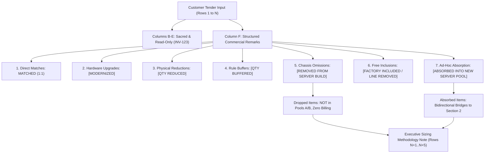

# BOQ Commercial Remarks & Reconciliation Skill (`boq-remarks-reconciliation-skill`)

When presales architects, sales engineers, and solutions leads evaluate customer BOQs, tender spreadsheets, or vendor quote reconciliations, this skill directs the agent to generate crystal-clear, standardized commercial remarks with 100% mathematical integrity, zero customer data overwriting, and executive visual hierarchy.

---

## 🎯 Core Architectural Principles & Golden Directives

---

## 🏛️ The 8 Universal Tenets of Commercial BOQ Remarks

### Tenet 1: Zero Customer Overwrite (`INV-123`)
* **Strict Immutability**: Original customer data columns (Part Number, Description, Requested Qty, Set/Multiplier Qty, Unit Price) are SACRED and MUST NEVER be altered, replaced, or deleted in-place.
* **Confined Execution**: All engineering analysis, actions, and modernizations are written strictly to **Column F** (`Remarks & Configuration Action`).
* **Dynamic Header Resolution**: Never assume fixed column letters (`B, C, D, E, F`). Dynamically locate headers using case-insensitive semantic regex matching:
  - Part Number: `/^(p\/?n|part\s*no|part\s*number|sku|item\s*code)/i`
  - Description: `/^(desc|description|item\s*desc|specification)/i`
  - Quantity: `/^(qty|quantity|units?|count)/i`
  - Set Qty / Multiplier: `/^(set\s*qty|system\s*qty|node\s*multiplier|servers?)/i`
  - Remarks: `/^(remarks?|comments?|notes?|actions?)/i`

---

### Tenet 2: The 7 Standard Commercial Action Tags (`INV-124`)
Every remark in Column F MUST open with exactly one of the 7 standardized commercial tags to eliminate sales ambiguity:

| Action Tag | Commercial Meaning | Example Scenario |
| :--- | :--- | :--- |
| **`MATCHED (1:1)`** | Direct line-by-line parity | Part number, description, and quantity match the quote 100%. |
| **`[MODERNIZED]`** | Upgraded to active generation | Obsolete Gen10 / DDR4 / 4th Gen Xeon upgraded to Gen11 / DDR5 / 5th Gen Xeon. |
| **`[QTY REDUCED]`** | Reduced to fit physical limits | 4 FC HBAs asked $\rightarrow$ 3 configured (DL380 Gen11 1P max 3 HBAs). Extra fan kits / NS204i-u normalized. |
| **`[QTY BUFFERED]`** | Increased to satisfy rule | 10 DIMMs asked $\rightarrow$ 12 configured (satisfies Intel 8-channel interleaving without orphaned channels). |
| **`[REMOVED FROM SERVER BUILD]`** | Omitted from integrated chassis | Omitted because of physical slot conflicts or SAN-boot compute head architecture (OS boots from NS204i-u; primary storage on SAN). |
| **`[FACTORY INCLUDED / LINE REMOVED]`**| Manufacturer free inclusion | Drive blanks (`666987-B21`) automatically installed by HPE factory; standalone paid line omitted from quote. |
| **`[ABSORBED INTO NEW SERVER POOL]`** | Loose part mounted in server pool | Unattached memory, drives, NICs, or CPUs packaged into certified Section 2 carrier server nodes. |

---

### Tenet 3: Absolute Prohibition of Ambiguous Words (`SPARE`, `[SYSTEM ARCHITECTURE]`)
* **The "SPARE" Prohibition**: The word "SPARE" must NEVER appear near removed or reduced items. When parts are omitted to satisfy physical limits or SAN-boot architecture, they are simply **DROPPED** from the factory configuration. Calling them "spares" implies that a loose part was delivered or billed, confusing sales, architects, and customers.
* **The "SYSTEM ARCHITECTURE" Prohibition**: Ambiguous placeholders like `[SYSTEM ARCHITECTURE]` are strictly forbidden. If a SAN storage array base (`R0Q74B`), chassis base (`P52534-B21`), or iLO license (`BD505A`) is present in the customer tender and configured in the BOM, it is classified as **`MATCHED (1:1)`**.

---

### Tenet 4: The Dropped vs. Absorbed Separation
There is a fundamental difference between items that are **DROPPED** and items that are **ABSORBED**:

1. **Dropped Items (Physical Deficiencies & Rule Violations)**:
   - Examples: 4th FC HBA in 1P build, NICs with no PCIe slots left, local SSDs on SAN-boot compute head, extra fan kits, duplicate boot devices, standalone drive blanks.
   - **Crucial Fact**: You can clearly see that these items are **NOT** in Server Pool A or Server Pool B.
   - **Mandatory Note**: Every dropped or reduced remark must conclude with:
     `Note: Dropped from factory build; not added to Server Pools A or B.`
2. **Absorbed Items (Loose Ad-Hoc Requirements)**:
   - Examples: Loose memory DIMMs, unattached SSDs/HDDs, standalone NICs, and disparate legacy CPUs in ad-hoc tables.
   - **Crucial Fact**: These items **ARE** in Server Pool A or Server Pool B, with exact mathematical proof.
   - **Mandatory Bridge**: Every absorbed remark must state the exact source formula and destination pool.

---

### Tenet 5: Standard 6-Color Visual Hierarchy

All deliverables (Excel `.xlsx` and Google Sheets) must apply this standardized executive color scheme:

| Category | Excel Fill | Excel Font | Google Sheets RGB (Bg / Fg) | Hex Codes |
| :--- | :---: | :---: | :---: | :---: |
| **MATCHED (1:1)** | `#E6F4EA` | `#137333` Bold | `(0.902, 0.957, 0.918) / (0.075, 0.451, 0.200)` | Soft Green |
| **MODERNIZED** | `#E8F0FE` | `#174EA6` Regular | `(0.910, 0.941, 0.996) / (0.090, 0.306, 0.651)` | Soft Blue |
| **QTY REDUCED** | `#FEF7E0` | `#B06000` Regular | `(0.996, 0.969, 0.878) / (0.690, 0.376, 0.000)` | Soft Amber |
| **QTY BUFFERED** | `#E0F2F1` | `#00695C` Regular | `(0.878, 0.949, 0.945) / (0.000, 0.412, 0.361)` | Soft Teal |
| **REMOVED / FACTORY** | `#FCE8E6` | `#C5221F` Regular | `(0.988, 0.910, 0.902) / (0.773, 0.133, 0.122)` | Soft Rose |
| **ABSORBED (Pools A/B)**| `#F3E8FD` | `#7627BB` Regular | `(0.953, 0.910, 0.992) / (0.463, 0.153, 0.733)` | Soft Purple |
| **SECTION HEADERS** | `#202124` | `#FFFFFF` Bold | `(0.125, 0.129, 0.141) / (1.000, 1.000, 1.000)` | Dark Slate Banner |

---

### Tenet 6: Bidirectional Mathematical Bridges

Remarks must establish an unbroken mathematical chain connecting Section 1 ad-hoc items to Section 2 carrier server pools:

* **Forward Link (Section 1 $\rightarrow$ Section 2)**:
  `[ABSORBED INTO NEW SERVER POOL] [Proposed Active SKU: P64707-F21 in Table 19] [Configured Qty: 128 DIMMs configured across Table 19] [Action: Absorbed into Server Pool A (Table 19). Tender requested 32 loose DDR4 64GB DIMMs here (+ 8 in Table 16 + 80 in Table 18 = 120 total). Modernized to active DDR5-5600 64GB Smart FIO and absorbed into Table 19 (4 servers x 32 DIMMs = 128 DIMMs) for fully populated 8-channel memory].`
* **Backtracking Link (Section 2 $\rightarrow$ Section 1)**:
  `Absorbs 120 ad-hoc 64GB DIMMs requested across Table 13 (32), Table 16 (8), and Table 18 (80). Configured as 4 servers x 32 DIMMs = 128 DIMMs total (satisfies 120 required + 8 buffer for balanced 8-channel memory).`

---

### Tenet 7: Executive Sizing & Reconciliation Methodology Note

Every customer-facing deliverable workbook MUST append the 4-point Executive Methodology Note at the bottom, merged across Columns B to F:

1. **Point 1 (Chassis Deficiencies / Dropped Items)**: Explains that physical duplicates, slot over-allocations, and SAN-boot unneeded drives were dropped from the factory build for certified physical/architectural reasons. Explicitly states that these dropped items are NOT present in Server Pool A or Server Pool B.
2. **Point 2 (Packaging Loose Ad-Hoc Items / Absorbed Items)**: Explains that only the customer's loose, unattached parts from ad-hoc tables were packaged into certified carrier server pools with exact mathematical proof.
3. **Point 3 (Zero Double-Counting & Mathematical Integrity)**: Guarantees every item is accounted for exactly once, with zero overlap between UCID 1 and UCID 2.
4. **Point 4 (100% Manufacturer Warranty & Deployment Readiness)**: Guarantees all servers are official HPE CTO builds with 3-year 24x7 Tech Care support.

---

### Tenet 8: The Blind Audit Validation Protocol

Before any deliverable is presented to the user or customer, run an automated blind read audit:
1. Extract **ONLY** the text in Column F across all rows.
2. Sum all requested quantities from Section 1 remarks ($\sum Q_{\text{req}}$).
3. Sum all configured quantities from Section 2 remarks ($\sum Q_{\text{cfg}}$).
4. Assert that $\sum Q_{\text{cfg}} \ge \sum Q_{\text{req}}$ and that every buffer is mathematically justified.
5. Assert that the word `SPARE` occurs **0 times** across the entire workbook.
6. Assert that 0 cells in customer columns B, C, D, E were modified in-place (`diff == 0`).
