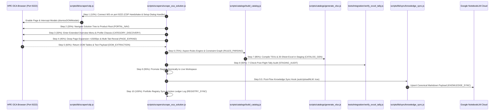

# OCA Catalog Scraper Skill (`oca-catalog-scraper`)

---

## 1. Purpose & Overview (Workflow 1)

This skill represents **Workflow 1 (Intelligence Extraction)** of the dual-workflow paradigm. Its sole purpose is to extract complete product catalog intelligence from vendor portals (HPE OCA, etc.) to build the baseline rules engine. It produces a classified multi-sheet **Catalog Excel workbook** (20 sheets) + companion JSON files stored under `outputs/{Family}/{Gen}/{Model}_{FormFactor}/`. These rules are structurally required by **Workflow 2 (Pre-Flight Evaluation)** to validate quotes.

---

## 2. 10-Stage Scraping Lifecycle Architecture (Mermaid Sequence Visual)



---

## 3. The 10 Atomic Scraping Stages & SSE Telemetry

| Step # | Stage ID | Stage Name | Target Action | SSE Emission Payload |
| :---: | :--- | :--- | :--- | :--- |
| **1** | `CDP_CONNECT` | CDP Handshake & Verification | Connects to port 9222 and binds automated modal handlers. | `{ step: 1, percent: 10, stage: 'CDP_CONNECT' }` |
| **2** | `PORTAL_NAV` | Solution Root Discovery | Finds solution title and navigates tree root. | `{ step: 2, percent: 20, stage: 'PORTAL_NAV' }` |
| **3** | `CATEGORY_DISCOVERY` | Menu Traversal & Profiling | Enters menu and loads hardware profile. | `{ step: 3, percent: 30, stage: 'CATEGORY_DISCOVERY' }` |
| **4** | `PAGE_EXPAND` | Section & Multi-Tab Expansion | Scrolls page past threshold, checks Pointnext/Services tabs. | `{ step: 4, percent: 45, stage: 'PAGE_EXPAND' }` |
| **5** | `DOM_EXTRACTION` | Tabular Row & Text Scraping | Extracts chunked text, table row arrays, and landmark headers. | `{ step: 5, percent: 60, stage: 'DOM_EXTRACTION', itemsScraped: N }` |
| **6** | `RULES_PARSING` | Aspect Rules & Constraints | Parses min/max limits, slot caps, dependencies into constraint graph. | `{ step: 6, percent: 75, stage: 'RULES_PARSING' }` |
| **7** | `CATALOG_GEN` | Staging & Master Excel Generation | Compiles TSVs, computes diffs, writes 20-sheet Excel in staging. | `{ step: 7, percent: 85, stage: 'CATALOG_GEN' }` |
| **8** | `STAGING_AUDIT` | 7-Check Post-Flight Tally Audit | Verifies row counts, formulas, 4-level hierarchy paths, numeric Qty. | `{ step: 8, percent: 90, stage: 'STAGING_AUDIT' }` |
| **9** | `KNOWLEDGE_SYNC` | Live Promotion & NotebookLM Grounding | Atomically promotes staging and syncs knowledge payload to NotebookLM. | `{ step: 9, percent: 95, stage: 'KNOWLEDGE_SYNC' }` |
| **10** | `REGISTRY_SYNC` | Portfolio Registry & Ledger Sync | Synchronizes chassis variants across workspace and logs action ledger. | `{ step: 10, percent: 100, stage: 'REGISTRY_SYNC' }` |

---

## 4. Current State & Certified Products (Last Audited: 2026-08-22)

| Product | Family | Output Prefix | Unique SKUs | Sheets | Audit | NotebookLM Sync |
|---------|--------|---------------|-------------|--------|-------|-----------------|
| Product | Family | Output Prefix | Unique SKUs | Sheets | Audit | NotebookLM Sync |
|---------|--------|---------------|-------------|--------|-------|-----------------|
| HPE ProLiant DL380 Gen12 SFF | ProLiant | `DL380_Gen12_SFF` | 261 HW / 603 Svc (864 total) | 20 Sheets | ✅ 100% PASS | ✅ Verified Cloud RAG |
| HPE ProLiant DL380 Gen11 | ProLiant | `DL380_Gen11` | 476 HW / 1115 Svc (1591 total) | 22 Sheets | ✅ 100% PASS | ✅ Verified Cloud RAG |
| HPE StoreEver MSL3040 Tape Library | StoreEver | `MSL3040_Tape` | 2 (Baseline + CTO) | 7 Sheets | ✅ 100% PASS | ✅ Verified Cloud RAG |
| HPE Cray Supercomputing GX5000 Rack | Cray | `GX5000_General_RACK` | 2 (Baseline + CTO) | 7 Sheets | ✅ 100% PASS | ✅ Verified Cloud RAG |
| HPE Synergy VC 100Gb F32 Module | Synergy | `SY100Gb_F32_Module` | 3 (Baseline + CTO) | 7 Sheets | ✅ 100% PASS | ✅ Verified Cloud RAG |
| HPE Alletra Storage System | Alletra | `Alletra_Storage_System` | 3 (Baseline + CTO) | 7 Sheets | ✅ 100% PASS | ✅ Verified Cloud RAG |

**Total Portfolio Intelligence**: **7/7 Product Lines Certified** across 5 families.

---

## 5. Master Excel Workbook Architecture (22 Validated Sheets)

1. `Category Summary`: Subcategories with quantity limits, constraint texts, and category roles.
2. `All SKUs`: Full 24-column metadata structure for every hardware component.
3. `Chassis Variants`: CTO Base Chassis Models (`P52534-B21`, etc.).
4. `Rules & Constraints`: Aspect & constraint rules across the hierarchy levels.
5. `Hardware Accessories`: Form-factor brackets, blanks, security bezels, cable kits.
6. `Software & Licenses`: Pointnext, Tech Care tiers, iLO Advanced, OS licenses.
7. `Support Services`: Proactive care & startup services configuration table.
8. `Catalog Diffs`: Differential SKU delta tracking with color-coded diff status badges.
9. `Price History Timeline`: Chronological snapshot price data points.
10. `Processor`: All Intel Xeon Scalable processors with thermal constraints and lifecycle status (`OB`, `DS`, `90`).
11. `Memory`: DDR5 Registered Smart Memory modules with memory channel rules.
12. `Networking`: High-speed OCP 3.0 & PCIe adapters (10GbE to 200GbE).
13. `Power Supplies`: Titanium, Platinum & -48VDC Flex Slot PSUs with power budget mappings.
14. `Cooling & Thermal`: High Performance & Standard Fan Kits and Performance Heat Sinks.
15. `Accessories & Infrastructure`: Energy Star presets, rail kits, and cable management arms.
16. `Drive Enclosures & Drives`: SFF cage bundles, NVMe drive enclosures, SAS/SATA backplanes.
17. `Storage Controllers`: Tri-Mode MegaRAID & Smart Array storage controllers.
18. `PCIe Risers`: Primary, secondary, tertiary PCIe risers.
19. `Graphics & GPU`: Enterprise GPU enablement kits and accelerators.
20. `Chassis`: Server chassis configurations and backplane topologies.
21. `Discontinued SKUs`: Tracked historical SKUs with EOL dates and price trails.
22. `Metadata`: Scrape metadata, session timestamps, and SHA-256 catalog checksum.

---

## 6. WebLogic DOM Extraction & Lifecycle Intelligence Protocol (INV-20 to INV-22)

1. **Sub-Choice Group Expansion (`INV-20`)**:
   - `expandSections` in `cdp.js` automatically toggles `#show_extra_columns`, `#show_dates`, `#show_obsolete_date`, `#show_cost`, `#show_price` and checks all `input[id*="showmore"]` inputs, dispatching jQuery `change` events (`jQuery(i).prop('checked', true).trigger('change')`) to trigger full WebLogic client rendering of sub-choices (e.g., `AdditionalProcessorsChoice`).
2. **Lifecycle Status Tag & Clean PID Separation (`INV-21`)**:
   - WebLogic OCA DOM places status tags (`OB`, `DS`, `90`) inside `<td class="item_prod">` as `<span class="td_prod">OB</span>` alongside `<span class="_pid">P49631-B21</span>`.
   - `dom_extract.js` and `build_catalog.js` extract both clean SKUs and separate lifecycle statuses (`Obsolete (OB)`, `Direct Ship (DS)`, `EOL Warning (90-Day)`, `Active`), start effective dates, and discontinued/obsolete dates into catalog JSON and Excel columns.
3. **Category Cardinality Assertion (`INV-22`)**:
   - Staging audits (`verify_excel_tally.js`, `test_pipeline_evals.js`) enforce category cardinality thresholds for flagship dual-socket systems (e.g. DL380 requires >= 40 processor SKUs) to fail hard if an incomplete DOM expansion is encountered.

---

## 7. Execution Commands

```bash
# E2E Server/Solution Scrape (DL380 Gen11 / Gen12 / Synergy / Cray)
node scripts/scrapers/scrape_oca_solution.js --chassis DL380_Gen11

# Rebuild all scraped catalogs & regenerate workbooks
npm run rebuild

# Full Portfolio Certification Audit
npm test
```
