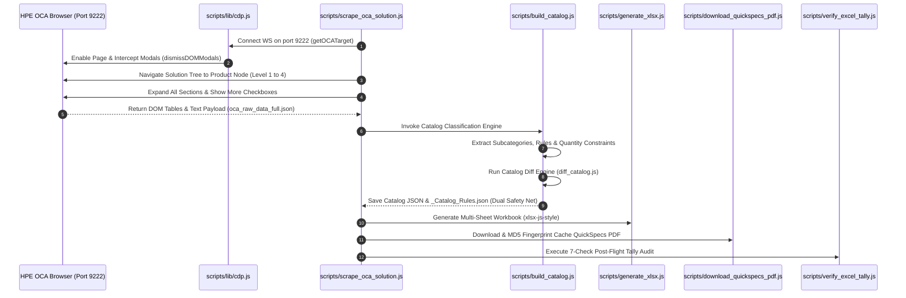

# OCA Catalog Scraper Skill (`oca-catalog-scraper`)

---

## 1. Purpose & Overview (Workflow 1)

This skill represents **Workflow 1 (Intelligence Extraction)** of the dual-workflow paradigm. Its sole purpose is to extract complete product catalog intelligence from vendor portals (HPE OCA, etc.) to build the baseline rules engine. It produces a classified multi-sheet **Catalog Excel workbook** + companion JSON files stored under `outputs/{Family}/{Gen}/{Model}_{FormFactor}/`. These rules are structurally required by **Workflow 2 (Pre-Flight Evaluation)** to validate quotes.

---

## 2. Scraping Lifecycle Architecture (Mermaid Sequence Visual)



---

## 3. Current State & Certified Products (as of 2026-08-14)

| Product | Family | Output Prefix | SKUs | Audit | QuickSpecs PDF |
|---------|--------|---------------|------|-------|----------------|
| HPE ProLiant DL380 Gen12 SFF | ProLiant | `DL380_Gen12_SFF` | 277 HW / 512 Svc | ✅ 100% PASS | ✅ Verified (2.06 MB) |
| HPE ProLiant DL380 Gen11 | ProLiant | `DL380_Gen11` | 4 (Baseline + CTO) | ✅ 100% PASS | ✅ Verified (2.06 MB) |
| HPE StoreEver MSL3040 Tape Library | StoreEver | `MSL3040_Tape` | 2 (Baseline + CTO) | ✅ 100% PASS | ✅ Verified (2.06 MB) |
| HPE Cray Supercomputing GX5000 Rack | Cray | `GX5000_General_RACK` | 2 (Baseline + CTO) | ✅ 100% PASS | ⚠️ Advisory |
| HPE Synergy VC 100Gb F32 Module | Synergy | `SY100Gb_F32_Module` | 3 (Baseline + CTO) | ✅ 100% PASS | ✅ Verified (0.89 MB) |
| HPE Alletra Storage System | Alletra | `Alletra_Storage_System` | 3 (Baseline + CTO) | ✅ 100% PASS | ⏳ Configured in map |

**Total Portfolio Intelligence**: **6/6 Product Lines Certified** across 5 families.

---

## 4. Key Production Components & Scripts

- **CDP Debugging Module**: [`scripts/lib/cdp.js`](file:///home/vinodh/vendorNotebookSolution/scripts/lib/cdp.js) — WebSocket remote debugging connection over port 9222 with auto-retry and backoff.
- **Server/Compute Scraper**: [`scripts/scrape_oca_solution.js`](file:///home/vinodh/vendorNotebookSolution/scripts/scrape_oca_solution.js) — Solution-first 4-level root traversal scraper (`npm run scrape`).
- **Storage Solution Wizard Scraper**: [`scripts/scrape_oca_storage_solution.js`](file:///home/vinodh/vendorNotebookSolution/scripts/scrape_oca_storage_solution.js) — Wizard sub-tab scraper for Alletra/Nimble/StoreOnce (`npm run scrape:storage`).
- **Catalog Build Engine**: [`scripts/build_catalog.js`](file:///home/vinodh/vendorNotebookSolution/scripts/build_catalog.js) — Compiles raw JSON into structured catalog JSON + TSVs + Dual Safety Net `*_Catalog_Rules.json` with `chassisVariantMatrix`.
- **Excel Workbook Generator**: [`scripts/generate_xlsx.js`](file:///home/vinodh/vendorNotebookSolution/scripts/generate_xlsx.js) — 19-sheet Excel generator using `xlsx-js-style` with color-coded diff formatting.
- **QuickSpecs PDF Downloader**: [`scripts/download_quickspecs_pdf.js`](file:///home/vinodh/vendorNotebookSolution/scripts/download_quickspecs_pdf.js) — Downloads PDF with MD5 fingerprint caching.
- **7-Check Tally Audit**: [`scripts/verify_excel_tally.js`](file:///home/vinodh/vendorNotebookSolution/scripts/verify_excel_tally.js) — Post-flight audit engine.
- **Master Registry Auto-Synchronizer**: [`scripts/sync_all_registered_catalogs.js`](file:///home/vinodh/vendorNotebookSolution/scripts/sync_all_registered_catalogs.js) — Injects base chassis variants across all registered catalogs.

---

## 5. Portal Scraping Channels & Strict In-Page Navigation Protocol

### 🌐 3 Distinct Scraping Channels
1. **Channel 1: Solution Root & Chassis Search Page**:
   - Contains Base Chassis CTO Variants (`P73282-B21` to `P73287-B21`) and their base list prices ($5,584 - $7,450).
2. **Channel 2: Product Node Menu / Extended Overview Menu**:
   - Contains internal hardware subcategories (Processors, Memory, Power, Drive cages, Fans) and Aspect Rules.
3. **Channel 3: Solution Services / Configured BOM Tab**:
   - Contains Pointnext, Tech Care tiers, and startup services.

### 🔒 Strict Navigation Protocol
- **NEVER use browser `back()` button or raw direct URLs**: Direct URL navigation breaks authenticated WebLogic/OAuth SSO sessions.
- **ALL navigation MUST execute via in-page DOM element clicks and jQuery tree selectors** via CDP within the active authenticated session.

---

## 6. Execution Commands

```bash
# E2E Server/Solution Scrape (DL380 Gen12 / Synergy / Cray)
npm run scrape

# E2E Storage Solution Wizard Scrape (Alletra / Nimble / StoreOnce)
npm run scrape:storage

# Rebuild all scraped catalogs & regenerate workbooks
npm run rebuild

# Sync portfolio registry & base chassis variants
node scripts/sync_all_registered_catalogs.js
```
