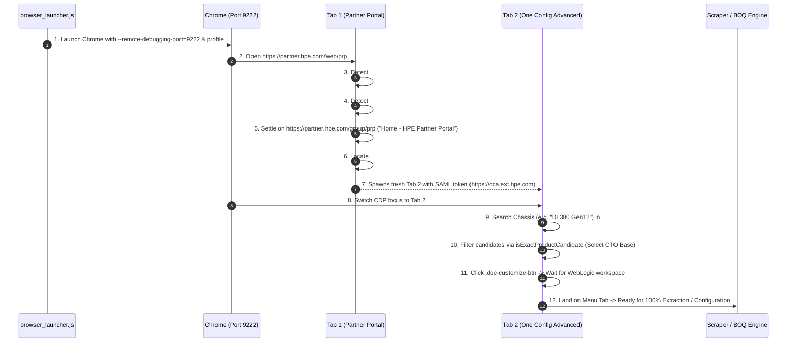

# HPE Partner Portal & OCA Auto-Navigator Skill (`oca-portal-navigator`)

This skill provides 100% hands-free, zero-touch automated navigation through the HPE Partner Portal (`https://partner.hpe.com`) SSO authentication, Quick Links launcher, chassis search, base CTO price extraction, and entering the WebLogic OCA configuration Menu tab using native Chrome DevTools Protocol (CDP) on port 9222.

Critically, this skill formalizes the **Stale-Session Self-Healing Recovery Protocol (INV-89)**, which recovers from WebLogic timeouts, silent freezes, and unhandled exceptions by returning to Tab 1 (Partner Portal) to refresh tokens rather than breaking state via in-place OCA page reloads.

---

## 1. Why CDP Port 9222 & Persistent Profile

| Metric | Playwright / Selenium | CDP Port 9222 with `.chrome_sso_profile` |
|---|---|---|
| **Dependency Weight** | > 300 MB browser binaries | **0 MB (Uses system Chrome WS)** |
| **SSO Credential Persistence** | Lost on each clean context | **100% Retained in `--user-data-dir=.chrome_sso_profile`** |
| **Bypass SSO MFA / Login Prompts** | Stalls on interactive login | **Auto-submits pre-filled Okta & Onepass credentials** |
| **WebLogic Popup & Window Handling** | Traps on `window.open` tabs | **Dynamic CDP page target discovery across all tabs** |
| **Recovery from Frozen State** | Requires restarting browser | **Recovers in seconds via Tab 1 Quick Links reload** |

---

## 2. The 12-Step Autonomous Navigation Lifecycle



### Atomic Stages Breakdown

1. **Browser Auto-Launch (`browser_launcher.js`)**:
   Checks if Chrome is listening on port 9222. If not, spawns `google-chrome` with `--remote-debugging-port=9222`, `--user-data-dir=.chrome_sso_profile`, and initial URL `https://partner.hpe.com/web/prp`.
2. **Landing Page Sign-In Detection**:
   Inspects DOM for `#oktaSignInBtn` or `button.btn-sign-in` ("Sign in") and triggers click.
3. **Automated Credential Modal Submission**:
   Detects the Onepass credential modal where email (`#oktaEmailInput`) and password (`#password-sign-in`) are auto-populated from Chrome's saved profile. Clicks the green submit button (`#onepass-submit-btn` / `button.submit-btn`) and dispatches simulated mouse clicks at center coordinates.
4. **Partner Portal Settlement**:
   Waits patiently for redirect to settle on `https://partner.hpe.com/group/prp` with page title "Home - HPE Partner Portal".
5. **Quick Links Discovery**:
   Locates the "One Config Advanced" launcher inside `.quickLinksContainer` at `#quick-links-807 a` (or element with `eServiceId=187402`).
6. **SAML SSO Tab Spawning**:
   Clicks the Quick Link, executing `updateToolActivity('187402')` and spawning `https://oca.ext.hpe.com/oca/OCAInternalLogin` in a new browser tab with fresh SAML tokens.
7. **CDP Target Switch**:
   Queries `http://localhost:9222/json` to acquire the WebSocket URL of the new OCA page target.
8. **Chassis Query Execution**:
   Switches to "Product Catalog" mode if required, enters the chassis search query (e.g., "DL380 Gen12") into `#searchProductInput`, and triggers `input` and `change` events.
9. **Candidate Triage & CTO Selection**:
   Runs `extractCandidates()` and filters using `isExactProductCandidate(query, candidate)`. Selects the standard Configure-To-Order (CTO) base chassis (e.g., `P73282-B21`) while strictly rejecting BTO, TAA (`#GTA`), and discontinued parts.
10. **Customization Trigger**:
    Selects standalone enclosure/rack if required and clicks the customize button (`.dqe-customize-btn`).
11. **WebLogic Configuration Load**:
    Waits for the legacy WebLogic Java workspace to render and passes through any intermediate customization gateway pages.
12. **Menu Tab Handshake**:
    Asserts presence of `#extended_overview_menu` or high DOM table cardinality (`tableCount > 40`), ready for scraping or component manipulation.

---

## 3. Stale-Session Self-Healing Recovery Protocol (`INV-89`)

### Why Direct OCA Page Reload (`location.reload()`) Breaks Flow
WebLogic OCA is an enterprise Java application where session state is held in server memory, validated against temporary SAML tokens issued during the Partner Portal redirect. 

Attempting to refresh an OCA page in-place (`location.reload()` or clicking browser reload):
- **Invalidates WebLogic server state** $\rightarrow$ produces unrecoverable 403 Forbidden or blank white screens.
- **Drops POST/SAML parameters** $\rightarrow$ redirects to broken generic login pages.
- **Fails on silent hangs** $\rightarrow$ WebLogic frequently encounters internal JavaScript exceptions, frozen AJAX overlays (`.dqe-loading`), or table rendering aborts without showing an explicit timeout message.

### The 6-Step Tab 1 Self-Healing Loop

When a timeout, silent freeze, or unhandled exception is detected:

```
[Stale / Frozen OCA Tab Detected]
               │
               ▼
[Step 1: Close Stale OCA Tab via CDP (/json/close)]
               │
               ▼
[Step 2: Switch Focus to Tab 1 (partner.hpe.com/group/prp)]
               │
               ▼
[Step 3: If Expired -> Auto-Sign In via #oktaSignInBtn & #onepass-submit-btn]
               │
               ▼
[Step 4: Reload Tab 1 via Page.reload -> Refreshes Quick Links & Tokens]
               │
               ▼
[Step 5: Click "One Config Advanced" in Quick Links (#quick-links-807 a)]
               │
               ▼
[Step 6: Fresh OCA Tab Created -> Search Chassis & Land on Menu Tab]
```

```javascript
// Canonical implementation in scripts/lib/scraper/navigate_oca.js
async function recoverAndLaunchFreshOCA(query, options = {}) {
  console.log(`🔄 [SELF_HEALING] Triggering Tab 1 Stale-Session Recovery...`);
  
  // 1. Close all existing OCA tabs to eliminate session collisions
  const pages = await getPageTargets();
  for (const t of pages) {
    if (t.url && t.url.includes('oca.ext.hpe.com')) {
      console.log(`   Closing stale OCA tab: [${t.id}] ${t.url}`);
      await closePageTarget(t.id);
    }
  }
  
  // 2. Locate Tab 1 (Partner Portal)
  let freshPages = await getPageTargets();
  let partnerTarget = freshPages.find(t => t.url && t.url.includes('partner.hpe.com'));
  if (!partnerTarget) {
    await ensureChromeBrowserRunning(CDP_PORT, 'https://partner.hpe.com/web/prp');
    partnerTarget = await waitForPartnerPortalHome();
  }
  
  // 3. Re-authenticate if session dropped to login screen
  if (partnerTarget.url.includes('login') || partnerTarget.url.includes('sso')) {
    partnerTarget = await performAutomatedSignIn(partnerTarget);
  }
  
  // 4. Refresh Tab 1 to reload fresh SAML tokens and Quick Links
  const partnerWs = await connectWS(partnerTarget.webSocketDebuggerUrl);
  await sendCommand(partnerWs, 'Page.reload');
  await waitForDOMPredicate(partnerWs, `Boolean(
    document.querySelector('.hpe-quicklinks__item a, a.hpe-quicklinks__link, #quick-links-807 a') ||
    document.readyState === 'complete'
  )`, 15000, 500);
  partnerWs.close();
  
  // 5. Click "One Config Advanced" under Quick links
  // 6. Navigate newly spawned tab to target chassis (strip forceFreshSession to allow target resolution)
  return handlePartnerPortalLaunch(reloadedPartner, query, { ...options, forceFreshSession: true });
}
```

---

## 4. Key DOM Selectors Reference

| Function | Selector / Trigger | Purpose |
|---|---|---|
| **Portal Sign-In Button** | `#oktaSignInBtn`, `button.btn-sign-in` | Initiates Partner Portal authentication |
| **Credential Submit Button** | `#onepass-submit-btn`, `button.submit-btn`, `#okta-signin-submit`, `.button-primary` | Submits auto-saved Okta credentials or Onepass modal |
| **Authenticated Portal Home** | `https://partner.hpe.com/group/prp` | Canonical Tab 1 landing location |
| **One Config Advanced Link** | `#quick-links-807 a`, `a[href*="eServiceId=187402"]` | Launches fresh OCA session with SAML tokens |
| **Product Search Input** | `#searchProductInput`, `#search-config` | Chassis search input box |
| **Search Mode Trigger** | `#dqe_ai_mode_trigger` $\rightarrow$ `.item-title` "Product Catalog" | Ensures standard product catalog search mode |
| **Customize Button** | `.dqe-customize-btn`, `button.dqe-customize-btn` | Enters configuration workspace for selected chassis |
| **Menu Configuration Tab** | `#extended_overview_menu`, `a[href*="extended_overview_menu"]` | Verification anchor for scraping / configuration |

---

## 5. Usage Commands

### 1. Launch Hands-Free Auto-Navigation to Chassis
```bash
node scripts/lib/scraper/navigate_oca.js "DL380 Gen12"
```

### 2. Force Fresh Session Recovery from Tab 1
```bash
node -e "
const { navigateToOCAChassis } = require('./scripts/lib/scraper/navigate_oca.js');
navigateToOCAChassis('DL380 Gen12', { forceFreshSession: true }).then(console.log);
"
```

### 3. Integrated Scrape Pipeline with Auto-Recovery
```bash
node scripts/scrapers/scrape_oca_solution.js --chassis DL380_Gen12
```
