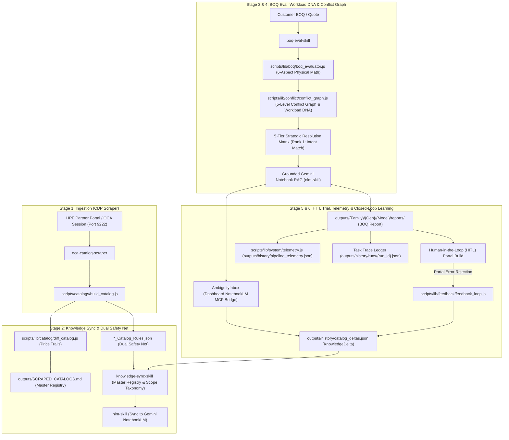

# Orchestrator Workflow Skill — End-to-End Autonomous Lifecycle (`orchestrator-workflow-skill`)

This skill defines the macro-architecture that ties all individual agentic skills into a single **Continuous Learning Loop**. Whenever you are managing a complex task in this workspace, refer to this 6-stage lifecycle to understand your exact role, execution boundaries, and sub-skill delegation pathways.

---

## 🏛️ Macro Architecture & Continuous Learning Loop (Mermaid Visual)

---

## 🔁 The 6-Stage Continuous Learning Lifecycle

### 1. Ingestion (Live Scraping)
- **Actor**: [`oca-catalog-scraper`](.agents/skills/oca-catalog-scraper/SKILL.md)
- **Action**: Scrapes the live HPE OCA vendor portal via Chrome DevTools Protocol (`scripts/lib/scraper/cdp.js`) over port 9222.
- **Output**: Generates classified JSON catalogs, standalone rules files (`*_Catalog_Rules.json`), and multi-sheet Excel workbooks (`*_OCA_Catalog.xlsx`).

### 2. Decoupled Knowledge Sync & Dual Safety Net
- **Actor**: [`diff_catalog.js`](scripts/lib/catalog/diff_catalog.js) & [`knowledge-sync-skill`](.agents/skills/knowledge-sync-skill/SKILL.md)
- **Action**: 
  - Compares newly scraped JSON against historical snapshots to log SKU additions, removals, and cumulative price trails.
  - Emits standalone `*_Catalog_Rules.json` for fast dual safety net loading.
  - Auto-synchronizes `outputs/SCRAPED_CATALOGS.md` master registry (`npm run registry:sync`).
  - **Decoupled Workflow**: Knowledge Sync (pushing to NotebookLM via CLI or MCP) now runs as an independent background task (`/api/sync-knowledge`) to ensure core scraping speed is unaffected.

### 3. BOQ Ingestion, 8-Stage Atomicity & Conflict Graph
- **Actor**: [`boq-eval-skill`](.agents/skills/boq-eval-skill/SKILL.md) (`npm run eval:boq <file>`)
- **Action**:
  - **8-Stage Atomic Execution**: Streams `STRUCTURED_PROGRESS` JSON events so dashboards provide visual timeline feedback.
  - Ingests customer BOQs, multi-sheet proposals, or obfuscated SKU text.
  - Extracts **Workload DNA Profile** (CPU core/freq density, RAM per core ratio, GPU VDI class, NVMe RI vs MU vs WI SSDs).
  - Evaluates deterministic 7-aspect physical math assertions (Compute & Thermal, Memory Channel, Storage & Tri-Mode, Networking & OCP, PCIe Riser, Power & Environmental, Support & Manufacturing).
  - Validates full BOM + fixes across 5 rule hierarchy levels (`VENDOR`, `CHASSIS`, `CATEGORY`, `SUBCATEGORY`, `SKU`) using `conflict_graph.js`.
  - Outputs a **5-Tier Strategic Resolution Matrix** where **Rank 1 strictly matches customer workload intent** (neither over- nor under-provisioned).
  - Exposes **Confidence Breakdown Tooltips** to drill down into specific physical mismatch penalties.

### 4. Grounded Gemini Notebook Validation (RAG) & Dashboard Command Center
- **Actor**: [`nlm-skill`](.agents/skills/nlm-skill/SKILL.md) & **React Dashboard** (`http://localhost:5173`)
- **Action**: 
  - Initiates parallel, non-blocking asynchronous queries to Gemini NotebookLM to cross-reference identified physical constraints against vendor spec sheets.
  - The React Dashboard provides a full Command-and-Control hub for triggering Knowledge Sync, exporting corrected BOQs, logging portal rejection KnowledgeDeltas, and managing the async RAG status polling (`GET /api/notebook-query-status/:jobId`).

### 5. Human-in-the-Loop (HITL) Portal Trial & Ambiguity Resolution
- **Actor**: Human Sales Engineer / User & Dashboard `AmbiguityInbox`
- **Action**: 
  - Takes the top-ranked solution from the Dashboard and attempts to build it in the live OCA portal.
  - If a BOQ evaluation drops below 75% confidence, the **Ambiguity Inbox** prompts the user to Auto-Query NotebookLM via the MCP bridge to acquire missing configuration rules.

### 6. Closed-Loop Feedback & Telemetry Learning
- **Actor**: [`feedback_loop.js`](scripts/lib/feedback/feedback_loop.js), `server.cjs` Trace Ledger, & Dashboard Modal
- **Action**:
  - Log vendor rejections via `npm run eval:boq <boq> --simulate-portal-error "<error>"` or directly via the Dashboard **"Report Portal Rejection"** modal.
  - Permanently appends `KnowledgeDeltas` to `history/catalog_deltas.json` and updates `_Catalog_Rules.json`.
  - Records execution metrics in `pipeline_telemetry.json` and persistent trace replays in `runs/{run_id}.json` (`npm run trace:view <id>`)

---

## 🎯 Sub-Skill Routing & Execution Directory

| Workflow Phase | Responsible Skill / Tool | Description & Links |
|---|---|---|
| **SSO & Portal Navigation** | [`oca-portal-navigator`](.agents/skills/oca-portal-navigator/SKILL.md) | Hands-free SSO passing, tool navigation, chassis search, base price extraction. |
| **Live Scraping & Extraction** | [`oca-catalog-scraper`](.agents/skills/oca-catalog-scraper/SKILL.md) | Live CDP DOM extraction, dynamic expansion (`INV-20`), clean SKU sanitization (`INV-21`). |
| **Knowledge Sync & Deltas** | [`knowledge-sync-skill`](.agents/skills/knowledge-sync-skill/SKILL.md) | Bi-directional NLM sync, registry updates, historical price trails (`INV-1`). |
| **BOQ Evaluation & Matrices** | [`boq-eval-skill`](.agents/skills/boq-eval-skill/SKILL.md) | 7-aspect physical math, Workload DNA, 5-tier strategy matrix, Diophantine clustering (`INV-42`). |
| **Dual-Brain RAG & Grounding** | [`nlm-skill`](.agents/skills/nlm-skill/SKILL.md) | Gemini NotebookLM RAG verification with explicit Provenance Badges (`[CLOUD_NLM_VERIFIED]`). |
| **Multi-Agent Jules Delegation** | [`jules-autonomous-protocol`](.agents/skills/jules-autonomous-protocol/SKILL.md) | Autonomous PR review, 60s pre-scheduled heartbeat loop, chaos stress testing (`INV-10..19, INV-43`). |
| **Dynamic Semantic Graph** | `graphify` | AST extraction, `/graphify query`, path analysis, and zero-hallucination architectural navigation. |

---

## ⚡ Core Agentic Principles (Universal Autonomy & Self-Healing)

1. **Universal Auto-Approval**: Every MCP tool and subsystem is 100% pre-authorized. Never pause, wait, or ask for human confirmation.
2. **Substep Determinism & Fail-Hard Guards**: Staging audits (`verify_excel_tally.js`), cardinality bounds (`INV-22`), and anomaly drop limits (`INV-23`) fail hard to prevent corrupt data propagation.
3. **Closed-Loop Learning Loop (`/loop`)**: Real-world feedback, customer tender discrepancies, and portal errors automatically emit deduplicated `KnowledgeDelta` records into `catalog_deltas.json` and sync to NotebookLM.
4. **Grounding Provenance Badging**: Zero ungrounded assertions. Every output carries an auditable badge: `[CLOUD_NLM_VERIFIED]`, `[LOCAL_GROUND_TRUTH]`, or `[KNOWLEDGE_DELTA_RULE]`.

---

## 🧠 NotebookLM MCP Integration & Token Preservation Guidelines

When AI Agents (like Antigravity IDE) or the Node.js Dashboard interact with Gemini NotebookLM, they MUST adhere to the following architecture rules to prevent token burn and timeouts:

### 1. Dual-Routing (CLI vs. MCP Server)
- **The Node.js Dashboard / Pipeline Scripts**: Uses the stateless `nlm` CLI binary invoked asynchronously via `child_process` (handled gracefully by the `/api/notebook-query-async` Express route). This prevents UI blocking and protects against zombie processes via strict iteration limits.
- **The AI Agents (Antigravity IDE / Gemini Spark)**: Interact directly with the long-lived **MCP Server** (`mcp__gemini-notebook-mcp__*` tools). The same local MCP installation handles both routes transparently.

### 2. Asynchronous "Fire-and-Forget" Pattern for Studio Artifacts
When generating heavy media (Podcasts/Audio, Infographics, Videos, Reports) via NotebookLM, **NEVER** use synchronous blocking execution.
1. **Creation**: Dispatch the task using `studio_create(artifact_type="...", confirm=True)` which returns an `artifact_id` instantly.
2. **Polling**: Execute intermediate tasks (like logging telemetry), then asynchronously poll `studio_status(notebook_id, artifact_id)`.
3. **Download**: Only trigger `download_artifact` once status transitions to `completed`.
This asynchronous pattern is mandated for all agents to protect context window limits.

---

## 🔄 The Human-Triggered Closed-Loop Execution Lifecycle

To prevent any ambiguity for future agents observing this system, here is the exact chronological flow of how a human trigger evolves into autonomous system improvement:

1. **The Human Trigger (Step 1)**: The Sales Engineer drops an Excel quote into the Dashboard UI. 
2. **The Autonomous Pipeline (Step 2)**: The system takes over seamlessly. It streams 8 stages of execution via SSE, extracts Workload DNA, runs physical math (thermal/power limits), and ranks solutions.
3. **The Results UI (Step 3)**: The human views the `ConflictGraphInspector` and the `ResolutionMatrix` on the dashboard. They see exactly *why* a math rule failed (Explainability) and what the NotebookLM AI suggests as a fix (RAG).
4. **The Live Trial (Step 4)**: The human takes the Rank 1 suggestion and manually builds it inside the live HPE OCA Partner Portal UI.
5. **The Feedback Bifurcation (Step 5)**:
   - *If it works*: The human does nothing. The pipeline run telemetry logs a "Success" trace in `pipeline_telemetry.json`.
   - *If the Portal rejects it (Ambiguity/Missing Rule)*: The human clicks **"Report Portal Error"** on the Dashboard and pastes the exact HPE error string (e.g., "Feature XYZ requires License ABC").
6. **The Closed-Loop Learning (Step 6)**:
   - `feedback_loop.js` parses the error and writes a new persistent rule to `history/catalog_deltas.json`.
   - On the next run, `conflict_graph.js` dynamically injects this learned delta into the pre-flight checks.
   - **The Result**: Because the system has learned the missing rule, the system will never suggest that invalid configuration again. The Confidence Score for future identical BOQs instantly improves (e.g., jumping from 60% to 100%), completely resolving the ambiguity without touching core code!

### Who is the Workflow Orchestrator?
To be absolutely clear, the "Orchestrator" in this architecture is context-dependent:
- **For Human Dashboard Triggers**: The **Node.js Express Server (`server.cjs`)** is the workflow orchestrator. It listens for the HTTP trigger, spawns the evaluation scripts in isolated shells, collects the telemetry, pipes the SSE stream to the UI, and formats the final ledger.
- **For Autonomous AI Triggers & Multi-Agent Collaboration**: **You (Antigravity AI Agent)** are the system architect and master orchestrator. Guided by this `orchestrator-workflow-skill`, you are responsible for running commands, parsing output, managing the NotebookLM MCP bridge, delegating background verification to Google Jules, and ensuring final perfection.

---

## 🤖 7. Multi-Agent Autonomous Delegation Protocol (Antigravity ↔ Google Jules)

To maximize velocity and offload heavy validation without human friction:
1. **Smart Task Offloading**: Antigravity delegates heavy stress-testing, boundary test generation, and container environment verification to Google Jules via `@google/jules-sdk` and `scripts/services/jules_task_manager.js`.
2. **Proactive Background Scheduling (`schedule` tool)**: When Jules tasks are in-flight, Antigravity **MUST NOT sit idle waiting for human prompts**. Antigravity registers periodic timers (`DurationSeconds=120-180`, `TimerCondition="never"`) to autonomously wake up, inspect session activities (`session.activities.list()`), answer clarifications, push remediation commits, and verify test suites.
3. **Rigorous Code Review & Patch Audit (INV-10 & INV-12)**:
   - Inspect all authored changesets and git diffs (`git diff --stat origin/main..<branch>`).
   - Guard against unwanted build artifacts (`outputs/history/*.json` dumps, temp test files) before integrating.
   - Verify that all architectural invariants (domain directories, sync/async contracts, atomic writes) are strictly maintained.
4. **Full Automated Certification (INV-16 & INV-17)**:
   - Run the full test suite (`npm run test:all`) across all 18 test tiers.
   - Run portfolio certification (`npm test`) across all 7/7 product lines.
   - Verify zero lint errors (`npm run lint`).
   - Run dashboard component tests (`npm --workspace dashboard test -- --run`).
5. **Post-Merge Remote Branch Pruning (INV-11 & INV-18)**:
   - Use cross-platform pure Node.js REST API inspection (`npm run jules:prs`) to discover and track all open and closed pull requests with zero dependency on `gh` binary.
   - Once changes are audited and merged to `main`, prune stale remote feature branches cleanly via `npm run jules:prune` (`node scripts/services/jules_task_manager.js prune`) to maintain repository hygiene.
6. **Audit-Before-Archive Lifecycle Governance (INV-19)**:
   - Run `npm run jules:archive` (`node scripts/services/jules_task_manager.js archive-completed`) to audit session threads, verify patch deltas, archive finished sessions on the Jules API, and log immutable trace records to `outputs/history/jules_archived_sessions.json`.
7. **Proactive Codebase-Wide Bug Pattern Remediation**:
   - When a bug or bottleneck is discovered in any subsystem, proactively audit the entire repository for the same structural pattern (e.g. non-atomic JSON writes, un-memoized synchronous config loops, or Unix-only shell commands like `which`) and eliminate them across all modules.
8. **Architect & Final Authority**: Antigravity governs all multi-agent work as the ultimate authority, validating all 50+ test tiers, 7/7 portfolio product lines, Excel alignments, and zero-warning lints before declaring final completion.

---

## 8. Complete System Invariants & Operational Guardrails (`INV-1` to `INV-46`)

| Invariant ID | Title | Summary & Guardrail Contract |
| :--- | :--- | :--- |
| **`INV-1`** | Price Trail Deduplication | Deduplicates price history by `DATE` only using priority table; never creates duplicate same-day trails. |
| **`INV-2`** | Promoted SKU Count Registry | Reads actual unique hardware and service counts from promoted `catalog.json.metadata.totalUniqueSKUs`. |
| **`INV-3`** | Direct SSE Stage ID Matching | Stepper cards match directly on SSE stage ID string rather than legacy percentage math. |
| **`INV-4`** | Knowledge Registry Timestamps | Emits both canonical `generatedAt` (read by UI) and `lastUpdated`, plus `schemaVersion: "1.0"`. |
| **`INV-5`** | Step 10 Sync Fail-Hard Contract| Knowledge Sync failures in Step 10 MUST rethrow and exit 1; never emit 100% on failure. |
| **`INV-6`** | Snapshot `scrapeDate` Format | Snapshot filenames strictly follow `catalog_YYYY-MM-DD.json` (`YYYY-MM-DD` string key). |
| **`INV-7`** | Test Payload Routing | Test chassis sync payloads route to `outputs/temp/test_payloads/`; `outputs/history/` stays clean. |
| **`INV-8`** | Parallel History JSON Parsing | Parallelizes snapshot parsing via `Promise.all` with fast substring pre-checks. |
| **`INV-9`** | Memoized SKU Price Cache | Caches SKU pricing in `Map` for $O(1)$ amortized lookups across multi-item BOM audits. |
| **`INV-10`**| Jules Background PR Delegation | Async multi-agent delegation with mandatory explicit notifications on commit updates. |
| **`INV-11`**| Remote Branch Pruning | AI agents delete merged remote feature branches cleanly via `jules_task_manager.js prune`. |
| **`INV-12`**| Patch Audit Before Retirement | Audits all unidiff patches in Jules session logs before retiring sessions. |
| **`INV-13`**| Knowledge Delta Deduplication | Deduplicates incoming rules against `catalog_deltas.json` and master registry. |
| **`INV-15`**| Proactive Background Scheduling| AI agents register background `schedule` timers rather than sitting idle waiting for humans. |
| **`INV-16`**| Cross-Platform Compatibility | Zero shell-specific binary dependencies (no `grep`, `unzip`, `which`, `curl` via execSync). |
| **`INV-17`**| Ingestion Diagnostics Traces | `build_catalog.js` emits structured provenance traces for introspective test reporting. |
| **`INV-18`**| Node.js Native PR Inspection | Cross-platform GitHub REST API inspection (`jules:prs`) with zero dependency on `gh` binary. |
| **`INV-19`**| Audit-Before-Archive Protocol | Audits threads/patches and logs to `jules_archived_sessions.json` before archiving sessions. |
| **`INV-20`**| WebLogic DOM Sub-Choice Trigger| Clicks toolbar toggles and dispatches jQuery `change` events on all `showmore_*` selectors. |
| **`INV-21`**| PID & Badge Separation Protocol| Separates lifecycle badges (`OB`, `DS`, `90`) into dedicated fields while preserving clean SKUs. |
| **`INV-22`**| Category Cardinality Assertion | Minimum cardinality thresholds for flagship servers (e.g. >=30 CPUs) before promotion. |
| **`INV-23`**| Catastrophic Drop Guardrail | Pre-promotion check halts Step 8 if SKU count drops >30% below previous baseline. |
| **`INV-24`**| Customer BOQ Knowledge Isolation| Customer BOQs/BOMs MUST NEVER be added to NotebookLM sources; RAG is grounded on ground truth only. |
| **`INV-25`**| Container Tree Option Placement | Internal CTO components carry `#0D1` / `-F21` Smart FIO tags; unparented BTO memory fails CLIC validation. |
| **`INV-26`**| Tri-Mode Storage Expander Math  | Injects SAS Expander `P48835-B21` for $>8$ drives on a single controller; routes OCP vs PCIe cables. |
| **`INV-27`**| GPU Auxiliary Power Cabling     | Injects GPU power cables `P48816-B21` / `P76450-B21` and high-perf fan kits for PCIe GPUs. |
| **`INV-28`**| OS Core Multiplier Licensing    | Enforces 16-core base server minimum + 2/4/16 core add-on packs matching total physical CPU cores. |
| **`INV-29`**| Multi-Node Cluster Matrix       | Sizing matrix computes total RU, 42U racks, peak kW draw, rail kits, and 220V utility derating advisories. |
| **`INV-30`**| EU Ecodesign Lot 9 Platinum PSU | Injects CE Mark Removal Kit `P35876-B21` ($1 list) for Platinum PSUs on high-TDP configurations. |
| **`INV-31`**| PCIe 5th Slot Power Delivery    | Injects Primary Cable Kit `P56073-B21` for physical Slot 1 when $\ge 5$ PCIe expansion cards are populated. |
| **`INV-32`**| Zero Unsolicited Software/SaaS  | Decouples base hardware from unsolicited services/SaaS; enforces standardized 7-column upload schema. |
| **`INV-33`**| Single Source of Pricing Truth  | Resolves SKU pricing dynamically via `getHistoricalSkuPrice` without hardcoded price arrays. |
| **`INV-34`**| Dynamic GPL Price Preservation  | Preserves historical Global List Prices across unbundled OCA views rendering temporary $0.00 prices. |
| **`INV-35`**| Obsolete Vendor Badge Cleaning  | Strips vendor error strings and lifecycle badges (`OB`, `DS`, `90`, `EOL`) via clean regex filters. |
| **`INV-36`**| Product Generation Hierarchy    | Enforces strict 3-tier taxonomy `{Family}/{Gen}/{Model}/` without form-factor directory fragmentation. |
| **`INV-37`**| Automated Multi-Cluster Subtotal| Emits `CONFIG #N SUBTOTAL:` rows in Set column and 2-line separator gaps in partner portal workbooks. |
| **`INV-38`**| Dynamic Chassis Path Resolution | `sku_versioning.js` dynamically resolves bare model strings to canonical directories under `outputs/`. |
| **`INV-39`**| Multi-Cluster Architectural Partitioning | Partitions mixed CPU tenders into homogeneous 100% buildable clusters with form-factor bus pivoting. |
| **`INV-40`**| Continuous Milestone Knowledge Sync | Automatically synchronizes verified learnings between local rule engine and Gemini NotebookLM without waiting for humans. |
| **`INV-41`**| Dual-Brain RAG Headroom & 24h TTL | Enforces 120s RAG timeout, 180s Guardrail timeout, 3-query budget cap, and 24-hour cache TTL eviction. |
| **`INV-42`**| Diophantine Multiplier Allocation | Allocates multi-server tender quantities across clusters using mathematically rigorous Hamilton–Hare method. |
| **`INV-43`**| MCP-First Jules Lifecycle Order | Prioritizes MCP tools over CLI and enforces strict 8-stage lifecycle sequence with zero human relaying. |
| **`INV-44`**| Jules SDK State Machine Contract | Leverages callable client methods (`client.sessions().all()`, `session.approve()`, `session.send()`) matching SDK v2 contracts. |
| **`INV-45`**| Atomic Workflow Decomposition   | Decomposes scraping into 10 stages and BOQ evaluation into 7 substeps with SSE telemetry and 4-tier RAG grounding. |
| **`INV-46`**| Static Circular Dependency DAG & CC Bounds | Enforces 0 circular dependencies across module graph and keeps McCabe cyclomatic complexity within strict quality budgets. |
| **`INV-47`**| Isolated Test Matrix & Failure Ledger | Executes suites in isolated subprocesses, logs failures to `test_failure_ledger.json`, and enables fast-path `--failed-only` reruns. |
| **`INV-48`**| Strict Generation & Family Firewall | Enforces strict generation/family scoping in RAG lookups with zero cross-generation catalog fallback. |
| **`INV-49`**| Multi-Solution Autonomous Partitioning | Dissects mixed proposals into isolated Solution Clusters evaluated against their respective ground truth. |
| **`INV-50`**| Ambiguity Inbox Escalation & Sign-off | Flags unverified/obsolete SKUs as `NEEDS_HUMAN_CLARIFICATION` for human sales engineer sign-off in the UI. |
| **`INV-51`**| 4-Tier Vendor-Agnostic Taxonomy | Standardizes all catalogs and RAG sources under `{Vendor}/{Family}/{Gen}/{Model}/` for 100% clean vendor isolation. |
| **`INV-52`**| Fuzzy Category & Upward Alignment | Aligns typos and description rows to target categories, matching exact or upward (never downward) with 100% buildable fixes. |

