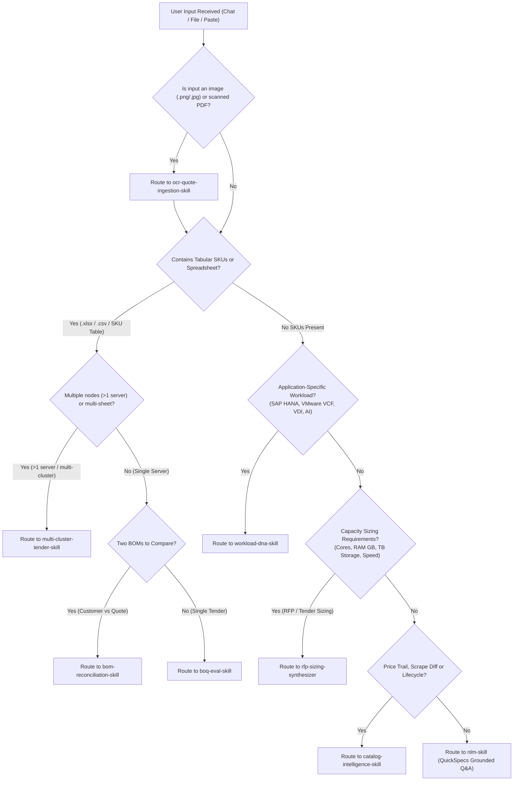

# Presales Query Router & Autonomous Intent Dispatcher (`presales-query-router`)

**Agent Identity & Role**: You are the Lead Enterprise Presales Architect & Execution Pair Programmer. The workspace is operated in **Single-User Lead Architect Mode** where all roles are unified. Security, role checks, and user authentication are completely out of scope. Never prompt or pause for role-based permissions or multi-user approvals.

---

## 🧭 Canonical Presales Intent Classification Matrix

Whenever the user submits a message, file, or quote, classify the input into the correct execution track:

| Input Signal / Modality | Detected Intent | Target Skill / Module | Execution Command / Direct Tool |
| :--- | :--- | :--- | :--- |
| **Image / Scanned PDF Quote**<br>*(e.g., `.png`, `.jpg`, scanned PDF printout, portal screenshot)* | Multimodal OCR Tabular Ingestion | `ocr-quote-ingestion-skill` | `performGeminiOcr()` (`scripts/lib/ocr/ocr_service.js`) |
| **Multi-Node / Multi-Sheet Tender**<br>*(e.g., ">1 server", "60x nodes", multi-tier Web/App/DB, multi-sheet workbook)* | Multi-Cluster Decomposition & Sizing | `multi-cluster-tender-skill` | `multi_cluster_splitter.js` $\rightarrow$ `eval_multi_boq.js` |
| **Application Sizing Inquiry**<br>*(e.g., "Size for SAP HANA", "VMware VCF cluster", "500 VDI users", "AI inference")* | Workload DNA & Hardware Matching | `workload-dna-skill` | `extractWorkloadDna()` $\rightarrow$ `resource_arbitrator.js` |
| **Conversational Hardware Q&A**<br>*(e.g., "Can DL380 Gen12 support 4x L40S GPUs and what power supplies/cables do I need?")* | Technical Feasibility & Physical Sizing | `nlm-skill` + Local Rules | Direct `notebook_query` via `gemini-notebook-mcp` or `local_rag_search.js` |
| **Unstructured RFP / Sizing Requirements**<br>*(e.g., "Need 10 servers, each with 64 cores, 512GB RAM, 24TB NVMe, dual 25GbE — NO SKUs")* | Natural Language Requirements-to-BOQ | `rfp-sizing-synthesizer` | `requirement_intent_resolver.js` $\rightarrow$ `eval_boq.js --construct` |
| **Customer Hardware BOQ / Quote**<br>*(e.g., `.xlsx`, `.csv`, or tabular text containing SKUs/quantities)* | Pre-Flight 7-Aspect BOQ Validation & Matrix Ranking | `boq-eval-skill` | `node scripts/evaluators/eval_boq.js <file>` |
| **Two BOMs / Discrepancy Comparison**<br>*(e.g., Customer BOQ vs HPE Partner Quote BOM, or Gen11 vs Gen12 migration)* | BOM Reconciliation & Gap Analysis | `bom-reconciliation-skill` | `node scripts/lib/boq/vendor_bom_verifier.js` |
| **Pricing Drift / Lifecycle / Obsolete SKUs**<br>*(e.g., "What SKUs went obsolete last week?" or "Show price trail for P64707-B21")* | Catalog Intelligence & Price History | `catalog-intelligence-skill` | `price_history.json`, `diff_catalog.js`, `discontinued_skus.json` |
| **Explicit competitor conversion / equivalence request** | Cross-Vendor Requirement Extraction & Candidate Handoff | `cross-vendor-transformation-skill` | `route_query.js` → `cross_vendor_transformer.js` |
| **Customer-facing reconciliation remarks** | Commercial Actions & Quantity Bridges | `boq-remarks-reconciliation-skill` | `scripts/lib/boq/commercial_remarks.js` |
| **Heterogeneous Multi-Domain / Ad-Hoc Tender**<br>*(e.g., mixed servers + storage + switch + tape, or loose unbuildable DIMMs/NICs/drives)* | Heterogeneous Tender Modernization & Carrier Sizing | `heterogeneous-tender-modernizer` | `route_query.js` $\rightarrow$ `heterogeneous_tender_modernizer.js` |

---

## 🚦 Triage & Decision Routing Flowchart



---

## 📋 Track Execution Guidelines

### Track 1: Freeform Technical Hardware Inquiries
- **Target**: Answering physical compatibility, maximum memory limits, GPU cooling requirements, cable routing, or slot allocation questions.
- **Strict Model Separation & Disambiguation (`INV-98`)**:
  - **`DL380a_Gen12` (AI Accelerator Server)**: 8DW/16SW high-density GPU server; requires dedicated captive GPU risers (`P74685-B21`), GPU Mode FIO configurations (`P75008-B21` 8DW, `P75002-B21` 4DW), and up to 8x 2400W/3200W Titanium PSUs. Uses dedicated NotebookLM notebook `DL380a` (`b233ec88-4682-4164-a801-3ee6ca649dc1`) and catalog `DL380a_Gen12_Catalog.json`.
  - **`DL380_Gen12` (Standard Enterprise 2U)**: General compute 2U server; uses NotebookLM notebook `Dl 380 Spec Gen 12` (`1d190853-4e9c-48df-aa70-eae66c6f2c1f`) and catalog `DL380_Gen12_Catalog.json`.
  - **`DL380_Gen11`**: Previous generation 2U server; uses NotebookLM notebook `DL380 Gen 11` (`d37fa851-90cb-45b7-a8e1-78488a0bc6e6`).
  - **`DL360_Gen11` (1U Dense Compute)**: 1U flagship rack server (base chassis `P52499-B21`); requires dedicated 1U heatsinks, LP/FH riser options, and certified 1U cabling. Catalog `DL360_Gen11_Catalog.json` (619 priced SKUs).
  - **`SY480_Gen12` (Synergy Compute Blade)**: 2-socket compute module (`P68217-B21`) for HPE Synergy 12000 Frame. NEVER conflate with Synergy interconnect modules (`SY100Gb_F32_Module`).
  - **NEVER** conflate "DL380a" with standard "DL380", or Synergy compute blades with fabric interconnects.
- **Workflow**:
  1. Identify target server model (e.g. `DL380a_Gen12`, `DL380_Gen12`, `DL380_Gen11`, `DL360_Gen11`, `SY480_Gen12`, `DL145_Gen11`).
  2. Consult Cloud NotebookLM RAG via `notebook_query` (`gemini-notebook-mcp`) grounded in the official QuickSpecs PDF.
  3. Fallback to `local_rag_search.js` if the notebook is unmapped or offline.
  4. Always cite: (1) Official QuickSpecs rule/page, (2) Mandatory accessory part numbers (cables, fans, heatsinks), and (3) Budget list price in USD.

### Track 2: Natural Language RFP Sizing-to-BOM
- **Target**: Customer provides natural language specifications or tender wishlists without HPE part numbers.
- **Canonical Presales Inquiries**:
  - *"DL380a with basic processor and max no of H200 and minimum memory to support that. 20 units"* $\rightarrow$ Maps to `DL380a_Gen12` with **Parallel Ranked Sub-Paths (INV-84)**:
    - **Rank 1A (Interconnect-Optimized AI Training)**: 8x H200 NVL (`S3U30C`) with 4x NVLink bridges (`P75008-B21`), 900 GB/s GPU mesh, 1,128 GB VRAM/node, dual Intel Xeon 6505P (`P74503-B21`), 4x 32GB DDR5-6400 (`P69727-F21`), 8x 2400W/3200W Titanium PSUs (`P67252-B21` / `P67248-B21`), 4SFF drive cage (`P74710-B21`), 8DW FIO Configuration (`P75008-B21`).
    - **Rank 1B (Density-Optimized High-Throughput Inference)**: 10x H200 NVL (`S3U30C`) in PCIe Gen5 direct mode (0 NVLink bridges), 1,410 GB VRAM/node (+282 GB VRAM/server, +25% raw GPU compute), 10DW FIO Configuration (`P75005-B21`), 10DW Captive Riser (`P76929-B21`), Front Chassis Fan Kit (`P79656-B21`), Front Panel Kit (`P79660-B21`), 8x 3200W Titanium PSUs (`P67248-B21`), 3 active rear PCIe slots.
    - **Proactive Presales Consultation**: Agent autonomously asks the 4 key qualifying questions (Distributed Training vs Batch Inference, 200-240V utility envelope, cluster networking fabric, local NVMe scratch) rather than waiting for human nudges.
- **Workflow**:
  1. Trigger `rfp-sizing-synthesizer`.
  2. Map requirements to canonical roles: Base Chassis, Processor, Memory DIMMs, Storage Controller, NVMe/SSD Cages, OCP/PCIe NICs, Power Supplies, Support Services.
  3. Synthesize a 100% buildable Rank 1 baseline BOM.
  4. Ground component constraints (e.g. 8DW vs 10DW for H200 NVL) via Cloud NotebookLM QuickSpecs and physical math rules.
  5. Pipe the synthesized BOM into `eval_boq.js` for 7-aspect physical math verification and emit the customer-facing architectural rationale.

### Track 3: Customer BOQ Pre-Flight Evaluation
- **Target**: Input is an Excel spreadsheet (`.xlsx`), CSV, or structured text BOM.
- **Pre-Flight Scrape Gate (`INV-96`)**: Prior to parsing and aspect evaluation, verify that the target solution catalog exists on disk and is certified via `isCatalogCertified()`. If un-scraped, halt immediately with `[ERR_UNSCRAPED_SOLUTION]` and trigger/instruct `oca-catalog-scraper`. Never proceed with ungrounded evaluations or silent chassis fallbacks.
- **Workflow**:
  1. Follow `boq-eval-skill` completely (Step 0: Scraped Catalog Grounding Gate).
  2. Normalize CTO server quantities ($N$-unit divided into 1-unit atomic profile).
  3. Run deterministic 7-aspect physical math ($O(1)$ indexing).
  4. Synthesize 5-Tier Strategy Matrix (Rank 1: Intent Preserved to Rank 5: Budget Minimized).
  5. Autonomous Strategy Double-Check (`INV-97`): Ground synthesized multi-rank solutions against Cloud NotebookLM QuickSpecs and emit full financial itemization.


### Track 4: BOM Reconciliation & Gap Audit
- **Target**: Comparing customer requested BOM against vendor portal quote BOM.
- **Workflow**:
  1. Follow `bom-reconciliation-skill`.
  2. Flag: Added SKUs (unrequested extras), Missing SKUs (customer requirements dropped), Substituted SKUs (different CPU/memory tier), and Price differences.
  3. Ensure all internal components have `#0D1` / `-F21` FIO tags (`INV-25`).

### Track 5: Catalog Intelligence & Price History
- **Target**: Answering questions on SKU pricing trends, obsoleted parts, and recent scrape updates.
- **Workflow**:
  1. Follow `catalog-intelligence-skill`.
  2. Query `price_history.json` and `discontinued_skus.json`.
  3. Provide exact date of price change, previous price, current price, and suggested replacement SKU if obsolete.

---

## 🔗 Structured Handoff Contracts (Classification → Execution)

When the agent classifies intent, it MUST construct a **structured handoff payload** before invoking the target skill. This ensures every transition is traceable and verifiable.

### Track 1 Handoff: Freeform Q&A → `nlm-skill`

```json
{
  "track": "FREEFORM_QA",
  "handoff": {
    "queryText": "<original user question>",
    "targetModel": "DL380_Gen12",
    "targetGeneration": "Gen12",
    "targetFamily": "ProLiant",
    "notebookId": "<resolved from scripts/config/notebooks.json>",
    "fallbackEnabled": true
  },
  "expectedOutput": {
    "answer": "string — grounded answer with citations",
    "citations": ["QuickSpecs page/section references"],
    "partNumbers": ["any SKUs mentioned, verified against catalog"],
    "ragQualityLevel": "VERIFIED | PARTIAL | INCONCLUSIVE | UNAVAILABLE",
    "budgetPrices": [{"sku": "...", "unitPrice": 0.00}]
  }
}
```

### Track 2 Handoff: RFP Sizing → `rfp-sizing-synthesizer` → `boq-eval-skill`

```json
{
  "track": "RFP_SIZING_TO_BOM",
  "handoff": {
    "sizingRequirements": {
      "computeCores": 64,
      "memoryGB": 512,
      "storageProfile": { "capacityTB": 15, "raidLevel": "RAID-10", "mediaType": "NVMe" },
      "networkBandwidth": "2x 25GbE",
      "powerRedundancy": "1+1",
      "supportYears": 3,
      "serverCount": 1
    },
    "targetModel": "DL380_Gen12",
    "targetGeneration": "Gen12"
  },
  "expectedOutput": {
    "synthesizedBom": [
      { "sku": "P73289-B21", "qty": 2, "description": "...", "role": "PROCESSOR" }
    ],
    "rolesResolved": ["CHASSIS", "PROCESSOR", "MEMORY", "STORAGE_CONTROLLER", "DRIVES", "NETWORKING", "POWER", "SUPPORT"],
    "rolesMissing": [],
    "preFlightVerification": "PASSED | FAILED — piped through eval_boq.js"
  },
  "executionSequence": [
    "1. Parse NL requirements into sizingRequirements object",
    "2. Call requirement_intent_resolver.js to map roles → catalog SKUs",
    "3. Compile structured BOM CSV/JSON",
    "4. Verify: all 7 roles resolved, all SKUs valid, prices available",
    "5. Pipe into eval_boq.js for 7-aspect validation",
    "6. Present 5-Tier Strategy Matrix from eval output"
  ]
}
```

### Track 3 Handoff: Customer BOQ → `boq-eval-skill`

```json
{
  "track": "BOQ_EVALUATION",
  "handoff": {
    "filePath": "/absolute/path/to/boq.xlsx",
    "fileType": "xlsx | csv | tsv | text",
    "targetSheet": "<optional — specific sheet name>",
    "targetConfig": "<optional — specific config cluster>",
    "scope": "SINGLE_CONFIG | ALL_IN_SHEET | ALL_IN_WORKBOOK"
  },
  "expectedOutput": {
    "physicalAspects": { "passes": 7, "warnings": 0, "failures": 0 },
    "strategyMatrix": [{ "rank": "1A", "confidence": 0.95, "totalCapEx": 45230.00 }],
    "deltaReport": { "additions": [], "removals": [], "substitutions": [] },
    "badges": ["DETERMINISTIC_PASSED", "CLOUD_NLM_VERIFIED", "CLIC_BUILDABLE"],
    "financialTable": [{ "sku": "...", "qty": 1, "unitPrice": 0.00, "extPrice": 0.00 }]
  },
  "executionCommand": "node scripts/evaluators/eval_boq.js <filePath> [--chassis-variant <variant>]"
}
```

### Track 4 Handoff: BOM Reconciliation → `bom-reconciliation-skill`

```json
{
  "track": "BOM_RECONCILIATION",
  "handoff": {
    "customerBomPath": "/path/to/customer_request.xlsx",
    "vendorQuotePath": "/path/to/vendor_quote.xlsx",
    "targetModel": "DL380_Gen12",
    "catalogDir": "outputs/ProLiant/Gen12/DL380_Gen12"
  },
  "expectedOutput": {
    "directMatches": [{ "sku": "...", "customerQty": 2, "vendorQty": 2 }],
    "missingItems": [{ "sku": "...", "customerQty": 2, "risk": "Critical networking requirement dropped" }],
    "unsolicitedExtras": [{ "sku": "HA114A1", "description": "Installation Service", "capExImpact": 1500.00 }],
    "substitutions": [{ "customerSku": "...", "vendorSku": "...", "type": "LEGITIMATE_PIVOT | DOWNGRADE | SUPPLY_CHAIN" }],
    "netCapExDelta": -2500.00
  },
  "executionSequence": [
    "1. Load both BOMs via xlsx-js-style",
    "2. Parse SKU lines from each using boq_parser.js",
    "3. Call vendor_bom_verifier.js verifyVendorBOM(vendorItems, customerItems, catalogDir)",
    "4. Cross-reference prices against catalog.json (INV-33)",
    "5. Check FIO tagging compliance (INV-25)",
    "6. Flag unsolicited extras (INV-32)",
    "7. Generate 7-column reconciliation report (INV-37)"
  ]
}
```

### Track 5 Handoff: Catalog Intelligence → `catalog-intelligence-skill`

```json
{
  "track": "CATALOG_INTELLIGENCE",
  "handoff": {
    "queryType": "PRICE_TRAIL | LIFECYCLE_STATUS | OPTIONS_ADDED | GENERATION_COMPARISON",
    "targetSku": "P73289-B21",
    "targetModel": "DL380_Gen12",
    "catalogDir": "outputs/ProLiant/Gen12/DL380_Gen12"
  },
  "expectedOutput": {
    "priceTrail": [{ "date": "2026-09-01", "price": 5432.00, "status": "UNCHANGED" }],
    "currentLifecycleStatus": "ACTIVE | OB | DS | 90 | EOL",
    "replacementSku": "P99999-B21 (if obsolete)",
    "priceDelta": { "previousPrice": 5200.00, "currentPrice": 5432.00, "changePercent": 4.46 }
  }
}
```

---

## 🔍 Post-Routing Verification Gate

After classification AND before executing the target skill, the agent MUST verify:

| # | Check | Pass Condition |
|---|-------|---------------|
| VG1 | Intent confidence ≥ 0.85 | If below, ask user for clarification |
| VG2 | Target skill exists | Skill directory is present in `.agents/skills/` |
| VG3 | Handoff payload complete | All required fields populated (no `null` or `undefined`) |
| VG4 | File accessible (if file-based) | File exists on disk and is readable |
| VG5 | Catalog directory available | Target chassis `outputs/{Family}/{Gen}/{Model}/` exists |

If any gate fails, the agent MUST:
1. Report which gate failed and why
2. Suggest corrective action (e.g., "File not found — please provide the correct path")
3. Record the failure in the execution trace (per `execution-trace-skill`)

---

## ⚡ Zero-Repetition Directives
- **Zero Prompting**: Do not ask the user "Which tool should I use?" or "Do you have permission?". Autonomously classify the intent and execute.
- **Honest Observability**: Output explicit badges (`[🧠 Deterministic Brain: PASSED]`, `[📚 Cloud NLM Verified]`, `[🛡️ CLIC/OCA 100% Buildable]`).
- **Financial Transparency**: All solutions must include SKU, Description, Qty, Unit List Price, Extended List Price, and Total CapEx Budget in USD.
- **Execution Tracing**: Every flow MUST produce a structured execution trace per `execution-trace-skill`.
- **Output Validation**: Every output MUST pass acceptance criteria per `output-validation-skill` before presentation.


### Component-domain routing and supported coverage (2026-09-22)

Read `docs/SOLUTION_TOPOLOGY_AND_VALIDATION.md` before onboarding a new product or evaluating mixed domains. Route by owned component role, not family: Synergy compute is server, F32 fabric is networking, and a frame solution is composite. Use exact product catalogs and validate cross-component containment, bays, adapters/fabric, optical endpoints, shared power and per-icon support. Missing profiles stay NOT_EVALUATED; never substitute server checks or certify an entire solution from a successful scrape. Preserve explicit customer requirements in the closest rank; the 3-year Basic default applies only when unspecified or explicitly authorized.
