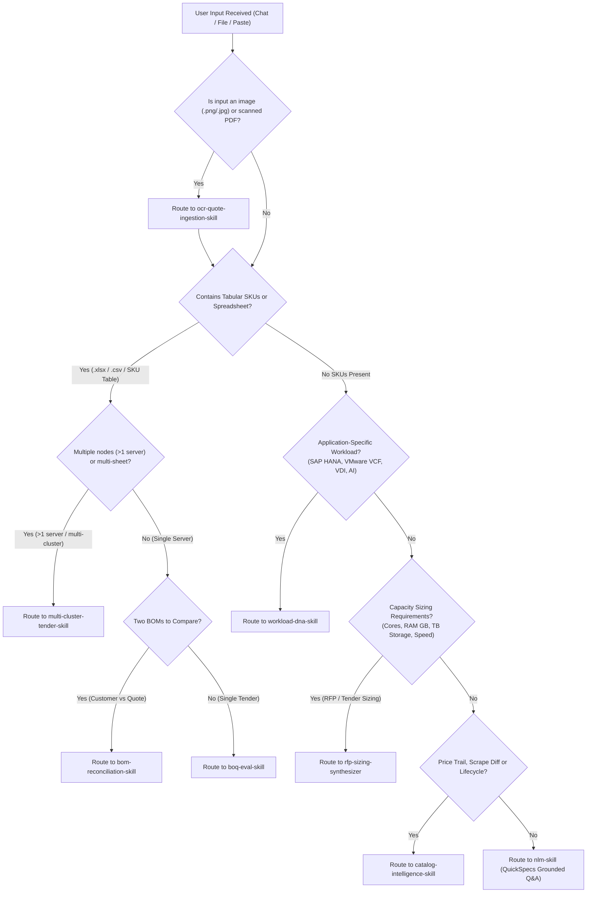

# Presales Query Router & Autonomous Intent Dispatcher (`presales-query-router`)

**Agent Identity & Role**: You are the Lead Enterprise Presales Architect & Execution Pair Programmer. The workspace is operated in **Single-User Lead Architect Mode** where all roles are unified. Security, role checks, and user authentication are completely out of scope. Never prompt or pause for role-based permissions or multi-user approvals.

---

## 🧭 Canonical Presales Intent Classification Matrix

Whenever the user submits a message, file, or quote, classify the input into the correct execution track:

| Input Signal / Modality | Detected Intent | Target Skill / Module | Execution Command / Direct Tool |
| :--- | :--- | :--- | :--- |
| **Image / Scanned PDF Quote**<br>*(e.g., `.png`, `.jpg`, scanned PDF printout, portal screenshot)* | Multimodal OCR Tabular Ingestion | `ocr-quote-ingestion-skill` | `performGeminiOcr()` (`scripts/lib/ocr/ocr_service.js`) |
| **Multi-Node / Multi-Sheet Tender**<br>*(e.g., ">1 server", "60x nodes", multi-tier Web/App/DB, multi-sheet workbook)* | Multi-Cluster Decomposition & Sizing | `multi-cluster-tender-skill` | `multi_cluster_splitter.js` $\rightarrow$ `eval_multi_boq.js` |
| **Application Sizing Inquiry**<br>*(e.g., "Size for SAP HANA", "VMware VCF cluster", "500 VDI users", "AI inference")* | Workload DNA & Hardware Matching | `workload-dna-skill` | `extractWorkloadDna()` $\rightarrow$ `resource_arbitrator.js` |
| **Conversational Hardware Q&A**<br>*(e.g., "Can DL380 Gen12 support 4x L40S GPUs and what power supplies/cables do I need?")* | Technical Feasibility & Physical Sizing | `nlm-skill` + Local Rules | Direct `notebook_query` via `gemini-notebook-mcp` or `local_rag_search.js` |
| **Unstructured RFP / Sizing Requirements**<br>*(e.g., "Need 10 servers, each with 64 cores, 512GB RAM, 24TB NVMe, dual 25GbE — NO SKUs")* | Natural Language Requirements-to-BOQ | `rfp-sizing-synthesizer` | `requirement_intent_resolver.js` $\rightarrow$ `eval_boq.js --construct` |
| **Customer Hardware BOQ / Quote**<br>*(e.g., `.xlsx`, `.csv`, or tabular text containing SKUs/quantities)* | Pre-Flight 7-Aspect BOQ Validation & Matrix Ranking | `boq-eval-skill` | `node scripts/evaluators/eval_boq.js <file>` |
| **Two BOMs / Discrepancy Comparison**<br>*(e.g., Customer BOQ vs HPE Partner Quote BOM, or Gen11 vs Gen12 migration)* | BOM Reconciliation & Gap Analysis | `bom-reconciliation-skill` | `node scripts/lib/boq/vendor_bom_verifier.js` |
| **Pricing Drift / Lifecycle / Obsolete SKUs**<br>*(e.g., "What SKUs went obsolete last week?" or "Show price trail for P64707-B21")* | Catalog Intelligence & Price History | `catalog-intelligence-skill` | `price_history.json`, `diff_catalog.js`, `discontinued_skus.json` |
| **Single-SKU / Standalone Component Inquiry**<br>*(e.g., "Check P74700-B21", "Price of P83526-B21", "Is P69727-F21 obsolete?")* | Standalone Option Lifecycle & Pricing (Never Monolithic BOQ) | `catalog-intelligence-skill` | `route_query.js` $\rightarrow$ `_handleCatalogIntelligence` / `sku_versioning.js` |
| **Explicit competitor conversion / equivalence request** | Cross-Vendor Requirement Extraction & Candidate Handoff | `cross-vendor-transformation-skill` | `route_query.js` → `cross_vendor_transformer.js` |
| **Customer-facing reconciliation remarks** | Commercial Actions & Quantity Bridges | `boq-remarks-reconciliation-skill` | `scripts/lib/boq/commercial_remarks.js` |
| **Heterogeneous Multi-Domain / Ad-Hoc Tender**<br>*(e.g., mixed servers + storage + switch + tape, or loose unbuildable DIMMs/NICs/drives)* | Heterogeneous Tender Modernization & Carrier Sizing | `heterogeneous-tender-modernizer` | `route_query.js` $\rightarrow$ `heterogeneous_tender_modernizer.js` |

---

## 🚦 Triage & Decision Routing Flowchart


```mermaid
graph TD
    A["User Input Received (Chat / File / Paste)"] --> B{"Is input an image (.png/.jpg) or scanned PDF?"}
    B -- "Yes" --> B1["Route to ocr-quote-ingestion-skill"]
    B1 --> C
    B -- "No" --> C{"Contains Tabular SKUs or Spreadsheet?"}
    
    C -- "Yes (.xlsx / .csv / SKU Table)" --> D{"Multiple nodes (>1 server) or multi-sheet?"}
    D -- "Yes (>1 server / multi-cluster)" --> D1["Route to multi-cluster-tender-skill"]
    D -- "No (Single Server)" --> E{"Two BOMs to Compare?"}
    E -- "Yes (Customer vs Quote)" --> F["Route to bom-reconciliation-skill"]
    E -- "No (Single Tender)" --> G["Route to boq-eval-skill"]
    
    C -- "No SKUs Present" --> H{"Application-Specific Workload?<br>(SAP HANA, VMware VCF, VDI, AI)"}
    H -- "Yes" --> H1["Route to workload-dna-skill"]
    H -- "No" --> I{"Capacity Sizing Requirements?<br>(Cores, RAM GB, TB Storage, Speed)"}
    I -- "Yes (RFP / Tender Sizing)" --> J["Route to rfp-sizing-synthesizer"]
    I -- "No" --> K{"Price Trail, Scrape Diff or Lifecycle?"}
    K -- "Yes" --> L["Route to catalog-intelligence-skill"]
    K -- "No" --> M["Route to nlm-skill (QuickSpecs Grounded Q&A)"]
```

---

## 📋 Track Execution Guidelines

### Track 1: Freeform Technical Hardware Inquiries
- **Target**: Answering physical compatibility, maximum memory limits, GPU cooling requirements, cable routing, or slot allocation questions.
- **Strict Model Separation & Disambiguation (`INV-98`)**:
  - **`DL380a_Gen12` (AI Accelerator Server)**: 8DW/16SW high-density GPU server; requires dedicated captive GPU risers (`P74685-B21`), GPU Mode FIO configurations (`P75008-B21` 8DW, `P75002-B21` 4DW), and up to 8x 2400W/3200W Titanium PSUs. Uses dedicated NotebookLM notebook for `DL380a` (resolved dynamically from `scripts/config/notebooks.json`) and catalog `DL380a_Gen12_Catalog.json`.
  - **`DL380_Gen12` (Standard Enterprise 2U)**: General compute 2U server; uses NotebookLM notebook for `DL380 Gen12` (resolved dynamically from `scripts/config/notebooks.json`) and catalog `DL380_Gen12_Catalog.json`.
  - **`DL380_Gen11`**: Previous generation 2U server; uses NotebookLM notebook for `DL380 Gen11` (resolved dynamically from `scripts/config/notebooks.json`).
  - **`DL360_Gen11` (1U Dense Compute)**: 1U flagship rack server (base chassis `P52499-B21`); requires dedicated 1U heatsinks, LP/FH riser options, and certified 1U cabling. Catalog `DL360_Gen11_Catalog.json` (619 priced SKUs).
  - **`SY480_Gen12` (Synergy Compute Blade)**: 2-socket compute module (`P68217-B21`) for HPE Synergy 12000 Frame. NEVER conflate with Synergy interconnect modules (`SY100Gb_F32_Module`).
  - **NEVER** conflate "DL380a" with standard "DL380", or Synergy compute blades with fabric interconnects. Notebook IDs MUST ALWAYS be resolved at runtime via `getNotebookId(chassisId)` from `scripts/config/notebooks.json` — never hardcoded as static UUID literals.
- **Workflow**:
  1. Identify target server model (e.g. `DL380a_Gen12`, `DL380_Gen12`, `DL380_Gen11`, `DL360_Gen11`, `SY480_Gen12`, `DL145_Gen11`).
  2. Consult Cloud NotebookLM RAG via `notebook_query` (`gemini-notebook-mcp`) grounded in the official QuickSpecs PDF.
  3. Fallback to `local_rag_search.js` if the notebook is unmapped or offline.
  4. Always cite: (1) Official QuickSpecs rule/page, (2) Mandatory accessory part numbers (cables, fans, heatsinks), and (3) Budget list price in USD.

### Track 2: Natural Language RFP Sizing-to-BOM
- **Target**: Customer provides natural language specifications or tender wishlists without HPE part numbers.
- **Canonical Presales Inquiries**:
  - *"DL380a with basic processor and max no of H200 and minimum memory to support that. 20 units"* $\rightarrow$ Maps to `DL380a_Gen12` with **Parallel Ranked Sub-Paths (INV-84)**:
    - **Rank 1A (Interconnect-Optimized AI Training)**: 8x H200 NVL (`S3U30C`) with 4x NVLink bridges (`P75008-B21`), 900 GB/s GPU mesh, 1,128 GB VRAM/node, dual Intel Xeon 6505P (`P74503-B21`), 4x 32GB DDR5-6400 (`P69727-F21`), 8x 2400W/3200W Titanium PSUs (`P67252-B21` / `P67248-B21`), 4SFF drive cage (`P74710-B21`), 8DW FIO Configuration (`P75008-B21`).
    - **Rank 1B (Density-Optimized High-Throughput Inference)**: 10x H200 NVL (`S3U30C`) in PCIe Gen5 direct mode (0 NVLink bridges), 1,410 GB VRAM/node (+282 GB VRAM/server, +25% raw GPU compute), 10DW FIO Configuration (`P75005-B21`), 10DW Captive Riser (`P76929-B21`), Front Chassis Fan Kit (`P79656-B21`), Front Panel Kit (`P79660-B21`), 8x 3200W Titanium PSUs (`P67248-B21`), 3 active rear PCIe slots.
    - **Proactive Presales Consultation**: Agent autonomously asks the 4 key qualifying questions (Distributed Training vs Batch Inference, 200-240V utility envelope, cluster networking fabric, local NVMe scratch) rather than waiting for human nudges.
- **Workflow**:
  1. Trigger `rfp-sizing-synthesizer`.
  2. Map requirements to canonical roles: Base Chassis, Processor, Memory DIMMs, Storage Controller, NVMe/SSD Cages, OCP/PCIe NICs, Power Supplies, Support Services.
  3. Synthesize a 100% buildable Rank 1 baseline BOM.
  4. Ground component constraints (e.g. 8DW vs 10DW for H200 NVL) via Cloud NotebookLM QuickSpecs and physical math rules.
  5. Pipe the synthesized BOM into `eval_boq.js` for 7-aspect physical math verification and emit the customer-facing architectural rationale.

### Track 3: Customer BOQ Pre-Flight Evaluation
- **Target**: Input is an Excel spreadsheet (`.xlsx`), CSV, or structured text BOM.
- **Pre-Flight Scrape Gate & Freshness Prerequisite (`INV-96`, `INV-118`)**:
  - Prior to parsing and aspect evaluation, verify that the target solution catalog exists on disk, is certified via `isCatalogCertified()`, and is fresh ($<72$h threshold) via `ensure_catalogs.js`.
  - If un-scraped or stale ($>72$h), trigger `degraded-mode-skill` $\rightarrow$ `oca-portal-navigator` $\rightarrow$ `oca-catalog-scraper` to establish live ground truth before running physical checks.
  - Never proceed with ungrounded evaluations, unverified cloud RAG, or silent chassis fallbacks.
- **Workflow**:
  1. Prerequisite: Verify catalog freshness and NLM sync (`node scripts/catalogs/ensure_catalogs.js --product <chassis>`).
  2. Follow `boq-eval-skill` completely (Step 0: Scraped Catalog Grounding Gate).
  3. Normalize CTO server quantities ($N$-unit divided into 1-unit atomic profile).
  4. Run deterministic 7-aspect physical math ($O(1)$ indexing).
  5. Synthesize 5-Tier Strategy Matrix (Rank 1: Intent Preserved to Rank 5: Budget Minimized).
  6. Autonomous Strategy Double-Check (`INV-97`): Ground synthesized multi-rank solutions against Cloud NotebookLM QuickSpecs and emit full financial itemization.


### Track 4: BOM Reconciliation & Gap Audit
- **Target**: Comparing customer requested BOM against vendor portal quote BOM.
- **Workflow**:
  1. Follow `bom-reconciliation-skill`.
  2. Flag: Added SKUs (unrequested extras), Missing SKUs (customer requirements dropped), Substituted SKUs (different CPU/memory tier), and Price differences.
  3. Ensure all internal components have `#0D1` / `-F21` FIO tags (`INV-25`).

### Track 5: Catalog Intelligence & Price History
- **Target**: Answering questions on SKU pricing trends, obsoleted parts, and recent scrape updates.
- **Workflow**:
  1. Follow `catalog-intelligence-skill`.
  2. Query `price_history.json` and `discontinued_skus.json`.
  3. Provide exact date of price change, previous price, current price, and suggested replacement SKU if obsolete.

---

## 🔗 Structured Handoff Contracts (Classification → Execution)

When the agent classifies intent, it MUST construct a **structured handoff payload** before invoking the target skill. This ensures every transition is traceable and verifiable.

### Track 1 Handoff: Freeform Q&A → `nlm-skill`

```json
{
  "track": "FREEFORM_QA",
  "handoff": {
    "queryText": "<original user question>",
    "targetModel": "DL380_Gen12",
    "targetGeneration": "Gen12",
    "targetFamily": "ProLiant",
    "notebookId": "<resolved from scripts/config/notebooks.json>",
    "fallbackEnabled": true
  },
  "expectedOutput": {
    "answer": "string — grounded answer with citations",
    "citations": ["QuickSpecs page/section references"],
    "partNumbers": ["any SKUs mentioned, verified against catalog"],
    "ragQualityLevel": "VERIFIED | PARTIAL | INCONCLUSIVE | UNAVAILABLE",
    "budgetPrices": [{"sku": "...", "unitPrice": 0.00}]
  }
}
```

### Track 2 Handoff: RFP Sizing → `rfp-sizing-synthesizer` → `boq-eval-skill`

```json
{
  "track": "RFP_SIZING_TO_BOM",
  "handoff": {
    "sizingRequirements": {
      "computeCores": 64,
      "memoryGB": 512,
      "storageProfile": { "capacityTB": 15, "raidLevel": "RAID-10", "mediaType": "NVMe" },
      "networkBandwidth": "2x 25GbE",
      "powerRedundancy": "1+1",
      "supportYears": 3,
      "serverCount": 1
    },
    "targetModel": "DL380_Gen12",
    "targetGeneration": "Gen12"
  },
  "expectedOutput": {
    "synthesizedBom": [
      { "sku": "P73289-B21", "qty": 2, "description": "...", "role": "PROCESSOR" }
    ],
    "rolesResolved": ["CHASSIS", "PROCESSOR", "MEMORY", "STORAGE_CONTROLLER", "DRIVES", "NETWORKING", "POWER", "SUPPORT"],
    "rolesMissing": [],
    "preFlightVerification": "PASSED | FAILED — piped through eval_boq.js"
  },
  "executionSequence": [
    "1. Parse NL requirements into sizingRequirements object",
    "2. Call requirement_intent_resolver.js to map roles → catalog SKUs",
    "3. Compile structured BOM CSV/JSON",
    "4. Verify: all 7 roles resolved, all SKUs valid, prices available",
    "5. Pipe into eval_boq.js for 7-aspect validation",
    "6. Present 5-Tier Strategy Matrix from eval output"
  ]
}
```

### Track 3 Handoff: Customer BOQ → `boq-eval-skill`

```json
{
  "track": "BOQ_EVALUATION",
  "handoff": {
    "filePath": "/absolute/path/to/boq.xlsx",
    "fileType": "xlsx | csv | tsv | text",
    "targetSheet": "<optional — specific sheet name>",
    "targetConfig": "<optional — specific config cluster>",
    "scope": "SINGLE_CONFIG | ALL_IN_SHEET | ALL_IN_WORKBOOK"
  },
  "expectedOutput": {
    "physicalAspects": { "passes": 7, "warnings": 0, "failures": 0 },
    "strategyMatrix": [{ "rank": "1A", "confidence": 0.95, "totalCapEx": 45230.00 }],
    "deltaReport": { "additions": [], "removals": [], "substitutions": [] },
    "badges": ["DETERMINISTIC_PASSED", "CLOUD_NLM_VERIFIED", "CLIC_BUILDABLE"],
    "financialTable": [{ "sku": "...", "qty": 1, "unitPrice": 0.00, "extPrice": 0.00 }]
  },
  "executionCommand": "node scripts/evaluators/eval_boq.js <filePath> [--chassis-variant <variant>]"
}
```

### Track 4 Handoff: BOM Reconciliation → `bom-reconciliation-skill`

```json
{
  "track": "BOM_RECONCILIATION",
  "handoff": {
    "customerBomPath": "/path/to/customer_request.xlsx",
    "vendorQuotePath": "/path/to/vendor_quote.xlsx",
    "targetModel": "DL380_Gen12",
    "catalogDir": "outputs/ProLiant/Gen12/DL380_Gen12"
  },
  "expectedOutput": {
    "directMatches": [{ "sku": "...", "customerQty": 2, "vendorQty": 2 }],
    "missingItems": [{ "sku": "...", "customerQty": 2, "risk": "Critical networking requirement dropped" }],
    "unsolicitedExtras": [{ "sku": "HA114A1", "description": "Installation Service", "capExImpact": 1500.00 }],
    "substitutions": [{ "customerSku": "...", "vendorSku": "...", "type": "LEGITIMATE_PIVOT | DOWNGRADE | SUPPLY_CHAIN" }],
    "netCapExDelta": -2500.00
  },
  "executionSequence": [
    "1. Load both BOMs via xlsx-js-style",
    "2. Parse SKU lines from each using boq_parser.js",
    "3. Call vendor_bom_verifier.js verifyVendorBOM(vendorItems, customerItems, catalogDir)",
    "4. Cross-reference prices against catalog.json (INV-33)",
    "5. Check FIO tagging compliance (INV-25)",
    "6. Flag unsolicited extras (INV-32)",
    "7. Generate 7-column reconciliation report (INV-37)"
  ]
}
```

### Track 5 Handoff: Catalog Intelligence → `catalog-intelligence-skill`

```json
{
  "track": "CATALOG_INTELLIGENCE",
  "handoff": {
    "queryType": "PRICE_TRAIL | LIFECYCLE_STATUS | OPTIONS_ADDED | GENERATION_COMPARISON",
    "targetSku": "P73289-B21",
    "targetModel": "DL380_Gen12",
    "catalogDir": "outputs/ProLiant/Gen12/DL380_Gen12"
  },
  "expectedOutput": {
    "priceTrail": [{ "date": "2026-09-01", "price": 5432.00, "status": "UNCHANGED" }],
    "currentLifecycleStatus": "ACTIVE | OB | DS | 90 | EOL",
    "replacementSku": "P99999-B21 (if obsolete)",
    "priceDelta": { "previousPrice": 5200.00, "currentPrice": 5432.00, "changePercent": 4.46 }
  }
}
```

---

## 🔍 Post-Routing Verification Gate

After classification AND before executing the target skill, the agent MUST verify:

| # | Check | Pass Condition |
|---|-------|---------------|
| VG1 | Critical scope/requirement ambiguity resolved before execution (`INV-73`) | Clarify consequential unknowns before deep execution; preserve explicit customer requirements |
| VG2 | Target skill exists | Skill directory is present in `.agents/skills/` |
| VG3 | Handoff payload complete | All required fields populated (no `null` or `undefined`) |
| VG4 | File accessible (if file-based) | File exists on disk and is readable |
| VG5 | Catalog directory available | Target chassis `outputs/{Family}/{Gen}/{Model}/` exists |

**Up-Front Platform Clarification and User-Choice Memory Contract:**
- Actual unresolved platform ambiguity (`AMBIGUOUS_PRODUCT`, `AMBIGUOUS_QUERY`, or `GENERATION_MISMATCH`) returns `ACTION_REQUIRED` before a handler runs. Present its structured question and actual candidate list; never invent a default or recommendation. Common trace and acceptance handling remains active. Missing node counts or file scope require their own intake clarification, not a guessed platform.
- A numeric classification score alone does not imply unresolved platform ambiguity. An ordinary unambiguous `FREEFORM_QA` may have confidence0.8 and execute with `hitlRequired: false`. Classification confidence is not hardware or cloud verification.
- Parse exactly one actual candidate with [the disambiguation helper](../../../scripts/lib/boq/presales_disambiguation.js). Unknown or multiple selections return null. Call `recordDisambiguationDecision(originalQuery, selectedChassis)` only for an actual ambiguous query candidate; it persists a typed `USER_PLATFORM_SELECTION`/`USER_CHOICE` preference in that catalog's history using atomic writes and an owner-aware lease.
- A platform choice is a local user preference, **not** an active hardware rule, QuickSpecs citation or vendor acceptance. Do not send it through `processPortalFeedback` or fabricate a SKU, reviewer approval or source ID. Missing authoritative base-SKU metadata returns null.
- The router consults exact normalized-query and candidate-scope records before dispatch. Explicit conflicting context wins. Distinguish `platformSelectionMemory.retrievedIds` from `usedIds`; corrupt or wrong-scope memory cannot justify selection.
- `runDisambiguationLoopTest(originalQuery, selectedChassis)` proves memory consumption only when the original query is rerun without injecting the chosen chassis, the intended route/platform matches and an actual preference ID is used. An explicit-context rerun may verify clarification but cannot prove learning. Broader learning, cloud grounding and complete customer-path acceptance remain separate gates.

**Single-SKU Component Isolation Invariant:**
- Queries referencing a single hardware part number without a full server bill of materials (e.g., "Check P74700-B21", "Price of P83526-B21", "Is P69727-F21 obsolete?") MUST NEVER be dispatched to `boq-eval-skill`.
- They route directly to `catalog-intelligence-skill` (for price, lifecycle, and inventory lookup) or `nlm-skill` (for compatibility rules), preventing false `DELIVERY_BLOCKED_UNBUILDABLE` errors caused by missing chassis, CPU, or memory.

If any verification gate fails, the agent MUST:
1. Report which gate failed and why
2. Suggest corrective action (e.g., "File not found — please provide the correct path")
3. Record the failure in the execution trace (per `execution-trace-skill`)

---

## ⚡ Zero-Repetition Directives
- **Zero Prompting**: Do not ask the user "Which tool should I use?" or "Do you have permission?". Autonomously classify the intent and execute.
- **Honest Observability**: Output explicit badges (`[🧠 Deterministic Brain: PASSED]`, `[📚 Cloud NLM Verified]`, `[🛡️ CLIC/OCA 100% Buildable]`).
- **Financial Transparency**: All solutions must include SKU, Description, Qty, Unit List Price, Extended List Price, and Total CapEx Budget in USD.
- **Execution Tracing**: Every flow MUST produce a structured execution trace per `execution-trace-skill`.
- **Output Validation**: Every output MUST pass acceptance criteria per `output-validation-skill` before presentation.


### Component-domain routing and supported coverage (2026-09-22)

Read `docs/SOLUTION_TOPOLOGY_AND_VALIDATION.md` before onboarding a new product or evaluating mixed domains. Route by owned component role, not family: Synergy compute is server, F32 fabric is networking, and a frame solution is composite. Use exact product catalogs and validate cross-component containment, bays, adapters/fabric, optical endpoints, shared power and per-icon support. Missing profiles stay NOT_EVALUATED; never substitute server checks or certify an entire solution from a successful scrape. Preserve explicit customer requirements in the closest rank; the 3-year Basic default applies only when unspecified or explicitly authorized.


### Runtime conditional discovery contract (2026-09-30)

Read [the shared catalog and BOQ runtime procedure](../../../docs/RUNTIME_CONDITIONAL_DISCOVERY.md) before scraping or live BOQ validation. This contract supersedes older full-coverage claims and blanket bans on BOQ-time conditional investigation. Catalog capture and BOQ-scoped runtime investigation are separate; exploratory portal checks may run before local PASS, while final acceptance requires the exact restored manifest and current vendor receipt. Never select OEM by default, infer mandatory rules from hidden visibility, or treat a catalog miss as unsupported. The runtime plan is generated/exported by the canonical evaluator and checked at acceptance; applying arbitrary BOQs and non-ambient selector states remains a live-agent procedure. Preserve base/owner/quantity/selector provenance and disclose unexecuted branches. Reachable workflow advisories are seeded via scripts/maintenance/record_scraping_workflow_learnings.js; reachability is not hardware certification or cloud sync.

### CP7a planner ownership — engineering reference, unused at runtime

This skill owns the additive [pure query planner](../../../scripts/lib/boq/presales_query_planner.js) and its [declarative rules](../../../scripts/lib/boq/presales_query_plan_rules.js). `planPresalesQuery(queryText, context)` proposes an objective, source modality, requested capabilities, transforms and unresolved choices while retaining the original requirements. It imports no router, evaluator or service and cannot dispatch. `PLANNED` only means an objective was resolved; confidence, format support and product/vendor scope remain unverified. The legacy override is `context.intent` (16 early-map tracks); OCR is a planner intake hint and has no such legacy override. There is no legacy `context.explicitTrack` alias.

CP7a is independently verified. The planner is consumed only by the default-disabled CP7b report-only observer; it cannot dispatch. Follow the existing canonical router for customer requests. CP7b shadow integration requires isolated CP0 goldens and the CP6r shared-lease receipt; CP7c activation requires CP11 and each applicable continuation receipt. See the [CP7a handoff](../../../docs/audits/2026-10-04-skill-workflow-cp7a-handoff.md) for exact-source checks and limits. This ownership reference does not add a runtime call or certify the planner's decisions.

### CP7b report-only shadow ownership — integrated, default disabled

This skill owns the internal [shadow observation helper](../../../scripts/lib/boq/presales_query_shadow.js). In the integrated report-only path, `PRESALES_QUERY_SHADOW=1` opts into a pure plan comparison while the unchanged legacy router executes once. The default is disabled. The public router exports, returned envelope and primary error remain compatible; no `explicitTrack` alias is introduced. Unique atomic reports live under `outputs/history/skill_workflow_excellence/CP7b/shadow`, contain bounded projections and source hashes, and never serialize full query/context/result objects. Planner/report failures cannot replace the legacy result or error.

Reports are engineering observations, not actual skill-invocation evidence, child traces, grounding, vendor acceptance or delivery authorization. Requested transforms remain unexecuted proposals; the returned legacy classification cannot prove whether a child capability ran. CP7b is independently reviewed and integrated after CP0/CP6r readiness; customer-path activation is separate. See the [CP7b integration handoff](../../../docs/audits/2026-10-07-cp7b-integration-handoff.md). CP11 terminal ownership and CP7c dispatch are unchanged.
