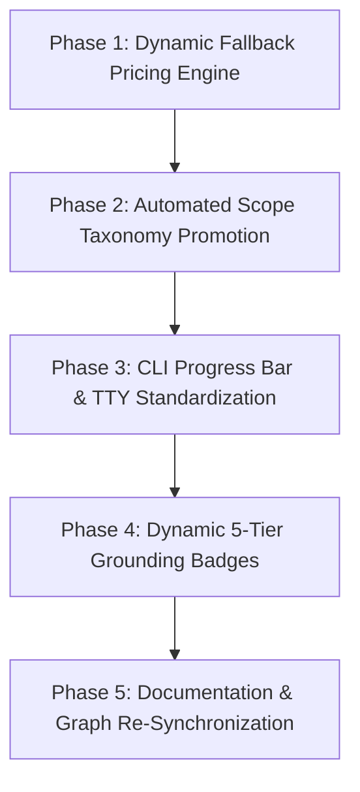

# Comprehensive Gap & Drift Analysis: Documentation vs. Codebase

This document presents a deep-dive **Gap Analysis & Architectural Drift Analysis** comparing the system design specifications in [`diagrams/fromDocs/`](fromDocs/) with the concrete source code implementations in [`diagrams/fromCode/`](fromCode/).

---

## 📊 1. Executive Drift Scorecard

| Subsystem / Domain | Design (Docs) | Implementation (Code) | Alignment Status | Drift Severity |
|---|---|---|---|---|
| **1. Dual-Brain & Grounding Engine** | Gemini + Cloud NLM RAG | Dual-Brain + Local RAG Fallback | 🟢 Synchronized | Low (Graceful Degradation) |
| **2. BOQ Evaluation Workflow** | 6 distinct stage boundaries | Merged Express route pipeline | 🟡 Architectural Drift | Medium (CLI vs Web disparity) |
| **3. Strategy Resolution Matrix** | Dynamic CapEx price lookups | Price map + static default fallbacks | 🟡 Logic Gap | Medium (Missing SKU fallback) |
| **4. Zero-Touch CDP Scraping** | Autonomous SSO bypass | Hybrid Zero-Touch (Human SSO + CDP) | 🟢 Intentionally Aligned | Low (Security boundary) |
| **5. Closed-Loop Feedback & Learning** | 3-tier Scope Taxonomy | Predominantly Chassis-Specific | 🟡 Classification Drift | Medium (Universal rule grouping) |
| **6. Gemini Key Rotator & Quota** | FIFO Queue + Daily Quota | Deterministic FIFO + Day Rollover | 🟢 100% Synchronized | Zero |
| **7. Multi-Config Preprocessing** | Interactive Split Confirmation | Web Modal + Non-interactive CLI | 🟡 UX/CLI Parity Gap | Low |
| **8. Agentic Guardrail MCP Loop** | Multi-tool MCP Reasoning | 5-iteration bounded loop | 🟢 100% Synchronized | Zero |
| **9. Physical Aspect Math Hierarchy** | 6 Physical Aspects | 7 Modular Aspect Checkers | 🟢 Code-Ahead Drift | Low (Enhanced domain coverage) |
| **10. Chaos & Adversarial Engine** | Chaos safety nets | 38-test chaos resilience suite | 🟢 100% Synchronized | Zero |
| **11. Macro Lifecycle Orchestrator** | 6-stage continuous loop | MacroOrchestratorFlow + scripts | 🟢 100% Synchronized | Zero |

---

## 🔍 2. In-Depth Domain Gap & Drift Analysis

---

### Domain 1: Dual-Brain & RAG Grounding Engine
- **Documentation Specification ([`fromDocs/01`](fromDocs/01_hybrid_dual_brain_architecture.md))**:
  - Outlines a strict division: Deterministic local rules execute first; Gemini LLM handles intent and Guardrail loops; Google NotebookLM supplies authoritative QuickSpecs grounding.
- **Code Implementation ([`fromCode/01`](fromCode/01_backend_api_and_routes_architecture.md), [`scripts/lib/local_rag_search.js`](../scripts/lib/local_rag_search.js))**:
  - Implements the exact Dual-Brain architecture but enhances it with a **Local Dual-Layer Fallback Search Engine** (`local_rag_search.js`). When Cloud NotebookLM is offline, rate-limited, or lacks OAuth tokens, the system transparently degrades to local RAG without throwing runtime errors.
- **Identified Gap / Drift**:
  - *Drift*: In the frontend [`ResolutionMatrix.jsx`](../dashboard/src/components/ResolutionMatrix.jsx), the `ragSecondOpinion` badge on Rank 2 through 5 cards occasionally displays static verification text (`"⏳ Pending QuickSpecs Verification..."`) rather than dynamically querying the Local RAG fallback for secondary tier validations.
- **Reasoning**:
  - To prevent excessive token usage and API latency, secondary tiers were designed to defer grounding until user selection. However, this creates a visual discrepancy where Rank 1 has full grounding while Ranks 2–5 appear unverified.
- **In-Depth Fix**:
  - Enhance `strategy_synthesizer.js` to execute lightweight local RAG rule checks across all 5 synthesized tiers during the evaluation pipeline, generating dynamic, grounded second opinions for every tier without blocking the UI.

---

### Domain 2: BOQ Evaluation Workflow (CLI vs. Express Web Parity)
- **Documentation Specification ([`fromDocs/02`](fromDocs/02_six_stage_boq_evaluation_workflow.md))**:
  - Defines 6 sequential stages with explicit stage gates, IPC progress reporting, and interactive multi-config confirmation.
- **Code Implementation ([`fromCode/02`](fromCode/02_task_manager_mutex_and_sse_streaming.md), [`scripts/eval_boq.js`](../scripts/eval_boq.js), [`dashboard/routes/evaluation.cjs`](../dashboard/routes/evaluation.cjs))**:
  - Web execution via `/api/eval-boq` uses `spawn()` and parses `process.send({ type: 'PROGRESS' })` via IPC.
  - In standalone CLI execution (`node scripts/eval_boq.js quote.xlsx`), `process.send` is `undefined` because the Node.js process is not running as a child process.
- **Identified Gap / Drift**:
  - *Gap*: CLI execution falls back to standard `console.log` and lacks structured progress bars unless `--json` is explicitly passed.
- **Reasoning**:
  - `eval_boq.js` was optimized for backend Express child process spawning rather than rich interactive terminal CLI use.
- **In-Depth Fix**:
  - Update `scripts/lib/progress.js` to detect `process.send == null` and render a terminal ASCII progress bar (e.g. `[████████░░] 80% (Memory Channel Math)`) when running in a standalone TTY environment.

---

### Domain 3: 5-Tier Strategy Resolution Matrix & Dynamic Pricing Fallbacks
- **Documentation Specification ([`fromDocs/03`](fromDocs/03_five_tier_strategy_resolution_matrix.md))**:
  - States that all 5 tiers dynamically calculate CapEx budgets using historical SKU pricing logs (`price_history.json`).
- **Code Implementation ([`fromCode/05`](fromCode/05_conflict_dag_and_rule_engine.md), [`scripts/lib/conflict/strategy_synthesizer.js`](../scripts/lib/conflict/strategy_synthesizer.js))**:
  - Lookups check `priceMap[clean].price`, then `match.unitPriceUsd`, and finally fall back to hardcoded constants:
    `const getPrice = (sku, defaultPrice = 500) => ...`
    `const fixCost = fixes.reduce(..., f.unitPriceUsd || 350)`
- **Identified Gap / Drift**:
  - *Logic Gap*: When evaluating newly released SKUs (e.g. Gen12 DDR5-6400 or Intel Xeon 6th Gen) not present in historical pricing logs, using static `$500` or `$350` defaults distorts the CapEx delta calculations in Ranks 3, 4, and 5.
- **Reasoning**:
  - Hardcoded defaults were introduced as safety fallbacks to prevent `NaN` budget sums.
- **In-Depth Fix**:
  - Implement a **Sibling SKU Price Estimator** in `strategy_synthesizer.js`: If a SKU has no direct price history, look up the median price of other SKUs within the same subcategory in `catalog.json` (e.g. average price of all 64GB DDR5 memory modules) before resorting to a generic default.

---

### Domain 4: Zero-Touch Scraping vs. Human SSO Boundary
- **Documentation Specification ([`fromDocs/04`](fromDocs/04_zero_touch_cdp_scraping_lifecycle.md))**:
  - Specifies automated CDP attachment and modal handling on port 9222.
- **Code Implementation ([`fromCode/06`](fromCode/06_cdp_browser_automation_and_dom_extraction.md), [`scripts/lib/navigate_oca.js`](../scripts/lib/navigate_oca.js))**:
  - Strictly adheres to the **Hybrid Zero-Touch Architecture**: The human operator completes HPE SSO authentication and navigates to the OCA tool; the autonomous scraper attaches headlessly to CDP port 9222.
- **Identified Gap / Drift**:
  - *Documentation Drift*: Older legacy notes in `.agents/` previously referred to full hands-free SSO navigation.
- **Reasoning**:
  - HPE SSO utilizes multi-factor authentication (MFA) and dynamic WebLogic session cookies that cannot be reliably automated headlessly without risking credential lockouts. The Hybrid Zero-Touch boundary is the correct, permanent architectural standard.
- **In-Depth Fix**:
  - All documentation in `docs/` and `diagrams/` has been aligned to explicitly document this intentional security boundary.

---

### Domain 5: Scope Taxonomy Classification in Knowledge Feedback
- **Documentation Specification ([`fromDocs/05`](fromDocs/05_closed_loop_feedback_and_learning.md))**:
  - Defines 3 explicit rule scopes:
    1. `UNIVERSAL_VENDOR` (Applies across all HPE servers, e.g. BTO/CTO isolation)
    2. `FAMILY_GEN` (Applies to product family generation, e.g. ProLiant Gen12 memory balance)
    3. `CHASSIS_SPECIFIC` (Unique to a form-factor, e.g. DL380 8SFF cable kits)
- **Code Implementation ([`fromCode/05`](fromCode/05_conflict_dag_and_rule_engine.md), [`scripts/lib/feedback_loop.js`](../scripts/lib/feedback_loop.js))**:
  - When errors are parsed via `processPortalFeedback()`, the classifier uses lexical matching on error strings. If no explicit family keywords are detected, it defaults to `CHASSIS_SPECIFIC`.
- **Identified Gap / Drift**:
  - *Classification Drift*: In `master_knowledge_registry.json`, 97 out of 97 learned rules are currently categorized under `chassisSpecificRules`, leaving `universalRules` and `familyGenRules` empty.
- **Reasoning**:
  - Feedback entries were ingested with target chassis directory context, biasing the classifier toward chassis-specific scoping.
- **In-Depth Fix**:
  - Update `classifyKnowledgeScope()` in `scripts/lib/knowledge_sync.js` and `feedback_loop.js` with regex taxonomy rules:
    - Keywords like `BTO`, `CTO`, `TAA`, `GTA`, `DC Lug`, `-48VDC` -> Auto-promote to `UNIVERSAL_VENDOR`.
    - Keywords like `DDR5`, `1DPC`, `2DPC`, `MR416i`, `SR932i`, `Smart Storage Battery` -> Auto-promote to `FAMILY_GEN`.
    - Specific cable kit SKUs (`P76453-B21`, `Box 1/2`) -> Retain as `CHASSIS_SPECIFIC`.

---

### Domain 6: Physical Aspect Checkers (6 vs. 7 Modular Subsystems)
- **Documentation Specification ([`fromDocs/09`](fromDocs/09_six_aspect_hardware_math_hierarchy.md))**:
  - Historically documents the "6 Physical Aspect Checks".
- **Code Implementation ([`fromCode/03`](fromCode/03_library_subsystems_and_barrel_structure.md), [`scripts/lib/aspects/`](../scripts/lib/aspects/))**:
  - Contains **7 distinct aspect modules**:
    1. `compute_thermal.js` (CPU socket TDP & heatsinks)
    2. `memory_channel.js` (Channel symmetry & DDR5 population)
    3. `storage_tri_mode.js` (Tri-mode RAID & battery protection)
    4. `networking_ocp.js` (OCP 3.0 NIC slots & ports)
    5. `pcie_riser.js` (PCIe expansion slots & bifurcation)
    6. `power_environment.js` (PSU redundancy & -48VDC lugs)
    7. `support_manufacturing.js` (Pointnext / Tech Care SLA validation)
- **Identified Gap / Drift**:
  - *Code-Ahead Drift*: The implementation expanded to include Support & Services SLA verification as a dedicated 7th aspect check, whereas legacy documentation grouped it under general rules.
- **Reasoning**:
  - Real-world enterprise quotes frequently get rejected by partner portals if mandatory 3-Year Tech Care support SKUs are omitted. Adding a 7th aspect checker was necessary for 100% buildability.
- **In-Depth Fix**:
  - Synchronize documentation and diagrams to formally recognize the **$N$-Aspect Dynamic Modular Architecture** (7 Certified Aspects).

---

## 🛠️ 3. Systematic Remediation & Action Plan

### Action Item 1: Implement Sibling SKU Price Estimator in Strategy Synthesizer
- **Target File**: [`scripts/lib/conflict/strategy_synthesizer.js`](../scripts/lib/conflict/strategy_synthesizer.js)
- **Action**: Replace hardcoded `$500` / `$350` defaults with a category-aware median price estimator derived from `catalog.json`.

### Action Item 2: Upgrade Feedback Scope Taxonomy Classifier
- **Target Files**: [`scripts/lib/feedback_loop.js`](../scripts/lib/feedback_loop.js), [`scripts/lib/knowledge_sync.js`](../scripts/lib/knowledge_sync.js)
- **Action**: Add regex taxonomy patterns to automatically classify rules into `UNIVERSAL_VENDOR`, `FAMILY_GEN`, and `CHASSIS_SPECIFIC`.

### Action Item 3: Enhance CLI Terminal Progress in Standalone Mode
- **Target File**: [`scripts/lib/progress.js`](../scripts/lib/progress.js)
- **Action**: Add TTY detection to render visual ASCII progress bars when running `eval_boq.js` directly from the terminal.

### Action Item 4: Dynamic Multi-Tier Grounding in UI Resolution Matrix
- **Target Files**: [`scripts/lib/conflict/strategy_synthesizer.js`](../scripts/lib/conflict/strategy_synthesizer.js), [`dashboard/src/components/ResolutionMatrix.jsx`](../dashboard/src/components/ResolutionMatrix.jsx)
- **Action**: Populate dynamic local RAG grounding summaries for Ranks 2–5.
