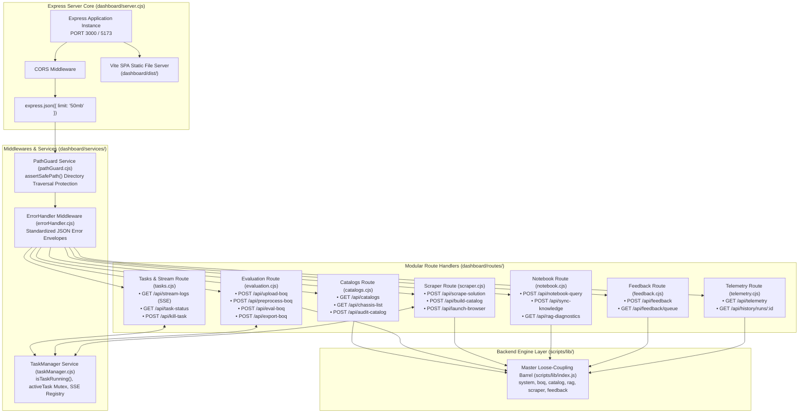

# Backend API & Modular Routes Architecture

Derived directly from the Express server implementation in `dashboard/server.cjs`, `dashboard/routes/`, and `dashboard/services/`.

```mermaid
graph TB
    subgraph "Express Server Core (dashboard/server.cjs)"
        APP["Express Application Instance<br/>PORT 3000 / 5173"]
        CORS["CORS Middleware"]
        JSON_BODY["express.json({ limit: '50mb' })"]
        STATIC["Vite SPA Static File Server<br/>(dashboard/dist/)"]
    end

    subgraph "Middlewares & Services (dashboard/services/)"
        PATH_GUARD["PathGuard Service (pathGuard.cjs)<br/>assertSafePath() Directory Traversal Protection"]
        TASK_MGR["TaskManager Service (taskManager.cjs)<br/>isTaskRunning(), activeTask Mutex, SSE Registry"]
        ERR_HANDLER["ErrorHandler Middleware (errorHandler.cjs)<br/>Standardized JSON Error Envelopes"]
    end

    subgraph "Modular Route Handlers (dashboard/routes/)"
        R_CATALOG["Catalogs Route (catalogs.cjs)<br/>• GET /api/catalogs<br/>• GET /api/chassis-list<br/>• POST /api/audit-catalog"]
        R_EVAL["Evaluation Route (evaluation.cjs)<br/>• POST /api/upload-boq<br/>• POST /api/preprocess-boq<br/>• POST /api/eval-boq<br/>• POST /api/export-boq"]
        R_SCRAPE["Scraper Route (scraper.cjs)<br/>• POST /api/scrape-solution<br/>• POST /api/build-catalog<br/>• POST /api/launch-browser"]
        R_TASKS["Tasks & Stream Route (tasks.cjs)<br/>• GET /api/stream-logs (SSE)<br/>• GET /api/task-status<br/>• POST /api/kill-task"]
        R_NOTEBOOK["Notebook Route (notebook.cjs)<br/>• POST /api/notebook-query<br/>• POST /api/sync-knowledge<br/>• GET /api/rag-diagnostics"]
        R_FEEDBACK["Feedback Route (feedback.cjs)<br/>• POST /api/feedback<br/>• GET /api/feedback/queue"]
        R_TELEMETRY["Telemetry Route (telemetry.cjs)<br/>• GET /api/telemetry<br/>• GET /api/history/runs/:id"]
    end

    subgraph "Backend Engine Layer (scripts/lib/)"
        LIB["Master Loose-Coupling Barrel (scripts/lib/index.js)<br/>system, boq, catalog, rag, scraper, feedback"]
    end

    %% Wiring
    APP --> CORS --> JSON_BODY
    JSON_BODY --> PATH_GUARD --> ERR_HANDLER
    ERR_HANDLER --> R_CATALOG & R_EVAL & R_SCRAPE & R_TASKS & R_NOTEBOOK & R_FEEDBACK & R_TELEMETRY
    R_TASKS <--> TASK_MGR
    R_EVAL <--> TASK_MGR
    R_SCRAPE <--> TASK_MGR
    R_CATALOG & R_EVAL & R_SCRAPE & R_NOTEBOOK & R_FEEDBACK & R_TELEMETRY --> LIB
    APP --> STATIC
```
