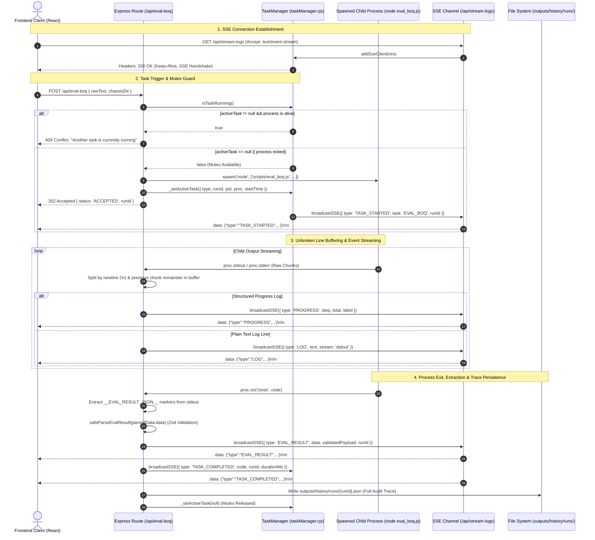

# Task Manager Mutex & Real-Time SSE Streaming Protocol

Derived directly from the implementation in `dashboard/services/taskManager.cjs` and `dashboard/routes/tasks.cjs`.

```mermaid
sequenceDiagram
    autonumber
    actor Client as Frontend Client (React)
    participant Route as Express Route (/api/eval-boq)
    participant TaskMgr as TaskManager (taskManager.cjs)
    participant Child as Spawned Child Process (node eval_boq.js)
    participant SSE as SSE Channel (/api/stream-logs)
    participant FS as File System (outputs/history/runs/)

    Note over Client,SSE: 1. SSE Connection Establishment
    Client->>SSE: GET /api/stream-logs (Accept: text/event-stream)
    SSE->>TaskMgr: addSseClient(res)
    TaskMgr-->>Client: Headers: 200 OK (Keep-Alive, SSE Handshake)

    Note over Client,TaskMgr: 2. Task Trigger & Mutex Guard
    Client->>Route: POST /api/eval-boq { rawText, chassisDir }
    Route->>TaskMgr: isTaskRunning()
    alt activeTask != null && process is alive
        TaskMgr-->>Route: true
        Route-->>Client: 409 Conflict: "Another task is currently running"
    else activeTask == null || process exited
        TaskMgr-->>Route: false (Mutex Available)
        Route->>Child: spawn('node', ['scripts/eval_boq.js', ...])
        Route->>TaskMgr: _setActiveTask({ type, runId, pid, proc, startTime })
        Route-->>Client: 202 Accepted { status: 'ACCEPTED', runId }
        TaskMgr->>SSE: broadcastSSE({ type: 'TASK_STARTED', task: 'EVAL_BOQ', runId })
        SSE-->>Client: data: {"type":"TASK_STARTED",...}\n\n
    end

    Note over Child,TaskMgr: 3. Unbroken Line Buffering & Event Streaming
    loop Child Output Streaming
        Child->>Route: proc.stdout / proc.stderr (Raw Chunks)
        Route->>Route: Split by newline (\n) & preserve chunk remainder in buffer
        alt Structured Progress Log
            Route->>SSE: broadcastSSE({ type: 'PROGRESS', step, total, label })
            SSE-->>Client: data: {"type":"PROGRESS",...}\n\n
        else Plain Text Log Line
            Route->>SSE: broadcastSSE({ type: 'LOG', text, stream: 'stdout' })
            SSE-->>Client: data: {"type":"LOG",...}\n\n
        end
    end

    Note over Child,FS: 4. Process Exit, Extraction & Trace Persistence
    Child->>Route: proc.on('close', code)
    Route->>Route: Extract __EVAL_RESULT_JSON__ markers from stdout
    Route->>Route: safeParseEvalResult(parsedData.data) (Zod Validation)
    Route->>SSE: broadcastSSE({ type: 'EVAL_RESULT', data: validatedPayload, runId })
    SSE-->>Client: data: {"type":"EVAL_RESULT",...}\n\n
    Route->>TaskMgr: broadcastSSE({ type: 'TASK_COMPLETED', code, runId, durationMs })
    SSE-->>Client: data: {"type":"TASK_COMPLETED",...}\n\n
    Route->>FS: Write outputs/history/runs/{runId}.json (Full Audit Trace)
    Route->>TaskMgr: _setActiveTask(null) (Mutex Released)
```
