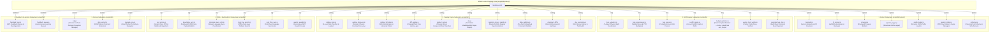

# Master Library Subsystems & Barrel Architecture

Derived directly from `scripts/lib/index.js` and the underlying domain directory structure in `scripts/lib/`.

```mermaid
graph TB
    subgraph "Master Loose-Coupling Barrel (scripts/lib/index.js)"
        ROOT["module.exports"]
    end

    subgraph "1. System Subsystem (scripts/lib/system/)"
        S_TEL["telemetry.js<br/>(System Telemetry & KPI Counters)"]
        S_FS["fs_compat.js<br/>(safeWriteJsonAtomic & Backups)"]
        S_PROG["progress.js<br/>(Structured Progress Emitter)"]
        S_LOG["pipeline_logger.js<br/>(Structured JSON Logger)"]
        S_PROF["profile_loader.js<br/>(Dynamic JSON Profile Loader)"]
        S_ROT["gemini_rotator.js<br/>(FIFO Key Rotator & Quota Manager)"]
        S_SCH["schemas.js<br/>(Canonical Zod Schemas & Safe Parsers)"]
    end

    subgraph "2. BOQ Engine Subsystem (scripts/lib/)"
        B_EVAL["boq_evaluator.js<br/>(7-Aspect Physical Math Coordinator)"]
        B_PRE["boq_preprocessor.js<br/>(Tabular Parser & CTO Multipliers)"]
        B_PAR["boq_parser.js<br/>(Centralized Line & SKU Parser)"]
        B_CG["conflict_graph.js<br/>(5-Level Conflict Graph & DAG)"]
        B_OPT["budget_optimizer.js<br/>(Rank 5 CapEx Minimizer — Active: called from eval_boq.js)"]
        B_VBOM["vendor_bom_verifier.js<br/>(Partner Portal Cross-Verifier)"]
        B_XLSX["generate_boq_xlsx.js<br/>(Multi-Sheet Corrected Excel Exporter)"]
    end

    subgraph "3. Catalog Engine Subsystem (scripts/lib/)"
        C_RULES["catalog_rules.js<br/>(5-Level Rule Classifier & Loader)"]
        C_DISC["catalog_discovery.js<br/>(Dynamic Chassis Directory Discovery)"]
        C_FORM["catalog_formatter.js<br/>(SKU Normalization & Hierarchy Paths)"]
        C_DIFF["diff_catalog.js<br/>(Catalog Diffs & Price History Logs)"]
        C_META["product_meta.js<br/>(Chassis Meta & Component Role Classifier)"]
        C_SKU["sku.js<br/>(Centralized isValidHpeSKU Regex Engine)"]
        C_REG["registry.js & sync_registry.js<br/>(Master Portfolio Registry Synchronization)"]
        C_VAL["data_validator.js<br/>(Pre-Commit Quality & Constraint Validator)"]
        C_CHKSUM["checksum_diff.js<br/>(SHA-256 Incremental Hashing)"]
        C_VERS["sku_versioning.js<br/>(SKU Version History & Trail Audit)"]
    end

    subgraph "4. RAG & Multimodal AI Subsystem (scripts/lib/)"
        R_OCR["ocr_service.js<br/>(Gemini Vision OCR & Multimodal Ingestion)"]
        R_SYNC["knowledge_sync.js<br/>(NotebookLM RAG Sync Payload Builder)"]
        R_QUERY["notebook_query_utils.js<br/>(Natural Language Query Coordinator)"]
        R_LOCAL["local_rag_search.js<br/>(Offline Dual-Layer Fallback Search)"]
        R_POST["post_flow_sync.js<br/>(Post-Flow Knowledge Sync Hook)"]
        R_GUARD["agentic_guardrail.js<br/>(Autonomous MCP Guardrail Loop)"]
    end

    subgraph "5. Scraper Subsystem (scripts/lib/)"
        SC_CDP["cdp.js<br/>(Chrome DevTools Protocol Connection Manager)"]
        SC_DOM["dom_extract.js<br/>(DOM Table & Constraint Extraction)"]
        SC_NAV["navigate_oca.js<br/>(Smart Partner Portal Auto-Navigator)"]
    end

    subgraph "6. Feedback & Learning Subsystem (scripts/lib/)"
        F_LOOP["feedback_loop.js<br/>(HITL Feedback Capture & Rule Ingestion)"]
        F_QUEUE["feedback_queue.js<br/>(Asynchronous Learning Queue)"]
    end

    %% Mappings
    ROOT -->|system| S_TEL & S_FS & S_PROG & S_LOG & S_PROF & S_ROT & S_SCH
    ROOT -->|boq| B_EVAL & B_PRE & B_PAR & B_CG & B_OPT & B_VBOM & B_XLSX
    ROOT -->|catalog| C_RULES & C_DISC & C_FORM & C_DIFF & C_META & C_SKU & C_REG & C_VAL & C_CHKSUM & C_VERS
    ROOT -->|rag| R_OCR & R_SYNC & R_QUERY & R_LOCAL & R_POST & R_GUARD
    ROOT -->|scraper| SC_CDP & SC_DOM & SC_NAV
    ROOT -->|feedback| F_LOOP & F_QUEUE
```
