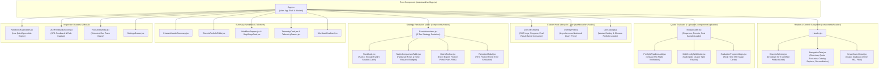

# React Frontend Component Hierarchy & State Flow

Derived directly from `dashboard/src/App.jsx`, `dashboard/src/hooks/`, and the modular UI component tree in `dashboard/src/components/`.

```mermaid
graph TD
    subgraph "Root Component (dashboard/src/App.jsx)"
        APP["App.jsx<br/>(Main App Shell & Modals)"]
    end

    subgraph "Custom Hook Lifecycle Layer (dashboard/src/hooks/)"
        H_SSE["useSSEStream()<br/>(SSE Logs, Progress, Eval Result Event Consumer)"]
        H_RAG["useRagPoller()<br/>(Asynchronous Notebook Query Poller)"]
        H_CAT["useCatalogs()<br/>(Master Catalog & Chassis Portfolio Loader)"]
    end

    subgraph "Header & Control Subsystem (components/header/)"
        HDR["Header.jsx"]
        C_SEL["ChassisSelector.jsx<br/>(Dropdown for 6 Certified Product Lines)"]
        NAV_TABS["NavigationTabs.jsx<br/>(Overview, Quote Evaluator, Catalog Explorer, Reconciliation)"]
        S_SRCH["SmartSearchInput.jsx<br/>(Instant Keyboard-Driven SKU Filter)"]
    end

    subgraph "Quote Evaluator & Uploader (components/uploader/)"
        UPLOADER["BoqUploader.jsx<br/>(Dropzone, Presets, Fast Sample Loader)"]
        AUDIT_PRE["PreflightPipelineAudit.jsx<br/>(5-Stage Pre-Flight Verification)"]
        SPLIT_MODAL["MultiConfigSplitModal.jsx<br/>(Multi-Node Cluster Split Review)"]
        PROG_STEPS["EvaluationProgressSteps.jsx<br/>(Real-Time SSE Stage Cards)"]
    end

    subgraph "Strategy Resolution Matrix (components/matrix/)"
        RES_MATRIX["ResolutionMatrix.jsx<br/>(5-Tier Strategy Container)"]
        RANK_CARDS["RankCard.jsx<br/>(Rank 1 through Rank 5 Solution Cards)"]
        COMP_TABLE["MatrixComparisonTable.jsx<br/>(Hardware Rows & None Required Badges)"]
        TOOLBAR["MatrixToolbar.jsx<br/>(Excel Export, Partner Portal Push, Filter)"]
        REJECT_MODAL["RejectionModal.jsx<br/>(HITL Partner Portal Error Simulation)"]
    end

    subgraph "Summary, Workflow & Telemetry"
        SUM_HDR["ChassisHeaderSummary.jsx"]
        SUM_PORT["ChassisPortfolioTable.jsx"]
        STEPPER["WorkflowStepper.jsx & StepStageCard.jsx"]
        TEL_CARD["TelemetryCard.jsx & TelemetryDrawer.jsx"]
        DNA_CARD["WorkloadDnaCard.jsx"]
    end

    subgraph "Inspection Drawers & Modals"
        RAG_DRAWER["NotebookRagDrawer.jsx<br/>(Live QuickSpecs Ask Engine)"]
        FEED_DRAWER["UserFeedbackDrawer.jsx<br/>(HITL Feedback & Rule Capture)"]
        RUN_MODAL["RunDetailModal.jsx<br/>(Historical Run Trace Viewer)"]
        SETTINGS["SettingsDrawer.jsx"]
    end

    %% Hierarchy
    APP --> H_SSE & H_RAG & H_CAT
    APP --> HDR
    HDR --> C_SEL & NAV_TABS & S_SRCH
    APP --> UPLOADER
    UPLOADER --> AUDIT_PRE & SPLIT_MODAL & PROG_STEPS
    APP --> DNA_CARD
    APP --> RES_MATRIX
    RES_MATRIX --> RANK_CARDS & COMP_TABLE & TOOLBAR & REJECT_MODAL
    APP --> SUM_HDR & SUM_PORT & STEPPER & TEL_CARD
    APP --> RAG_DRAWER & FEED_DRAWER & RUN_MODAL & SETTINGS
```
