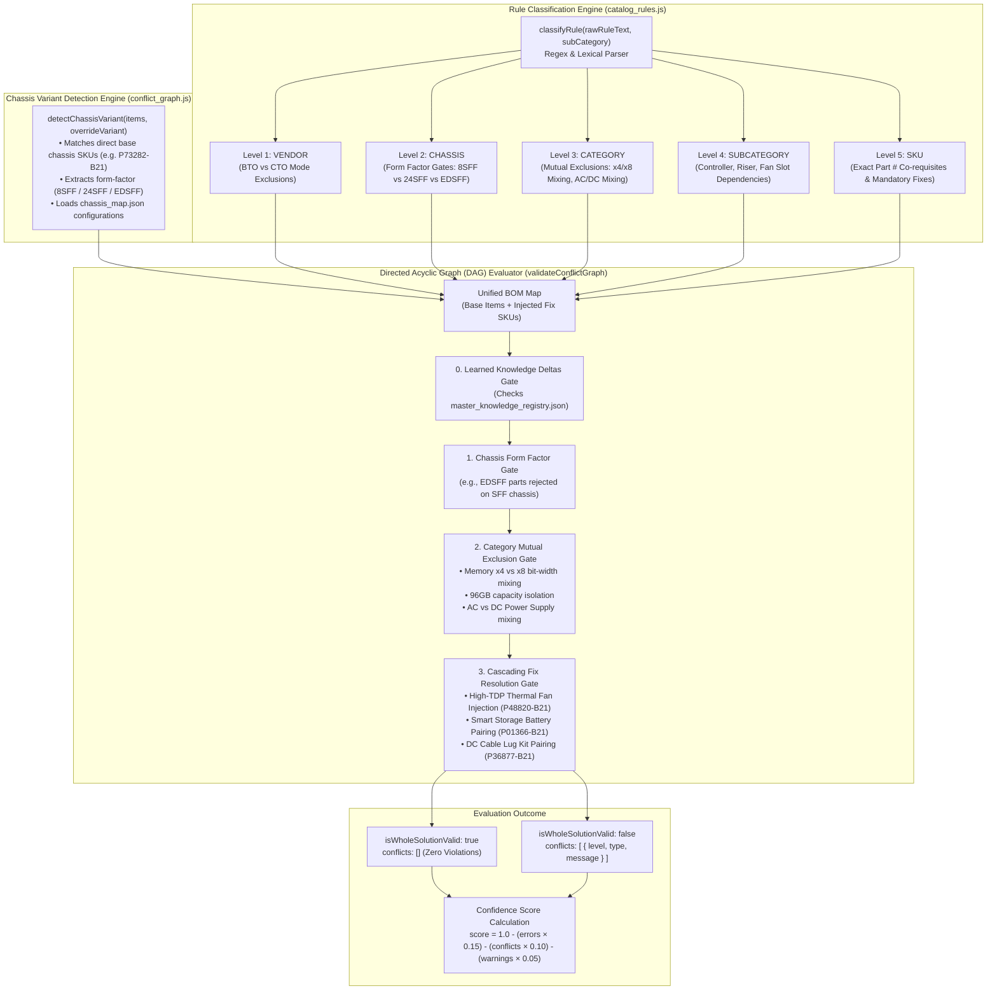

# Conflict DAG & 5-Level Rule Engine Architecture

Derived directly from `scripts/lib/conflict_graph.js`, `scripts/lib/catalog_rules.js`, and `scripts/lib/conflict/workload_dna.js`.

```mermaid
graph TD
    subgraph "Rule Classification Engine (catalog_rules.js)"
        R_CLASS["classifyRule(rawRuleText, subCategory)<br/>Regex & Lexical Parser"]
        L1["Level 1: VENDOR<br/>(BTO vs CTO Mode Exclusions)"]
        L2["Level 2: CHASSIS<br/>(Form Factor Gates: 8SFF vs 24SFF vs EDSFF)"]
        L3["Level 3: CATEGORY<br/>(Mutual Exclusions: x4/x8 Mixing, AC/DC Mixing)"]
        L4["Level 4: SUBCATEGORY<br/>(Controller, Riser, Fan Slot Dependencies)"]
        L5["Level 5: SKU<br/>(Exact Part # Co-requisites & Mandatory Fixes)"]
    end

    subgraph "Chassis Variant Detection Engine (conflict_graph.js)"
        DETECT["detectChassisVariant(items, overrideVariant)<br/>• Matches direct base chassis SKUs (e.g. P73282-B21)<br/>• Extracts form-factor (8SFF / 24SFF / EDSFF)<br/>• Loads chassis_map.json configurations"]
    end

    subgraph "Directed Acyclic Graph (DAG) Evaluator (validateConflictGraph)"
        FULL_BOM["Unified BOM Map<br/>(Base Items + Injected Fix SKUs)"]
        LEARNED_CHECK["0. Learned Knowledge Deltas Gate<br/>(Checks master_knowledge_registry.json)"]
        CHASSIS_GATE["1. Chassis Form Factor Gate<br/>(e.g., EDSFF parts rejected on SFF chassis)"]
        MUTUAL_EXCLUDE["2. Category Mutual Exclusion Gate<br/>• Memory x4 vs x8 bit-width mixing<br/>• 96GB capacity isolation<br/>• AC vs DC Power Supply mixing"]
        CASCADE_FIX["3. Cascading Fix Resolution Gate<br/>• High-TDP Thermal Fan Injection (P48820-B21)<br/>• Smart Storage Battery Pairing (P01366-B21)<br/>• DC Cable Lug Kit Pairing (P36877-B21)"]
    end

    subgraph "Evaluation Outcome"
        CLEAN["isWholeSolutionValid: true<br/>conflicts: [] (Zero Violations)"]
        CONFLICTS["isWholeSolutionValid: false<br/>conflicts: [ { level, type, message } ]"]
        CONFIDENCE["Confidence Score Calculation<br/>score = 1.0 - (errors × 0.15) - (conflicts × 0.10) - (warnings × 0.05)"]
    end

    %% Flow
    R_CLASS --> L1 & L2 & L3 & L4 & L5
    DETECT --> FULL_BOM
    L1 & L2 & L3 & L4 & L5 --> FULL_BOM
    FULL_BOM --> LEARNED_CHECK --> CHASSIS_GATE --> MUTUAL_EXCLUDE --> CASCADE_FIX
    CASCADE_FIX --> CLEAN
    CASCADE_FIX --> CONFLICTS
    CLEAN & CONFLICTS --> CONFIDENCE
```
