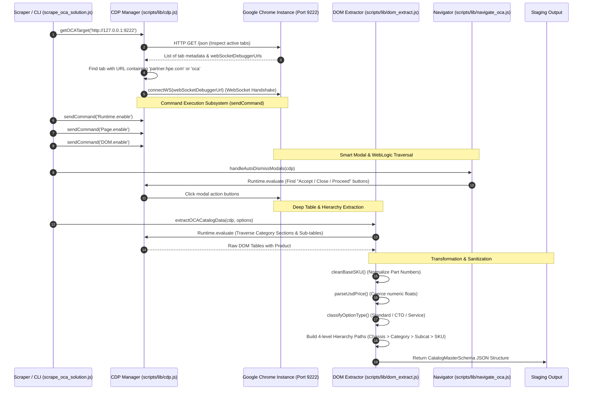

# CDP Browser Automation & DOM Extraction Engine

Derived directly from `scripts/lib/cdp.js`, `scripts/lib/dom_extract.js`, and `scripts/lib/navigate_oca.js`.

```mermaid
sequenceDiagram
    autonumber
    participant Script as Scraper / CLI (scrape_oca_solution.js)
    participant CDP as CDP Manager (scripts/lib/cdp.js)
    participant Chrome as Google Chrome Instance (Port 9222)
    participant DOM as DOM Extractor (scripts/lib/dom_extract.js)
    participant Nav as Navigator (scripts/lib/navigate_oca.js)
    participant Out as Staging Output

    Script->>CDP: getOCATarget('http://127.0.0.1:9222')
    CDP->>Chrome: HTTP GET /json (Inspect active tabs)
    Chrome-->>CDP: List of tab metadata & webSocketDebuggerUrls
    CDP->>CDP: Find tab with URL containing 'partner.hpe.com' or 'oca'
    CDP->>Chrome: connectWS(webSocketDebuggerUrl) (WebSocket Handshake)

    Note over CDP,Chrome: Command Execution Subsystem (sendCommand)
    Script->>CDP: sendCommand('Runtime.enable')
    Script->>CDP: sendCommand('Page.enable')
    Script->>CDP: sendCommand('DOM.enable')

    Note over Nav,Chrome: Smart Modal & WebLogic Traversal
    Script->>Nav: handleAutoDismissModals(cdp)
    Nav->>CDP: Runtime.evaluate (Find "Accept / Close / Proceed" buttons)
    CDP->>Chrome: Click modal action buttons

    Note over DOM,Chrome: Deep Table & Hierarchy Extraction
    Script->>DOM: extractOCACatalogData(cdp, options)
    DOM->>CDP: Runtime.evaluate (Traverse Category Sections & Sub-tables)
    CDP-->>DOM: Raw DOM Tables with Product #, Description, List Price, Constraints
    
    Note over DOM,Out: Transformation & Sanitization
    DOM->>DOM: cleanBaseSKU() (Normalize Part Numbers)
    DOM->>DOM: parseUsdPrice() (Coerce numeric floats)
    DOM->>DOM: classifyOptionType() (Standard / CTO / Service)
    DOM->>DOM: Build 4-level Hierarchy Paths (Chassis > Category > Subcat > SKU)
    DOM->>Out: Return CatalogMasterSchema JSON Structure
```
