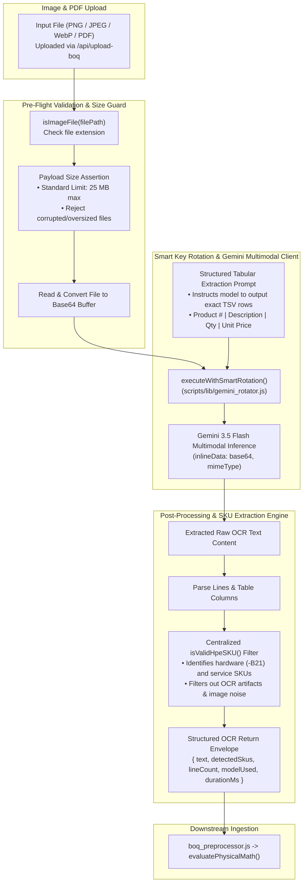

# Multimodal Vision OCR Ingestion Pipeline

Derived directly from `scripts/lib/ocr_service.js` and its integration with the Smart FIFO Key Rotator.

```mermaid
graph TD
    subgraph "Image & PDF Upload"
        FILE["Input File (PNG / JPEG / WebP / PDF)<br/>Uploaded via /api/upload-boq"]
    end

    subgraph "Pre-Flight Validation & Size Guard"
        IS_IMAGE["isImageFile(filePath)<br/>Check file extension"]
        SIZE_CHECK["Payload Size Assertion<br/>• Standard Limit: 25 MB max<br/>• Reject corrupted/oversized files"]
        BASE64["Read & Convert File to Base64 Buffer"]
    end

    subgraph "Smart Key Rotation & Gemini Multimodal Client"
        ROTATOR["executeWithSmartRotation()<br/>(scripts/lib/gemini_rotator.js)"]
        PROMPT["Structured Tabular Extraction Prompt<br/>• Instructs model to output exact TSV rows<br/>• Product # | Description | Qty | Unit Price"]
        CALL["Gemini 3.5 Flash Multimodal Inference<br/>(inlineData: base64, mimeType)"]
    end

    subgraph "Post-Processing & SKU Extraction Engine"
        RAW_TEXT["Extracted Raw OCR Text Content"]
        LINE_PARSER["Parse Lines & Table Columns"]
        REGEX["Centralized isValidHpeSKU() Filter<br/>• Identifies hardware (-B21) and service SKUs<br/>• Filters out OCR artifacts & image noise"]
        STRUCTURED["Structured OCR Return Envelope<br/>{ text, detectedSkus, lineCount, modelUsed, durationMs }"]
    end

    subgraph "Downstream Ingestion"
        PREPROC["boq_preprocessor.js -> evaluatePhysicalMath()"]
    end

    %% Flows
    FILE --> IS_IMAGE --> SIZE_CHECK --> BASE64
    BASE64 --> ROTATOR
    PROMPT --> ROTATOR
    ROTATOR --> CALL --> RAW_TEXT
    RAW_TEXT --> LINE_PARSER --> REGEX --> STRUCTURED
    STRUCTURED --> PREPROC
```
