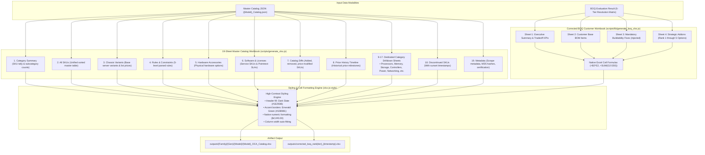

# Master Excel Workbook Generation Pipeline

Derived directly from `scripts/generate_xlsx.js` and `scripts/lib/generate_boq_xlsx.js` using `xlsx-js-style`.

```mermaid
graph TD
    subgraph "Input Data Modalities"
        CAT_JSON["Master Catalog JSON ({Model}_Catalog.json)"]
        EVAL_JSON["BOQ Evaluation Result (5-Tier Resolution Matrix)"]
    end

    subgraph "19-Sheet Master Catalog Workbook (scripts/generate_xlsx.js)"
        S_SUM["1. Category Summary (SKU tally & subcategory counts)"]
        S_ALL["2. All SKUs (Unified sorted master table)"]
        S_CTO["3. Chassis Variants (Base server variants & list prices)"]
        S_RULES["4. Rules & Constraints (5-level parsed rules)"]
        S_HW["5. Hardware Accessories (Physical hardware options)"]
        S_SVC["6. Software & Licenses (Service SKUs & Pointnext SLAs)"]
        S_DIFF["7. Catalog Diffs (Added, removed, price modified SKUs)"]
        S_TRAIL["8. Price History Timeline (Historical price milestones)"]
        S_CATS["9-17. Dedicated Category Drilldown Sheets<br/>• Processors, Memory, Storage, Controllers, Power, Networking, etc."]
        S_DISC["18. Discontinued SKUs (With sunset timestamps)"]
        S_META["19. Metadata (Scrape metadata, MD5 hashes, certification)"]
    end

    subgraph "Corrected BOQ Customer Workbook (scripts/lib/generate_boq_xlsx.js)"
        B_SUM["Sheet 1: Executive Summary & Tradeoff KPIs"]
        B_BASE["Sheet 2: Customer Base BOM Items"]
        B_FIXES["Sheet 3: Mandatory Buildability Fixes (Injected)"]
        B_TIERS["Sheet 4: Strategic Addons (Rank 1 through 5 Options)"]
        B_CALC["Native Excel Cell Formulas (=B2*E2, =SUM(G2:G50))"]
    end

    subgraph "Styling & Cell Formatting Engine (xlsx-js-style)"
        ARGB["High-Contrast Styling Engine<br/>• Header fill: Dark Slate (#1E293B)<br/>• Accent borders: Emerald Green (#10B981)<br/>• Native numeric formatting ($#,##0.00)<br/>• Column width auto-fitting"]
    end

    subgraph "Artifact Output"
        XLSX_CAT["outputs/{Family}/{Gen}/{Model}/{Model}_OCA_Catalog.xlsx"]
        XLSX_BOQ["outputs/corrected_boq_rank{tier}_{timestamp}.xlsx"]
    end

    %% Flows
    CAT_JSON --> S_SUM & S_ALL & S_CTO & S_RULES & S_HW & S_SVC & S_DIFF & S_TRAIL & S_CATS & S_DISC & S_META
    S_SUM & S_ALL & S_CTO & S_RULES & S_HW & S_SVC & S_DIFF & S_TRAIL & S_CATS & S_DISC & S_META --> ARGB
    ARGB --> XLSX_CAT

    EVAL_JSON --> B_SUM & B_BASE & B_FIXES & B_TIERS --> B_CALC --> ARGB --> XLSX_BOQ
```
