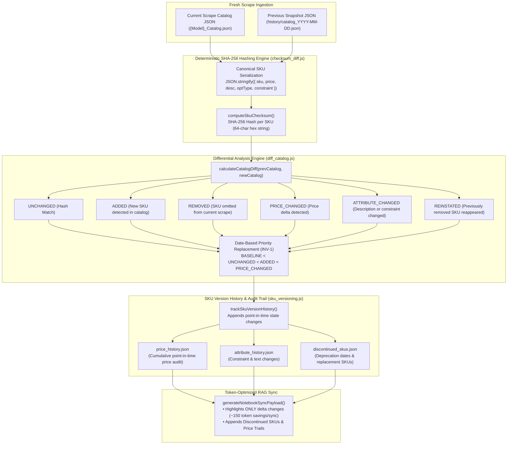

# Checksum Diffing & SKU Versioning Engine

Derived directly from `scripts/lib/checksum_diff.js`, `scripts/lib/sku_versioning.js`, and `scripts/lib/diff_catalog.js`.

```mermaid
graph TD
    subgraph "Fresh Scrape Ingestion"
        NEW_CAT["Current Scrape Catalog JSON ({Model}_Catalog.json)"]
        PREV_CAT["Previous Snapshot JSON (history/catalog_YYYY-MM-DD.json)"]
    end

    subgraph "Deterministic SHA-256 Hashing Engine (checksum_diff.js)"
        CANONICAL["Canonical SKU Serialization<br/>JSON.stringify({ sku, price, desc, optType, constraint })"]
        HASH["computeSkuChecksum()<br/>SHA-256 Hash per SKU (64-char hex string)"]
    end

    subgraph "Differential Analysis Engine (diff_catalog.js)"
        DIFF["calculateCatalogDiff(prevCatalog, newCatalog)"]
        D_UNCHANGED["UNCHANGED (Hash Match)"]
        D_ADDED["ADDED (New SKU detected in catalog)"]
        D_REMOVED["REMOVED (SKU omitted from current scrape)"]
        D_PRICE["PRICE_CHANGED (Price delta detected)"]
        D_ATTR["ATTRIBUTE_CHANGED (Description or constraint changed)"]
        D_REINST["REINSTATED (Previously removed SKU reappeared)"]
        D_PRIORITY["Date-Based Priority Replacement (INV-1)<br/>BASELINE < UNCHANGED < ADDED < PRICE_CHANGED"]
    end

    subgraph "SKU Version History & Audit Trail (sku_versioning.js)"
        V_TRACK["trackSkuVersionHistory()<br/>Appends point-in-time state changes"]
        PRICE_LOG["price_history.json<br/>(Cumulative point-in-time price audit)"]
        ATTR_LOG["attribute_history.json<br/>(Constraint & text changes)"]
        DISC_LOG["discontinued_skus.json<br/>(Deprecation dates & replacement SKUs)"]
    end

    subgraph "Token-Optimized RAG Sync"
        RAG_PAYLOAD["generateNotebookSyncPayload()<br/>• Highlights ONLY delta changes (~150 token savings/sync)<br/>• Appends Discontinued SKUs & Price Trails"]
    end

    %% Flows
    NEW_CAT & PREV_CAT --> CANONICAL --> HASH --> DIFF
    DIFF --> D_UNCHANGED & D_ADDED & D_REMOVED & D_PRICE & D_ATTR & D_REINST
    D_UNCHANGED & D_ADDED & D_REMOVED & D_PRICE & D_ATTR & D_REINST --> D_PRIORITY --> V_TRACK
    V_TRACK --> PRICE_LOG & ATTR_LOG & DISC_LOG
    PRICE_LOG & ATTR_LOG & DISC_LOG --> RAG_PAYLOAD
```
