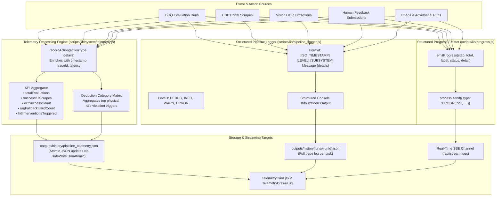

# System Telemetry Ledger & Observability Pipeline

Derived directly from `scripts/lib/system/telemetry.js`, `scripts/lib/pipeline_logger.js`, and `scripts/lib/progress.js`.

```mermaid
graph TD
    subgraph "Event & Action Sources"
        EVAL_ACTION["BOQ Evaluation Runs"]
        SCRAPE_ACTION["CDP Portal Scrapes"]
        OCR_ACTION["Vision OCR Extractions"]
        HITL_ACTION["Human Feedback Submissions"]
        CHAOS_ACTION["Chaos & Adversarial Runs"]
    end

    subgraph "Telemetry Processing Engine (scripts/lib/system/telemetry.js)"
        RECORD["recordAction(actionType, details)<br/>Enriches with timestamp, traceId, latency"]
        COUNTERS["KPI Aggregator<br/>• totalEvaluations<br/>• successfulScrapes<br/>• ocrSuccessCount<br/>• ragFallbackUsedCount<br/>• hitlInterventionsTriggered"]
        REASONS["Deduction Category Matrix<br/>Aggregates top physical rule violation triggers"]
    end

    subgraph "Structured Pipeline Logger (scripts/lib/pipeline_logger.js)"
        LOG_FORMAT["Format: [ISO_TIMESTAMP] [LEVEL] [SUBSYSTEM] Message {details}"]
        LOG_LEVELS["Levels: DEBUG, INFO, WARN, ERROR"]
        STDOUT_STREAM["Structured Console stdout/stderr Output"]
    end

    subgraph "Structured Progress Emitter (scripts/lib/progress.js)"
        PROG_EMIT["emitProgress(step, total, label, status, detail)"]
        IPC_SEND["process.send({ type: 'PROGRESS', ... })"]
    end

    subgraph "Storage & Streaming Targets"
        LEDGER_FILE["outputs/history/pipeline_telemetry.json<br/>(Atomic JSON updates via safeWriteJsonAtomic)"]
        RUN_TRACE["outputs/history/runs/{runId}.json<br/>(Full trace log per task)"]
        SSE_FEED["Real-Time SSE Channel (/api/stream-logs)"]
        UI_DASHBOARD["TelemetryCard.jsx & TelemetryDrawer.jsx"]
    end

    %% Wiring
    EVAL_ACTION & SCRAPE_ACTION & OCR_ACTION & HITL_ACTION & CHAOS_ACTION --> RECORD & LOG_FORMAT & PROG_EMIT
    RECORD --> COUNTERS & REASONS --> LEDGER_FILE
    LOG_FORMAT --> STDOUT_STREAM --> RUN_TRACE
    PROG_EMIT --> IPC_SEND --> SSE_FEED
    LEDGER_FILE & RUN_TRACE & SSE_FEED --> UI_DASHBOARD
```
