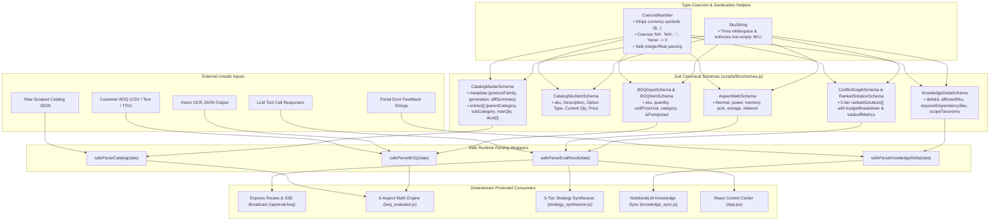

# Canonical Zod Schema & Runtime Validation Pipeline

Derived directly from `scripts/lib/schemas.js` and `scripts/lib/data_validator.js`.

```mermaid
graph TB
    subgraph "External Unsafe Inputs"
        IN_CAT["Raw Scraped Catalog JSON"]
        IN_BOQ["Customer BOQ (CSV / Text / TSV)"]
        IN_OCR["Vision OCR JSON Output"]
        IN_AGENT["LLM Tool Call Responses"]
        IN_DELTA["Portal Error Feedback Strings"]
    end

    subgraph "Zod Canonical Schemas (scripts/lib/schemas.js)"
        S_CAT["CatalogMasterSchema<br/>• metadata (productFamily, generation, diffSummary)<br/>• entries[] (parentCategory, subCategory, maxQty, skus[])"]
        S_SKU["CatalogSkuItemSchema<br/>• sku, Description, Option Type, Current Qty, Price"]
        S_BOQ["BOQInputSchema & BOQItemSchema<br/>• sku, quantity, unitPriceUsd, category, isFixInjected"]
        S_MATH["AspectMathSchema<br/>• thermal, power, memory, pcie, storage, network"]
        S_CG["ConflictGraphSchema & RankedSolutionSchema<br/>• 5-tier rankedSolutions[] with budgetBreakdown & tradeoffMetrics"]
        S_DELTA["KnowledgeDeltaSchema<br/>• deltaId, affectedSku, requiredDependencySku, scopeTaxonomy"]
    end

    subgraph "Type Coercion & Sanitization Helpers"
        C_NUM["CoercedNumber<br/>• Strips currency symbols ($, ,)<br/>• Coerces 'NA', 'N/A', '-', 'None' -> 0<br/>• Safe integer/float parsing"]
        C_SKU["SkuString<br/>• Trims whitespace & enforces non-empty SKU"]
    end

    subgraph "Safe Runtime Parsing Wrappers"
        P_CAT["safeParseCatalog(data)"]
        P_BOQ["safeParseBOQ(data)"]
        P_EVAL["safeParseEvalResult(data)"]
        P_DELTA["safeParseKnowledgeDelta(data)"]
    end

    subgraph "Downstream Protected Consumers"
        OUT_API["Express Routes & SSE Broadcast (/api/eval-boq)"]
        OUT_MATH["6-Aspect Math Engine (boq_evaluator.js)"]
        OUT_SYN["5-Tier Strategy Synthesizer (strategy_synthesizer.js)"]
        OUT_RAG["NotebookLM Knowledge Sync (knowledge_sync.js)"]
        OUT_UI["React Control Center (App.jsx)"]
    end

    %% Flows
    C_NUM & C_SKU --> S_CAT & S_SKU & S_BOQ & S_MATH & S_CG & S_DELTA
    IN_CAT --> P_CAT
    IN_BOQ & IN_OCR --> P_BOQ
    IN_AGENT --> P_EVAL
    IN_DELTA --> P_DELTA

    S_CAT --> P_CAT
    S_BOQ --> P_BOQ
    S_MATH & S_CG --> P_EVAL
    S_DELTA --> P_DELTA

    P_CAT --> OUT_MATH
    P_BOQ --> OUT_MATH
    P_EVAL --> OUT_API & OUT_SYN & OUT_UI
    P_DELTA --> OUT_RAG
```
