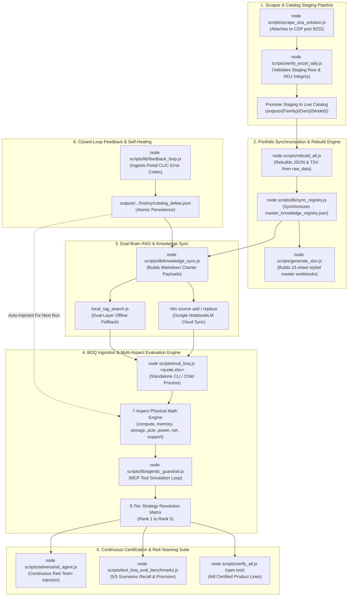

# Macro Orchestration Execution Lifecycle & CLI Script Pipeline

Derived directly from `scripts/rebuild_all.js`, `scripts/verify_all.js`, `scripts/eval_boq.js`, `scripts/lib/knowledge_sync.js`, and `scripts/lib/feedback_loop.js`.

