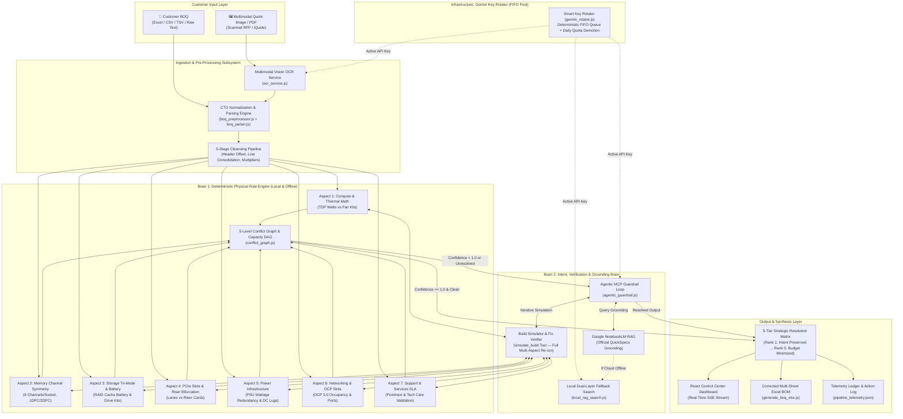

# Hybrid Dual-Brain Architecture

The HPE ProLiant AI Studio BOQ Evaluator employs a **Hybrid Dual-Brain Architecture** separating deterministic physical hardware math from agentic AI reasoning and QuickSpecs grounded RAG.

