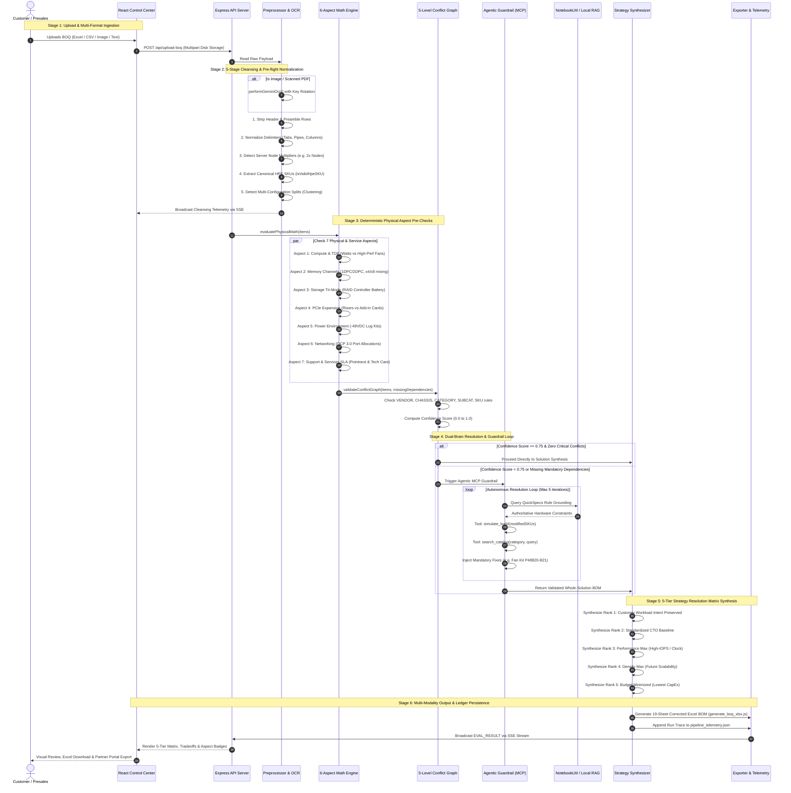

# 6-Stage BOQ Evaluation Workflow & Pre-Flight Sub-Steps

This diagram captures the complete end-to-end evaluation pipeline defined in `docs/WORKFLOWS_AND_LEARNINGS.md` and `.agents/skills/boq-eval-skill/SKILL.md`.

