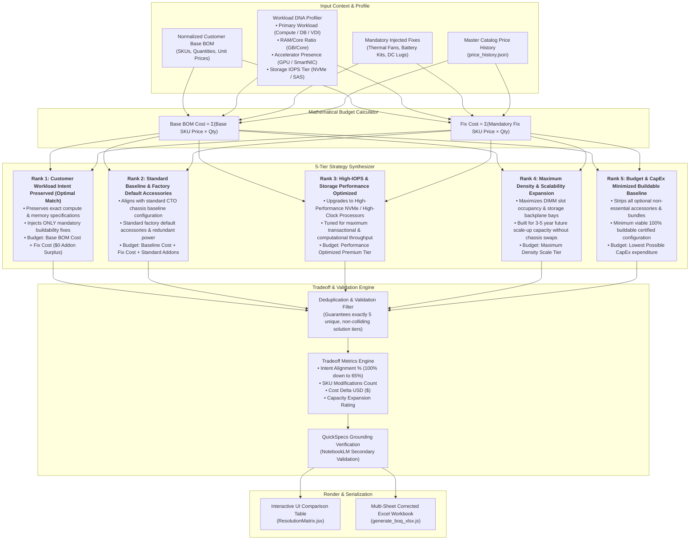

# 5-Tier Strategy Resolution Matrix Synthesis Pipeline

This diagram illustrates how the **5-Tier Strategy Resolution Matrix** is synthesized from Workload DNA profiling, mandatory physical fixes, and budget arithmetic (`scripts/lib/conflict/strategy_synthesizer.js`).

