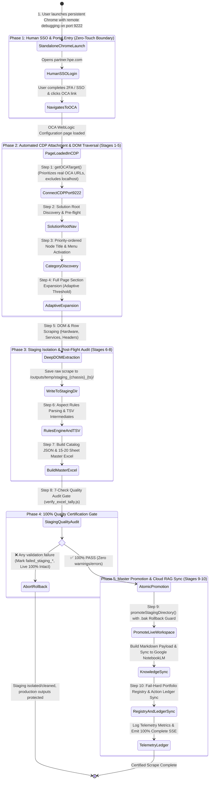

# Zero-Touch CDP Scraping & Staging Isolation Lifecycle

This diagram illustrates the **Zero-Touch Scraping Lifecycle** (`scripts/lib/cdp.js`, `scripts/lib/dom_extract.js`, `scripts/lib/navigate_oca.js`, `.agents/skills/oca-catalog-scraper/SKILL.md`).

