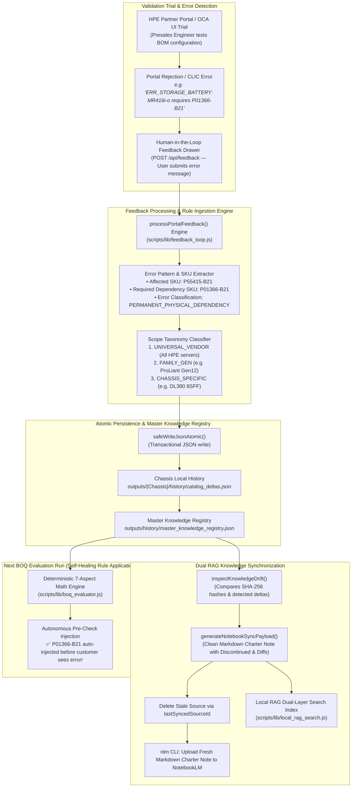

# Closed-Loop Autonomous Feedback & Knowledge Learning Lifecycle

This diagram demonstrates how the system captures errors from human review and HPE Partner Portal validation rejections, learns new hardware rules, and syncs them bi-directionally to Google NotebookLM (`scripts/lib/feedback_loop.js`, `scripts/lib/knowledge_sync.js`, `.agents/skills/knowledge-sync-skill/SKILL.md`).

