# Smart FIFO Gemini Key Rotator & Daily Quota State Machine

This diagram models the deterministic FIFO queue, automated 429 quota exhaustion demotion, and UTC calendar day reset mechanism implemented in `scripts/lib/gemini_rotator.js`.

```mermaid
stateDiagram-v2
    [*] --> InitializeQueue : Read GEMINI_API_KEY from .env (Comma-separated pool)

    state "FIFO Pool Initialization" as InitState {
        InitializeQueue --> LoadDailyUsageJSON : Read outputs/history/gemini_key_usage.json
        LoadDailyUsageJSON --> CheckUTCRollover : Compare stored calendar day vs current UTC day
        CheckUTCRollover --> ResetCounters : UTC day changed -> Reset all daily quota counters to 0
        CheckUTCRollover --> RetainCounters : Same day -> Retain usage counts & exhausted flags
        ResetCounters --> QueueReady : All keys marked ACTIVE in FIFO order
        RetainCounters --> QueueReady
    }

    state "Request Execution Lifecycle" as ExecState {
        QueueReady --> SelectHeadKey : Peek active key at Position 1 (Head of Queue)
        SelectHeadKey --> ExecuteAPIRequest : Call Gemini 3.5 Flash / Gemini Vision OCR

        state request_check <<choice>>
        ExecuteAPIRequest --> request_check

        request_check --> RecordSuccess : 200 OK (Successful inference)
        request_check --> HandleQuotaError : 429 RESOURCE_EXHAUSTED / Quota limit reached
        request_check --> HandleTransientError : 500 / 503 / Network Timeout

        RecordSuccess --> IncrementKeyMetrics : Update successes count & latency in memory
        IncrementKeyMetrics --> PersistUsageJSON : safeWriteJsonAtomic(gemini_key_usage.json)
        PersistUsageJSON --> QueueReady : Retain position at Head (Key stays active)

        HandleTransientError --> RetryTransient : Exponential backoff (Up to 3 retries on same key)
        RetryTransient --> ExecuteAPIRequest

        HandleQuotaError --> DemoteKeyToBottom : Mark key EXHAUSTED for remainder of UTC day
        DemoteKeyToBottom --> ShiftNextKeyToHead : Key 1 pushed to end of FIFO queue; Key 2 promoted to Head
        ShiftNextKeyToHead --> CheckPoolAvailability

        state pool_check <<choice>>
        CheckPoolAvailability --> pool_check
        pool_check --> ExecuteAPIRequest : Next active key available -> Execute immediately!
        pool_check --> AllKeysExhaustedLockout : 0 active keys remaining in pool (All Exhausted)
    }

    state "AllKeysExhausted Lockout & UTC Rollover" as LockoutState {
        AllKeysExhaustedLockout --> SleepUntilUTCMidnight : Calculate seconds until 00:00:00 UTC (Local rule fallback active)
        SleepUntilUTCMidnight --> TriggerUTCRollover : UTC Midnight reached
        TriggerUTCRollover --> ResetCounters : Restore all pool keys to ACTIVE
    }
```

