# Multi-Configuration BOQ Preprocessing & CTO Normalization

This diagram illustrates the multi-config clustering, preamble stripping, and CTO multiplier division logic in `scripts/lib/boq_preprocessor.js` and `scripts/lib/preprocessor/`.

```mermaid
graph TD
    subgraph "Raw Customer Input"
        RAW["Customer Quotation File<br/>(Excel Workbook / CSV / OCR TSV)"]
    end

    subgraph "Stage 1: Multi-Sheet & Preamble Extraction"
        SHEETS["Iterate Sheets & Strip Headers<br/>• Skip quote preambles (Customer name, validity date, terms)<br/>• Align column offsets (Product #, Description, Qty, Price)"]
    end

    subgraph "Stage 2: SKU Tokenization & Parsing"
        TOKENIZE["Line Tokenizer & Separator Parser<br/>• Normalizes tabs, commas, pipes (|), and inline delimiters<br/>• Filters through isValidHpeSKU() regex (-B21 / Service SKU)<br/>• Extracts embedded quantities (e.g. '2x P74573-B21' -> Qty: 2)"]
    end

    subgraph "Stage 3: CTO Server Multiplier & Clustering Engine"
        DETECT_CHASSIS["Detect CTO Base Server SKUs<br/>(e.g., P73282-B21, P52534-B21, R0Q21A)"]
        CLUSTER["Cluster Sub-Configurations<br/>• Group components under respective chassis base nodes<br/>• Detect multi-node orders (e.g. Cluster of 4 identical DL380 nodes)"]
    end

    subgraph "Stage 4: Fractional Division & Improbability Anomaly Scoring"
        FRACTIONAL["CTO Multiplier Integer Division<br/>• 4 Nodes × 2 CPUs = 8 CPUs (Integer: Valid)<br/>• 4 Nodes × 6 DIMMs = 24 DIMMs (Integer: Valid)<br/>• 4 Nodes × 3 DIMMs = 0.75 DIMMs/node (Fractional Anomaly!)"]
        ANOMALY["Improbability Index & Quality Heuristics<br/>• Detects non-integer division per node<br/>• Detects cross-generation mixing (Gen11 CPU with Gen12 Chassis)"]
    end

    subgraph "Pre-Flight Verification Modal & Confirmation"
        AUTO_CONFIRM["High Confidence (>0.85)<br/>✅ Auto-proceed to Aspect Evaluation"]
        SPLIT_MODAL["Pre-Flight Inspection Modal (App.jsx)<br/>⚠️ Prompts user to confirm or edit multi-config split"]
        RULE_PERSIST["savePreprocessingRuleFeedback()<br/>Persists confirmed split patterns to deltas"]
    end

    %% Flows
    RAW --> SHEETS --> TOKENIZE --> DETECT_CHASSIS --> CLUSTER --> FRACTIONAL --> ANOMALY
    ANOMALY -->|Clean Integer Division| AUTO_CONFIRM
    ANOMALY -->|Fractional / Ambiguous Split| SPLIT_MODAL
    SPLIT_MODAL --> RULE_PERSIST --> AUTO_CONFIRM
```

