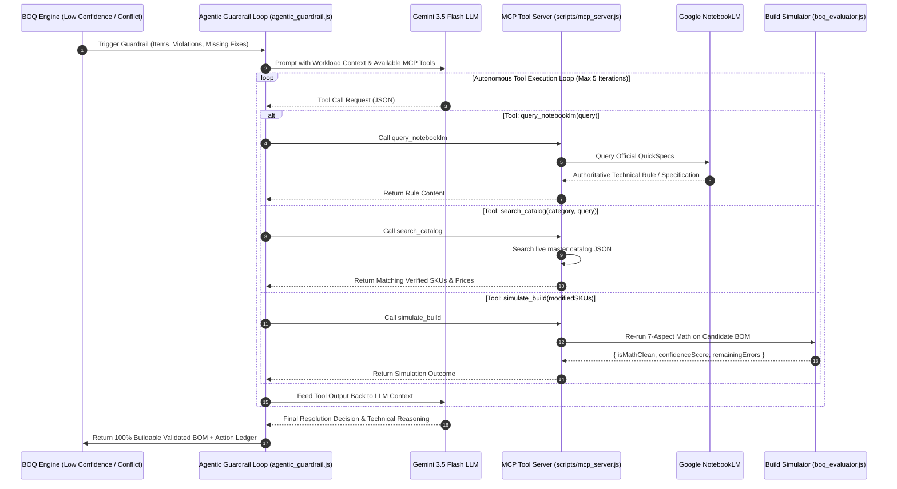

# Agentic Guardrail MCP Tool Loop & Build Simulation

This diagram illustrates the autonomous tool execution loop used by the Gemini AI Agent to resolve hardware conflicts (`scripts/lib/agentic_guardrail.js`, `scripts/mcp_server.js`).

