# 7-Aspect Physical Math Hierarchy & Capacity Bounds

This diagram outlines the mathematical logic, constraints, and capacity boundaries enforced by the 7 physical aspect checkers in `scripts/lib/aspects/`.

```mermaid
graph TB
    subgraph "Aspect 1: Compute & Thermal Math (compute_thermal.js)"
        C1["CPU Socket Count = Σ(Processor Qty)"]
        C2["Max CPU TDP Watts = Max(Regex TDP)"]
        C3["Rule: If Max TDP >= 240W & No High-Perf Fans<br/>❌ FAIL -> Inject High-Perf Fan Kit (P48820-B21)"]
        C4["Rule: If TDP >= 185W -> Mandate Performance Heatsink Kit (P74792-B21)"]
    end

    subgraph "Aspect 2: Memory Channel Symmetry (memory_channel.js)"
        M1["Total DIMM Count = Σ(Memory Qty)"]
        M2["Total RAM GB = Σ(Capacity GB × Qty)"]
        M3["Rule: 1DPC / 2DPC Channel Symmetry<br/>(DIMMs % CPUs == 0) && ((DIMMs / CPUs) % 8 == 0)"]
        M4["Rule: Mutual Exclusion<br/>• No mixing x4 and x8 DIMMs<br/>• 96GB DIMMs isolated from other capacities"]
    end

    subgraph "Aspect 3: Storage Tri-Mode & Battery (storage_tri_mode.js)"
        S1["Drive Count = Σ(NVMe / SAS / SATA Drive Qty)"]
        S2["Rule: If Tri-Mode Controller (MR416i / SR932i) Present<br/>❌ FAIL without Smart Storage Battery (P01366-B21)"]
        S3["Rule: If Drive Count == 0 & No Front Cage<br/>Mandate No Drive Configuration FIO Kit (873763-B21)"]
    end

    subgraph "Aspect 4: PCIe Expansion & Riser Math (pcie_riser.js)"
        P1["Required Add-In Cards = Σ(NICs, HBAs, GPUs, Controllers)"]
        P2["Available Motherboard Base Slots = 3"]
        P3["Riser Capacity = (Primary × 3) + (Secondary × 3) + (Tertiary × 2)"]
        P4["Rule: Secondary / Tertiary Risers REQUIRE 2nd CPU Socket"]
    end

    subgraph "Aspect 5: Power & Environment (power_environment.js)"
        PW1["PSU Count = Σ(Power Supply Qty)"]
        PW2["Rule: N+1 Redundancy Warning if PSU Count == 1 per node"]
        PW3["Rule: If -48VDC Telco PSU present<br/>Mandate DC Power Cable Lug Kit (P36877-B21)"]
        PW4["Rule: No mixing AC and DC power supplies"]
    end

    subgraph "Aspect 6: Networking & OCP 3.0 (networking_ocp.js)"
        N1["OCP Adapter Count = Σ(OCP 3.0 NIC Qty)"]
        N2["Max OCP Slots = 2 per node (from Catalog constraint)"]
        N3["Rule: OCP Adapter Count <= Max OCP Slots"]
        N4["Calculate Total Active Network Ports across 1G/10G/25G/100G"]
    end

    subgraph "Aspect 7: Support & Services SLA (support_manufacturing.js)"
        SP1["Service SKU Count = Σ(Pointnext / Tech Care SKUs)"]
        SP2["Rule: Enterprise Quotes mandate minimum 3-Year Foundation Care or Tech Care Essential SLA"]
        SP3["Rule: Service Duration & Chassis Form Factor Match"]
    end

    %% Dependencies
    C1 --> M3
    C1 --> P4
    C2 --> C3 & C4
    M1 --> M3 & M4
    S1 --> S3
    S2 --> S1
    P1 --> P3
    PW1 --> PW2 & PW3 & PW4
    N1 --> N3
    C1 --> SP2
```

