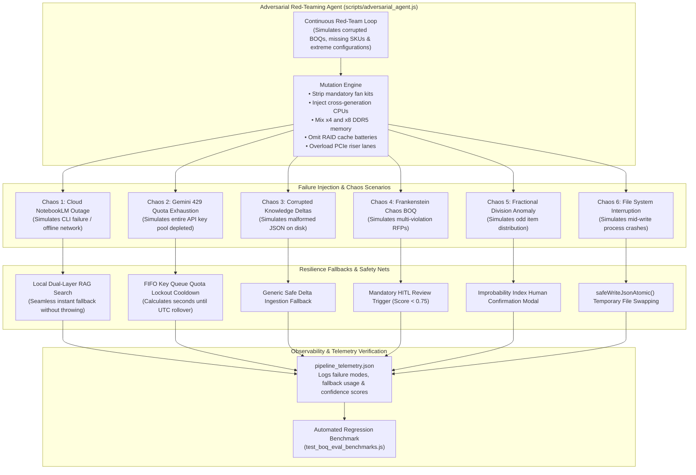

# Chaos Resilience & Adversarial Red-Teaming Architecture

This diagram illustrates the resilience safety nets and continuous background stress-testing architecture documented in `docs/WORKFLOWS_AND_LEARNINGS.md` (`scripts/adversarial_agent.js`, `tests/test_failure_modes_and_chaos.js`).

