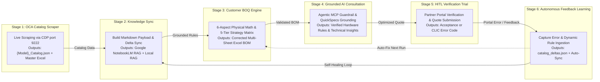

# Master Macro Continuous Lifecycle Orchestration Flow

This diagram illustrates the **6-Stage Continuous Learning Macro Lifecycle** spanning from portal scraping to feedback learning (`.agents/skills/orchestrator-workflow-skill/SKILL.md`).

