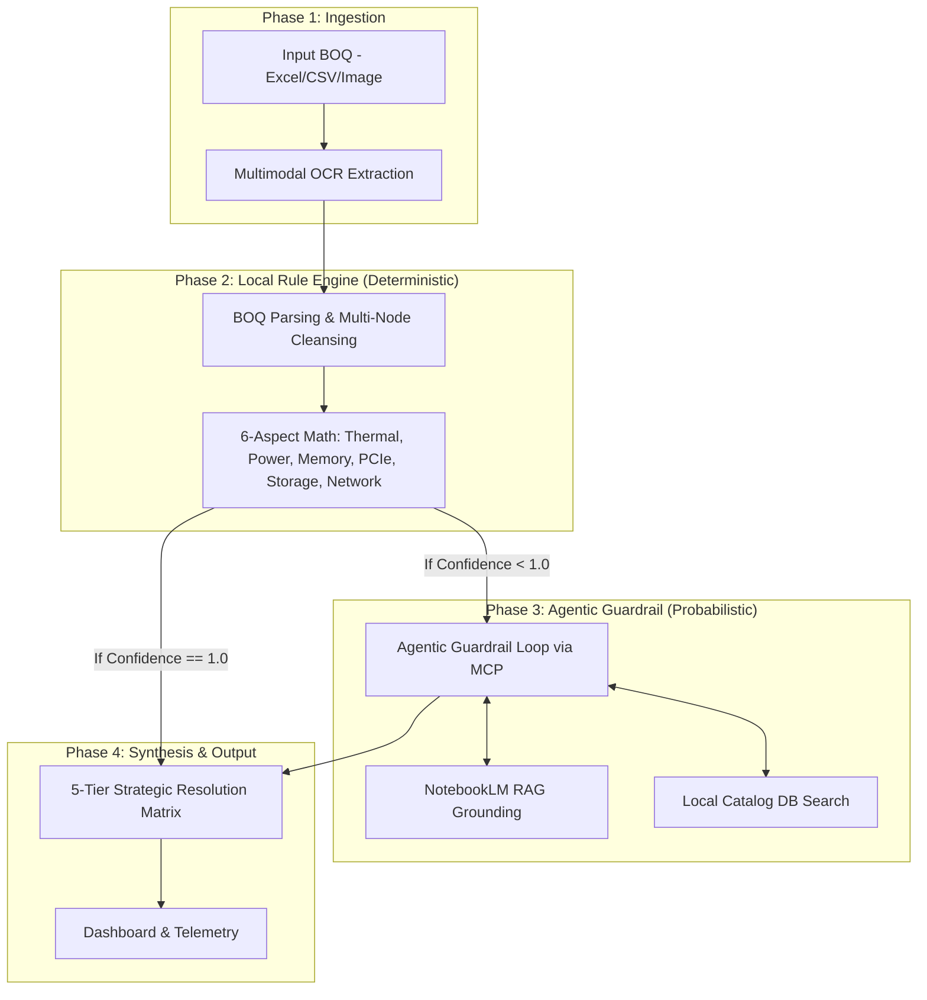

# Architecture & Design

## 1. Hybrid Dual-Brain Architecture
The application employs a **Hybrid Dual-Brain Architecture** designed for maximum resilience, auditability, and execution speed:

## 2. Core Architectural Decisions
- **Deterministic Rule Engine Primacy**: The local engine (e.g., `boq_evaluator.js`) executes fast, hardcoded physical hardware math without relying on external LLMs. This ensures a 100% functional fallback if APIs go offline.
- **Agentic MCP Guardrail**: Instead of brittle LLM single-pass prompting, the system uses a stateful Model Context Protocol (MCP) tool-calling loop (`agentic_guardrail.js`). The LLM actively hypothesizes fixes, calls the local rule engine via `simulate_build`, and checks NotebookLM before committing.
- **Loose Coupling via Barrel Exports**: All backend subsystems (BOQ Engine, RAG, Scraper, Feedback) are strictly decoupled and routed through a master barrel export (`scripts/lib/index.js`). This eliminates "God Nodes" and tight coupling, preventing brittle cross-dependencies.
- **Continuous Structural Auditing**: The system architecture is actively audited using the `graphify` skill to map semantic graphs, detect cohesion gaps, and optimize AI agent token usage by providing dense codebase graphs instead of forcing full-file reads.
- **Decoupled Data Architecture**: SKUs are strictly classified (e.g., base chassis vs. options). Atomic JSON writes (`safeWriteJsonAtomic`) ensure database files are never corrupted.
- **Configuration-Driven Scraping Profiles**: The scraping pipeline (`scrape_oca_solution.js`) relies on dynamically loaded JSON profiles (`scripts/config/profiles/`) to govern DOM thresholds, required tabs, and generation-specific component rules (e.g., DL380 Gen12 vs Alletra). This ensures zero hardcoding in the core orchestration script, making scaling to new product families highly maintainable.

## 3. Data Dictionary & Key Schemas
- **KnowledgeDelta**: Captures learned physical dependency rules. Used to train the local rule engine.
- **ConflictGraph**: Directed Acyclic Graph tracking SKU dependencies, mutually exclusive items, and capacity bounds.
- **ResolutionMatrix**: 5-Tier layout of hardware builds (Rank 1: Intent Preserving, Rank 5: Budget Minimized). Includes itemized price data.

## 4. UI/UX Design System
- **Real-Time Telemetry Dashboard**: Utilizes SSE (Server-Sent Events) to stream evaluation logs.
- **Anti-Slop Aesthetic (Taste Skill)**: The UI actively rejects generic "AI-generated" aesthetics by strictly adhering to the `design-taste-frontend` ruleset. It uses the **Geist** font family and an **Emerald Green (`#01A781`) / Slate** high-contrast palette.
- **Component Design**: Tailwind-based, strict `rounded-xl` (12px) radiuses, and tightly-controlled custom tinted drop-shadows (e.g., `TelemetryCard.jsx`, `ResolutionMatrix.jsx`) for maximum data-density.
