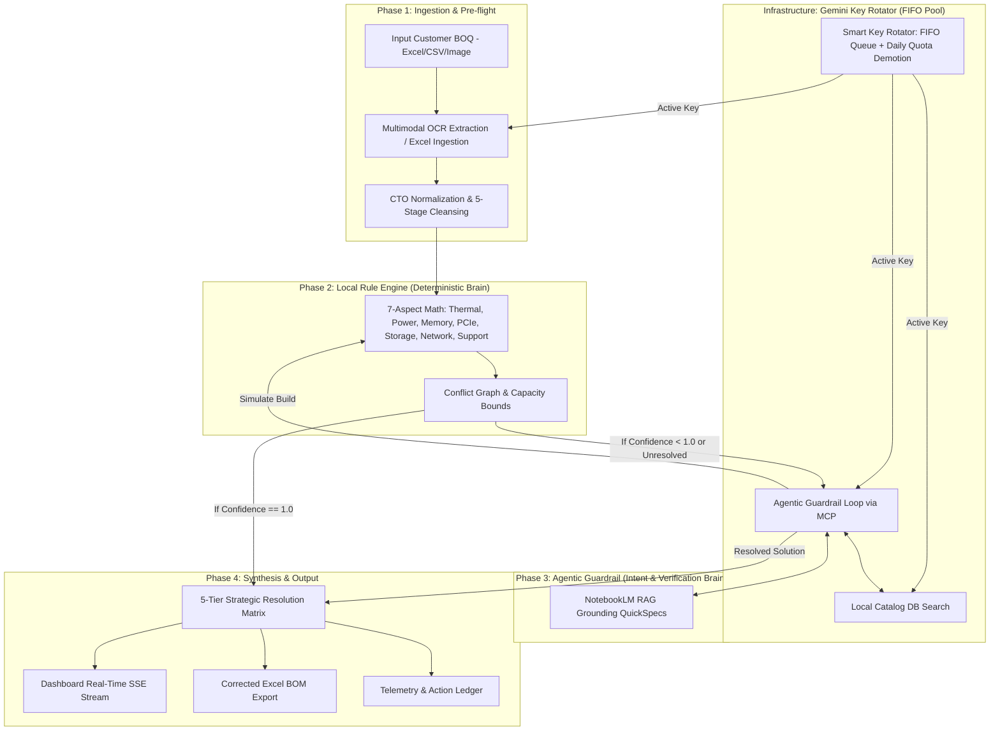
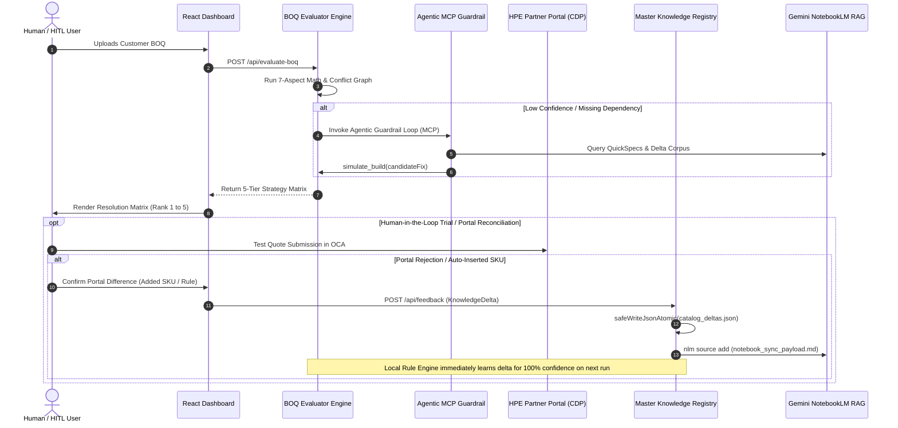
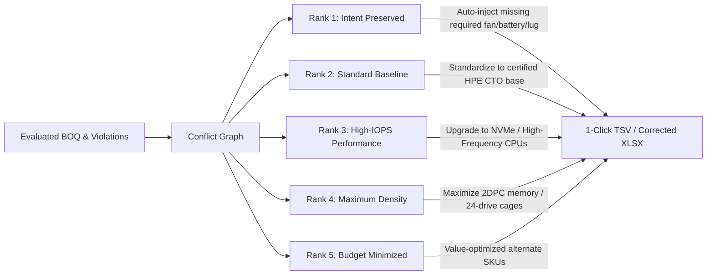
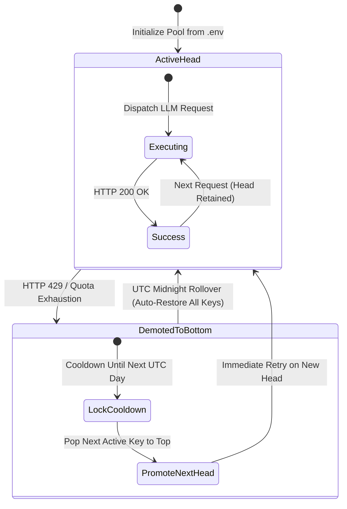
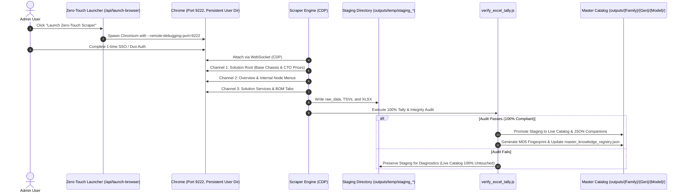
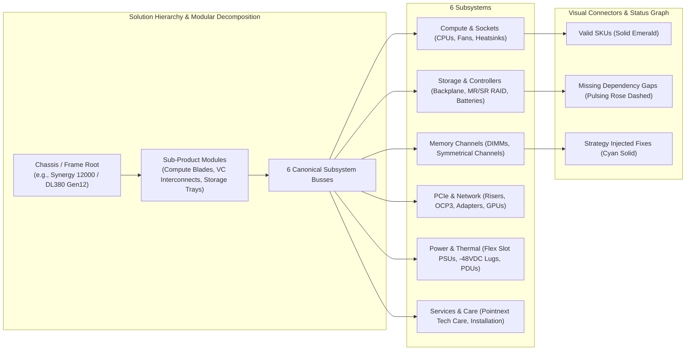
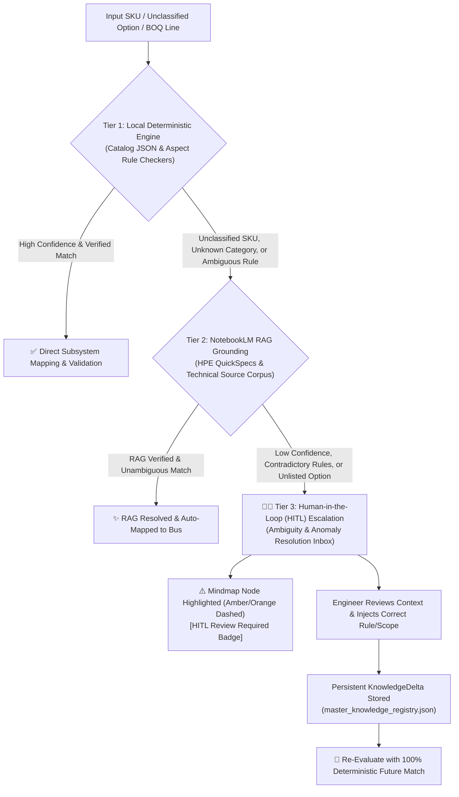

# Architecture & Design

## 1. Hybrid Dual-Brain Architecture
The application employs a **Hybrid Dual-Brain Architecture** designed for maximum resilience, auditability, and execution speed:

## 1.1 Closed-Loop Autonomous Feedback & Knowledge Learning Lifecycle
The system operates as a **closed-loop continuous learning engine**:

## 1.2 5-Tier Strategic Resolution Matrix Pipeline
The multi-tiered resolution engine synthesizes buildable options tailored to customer constraints:

## 1.3 Deterministic FIFO Gemini Key Rotator & Quota State Machine
Manages high-concurrency LLM requests across multi-key pools with zero downtime:

## 1.4 Zero-Touch CDP Scraping & Staging Isolation Lifecycle
Ensures live catalog scraping never overwrites master database without 100% verification:

## 2. Core Architectural Decisions
- **Deterministic Rule Engine Primacy**: The local engine (e.g., `boq_evaluator.js`) executes fast, hardcoded physical hardware math without relying on external LLMs. This ensures a 100% functional fallback if APIs go offline.
- **Smart Key Rotation & Quota Management (FIFO Queue)**: API traffic is governed by `gemini_rotator.js`. Instead of random key selection, it uses a deterministic FIFO queue. When a key encounters a 429 or daily quota exhaustion, it is marked exhausted and pushed to the bottom of the queue while the next active key immediately pops up to complete the call. Keys automatically restore to active status on UTC day rollover.
- **Agentic MCP Guardrail**: Instead of brittle LLM single-pass prompting, the system uses a stateful Model Context Protocol (MCP) tool-calling loop (`agentic_guardrail.js`). The LLM actively hypothesizes fixes, calls the local rule engine via `simulate_build`, and checks NotebookLM before committing.
- **Loose Coupling via Barrel Exports**: All backend subsystems (BOQ Engine, RAG, Scraper, Feedback) are strictly decoupled and routed through a master barrel export (`scripts/lib/index.js`). This eliminates "God Nodes" and tight coupling, preventing brittle cross-dependencies.
- **Continuous Structural Auditing (Dynamic Truth)**: While this document provides the *static* conceptual design, the system architecture is actively audited using the `graphify` skill. The resulting semantic graph (`graphify-out/GRAPH_REPORT.md`) is the *dynamic source of truth* for file dependencies and god nodes. Agents MUST query this graph rather than relying solely on static docs.
- **Decoupled Data Architecture**: SKUs are strictly classified (e.g., base chassis vs. options). Atomic JSON writes (`safeWriteJsonAtomic`) ensure database files are never corrupted.
- **Incremental SHA-256 Checksum Diffing & Fingerprinting**: `checksum_diff.js` computes deterministic SHA-256 hashes per SKU and per subcategory table payload. During live rescapes, unchanged SKUs skip LLM re-classification (saving ~150 tokens and ~200ms per SKU), while modified and discontinued SKUs are isolated and logged to `price_history.json` and `discontinued_skus.json`.
- **Commercial Option Suffix (BTO vs FIO) & Factory Rules**: The engine decouples physical feasibility from factory orderability. In Configure-to-Order (CTO) server chassis (e.g. `P73282-B21`), retail Build-to-Order (`-B21`) memory kits and options are flagged with direct SKU replacements to Factory Integrated Option (`-F21` / `FIO`) equivalents.
- **Cross-Chassis & Cross-Gen Boundary Guards**: The physical math engine detects form factor mismatches (e.g. 1U DL360 storage cables on 2U DL380 chassis) and bus generation mismatches (e.g. Gen11 PCIe risers on Gen12 servers) before sending quotes to vendor portals.
- **Configuration-Driven Scraping Profiles**: The scraping pipeline (`scripts/scrapers/scrape_oca_solution.js`) relies on dynamically loaded JSON profiles (`scripts/config/profiles/`) to govern DOM thresholds, required tabs, and generation-specific component rules (e.g., DL380 Gen12 vs Alletra). This ensures zero hardcoding in the core orchestration script, making scaling to new product families highly maintainable.

## 3. Data Dictionary & Key Schemas
- **KnowledgeDelta**: Captures learned physical dependency rules. Used to train the local rule engine.
- **ConflictGraph**: Directed Acyclic Graph tracking SKU dependencies, mutually exclusive items, and capacity bounds.
- **ResolutionMatrix**: 5-Tier layout of hardware builds (Rank 1: Intent Preserving, Rank 5: Budget Minimized). Includes itemized price data.
- **GeminiKeysState**: Dynamic queue state, quota health, success/failure counts, and cooldown timestamps for all configured API keys (`gemini_keys_state.json`).
- **MasterKnowledgeRegistry**: Central registry of all certified product families, SKU tallies, checksum hashes, and NotebookLM sync payload paths (`outputs/history/master_knowledge_registry.json`).

## 4. UI/UX Design System
- **Real-Time Telemetry Dashboard**: Utilizes SSE (Server-Sent Events) to stream evaluation logs.
- **Anti-Slop Aesthetic (Taste Skill)**: The UI actively rejects generic "AI-generated" aesthetics by strictly adhering to the `design-taste-frontend` ruleset. It uses the **Geist** font family and an **Emerald Green (`#01A781`) / Slate** high-contrast palette.
- **Component Design**: Tailwind-based, strict `rounded-xl` (12px) radiuses, and tightly-controlled custom tinted drop-shadows (e.g., `TelemetryCard.jsx`, `ResolutionMatrix.jsx`) for maximum data-density.

## 5. Subsystem Architecture & Master Barrel API
The engine is structured into 5 decoupled domain namespaces exported via [`scripts/lib/index.js`](file:///home/vinodh/vendorNotebookSolution/scripts/lib/index.js):

| Subsystem | Modules | Core Responsibilities |
|---|---|---|
| **`system`** | `telemetry`, `fsCompat`, `progress`, `logger`, `profileLoader`, `geminiRotator` | Atomic I/O with rollback (`safeWriteJsonAtomic`), progress streaming, structured logging, profile loading, FIFO Gemini API key rotation & daily quota management |
| **`boq`** | `evaluator`, `preprocessor`, `parser`, `conflictGraph`, `budgetOptimizer`, `vendorBomVerifier`, `xlsxExporter` | 7-aspect physical math, N-way configuration diffing, shared SKU line parsing (`boq_parser.js`), 5-tier strategy matrix |
| **`catalog`** | `rules`, `discovery`, `formatter`, `diff`, `productMeta`, `sku`, `registry`, `validator`, `checksumDiff`, `skuVersioning`, `syncRegistry` | 5-level catalog rules, auto-chassis detection, schema validation (`data_validator.js`), SKU regex, price diff audit |
| **`rag`** | `ocrService`, `knowledgeSync`, `notebookQuery`, `localSearch`, `postFlowSync`, `geminiRotator` | Multimodal Gemini Vision OCR (with 25MB limits), bi-directional NotebookLM sync, dual-layer local fallback search, smart LLM synthesis |
| **`scraper` & `feedback`** | `cdp`, `domExtract`, `navigateOca`, `loop`, `queue` | Hands-free CDP automation, zero-touch browser runner, closed-loop `KnowledgeDelta` learning |

## 6. Visual BOQ Configuration Topology & Mindmap Engine
The frontend incorporates a decoupled, high-density SVG visualizer located in [`dashboard/src/components/topology/`](file:///home/vinodh/vendorNotebookSolution/dashboard/src/components/topology/) driven by the [`topologyGraphBuilder.js`](file:///home/vinodh/vendorNotebookSolution/dashboard/src/services/topologyGraphBuilder.js) pure service.

- **Product Family Flexibility**: Dynamically renders standard rack servers (ProLiant), composable modular infrastructure (Synergy Frame $\rightarrow$ Compute & VC Modules), controller pairs & expansion enclosures (Alletra), and tape library drawers (StoreEver).
- **Interactive Multi-Level Canvas**: Supports drag-panning, wheel-zooming, reset-view, and subsystem filtering (`Compute`, `Memory`, `Storage`, `PCIe`, `Power`, `Services`, `Only Gaps & Fixes`, `⚠️ Ambiguities`).
- **Telemetry & Self-Healing**: Real-time diagnostic bar tracking render latency, subsystem nodes, mapped SKUs, completeness scores, and product family identification.

## 7. 3-Tier Classification, Contradiction Handling & HITL Learning Protocol

To guarantee zero hallucinations and prevent ungrounded guesswork, the architecture enforces a strict **3-Tier Escalation Protocol** for any SKU, category, or physical relationship:

1. **Tier 1 (Deterministic Local Rule Engine)**: Checks the local catalog (`catalog.json`, `chassis_map.json`, `aspects/`). If the SKU is cataloged and satisfies physical rules (memory symmetry, TDP fans, storage batteries), it is mapped with solid Emerald status.
2. **Tier 2 (NotebookLM RAG Grounding)**: If an SKU is unclassified, an option is ambiguous, or a companion relationship is unknown, the system automatically queries NotebookLM MCP against grounded HPE QuickSpecs. If NotebookLM clarifies the rule with high confidence, the system maps the node.
3. **Tier 3 (Human-in-the-Loop Escalation)**: If NotebookLM cannot clarify, if confidence is low ($<0.85$), or if contradictory technical statements are found:
   - The SKU is flagged as **`NEEDS_HUMAN_CLARIFICATION`**.
   - In the **Visual Topology Mindmap**, it renders with a pulsing Amber/Orange dashed border and `[HITL]` badge.
   - In the **Ambiguity Inbox**, the user is shown the exact contradiction or anomaly and can assign the category, affected SKU, and companion dependency.
   - Upon submission, the engine writes an atomic **`KnowledgeDelta`** to `master_knowledge_registry.json`, permanently teaching the local rule engine so it never needs to ask again.

