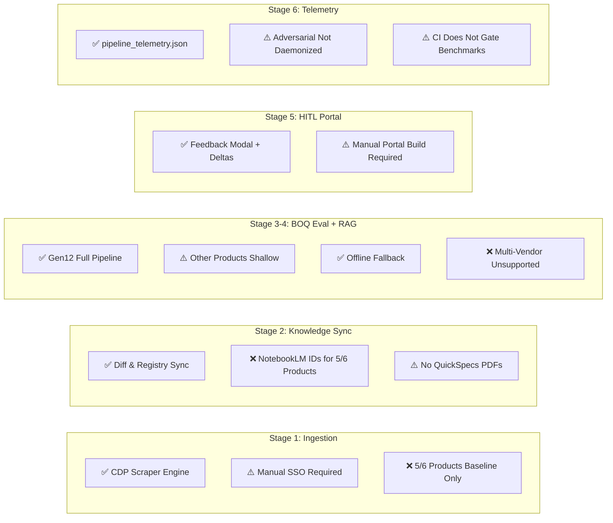
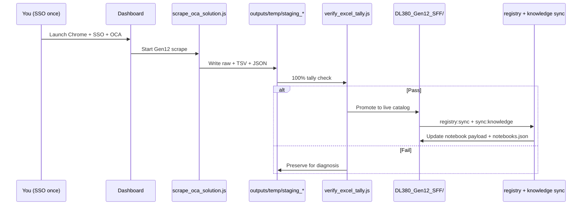
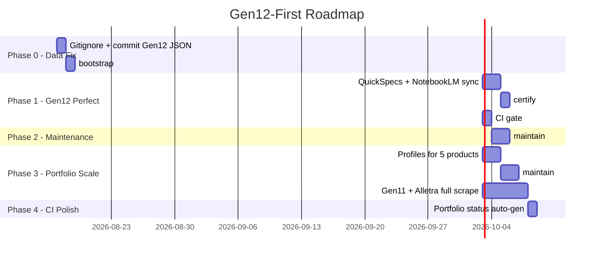

# Gap Analysis: HPE ProLiant AI Studio BOQ Evaluator

This analysis compares your **documented vision** (6-stage continuous learning loop, Dual-Brain architecture, multi-vendor BOM engine) against **what is implemented and verified today** in this workspace.

---

## Executive Summary

You have a **strong, production-grade core** centered on **DL380 Gen12**: deterministic 6-aspect math, 5-tier resolution matrix, agentic guardrail, dashboard, feedback loop, and portfolio audits all pass at **100%**. The solution is architecturally mature and well-documented.

The largest gaps are **breadth** (most product lines are baseline stubs), **multi-vendor claims vs HPE-only reality**, **operational automation** (manual SSO, no deployment packaging), and **CI/test coverage** (critical paths like Playwright E2E and benchmarks are not gated in CI).

| Area | Maturity | Gap Severity |
|------|----------|--------------|
| DL380 Gen12 BOQ evaluation | Production-ready | Low |
| Dual-Brain / offline fallback | Strong | Low |
| Portfolio catalog depth | 1 deep + 5 baseline | **High** |
| NotebookLM RAG coverage | Gen12 only | **High** |
| Multi-vendor (Cisco/Dell) | Aspirational | **High** |
| Scraping automation | Hybrid manual SSO | Medium |
| CI/CD & test gating | Partial | Medium |
| Production deployment | Not packaged | Medium |
| Documentation accuracy | Mostly aligned, some drift | Low |

---

## What Is Solid (No Major Gaps)

### 1. Core BOQ Engine (DL380 Gen12)
- **6-aspect physical math**, conflict graph, and **5-tier strategy matrix** are implemented and certified.
- Benchmarks: **5/5 scenarios, 100% recall/precision** (`scripts/test_boq_eval_benchmarks.js`).
- Aspect suite: **34/34 assertions** pass.
- Portfolio audit: **6/6 product lines pass** (`npm test` → `verify_all.js`).
- **52 KnowledgeDeltas** logged from portal feedback — closed-loop learning is real, not theoretical.

### 2. Dual-Brain Resilience
- Local rule engine runs without Gemini keys (documented and tested via `tests/test_offline_pipeline.js`).
- FIFO Gemini key rotator with quota demotion is implemented and has a dedicated test suite.
- Agentic MCP guardrail (`agentic_guardrail.js`) + MCP server exist for LLM-assisted resolution.

### 3. Dashboard & UX
- **34 React components**, Express backend with **46 API routes**, SSE telemetry streaming.
- E2E UI test exists (`tests/e2e_headless_ui_test.js`) — docs claim 7/7 pass when run locally.
- Real customer BOQ E2E flow (`tests/e2e_customer_boq_flow.js`) covers 13 steps end-to-end.

### 4. Architecture & Agent Ops
- Semantic graph is **fresh** (built from current commit `04437534`).
- Skills, data dictionary, and consolidated docs are unusually thorough for a project this size.
- Atomic JSON writes, staging isolation for scrapes, checksum diffing — enterprise-grade data hygiene.

---

## Critical Gaps (Priority 1)

### G1. Catalog Depth Is Heavily Skewed to One Product

| Product | SKUs on Disk | Scrape Depth |
|---------|-------------|--------------|
| DL380 Gen12 SFF | **277** | Full OCA scrape |
| DL380 Gen11 | 4 | Baseline only |
| Alletra Storage | 3 | Baseline only |
| Synergy F32 Module | 3 | Baseline only |
| Cray GX5000 | 2 | Baseline only |
| MSL3040 Tape | 2 | Baseline only |

**Impact:** BOQ evaluation, strategy matrix, and rule coverage are **deeply validated for Gen12** but **cannot reliably evaluate** complex quotes for Alletra, Synergy, Cray, or Gen11 beyond chassis detection and minimal rules.

**Recommendation:** Prioritize full rescrapes for Gen11 and Alletra (highest sales volume after Gen12), with dedicated scraping profiles (today only `proliant_gen12.json` + `default_profile.json` exist).

---

### G2. NotebookLM RAG Is Gen12-Only in Practice

From `scripts/config/notebooks.json`:

- **DL380 Gen12 SFF** — has `notebookId` configured
- **All other 5 products** — `notebookId: ""`, `lastSyncedAt: null`

**Impact:** Stage 4 (Grounded NotebookLM validation) and Stage 2 (knowledge sync) only work end-to-end for Gen12. Other product lines fall back to local rule engine + `local_rag_search.js` without live QuickSpecs grounding.

**Recommendation:** Provision NotebookLM notebooks per chassis, run `npm run sync:knowledge` for each, and wire IDs into `notebooks.json`.

---

### G3. "Multi-Vendor" Is Marketing, Not Implementation

The UI header says **"Multi-Vendor Hardware BOM Engine"** and the BOQ eval skill mentions **HPE, Cisco, Dell**. In code:

- All catalogs, rules, SKU regex, and scrapers are **HPE OCA-specific**
- OCR prompt mentions Cisco/Dell, but there are **no Cisco/Dell catalog JSONs, rules, or evaluation paths**
- `isValidHpeSKU()` is the canonical SKU gate everywhere

**Impact:** Evaluating a Dell or Cisco quote will fail or produce misleading results.

**Recommendation:** Either narrow positioning to **"HPE OCA Intelligence Platform"** or define a vendor abstraction layer (catalog adapter, SKU normalizer, per-vendor rule packs) as a Phase 2 initiative.

---

### G4. Catalog Artifacts Are Not in Git — Fresh Clone Is Empty

`.gitignore` excludes all `outputs/**/*.json`, `.xlsx`, `.tsv`, `.pdf` except a few registry files.

**Impact:** A new developer or CI runner gets **no catalog data** unless they scrape or receive artifacts out-of-band. Tests that depend on `outputs/` pass locally for you but would fail on a clean clone without a data bootstrap step.

**Recommendation:** Add a `npm run bootstrap:data` that downloads certified catalog snapshots from object storage, or commit a minimal fixture set for CI while keeping live scrapes gitignored.

---

## Significant Gaps (Priority 2)

### G5. QuickSpecs PDFs Missing for Entire Portfolio

Observability reports **⚠️ Advisory (No PDF)** for all 6 products. AGENTS.md claims several are "✅ Verified" — documentation drift.

**Impact:** PDF-based grounding, fingerprint MD5 cache, and offline QuickSpecs reference in RAG are unavailable.

---

### G6. Scraping Requires Manual Human SSO (By Design, But Limits Scale)

The Hybrid Zero-Touch workflow is correctly documented — Chrome on port 9222, manual partner.hpe.com login, then scrape. CDP is currently **inactive** on this machine.

**Impact:** No unattended scheduled rescrapes; price drift detection depends on human triggering scrapes.

**Recommendation:** Document a runbook for scheduled "scrape windows" and consider a dedicated SSO session VM with persistent Chrome profile.

---

### G7. Adversarial Red-Teaming Is Not Continuous

Docs describe a **background adversarial agent** that "continually stress-tests" the evaluator. Reality:

- `scripts/adversarial_agent.js` runs **once and exits**
- README references **`run_background_adversary.js`** which **does not exist**
- DEVELOPER_GUIDE correctly says `node scripts/adversarial_agent.js` for a single pass

**Impact:** Catch rate/precision metrics in telemetry are only updated when manually invoked.

**Recommendation:** Add `npm run adversary:daemon` with interval scheduling, or wire into `feedback_listener.js` / a cron job.

---

### G8. CI Pipeline Covers ~60% of Test Surface

**In CI today** (`.github/workflows/ci.yml`):
- Lint, offline pipeline, aspects, conflict graph, E2E scenarios, vendor BOM verifier

**Not in CI:**
- BOQ benchmarks (`test_boq_eval_benchmarks.js`)
- Gemini rotator (unit + live key tests)
- Playwright E2E UI tests
- NotebookLM MCP tests
- Adversarial agent
- Portfolio audit (`verify_all.js` — what `npm test` runs)

**Impact:** Regressions in benchmarks, UI, or rotator logic can merge undetected.

---

### G9. Dashboard Unit Test Coverage Is Thin

- **34 components**, **5 test files** (~15% component coverage)
- Untested: `AmbiguityInbox`, `NotebookRagDrawer`, `MacroOrchestratorFlow`, `PartnerReconciliationView`, `ScraperTriggerCard`, and others

---

## Moderate Gaps (Priority 3)

### G10. No Production Deployment Packaging
- No Dockerfile, docker-compose, or k8s manifests
- No reverse-proxy / TLS configuration
- No process manager (PM2/systemd) scripts
- Dashboard runs as dev server (`concurrently` with Vite) — not a production build story

### G11. API Security
- **46 unauthenticated Express routes** including scrape launch, knowledge sync, BOQ evaluation, feedback submission
- Acceptable for local dev; **not production-safe** without auth middleware, CORS lockdown, and rate limiting

### G12. Scraping Profile Coverage
Only 2 profiles exist. Alletra, Synergy, Cray, StoreEver, and Gen11 rely on `default_profile.json` fallbacks — risk of false-positive validation failures or incomplete DOM extraction (the exact problem profiles were created to solve for Gen12).

### G13. Documentation Drift
- Orchestrator skill contains **stale macOS absolute paths** (`file:///Users/macbookaira1466/...`)
- README adversarial command is wrong
- AGENTS.md QuickSpecs status contradicts observability output

### G14. Scale & Architecture Limits
- Single-node: Chrome CDP on localhost, in-memory catalog JSON loading
- No queue/worker model for parallel multi-chassis evaluation at scale
- `eval:multi` exists but horizontal scaling path is undefined

---

## Gap Map by 6-Stage Lifecycle



---

## Recommended Roadmap (Ordered)

| Phase | Focus | Effort | Outcome |
|-------|-------|--------|---------|
| **Phase 1** | Full scrape Gen11 + Alletra; add scraping profiles | 2–3 weeks | 3 production-depth catalogs |
| **Phase 2** | NotebookLM notebook provisioning + sync for all 6 chassis | 1 week | RAG works portfolio-wide |
| **Phase 3** | CI hardening: add benchmarks, `verify_all`, Playwright E2E | 3–5 days | Merge-safe quality gate |
| **Phase 4** | Data bootstrap script for clean clones | 2 days | Onboarding + CI reliability |
| **Phase 5** | Fix doc drift; rename multi-vendor UI copy or build adapter | 1 day | Accurate positioning |
| **Phase 6** | Docker + auth middleware for API | 1–2 weeks | Deployable beyond localhost |
| **Phase 7** | Adversarial daemon + scheduled rescrape cron | 3 days | Continuous learning loop as documented |

---

## Bottom Line

You have built a **genuine, working Dual-Brain BOQ evaluator** — not a prototype. The Gen12 path (ingest → 6-aspect math → conflict graph → 5-tier matrix → Excel export → HITL feedback → KnowledgeDelta learning) is **end-to-end real** and **100% certified** on your machine.

The gap is not "does the core work?" — it does. The gap is **portfolio breadth, RAG coverage, multi-vendor claims, operational automation, and production packaging**. Closing G1 (catalog depth) and G2 (NotebookLM per chassis) would move this from a **best-in-class Gen12 tool** to a **true multi-product HPE platform**.

If you want to go deeper on any slice — e.g. a phased plan just for Alletra, a CI hardening PR, or reframing the multi-vendor story — say which area to tackle first.


# Implementation Plan: Gen12 First, Then Scrape-to-Auto-Work

This plan matches your intent: **no security work**, **perfect DL380 Gen12 end-to-end**, then **repeatable scrape + maintain** so every other product line plugs in without engine changes.

---

## Guiding Principles

1. **Gen12 is the golden reference** — everything else copies its artifact layout, verify gates, and sync hooks.
2. **Catalog data must survive git clone** — the current `.gitignore` blanket on `outputs/**` is the root cause of “works on my machine, broken on fresh clone.”
3. **Engine stays frozen; data grows** — after Gen12 is certified, new products are mostly scrape → verify → promote → registry sync → notebook sync.
4. **One command per maintenance action** — no manual file copying or remembering 6 npm scripts.

---

## Phase 0 — Fix the Data Preservation Gap (1–2 days)

**Problem:** `.gitignore` excludes all catalog JSON, XLSX, TSV, PDF, and MD under `outputs/`, so certified Gen12 artifacts are never versioned.

**Solution:** Split outputs into **certified (tracked)** vs **ephemeral (ignored)**.

### 0.1 Restructure `.gitignore`

```
outputs/temp/              ← still ignored (staging scrapes)
outputs/**/intermittent_scraps/  ← ignored
outputs/**/raw_data/       ← ignored (large DOM dumps)

# CERTIFIED — track these explicitly
!outputs/ProLiant/Gen12/DL380_Gen12_SFF/*_Catalog.json
!outputs/ProLiant/Gen12/DL380_Gen12_SFF/*_Catalog_Rules.json
!outputs/ProLiant/Gen12/DL380_Gen12_SFF/*_Services.json
!outputs/ProLiant/Gen12/DL380_Gen12_SFF/notebook_sync_payload_*.md
!outputs/ProLiant/Gen12/DL380_Gen12_SFF/history/catalog_*.json
!outputs/ProLiant/Gen12/DL380_Gen12_SFF/history/price_history.json
!outputs/ProLiant/Gen12/DL380_Gen12_SFF/history/discontinued_skus.json
!outputs/ProLiant/Gen12/DL380_Gen12_SFF/history/attribute_history.json
!outputs/ProLiant/Gen12/DL380_Gen12_SFF/history/catalog_deltas.json

# XLSX optional: regenerate via npm run generate — OR use Git LFS if you want it tracked
outputs/**/*.xlsx          ← keep ignored; regenerate from JSON
```

**Why:** JSON + rules + history deltas are the **source of truth** (~300 KB). XLSX is 2.2 MB and reproducible via `generate_xlsx.js`.

### 0.2 Add `npm run bootstrap:gen12`

New script that on fresh clone:

1. Verifies certified JSON exists (or fails with clear message)
2. Regenerates XLSX from JSON if missing
3. Runs `verify_excel_tally.js` on Gen12
4. Runs `npm run test:benchmarks` (Gen12 fixtures)
5. Prints pass/fail summary

**Acceptance:** Fresh `git clone && npm install && npm run bootstrap:gen12` → all Gen12 checks green without scraping.

### 0.3 Add certified manifest file

Create `outputs/ProLiant/Gen12/DL380_Gen12_SFF/CERTIFIED.json`:

```json
{
  "chassis": "DL380_Gen12_SFF",
  "certifiedAt": "2026-08-16",
  "totalUniqueSKUs": 277,
  "benchmarkPassRate": "5/5",
  "aspectTestsPassRate": "34/34",
  "portfolioAuditPass": true
}
```

Small file, always tracked — gives agents and CI a single “is Gen12 golden?” check.

---

## Phase 1 — Gen12 Perfection Checklist (3–5 days)

Goal: Gen12 is **complete, synced, documented, and CI-gated** — not just “277 SKUs on disk.”

### 1.1 Close Gen12 artifact gaps

| Item | Current State | Action |
|------|---------------|--------|
| QuickSpecs PDF | Missing (advisory) | Run `npm run download:qs -- DL380_Gen12_SFF`; add PDF to certified exceptions or document as optional |
| NotebookLM sync | `lastSyncedAt: null` in `notebooks.json` | Run full sync; persist `lastSyncedAt` + delta count after success |
| Notebook ID | Configured | Verify RAG query from dashboard AmbiguityInbox works end-to-end |
| Services JSON | Present (356 KB) | Include in certified gitignore exceptions |
| 52 KnowledgeDeltas | On disk | Commit `catalog_deltas.json` under Gen12 history |

### 1.2 Gen12 test gate (single command)

Add `npm run certify:gen12` that runs in order:

```
verify_excel_tally.js  (Gen12 path)
test_all_aspects.js
test_boq_eval_benchmarks.js
test_conflict_graph.js
test_end_to_end_scenarios.js  (Gen12 scenarios only)
e2e_customer_boq_flow.js      (if fixture file present)
verify_all.js                 (portfolio — Gen12 section must pass)
```

**Acceptance:** One command, zero failures, report written to `outputs/history/gen12_certification_report.json`.

### 1.3 Fix documentation drift (same PR as Phase 0)

| File | Fix |
|------|-----|
| `README.md` | Replace `run_background_adversary.js` → `adversarial_agent.js` |
| `.agents/AGENTS.md` | QuickSpecs column: derive from `observability_status.js --json`, not hand-edited |
| `.agents/skills/orchestrator-workflow-skill/SKILL.md` | Replace macOS `file:///Users/macbookaira1466/...` paths with repo-relative paths |
| UI copy in `Header.jsx` | Change “Multi-Vendor” → “HPE OCA BOM Engine” (accurate until Cisco/Dell exist) |

### 1.4 CI: gate Gen12 certification

Extend `.github/workflows/ci.yml`:

```yaml
- run: npm run bootstrap:gen12
- run: npm run certify:gen12
- run: npm run test:benchmarks
```

No Playwright in CI yet (needs browser + possibly Gemini keys) — add later as optional job.

**Acceptance:** PR cannot merge if Gen12 certification fails.

---

## Phase 2 — Gen12 Maintenance Automation (2–3 days)

Goal: When prices/SKUs change on HPE portal, **one workflow** refreshes everything.

### 2.1 Define the Gen12 maintenance pipeline



### 2.2 Add `npm run maintain:gen12`

Wraps:

1. Pre-flight CDP health check (`probe:cdp`)
2. Scrape with Gen12 profile (`proliant_gen12.json`)
3. Audit + promote (existing staging logic)
4. `registry:sync`
5. `sync:knowledge` for Gen12 notebook
6. `certify:gen12` (post-scrape verification)
7. Auto-update `CERTIFIED.json` timestamps

**Acceptance:** After a successful rescrape, certification re-runs automatically; you only intervene on audit failure.

### 2.3 Adversarial quality loop (optional, low effort)

Add `npm run adversary:loop` — runs `adversarial_agent.js` every N hours, appends to `pipeline_telemetry.json`.

Not security-related; purely catches evaluator regressions after catalog updates.

---

## Phase 3 — “Scrape Once, System Auto-Works” Template (3–4 days)

Goal: Replicate Gen12 pattern for Gen11, Alletra, Synergy, Cray, MSL **without engine changes**.

### 3.1 Per-product checklist (copy from Gen12)

For each new chassis, these artifacts must exist after scrape + promote:

| Artifact | Purpose |
|----------|---------|
| `{Chassis}_Catalog.json` | Rule engine + dashboard |
| `{Chassis}_Catalog_Rules.json` | Fast dual safety net |
| `{Chassis}_Services.json` | Pointnext / Tech Care |
| `{Chassis}_OCA_Catalog.xlsx` | Human review (regenerated) |
| `notebook_sync_payload_{Chassis}.md` | NotebookLM RAG |
| `history/catalog_*.json` | Diff / price trails |
| `history/catalog_deltas.json` | Learned rules |
| Entry in `SCRAPED_CATALOGS.md` | Portfolio registry |
| Entry in `notebooks.json` | RAG routing |
| Scraping profile in `scripts/config/profiles/` | DOM thresholds |

### 3.2 Create profile templates

| Product | Profile to Create | Base From |
|---------|-------------------|-----------|
| DL380 Gen11 | `proliant_gen11.json` | `proliant_gen12.json` |
| Alletra | `alletra_storage.json` | `default_profile.json` |
| Synergy | `synergy_module.json` | `default_profile.json` |
| Cray GX5000 | `cray_rack.json` | `default_profile.json` |
| MSL3040 | `storeever_tape.json` | `default_profile.json` |

Each profile only needs scroll thresholds, tab names, and category keyword maps — not engine code.

### 3.3 Add `npm run maintain:portfolio`

Generic version of `maintain:gen12`:

```
--chassis <id>   → scrape + verify + promote + sync for one product
--all-baseline   → rescrape all 5 shallow products sequentially
--certify-only   → run verify_all without scraping
```

After any successful scrape, `catalog_discovery.js` and `listAllCatalogs()` already pick up new data — **no dashboard code changes needed**.

### 3.4 NotebookLM provisioning runbook

For each new chassis (after first full scrape):

1. Create NotebookLM notebook (manual, one-time)
2. Add `notebookId` to `scripts/config/notebooks.json`
3. Run `npm run sync:knowledge -- --chassis <id>`
4. Confirm `lastSyncedAt` populated

Gen12 notebook already exists — do this for Gen11 and Alletra next (highest value).

### 3.5 Progressive gitignore exceptions

As each product reaches “full scrape” depth (like Gen12’s 277 SKUs), add its JSON + rules + history to the certified exceptions list in `.gitignore` — same pattern as Phase 0.

Baseline products (2–4 SKUs) stay gitignored until promoted to full scrape.

---

## Phase 4 — CI & Observability Hardening (1–2 days)

Skipped: security, Docker, auth.

### 4.1 Expand CI (offline-safe only)

| Test | Add to CI? | Notes |
|------|-----------|-------|
| `bootstrap:gen12` | Yes | Needs committed Gen12 JSON |
| `certify:gen12` | Yes | Core gate |
| `test:benchmarks` | Yes | Already offline |
| `verify_all.js` | Yes | Uses on-disk catalogs |
| `test:rotator` | Yes | Mock keys only, no live API |
| Playwright E2E | Optional job | `continue-on-error: true` without keys |
| NotebookLM MCP | Manual only | Requires `nlm` + auth |

### 4.2 Auto-generate portfolio status

Add script `scripts/generate_portfolio_status.js` that:

- Runs `observability_status.js --json`
- Writes `.agents/PORTFOLIO_STATUS.md` (or updates AGENTS.md table section)

**Acceptance:** Portfolio table in docs never drifts from disk reality again.

---

## Phase 5 — Explicitly Out of Scope (Per Your Direction)

| Gap from prior analysis | Status |
|-------------------------|--------|
| API authentication | Ignored |
| Docker / k8s deployment | Ignored |
| Multi-vendor Cisco/Dell | Deferred indefinitely |
| Fully automated HPE SSO | Impossible; keep manual SSO step |
| Horizontal scaling | Not needed for single-user |

---

## Execution Order & Timeline



**Total estimate:** ~2–3 weeks calendar time, mostly scrape sessions waiting on your SSO availability.

---

## Definition of Done

### Gen12 Done (Phase 0 + 1 + 2)
- [ ] Gen12 JSON, rules, services, deltas, and sync payload are **in git**
- [ ] Fresh clone → `npm run bootstrap:gen12` → **100% pass**
- [ ] `npm run certify:gen12` → **100% pass**
- [ ] NotebookLM `lastSyncedAt` populated for Gen12
- [ ] CI runs bootstrap + certify on every PR
- [ ] `npm run maintain:gen12` documented as the only rescrape entry point
- [ ] Doc drift fixed (README, AGENTS, orchestrator skill, UI copy)

### Portfolio Done (Phase 3)
- [ ] Each product has a scraping profile
- [ ] Gen11 and Alletra at full scrape depth (not 2–4 SKU baseline)
- [ ] Each full-scrape product has NotebookLM notebookId + synced payload
- [ ] `npm run maintain:portfolio -- --chassis X` works for any certified product
- [ ] New scrape auto-appears in dashboard catalog explorer without code changes

---

## Suggested First PR (Smallest High-Impact Slice)

If you want to start immediately, PR #1 should contain only:

1. `.gitignore` certified exceptions for Gen12
2. Commit Gen12 `*_Catalog.json`, `*_Catalog_Rules.json`, `*_Services.json`, history deltas
3. `scripts/bootstrap_gen12.js` + `npm run bootstrap:gen12`
4. README adversarial command fix
5. `Header.jsx` copy fix (“HPE OCA BOM Engine”)

That alone fixes the biggest operational gap: **catalog data surviving clone and CI**.

---


Can we implement and fix the gaps
