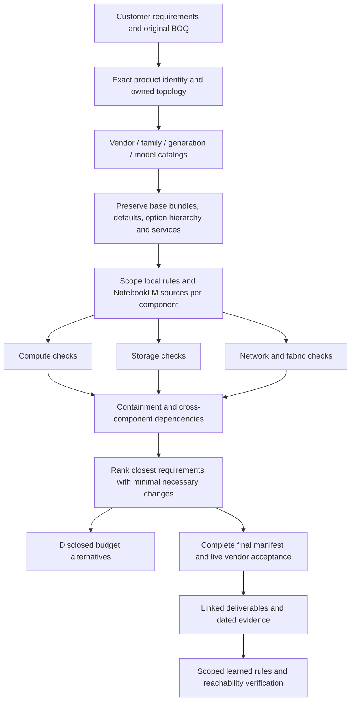

# Server, storage and networking validation architecture

## Contract

A product family locates evidence; a component's role determines its checks. A solution can contain all three domains. Synergy is a composable family, not a synonym for either server or networking. A scraped catalog establishes available options and observed defaults; it does not certify a solution.

## Required scope and evidence

| Layer | Preserve / verify | Never infer |
|---|---|---|
| Vendor and product | Exact base SKU, generation, catalog, official source, current ordering evidence | Brand or a speed such as 100Gb proves a particular product |
| Solution / icon | Requested capabilities, quantity basis, owner, per-icon SLA | All icons share one support tier |
| Enclosure / parent | Frame identity, bays, supported modules, installed or existing infrastructure | Every compute blade includes its frame or every frame needs server risers |
| Compute | CPU, memory, thermal, local storage and supported adapter constraints | Network switches require CPU/DIMM/diskless server kits |
| Storage appliance | Controller topology, enclosure/media limits, host ports, capacity/licenses and redundancy | Every storage device follows one generic two-controller rule |
| Networking / fabric | Physical and licensed ports, protocol, speed, lane/breakout compatibility, optics, reach, airflow and power | An upgrade license and bundled optics need a second optics charge |
| Relationships | Compute adapter to fabric/bay mapping, both link endpoints, redundancy, shared power/cooling and management requirements | Locally valid components prove an end-to-end valid assembly |
| Service | Product-specific parent/suffix, term, tier, retention and owner | A generic parent price of zero proves its child is free |

Explicit requested support wins in the closest rank. The owner's default is **3-year Tech Care Basic only when unspecified or explicitly authorized**. Compare qualified fixed and flexible offers; when retention is unspecified, disclose DMR/CDMR/GDMR and choose the cheapest suitable evidenced option. Do not call an option globally cheapest without pricing its qualified alternatives. Installation remains separate. Both OCA apply-to-all controls stay off unless bulk assignment is requested.

## Runtime boundaries implemented

- `scripts/lib/boq/solution_topology.js` classifies base-product roles **before** configuration quantity normalization. It exposes nodes, roles, ownership and required relationship checks.
- `evaluatePhysicalMath` retains the server evaluator for compute and the evidence-backed SAN evaluator for the single supported SAN scope. It does not send other domains or a mixed assembly through server default injection.
- Non-server products without a complete product evaluator, mixed assemblies, repeated unowned appliances and unknown products return `NOT_EVALUATED` checks with `VALIDATION_PROFILE_REQUIRED`, retain the requested items and produce no invented corrected rank. These are engineering/evidence gaps, not proof of incompatibility.
- A standalone Synergy compute evaluation is explicitly incomplete for enclosure/fabric relationships. Its compute diagnostics can be useful, but cannot certify the whole solution.
- Synergy F32 uses the networking knowledge pillar; Synergy 480 uses server. An unidentified Synergy family is composite. Generic `100Gb`, `HPE` and generation text do not silently identify a Synergy fabric or ProLiant server.
- Catalog generation records its pillar and catalog-only scope. Extraction categories and product role classification remain separate from buildability checks.
- Reports and JSON expose the selected topology and unresolved relationships. Do not hide these with a confidence percentage or a successful notebook upload.

## Onboarding another vendor/product or a full Synergy solution

1. Use its vendor connector/navigator; the HPE OCA connector is not a universal vendor browser adapter. Recover expired OCA sessions from Partner Portal and One Config Advanced.
2. Scrape each exact owned product's complete categories, subcategories, defaults, bundle composition, mandatory/optional children, selection limits, services and lifecycle/prices. Preserve source evidence and hierarchy; do not flatten a frame and its modules into repeated servers.
3. Map catalogs and official NotebookLM sources independently for each component. Keep customer claims separate from vendor evidence. A generic family-wide rule needs evidence of that scope.
4. Implement or attach the missing product-specific domain evaluator. The current safe boundary intentionally does not claim comprehensive storage/network/fabric coverage for an unseen product.
5. Resolve each row to its icon/parent and explicit quantity basis. Evaluate owned components against their own catalog. Then validate every cross-component relationship above. Existing infrastructure must be supplied as evidence, not presumed.
6. Generate only supported ranks: closest requested solution first, necessary buildability deltas next, disclosed budget alternatives separately. If the ask cannot be met, report the unmet requirement; do not silently reduce it.
7. Obtain exact complete vendor acceptance after the final hardware and service edits. Preserve CLIC's limits: it is one safeguard alongside official documents and local relationship checks.
8. Retain dated receipts, source citations, unresolved coverage and outputs together. Promote only evidence-backed rules; verify reachability and scope. A future agent must see both supported capabilities and gaps.

## September 22 focused verification

Windows checks covered SAN switch, Synergy compute, Synergy F32 fabric, frame, storage appliance, a generic optic and mixed compute/frame/fabric routing. Mixed inputs produce no server accessory additions or false passed ranks. This is focused boundary verification, not a new full regression or cross-platform runtime certification. Full composite product validation remains pending its owned catalogs and relationship profiles.
