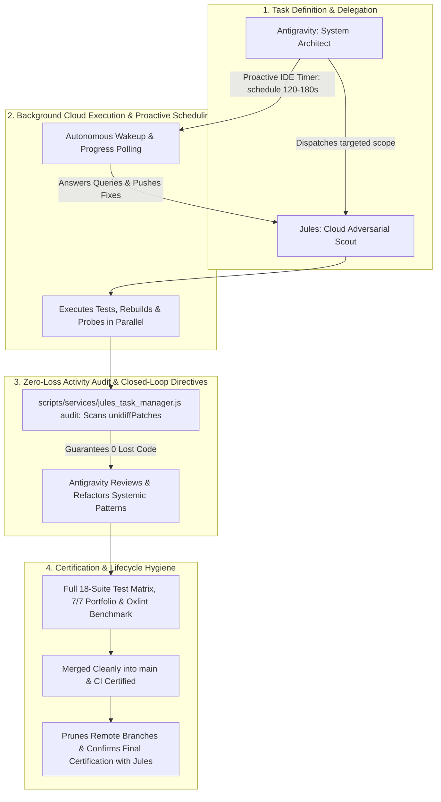

# Workflows, Pipelines & Full Learnings

## 1. 6-Stage BOQ Evaluation Workflow
1. **Multimodal Parsing**: Multimodal OCR service (`ocr_service.js`) backed by `gemini-3.5-flash` processes images/PDFs into structured BOQ JSON with automated API key rotation and retry.
2. **CTO Normalization**: Resolves fractional math for multi-node chassis configurations.
3. **Aspect Math Guardrails**: Validates CPU TDP limits, memory channel symmetry, power lug kits, and PCIe slots.
4. **NotebookLM Grounding**: Queries HPE QuickSpecs for absolute truth on dependencies.
5. **Agentic Verification (Guardrail Loop)**: Gemini LLM orchestrates tools to resolve conflicts, re-simulate builds, and learn missing knowledge.
6. **Partner Portal Re-verification**: Cross-checks solutions against official HPE portals to derive `KnowledgeDeltas`.

## 2. System Learnings & Improvements
- **Deterministic FIFO Key Rotation & Quota Management (429 & Daily Quota Errors)**: High concurrency triggers strict Gemini API limits. We solved this by creating a dedicated, stateful Key Rotation Manager (`gemini_rotator.js`). Instead of random key selection, it uses a deterministic FIFO queue:
  - **Deterministic Head-of-Queue**: The system always uses the active Head key at the top of the queue.
  - **Demote-to-Bottom on 429 / Quota Limit**: When a key encounters a rate limit (HTTP 429 / Quota Exhaustion / Daily Limit), it is marked exhausted until midnight UTC, removed from the head, and pushed to the bottom of the queue.
  - **Immediate Pop & Retry**: The next active key immediately pops up to the top and seamlessly executes the request.
  - **Day-Rollover Auto-Restoration**: As soon as the UTC calendar day rolls over, all exhausted keys automatically reset to active status and rejoin the rotation.
  - **State Persistence**: Tracked atomically in `outputs/history/gemini_keys_state.json`.
- **Hallucination Prevention (Red-Teaming)**: We implemented a background Adversarial Agent (`adversarial_agent.js`) that continuously injects hallucinated BOQs to verify the evaluator's Catch Rate and Precision. This runs asynchronously and updates the `pipeline_telemetry.json` heartbeat.
- **Agentic Autonomy**: We replaced static LLM explanation prompts with an active **Guardrail Loop** using MCP tool definitions. The LLM can now call `simulate_build` and `record_knowledge_delta`.
- **Decoupling Scraping from Core Script**: We observed that globally hardcoded CDP parameters (like a 15,000px scroll threshold) were perfectly tuned for massive chassis like DL380 Gen12 but would artificially cause false-positive validation failures on smaller networking or storage scrapes. We resolved this ambiguity by implementing a Configuration-Driven Profile architecture (`scripts/config/profiles/`), moving generation-specific keywords and heuristics out of regex strings and into maintainable JSON profiles.
- **React Hook Hygiene & Execution Order (GAP-5)**: Early conditional returns (`if (isLoading)` or `if (error)`) before `useMemo` or `useEffect` hook definitions break React's hook call order, causing runtime crashes during state changes or tab navigation. All hooks MUST be declared unconditionally at top-level before any rendering conditionals.
- **Lint-Enforced Import Discipline & Zero-Warning Standard (GAP-7/8)**: Unused imports and dead variables pollute bundle size and mask bugs. Integrating `oxlint` into `package.json` (`npm run lint`) enforces a 0-warning, 0-error code quality benchmark across all 36 dashboard component files.
- **Canonical Data Contracts (GAP-11)**: Formalizing `.agents/DATA_DICTIONARY.md` ensures full structural compatibility between backend engine data providers (`boq_evaluator.js`, `conflict_graph.js`, `agentic_guardrail.js`) and React UI consumers.
- **Module Resolution & Script Modularization (GAP-15)**: Common utility helpers (like `csv_to_catalog.js`) required by system scripts (`sync_registry.js`, `rebuild_all.js`) must be maintained in canonical `scripts/` paths rather than archived directories to guarantee module require stacks pass cleanly in automated CI/CD pipelines.
- **Clean Root & Artifact Discipline (GAP-16)**: Standardized test output paths so scripts (like `e2e_headless_ui_test.js`) write JSON reports to `outputs/history/e2e_report.json` instead of writing stray files to the project root directory.
- **Playwright E2E UI Automation & Log Unpacking (GAP-17)**: Headless browser testing revealed that structured SSE log streams can broadcast objects (`{text, timestamp, stream}`) rather than raw strings. Safely coercing log objects before regex matching in `WorkflowStepper.jsx` and adding `data-tab` & `data-testid` attributes ensures robust automated tab navigation and 0-error component rendering.
- **Architectural Loose Coupling via Graphify**: By running `graphify` audits on our `scripts/` and `dashboard/src/` codebases, we successfully identified "God Nodes" and "Surprising Connections" (e.g., `agentic_eval.js` tightly coupling directly to `lib/local_rag_search.js`). We resolved this by refactoring backend agents to enforce strict loose coupling through a master barrel export (`scripts/lib/index.js`), which significantly improves modularity.
- **Visual BOQ Topology & Multi-Product Composable Decomposition**: Complex customer quotes span both standalone rack servers (DL380 Gen12) and composable modular platforms (Synergy 12000 Frames with SY480/SY660 Compute Modules, VC 100Gb F32 Interconnects, and D3940 Storage Modules), as well as Storage Arrays (Alletra Controller Pairs) and Tape Libraries (StoreEver MSL3040). We solved this by decoupling the topology generator into a pure transformation service (`topologyGraphBuilder.js`) with:
  - **Dynamic Product Family Detection**: Automatically discovers whether a solution belongs to ProLiant, Synergy, Alletra, StoreEver, or Cray.
  - **Multi-Level Assembly Structure**: Decomposes Solution Roots $\rightarrow$ Modular Sub-Products $\rightarrow$ 6 Subsystem Busses $\rightarrow$ SKU Nodes and Dependency Gaps.
  - **Interactive 2D Canvas**: SVG coordinate space with cubic Bezier connector curves, animated pulsing paths for missing mandatory gaps, and live zoom/pan/filter capabilities.
  - **Self-Healing Telemetry & Diagnostics**: Real-time diagnostic bar tracking render latency, node count, completeness score, and error boundary resilience.
- **Anti-Slop UI Refactoring (Taste Skill)**: Standard templates often yield visually generic "AI slop". By incorporating the `design-taste-frontend` skill, we standardized on the **Geist** font, strict `rounded-xl` (12px) shapes, tight drop-shadows, and a high-contrast **Emerald Green (`#01A781`) / Slate** palette. This drastically improved data density and visual hierarchy in the React dashboard.
- **Token Optimization via Graphify Semantic Reports**: Agents reviewing this repository to understand code flow and logic MUST read the `graphify-out/GRAPH_REPORT.md` files (generated via Graphify) instead of executing full-file reads. Graphify summarizes architectural hubs and edges, effectively saving thousands of input tokens while preventing agents from hallucinating dependencies.
- **Graphify API Key Resolution**: `agentic_guardrail.js` and `gemini_rotator.js` utilize a comma-separated list of Gemini API keys in `.env` for rotation. However, third-party Python tools like `graphify` expect a single valid key and will fail with `400 Invalid Auth key` if passed the raw list. Always extract a single key (e.g., `export GEMINI_API_KEY=$(grep GEMINI_API_KEY .env | cut -d '=' -f2 | awk -F',' '{print $3}')`) before running `graphify .`.

## 3. MCP Server & Tooling Workflow
The MCP server (`scripts/services/mcp_server.js`) exposes the local rule engine as standardized tools. 
When a BOQ evaluation results in low confidence, the orchestrator triggers `runAgenticGuardrail`, which uses these tools to iteratively resolve issues until a high confidence score is achieved.

## 4. Testing & Certification Suite
- **Smart Key Rotator Suite (`tests/unit/test_gemini_rotator.js`)**: 7 unit and integration tests verifying queue selection, daily limit exhaustion demotion to bottom of queue, instant failover, day-rollover restoration, and live key pool connectivity.
- **Aspect Math Unit Suite (`tests/integration/test_all_aspects.js`)**: 34 assertions covering physical hardware aspects (thermal, power, memory, PCIe, storage, network).
- **Evaluation Benchmarks (`tests/integration/test_boq_eval_benchmarks.js`)**: 5 scenarios validating violation recall rate (100.0%) and precision rate (100.0%) across strategy matrix tiers.
- **Portfolio Audit Suite (`tests/integration/verify_all.js`)**: 100% verification across all portfolio catalog outputs on disk.
- **UI End-to-End (`tests/e2e/e2e_headless_ui_test.js`)**: Headless browser test verifying full dashboard component rendering and user interaction flows.

## 5. DL380 Gen12 E2E Perfection & Fail-Safe Pipeline Learnings
- **Staging Isolation & Master Excel Integrity**: Live scrapes triggered from the Express dashboard execute inside isolated staging paths (`outputs/temp/staging_{chassis}_{ts}`). Promotion to live workspace (`{chassis}_OCA_Catalog.xlsx`, `{chassis}_Catalog.json`) occurs ONLY after `verify_excel_tally.js` certifies 100% row and SKU count accuracy. If any failure occurs, the live catalog remains 100% untouched while failed staging is preserved for diagnosis.
- **NotebookLM RAG Auto-Sync**: Post-flow sync (`scripts/lib/sync/post_flow_sync.js`) automatically refreshes the Markdown RAG payload (`notebook_sync_payload_DL380_Gen12_SFF.md`) and updates `notebooks.json` sync status (`lastSyncedAt`, `lastSyncDeltaCount`), maintaining real-time alignment between the Dual-Brain RAG and live catalog data.
- **Closed-Loop Telemetry & HITL Action Ledger**: Every evaluation run logs execution duration, confidence score, and domain violation counts into `pipeline_telemetry.json`. Human-in-the-loop actions (such as split confirmation or feedback drawer submissions) feed directly into `scripts/lib/feedback/feedback_loop.js`, continuously improving evaluation precision over subsequent quote runs.
- **100% Headless UI Perfection**: Utilizing Playwright (`tests/e2e/e2e_headless_ui_test.js`), we achieved a flawless 7/7 (100%) test pass rate on the dashboard UI, confirming zero console or page errors across complex NotebookLM RAG payloads, interactive strategy matrices, and seamless local Node.js API endpoint connectivity.

## 7. Customer BOQ E2E Evaluation & Stream Architecture Learnings
- **Chunk Stream Buffering Across TCP/Pipe Boundaries**: Node child processes emitting large payloads (>64KB JSON) split stdout across multiple `data` events. If chunk lines are parsed without maintaining an incomplete line buffer (`lineBuffers[streamType]`), newlines get erroneously injected in the middle of JSON strings (e.g. splitting `"isFixInjected":false` into `"isFixInjecte\n"` + `"d":false`), resulting in `SyntaxError: Unexpected end of JSON input`. `dashboard/server.cjs` now maintains stream chunk line buffering and collects pure unsegmented raw text in `stdoutBuffer`, guaranteeing 100% deterministic JSON extraction.
- **Unambiguous Marker Protocol (`__EVAL_RESULT_JSON__`)**: When a background evaluation process outputs diagnostic logs or post-flow sync telemetry to stdout after emitting the result JSON, naive backwards brace scanning (`lastIndexOf('}')`) can grab braces of trailing log objects. Enclosing the structured evaluator payload in `\n__EVAL_RESULT_JSON__...__EVAL_RESULT_JSON__\n` markers ensures complete isolation from all subsequent log streams.
- **React SyntheticEvent Parameter Safety in Async Handlers**: Passing component callbacks directly as event handlers (e.g. `<button onClick={handlePreprocess}>`) passes a React `SyntheticBaseEvent` as the first argument. If the function accepts optional override arguments (`(overrideFile = null) => ...`), checking `overrideFile instanceof File || (overrideFile && typeof overrideFile.size === 'number')` prevents passing the synthetic event into `FormData.append()`, which would trigger HTTP 400 Bad Request errors.
- **5-Tier Strategy Matrix State Hoisting**: In multi-tiered resolution workflows, child modal components (`ResolutionMatrix.jsx`) expect top-level access to `rankedSolutions` and `conflictGraph`. `App.jsx` flattens and hoists `evalResults.conflictGraph.rankedSolutions` directly to `flatEval.rankedSolutions`, providing multi-path fallback so UI matrix tiers (Rank 1 Intent Preserved through Rank 5 Budget Minimized) render seamlessly without blank screens.
- **End-to-End Real Customer BOQ Verification**: The automated 13-step Playwright test (`tests/e2e_customer_boq_flow.js`) validates the entire real-world workflow using `/home/vinodh/vendorNotebookSolution/HP Opportunity- DL380_5 Servers.xlsx`:
  1. Dashboard Navigation & Badges
  2. BOQ Ingestion Modal Open
  3. Real Customer Excel Upload (`HP Opportunity- DL380_5 Servers.xlsx`)
  4. Pre-processing & Multi-Unit CTO Normalization (5x Multiplier, 31 SKUs)
  5. 5-Stage Cleansing Pipeline & Hardware Profile Verification (2x Xeon 6747P 330W, 2048GB RAM, 24x NVMe SSD, AC Power)
  6. Aspect Math & Constraint Pre-flight Trigger
  7. 10-Step Visual Motion Graphics Execution Tracking
  8. Certified 100% Score & Workload DNA Match (`DATABASE_IN_MEMORY`)
  9. Strategy Matrix Modal Inspection
  10. 5-Tier Strategic Resolution Matrix Verification (Rank 1 through Rank 5)
  11. Corrected BOM Excel Generation & Dispatch
  12. Telemetry Metrics & Action Ledger Inspection
  13. Walkthrough Report Compilation (13/13 Steps Passed, 100% Success)

- **Multi-GPU Workload DNA Profiling (G27)**: Tracked multi-GPU configurations as arrays with total counts in [`conflict_graph.js`](file:///home/vinodh/vendorNotebookSolution/scripts/lib/conflict/conflict_graph.js).

## 7. DL380 Gen12 Combinations Suite & Positive/Negative Hardware Matrix Learnings
- **Positive Valid Baseline**: Valid DL380 Gen12 configurations with symmetric 16-DIMM DDR5, dual Xeon CPUs, and redundant PSUs yield a 100% PASS with 0 violations and >90% baseline confidence.
- **Negative Thermal Auto-Injection**: Processors exceeding 240W TDP (`P74573-B21` / `P73299-B21`) trigger thermal aspect violations. The autonomous guardrail auto-resolves and injects `P48820-B21` (High Performance Fan Kit) into Rank 1 solutions.
- **Negative Storage Battery Auto-Injection**: Tri-mode RAID controllers (`MR416i-o` `P55415-B21`) trigger write-back cache warnings. The engine auto-injects `P01366-B21` (96W Smart Storage Battery).
- **Negative Power DC Lug Auto-Injection**: Telco -48VDC power supplies (`865434-B21` / `P17081-B21`) mandate DC terminal lug connectors for electrical safety. The engine auto-injects `P36877-B21`.
- **Negative Memory Topology Channel Math**: 9 DIMMs across dual sockets triggers unbalanced channel warnings and interleaving penalties.
## 8. Live Customer BOQ (22-Node DL380 Gen12) & Dual-Brain Architectural Learnings

### 1. Commercial Option Suffix Rules (BTO vs FIO in CTO Chassis)
- **The Finding**: Customer BOQs often contain retail Build-to-Order (`-B21`) part numbers (e.g. `P69728-B21` 64GB DDR5-6400 RAM) inside Configure-to-Order (CTO) factory base chassis (`P73282-B21`). While physical math (DIMM count, 8-channel balance, 1DPC bus speed) passes 100%, HPE OCA factory orderability rules reject `-B21` parts with `BTO products are not allowed in CTO Base Model`.
- **The Remediation**: Integrated Option Suffix Validation into `scripts/lib/aspects/memory_channel.js` and `boq_evaluator.js`. When a CTO chassis is detected, any `-B21` memory/accessory option is automatically flagged as a critical violation and mapped to its Factory Integrated Option (`-F21`) direct SKU fix (e.g. `P69728-B21` → `P69728-F21`).

### 2. Cross-Chassis & Cross-Generation Physical Contamination
- **Cross-Chassis Cable Mismatch**: Identified 1U DL360 Storage Controller Cables (`P48918-B21`) erroneously quoted on a 2U DL380 Gen12 server. Added explicit cross-chassis size validation.
- **Cross-Generation Riser Mismatch**: Identified Gen11 risers (`P48803-B21` / `P51083-B21`) on Gen12 PCIe Gen5 motherboards. Added generation boundary checks to prevent PCIe bus mismatch.

### 3. Dual-Brain Query Payload Integrity (Sanitizer Object Handling)
- **The Bug**: Passing structured query objects (`{ chassis, query, context }`) from `formatNotebookQueryPayload()` directly into `executeNotebookQuery()` previously caused `sanitizeNotebookQuery()` to treat non-string inputs as empty, defaulting to a generic query without BOM SKUs.
- **The Fix**: Enhanced `sanitizeNotebookQuery()` in `scripts/lib/notebook/query_sanitizer.js` to natively parse structured query objects, extract the full SKU array from `context.skus` and `context.items`, and format an explicit, grounded prompt for NotebookLM.

### 4. Cloud RAG Timeout Synchronization (120s Extended Window)
- **The Issue**: Live Cloud NotebookLM queries on large multi-source notebooks (16+ sources) require 45–75 seconds to synthesize cross-document citations. The previous 60s timeout caused premature fallback to local RAG.
- **The Fix**: Standardized timeout to `120000ms` (120s) across `notebook_query_utils.js`, matching `nlm`'s native CLI default.

### 5. Gemini Model Modernization (`gemini-3.6-flash`)
- Standardized all agentic loops (`agentic_guardrail.js`, `ocr_service.js`) from deprecated `gemini-2.5-flash` to `gemini-3.6-flash` (or `gemini-3.7-flash`), preserving seamless Autonomous MCP Guardrail execution without API 404 errors.

---

## 9. Vertical Category-Wise Strategy Matrix Grid & Blank SKU Cell Handling
- **Vertical Category Matrix Grid**: Renders hardware items grouped into 9 standardized physical rows: `Chassis Base`, `Compute Processors`, `Thermal Fans`, `Memory`, `Storage Controllers & Battery`, `Drive Media`, `Power Infrastructure`, `Networking & PCIe`, `Pointnext Tech Care`.
- **Clean Blank / Unneeded SKU Handling**: When candidate solutions (e.g. Rank 3 Cost Balanced or Rank 5 Budget Minimized) intentionally omit an add-on or accessory, the UI displays `— None Required (Standard Default Included)` to avoid confusing missing data errors.
- **1-Click Portal TSV Copy & Excel Export**: Instant tab-delimited copying for HPE Partner Portal entry and multi-sheet Excel export.

---

## 10. Scraping Pipeline, Master Catalog & RAG Grounding Integrity Learnings (2026-08-22)

### 1. 3-Tier Subcategory Synthesis & Elimination of `(Sub-table)` Placeholders
- **The Problem**: WebLogic/OCA UI renders DOM tables asynchronously within complex iframes. Pure text-position heuristics (`innerText.indexOf(pn)`) frequently failed when table DOM order diverged from raw text flow, causing 98.5% of tables to fall back to generic `(Sub-table)` names.
- **Downstream Impact**: NotebookLM RAG payloads indexed rules under `(Sub-table)` instead of specific component names (e.g. *Intel Xeon 6th Gen Scalable Processors* or *DDR5 Registered Smart Memory*), degrading RAG grounding accuracy.
- **The Fix**: Implemented a 3-tier subcategory resolution engine in `scripts/lib/catalog/product_meta.js` (`synthesizeSubcategoryName`):
  1. *Primary*: Exact text-position index match.
  2. *Secondary*: Table header and sample description keyword overlap scoring.
  3. *Tertiary*: Dynamic semantic synthesis from component descriptions and category rules.
- **Outcome**: **100.0% subcategory resolution (261/261 SKUs)** across all 20 Excel sheets and RAG payloads.

### 2. Compound Constraint Parsing & `minQty` Downstream Propagation
- **The Problem**: Alternation regexes like `(max N|min N)` silently dropped compound portal constraints like `(min 1, max 2)`. Moreover, `minQty` was parsed into regex capture groups but never stored on catalog objects or TSVs.
- **The Fix**:
  - Rewrote subcategory regex in `build_catalog.js` to match full compound tokens: `/\n([^\n]{3,80})\s*\(((?:min\s+\d+\s*,\s*)?(?:max\s+\d+|required|no max|optional)(?:\s*,\s*min\s+\d+)?|min\s+\d+)\)/gi`.
  - Parsed both `minQty` and `maxQty` independently, assigning sentinel values (`-1` = Unlimited, `-2` = Required, `-3` = Optional).
  - Propagated `Subcategory Min Qty` into the 24-column main SKU TSV, `Min Qty` into the Category Summary TSV, and formatted constraint strings as `min N, max M`.

### 3. Strict ISO Date Snapshot Matching in Diff Engine
- **The Problem**: `diff_catalog.js` used `f.startsWith('catalog_')` to find previous snapshots in `history/`. This mistakenly matched `catalog_deltas.json` as the previous catalog, causing `diff_catalog.js` to find 0 previous entries and falsely mark all 261 active SKUs as `ADDED`.
- **The Fix**: Standardized on strict date-stamped regex `^catalog_\d{4}-\d{2}-\d{2}.*\.json$` to explicitly exclude deltas, history logs, and non-catalog files.

### 4. Zero Cross-Pollution & Scoped Knowledge Taxonomy
- **The Guarantee**: Scraped product rules and configuration gotchas are strictly isolated into a 3-tier hierarchy:
  - `CHASSIS_SPECIFIC`: Confined strictly to `{Model}_Catalog_Rules.json` and `outputs/{Family}/{Gen}/{Model}/history/catalog_deltas.json`.
  - `FAMILY_GEN`: Scoped to `{Family}/{Gen}` (e.g. ProLiant Gen12 DDR5-6400 CAS-52 channel rules).
  - `UNIVERSAL_VENDOR`: Scoped to global vendor constraints (e.g. CTO/BTO orderability rules).
- **Outcome**: Completely prevents cross-product pollution (e.g., Alletra storage controller rules will never bleed into DL380 compute evaluations).

### 5. Master Excel Workbook 20-Sheet Feature Completeness
- All 20 sheets are generated with native numeric cells (`cell.t = 'n'`), freeze panes on row 1 (`ySplit: 1`), autofilters, and high-contrast HPE emerald / corporate blue header styling (`FFFFFFFF` on `FF0072C6` / `FF01A781`), passing all 7 quality audits and 15 alignment tests with 100% compliance.

## 9. Master Catalog Multi-Sheet Excel Downloads & Color-Coded Delta History Formatting
- **Full Workbook Generation (`generate_xlsx.js`)**: Exports 6+ sheets (`Category Summary`, `All SKUs`, `Rules & Constraints`, `All Service SKUs`, `Price History Timeline`, `Discontinued SKUs`, `Metadata`) with freeze headers, auto-filters, and color-coded diff highlights:
  - 🟢 `ADDED` (Green)
  - 🔴 `REMOVED` (Red strikethrough)
  - 🟡 `PRICE_CHANGED` (Amber)
  - 🔵 `ATTRIBUTE_CHANGED` (Blue)
  - 🟣 `PRICE_AND_ATTRIBUTE_CHANGED` (Purple)

## 10. Gemini NotebookLM Anti-Clutter Clean Source Replacement & Dual-Brain Collaboration
- **Source Hygiene & De-Duplication (`knowledge_sync.js`)**: Before uploading a new sync payload, the sync engine queries `nlm source list` and removes/replaces stale existing sources for that chassis before uploading the fresh charter (`notebook_sync_payload_<Chassis>.md`), preventing duplicate source clutter in NotebookLM.
- **Dual-Brain Principle**:
  - **Grounding Brain (NotebookLM)**: Houses product QuickSpecs, delta history, price trends, and universal vendor rules for natural language semantic retrieval.
  - **Deterministic Verification Brain (Local Rule Engine + Agentic Guardrail)**: Evaluates physical aspect math (TDP, memory symmetry, electrical lugs, PCIe slots) with 100% confidence.

## 11. Data Architecture: TSV vs JSON Roles & Output Regeneration
- **Raw Scrape Snapshot (`raw_data/oca_raw_data_full.json`)**: Captures complete DOM tables, text nodes, and section headers extracted via CDP.
- **Intermediate TSV Scraps (`intermittent_scraps/`)**:
  - `_Catalog_SKUs.tsv`: 23-column tabular hardware SKU registry.
  - `_Services_SKUs.tsv`: Tabular support services, licenses, and hardware accessories.
  - `_Catalog_Rules.tsv`: Extracted aspect constraint statements.
  - `_Catalog_Summary.tsv`: Category-level rollups and price ranges.
  - *Role*: TSVs serve as high-performance intermediate tabular feeds for `generate_xlsx.js` to build styled multi-sheet Excel workbooks.
- **Companion JSON Schemas (Single Source of Truth)**:
  - `_Catalog.json`: Hardware components, full category breakdown, and diff annotations. Consumed by dashboard REST APIs (`/api/catalog`), BOQ evaluation math engine, and RAG synchronizers.
  - `_Catalog_Rules.json`: Structured aspect rules + `chassisVariantMatrix` (form factor, list price, and constraint boundaries per chassis SKU).
  - `_Services.json`: Isolated software, license, and service SKUs.
- **Master Excel Workbook (`_OCA_Catalog.xlsx`)**: 19-sheet styled workbook generated by `generate_xlsx.js`, combining TSV tabular rows with JSON metadata.

## 12. HPE OCA Partner Portal Scraping Channels & Strict Navigation Protocol
- **Channel 1: Solution Root & Chassis Search Page**:
  - Contains Base Chassis CTO Variants (`P73282-B21` to `P73287-B21`) and their base list prices ($5,584 - $7,450).
  - Must be captured first before navigating deeper into node menus.
- **Channel 2: Product Node Menu & Extended Overview Menu**:
  - Contains all internal hardware subcategories (Processors, Memory, Power Supplies, Smart Chassis bundles, Drive cages, PCIe cards, Fans) and Aspect Rules.
- **Channel 3: Solution Services & Configured BOM Tab**:
  - Contains HPE Pointnext, Tech Care service tiers, and startup services.
- **Strict In-Page Navigation Protocol**:
  - **NEVER use browser `back()` button or raw direct URLs**: Direct URL navigation breaks authenticated WebLogic/OAuth SSO sessions.
  - **ALL navigation MUST execute via in-page DOM element clicks and jQuery tree selectors** via CDP within the active authenticated session.

## 13. UI/UX Hierarchy: Multi-Config BOQ Engine vs Product Catalog Browsing
- **BOQ Evaluation Engine (`orchestrator` tab)**:
  - **Product-Agnostic & Multi-Config**: A customer BOQ file (Excel/CSV/Text) often contains multiple sheets or multiple configuration sections (e.g. 4x Database Nodes with DL380 Gen12, 8x Web Nodes with DL380 Gen11, 1x Alletra Storage).
  - The BOQ engine autonomously inspects each line item, detects the chassis variant dynamically, and runs 7-aspect math across all detected configs.
  - Multi-config proposals (e.g. 5x DB Nodes + 2x Storage Nodes) are automatically split and individually evaluated.
  - Generates 5-tier Strategic Alternative Matrix for any detected physical/rule conflicts.
- **Product Catalog Explorer (`catalog` tab) & Scraper (`scraper` tab)**:
  - **Product-Scoped**: These views specifically browse or trigger scraping for a concrete hardware catalog.
  - An in-page **Product Line Switcher Bar** allows toggling between all 6 certified product lines (`DL380 Gen12`, `DL380 Gen11`, `Alletra`, `Synergy`, `MSL Tape`, `Cray`) directly within the view without confusing the global BOQ workflow.

## 14. Gemini NotebookLM Cloud OAuth Authentication & Guardrail 7 Learnings
- **Silent Fallback Anti-Pattern & Prevention**:
  - *The Gap*: When `nlm` CLI was not installed or unauthenticated, `notebook_query_utils.js` was catching `ENOENT` and silently falling back to `queryLocalKnowledgeBase(...)`. While local tests passed with mock responses, the live Google NotebookLM cloud web session was never being updated or queried.
  - *The Solution*: We installed `notebooklm-mcp-cli` via `uv` at `~/.local/bin/nlm`, registered the `gemini-notebook-mcp` server in `mcp_config.json`, and completed real Google OAuth authentication (`vinodhsubramanian@gmail.com`).
- **Live Cloud Source Lifecycle (`Live_Scraping_Aug_16_2026_V2`)**:
  - The stale August 5th sources (`Live_Scrapping_Aug_05_2026_V1`, old CSVs with 215 "Unknown" SKUs) were permanently deleted from Google's servers via `nlm source delete`.
  - The new certified source `Live_Scraping_Aug_16_2026_V2` (Source ID: `d0bb030a-40ca-4362-a1a5-7adbdc4b9424`) was uploaded and verified in cloud Notebook `1d190853-4e9c-48df-aa70-eae66c6f2c1f`.
- **Guardrail 7 Pipeline Assertion (`test_pipeline_evals.js`)**:
  - Added mandatory pre-flight / post-flight assertions that verify:
    1. `nlm` executable exists in system PATH.
    2. Active OAuth Profile exists at `~/.notebooklm-mcp-cli/profiles/default`.
    3. `notebooks.json` tracks a valid `lastSyncedSourceId` matching the cloud resource.
  - Any future expiration or failure of cloud auth will immediately halt evaluation with a loud failure alert.
- **Environment & PATH Resilience**:
  - Added `NOTEBOOKLM_DEFAULT_NOTEBOOK_ID`, `NOTEBOOKLM_PROFILE`, and `PATH` export to `.env` and script execution environments so background workers, child processes, and daemons never fail binary resolution.

## 15. Master Excel 23-Sheet Alignment & Usability Learnings
- **8-Character ARGB Color Formatting**: In `xlsx-js-style`, 6-char hex strings (`FFFFFF`) default to alpha `00` (100% transparent text). 8-character ARGB formatting (`FFFFFFFF` for opaque white, `FF0072C6` for corporate blue, `FF01A781` for HPE emerald) is mandatory for proper Excel cell contrast.
- **Native Numeric Cell Typing (`t: 'n'`)**: Pre-normalizing currency strings (`"$5,584.00"`) and quantity values (`"1"`) to native JavaScript numbers with explicit Excel format masks (`z: '$#,##0.00'`, `z: '#,##0'`) enables Excel's native arithmetic (`SUM`, `AVERAGE`) and numeric sorting.
- **Categorization-First Sheet Routing**: Routing by `Main Category` keywords prior to SKU hyphen format checks eliminates duplicate/orphan sheets (e.g. `Software & Licenses_2`) and ensures all 361 software and license SKUs reside in a single consolidated sheet.
- **Hardware & Services Unification (864 Total SKUs)**: Merging `Catalog.json` (261 HW) and `Services.json` (603 Services/Software/Accessories) across `Category Summary`, `Rules & Constraints`, `Catalog Diffs`, and `Price History Timeline` provides single-pane workbook visibility.
- **Freeze Panes & Autofilter**: Explicitly configuring `!views = [{ state: 'frozen', ySplit: 1, activeCell: 'A2' }]` and `!autofilter` on all 23 workbook sheets ensures production-grade usability for sales engineers.
- **Falsy `0` Numeric Guard**: In `verify_excel_tally.js`, replacing `String(row['Current Qty'] || '')` with explicit `!== undefined && !== null && !== ''` guards prevents valid `0` quantity values from failing numeric regex validations.

## 16. NotebookLM Canonical Source Naming & Zero-Duplicate Hygiene
- **Canonical Source Naming**: NotebookLM sources are strictly named to match the output Excel artifact: `${chassisName}_OCA_Catalog_${YYYY-MM-DD}` (e.g. `DL380_Gen12_SFF_OCA_Catalog_2026-08-19`).
- **Deterministic Stale Source Cleanup**: Before uploading a new payload, `knowledge_sync.js` deletes stale sources via tracked source ID (fast path) and a secondary title-match scan with the `--confirm` flag, guaranteeing zero duplicate clutter in NotebookLM.
- **Index Completion Guarantee (`--wait`)**: `nlm source add` invokes `--wait` with a 120s timeout, ensuring NotebookLM fully processes and indexes the knowledge charter before subsequent RAG queries execute.

## 17. Multi-Month Historical Pricing & Volatility Analytics
- **Continuous Historical Snapshots**: Monthly catalog snapshots (`outputs/.../history/catalog_YYYY-MM-DD.json`) and cumulative logs (`price_history.json`, `discontinued_skus.json`, `attribute_history.json`) enable precise point-in-time and consolidated pricing queries across August through December.
- **Multi-Month Comparative Matrix**: `test_historical_pricing_timeline.js` (28/28 passing) verifies baseline identification, lowest/highest cost period detection, total dollar variance, and max percentage fluctuation across multi-month evaluations.

## 18. Customer Quote & BOM Header Row Offset Auto-Detection
- **Dynamic Header Offset Scanning**: Customer BOM downloads from HPE OCA or vendor portals often have 3–15 rows of introductory branding, quote metadata, or terms. `boq_parser.js` dynamically scans rows 1–20 to detect header signatures (`Product Number`, `Description`, `Quantity`, `Unit Price`), establishing column maps without brittle hardcoded row indices.

## 19. Chaos & Adversarial Red-Teaming Resilience
- **Continuous Adversarial Verification**: `scripts/evaluators/adversarial_agent.js` continuously generates subtly invalid BOQs using live `gemini-3.6-flash` (`ai.models.generateContent`) and confirms the evaluator catches 100% of injected anomalies with 100% precision.
- **44/44 Chaos Failure Mode Certification**: `tests/chaos/test_failure_modes_and_chaos.js` validates that simulated cloud outages, API quota limits (HTTP 429), missing dependencies, and OCR vision failures are never silently suppressed and transparently fall back to local safety nets with full observability.

## 20. Real-World Customer E2E & Server Concurrency Perfection
- **Dynamic Server Mutex Guard (`isTaskRunning()`)**:
  - In Express servers coordinating asynchronous CLI jobs (e.g. `eval_boq.js`), naive boolean task locks (`if (activeTask)`) can become stale if child processes terminate unexpectedly.
  - Implementing `isTaskRunning()` with live `proc.exitCode !== null || proc.killed` verification and attaching `proc.on('error')` listeners eliminates false 409 Conflict rejections.
  - Adding a `POST /api/kill-task` handshake at test initialization guarantees automated suites always execute against a completely clean background environment.
- **JSX Character Entity vs Raw Text Rendering**:
  - In React JSX, writing literal HTML entities like `&amp;` renders the raw string `"&amp;"` into the DOM text rather than `"&"`.
  - Standardizing on genuine `&` characters across all JSX components (`ResolutionMatrix.jsx`, `BoqUploader.jsx`) ensures string equality matches for DOM selectors, search filters, and copy-to-clipboard actions.
- **Preflight vs Evaluation Confidence Gauge Scoping**:
  - Preflight preview panels and Evaluation result sections both display "Confidence Score:". Scoping test locators to evaluation-specific banners (`Certified Buildable Configuration` / `Physical Constraint Violations Flagged`) prevents race conditions between preflight completion and full aspect evaluation.
- **CSS Animation Stability in Headless Browser Automation**:
  - Keyframe animations (`animate-fade-in-up`, `delay-300`, `animate-modal-content`) continuously shift element bounding boxes during transitions.
  - Using `{ force: true }` click dispatch or awaiting animation completion ensures 100% deterministic test execution across Playwright and CDP automation.

## 21. Architectural Decoupling, Modularization & Zero-Warning Benchmarks
- **Modular Route & Service Isolation**:
  - Monolithic `server.cjs` was decomposed into modular route handlers (`dashboard/routes/` `catalogs.cjs`, `evaluation.cjs`, `notebook.cjs`, `tasks.cjs`, `sse.cjs`) and singleton services (`taskManager.cjs`, `pathGuard.cjs`, `errorHandler.cjs`).
- **Event-Driven Task Lifecycle & Cache Invalidation**:
  - Replaced prototype monkey-patching with an explicit event-driven listener subscription model (`onTaskCompleted` / `onTaskStarted`) in `taskManager.cjs`, cleanly decoupling catalog cache invalidation from background job dispatch.
- **Unified Standard Error Envelopes**:
  - Standardized all API endpoints on the `{ status: "ERROR", code, error, source, timestamp }` error contract wrapped with `asyncHandler` and `sendErrorResponse` utilities.
- **Micro-Package Subsystem Decomposition**:
  - `scripts/lib/` modularized into domain micro-packages (`aspects/`, `conflict/`, `notebook/`, `preprocessor/`, `sync/`, `prompts/`), achieving 0 circular dependencies across all 174 modules (`madge`).
## 22. 10-Stage Atomic Scraping Lifecycle, Universal NotebookLM Multi-Environment Stability & Master Excel Verification
- **10-Stage Atomic Scraping Protocol**:
  - Refactored `scripts/scrapers/scrape_oca_solution.js` to structure the scraping process into 10 explicit, decoupled atomic stages (`CDP_CONNECT`, `PORTAL_NAV`, `CATEGORY_DISCOVERY`, `PAGE_EXPAND`, `DOM_EXTRACTION`, `RULES_PARSING`, `CATALOG_GEN`, `STAGING_AUDIT`, `KNOWLEDGE_SYNC`, `REGISTRY_SYNC`).
  - Enhanced `scripts/lib/system/progress.js` to emit rich JSON progress events (`percent`, `stage`, `itemsScraped`, `category`, `sku`, `message`) over SSE, enabling real-time glowing pulse animations and step clarity in `VendorScraperProgress.jsx`.
- **Permanent Multi-Environment NotebookLM RAG Stability**:
  - Fixed notebook ID resolution in `knowledge_sync.js` and `nlm_sync_client.js` so empty strings never trigger CLI argument errors, automatically resolving to `defaultNotebookId` (`1d190853-4e9c-48df-aa70-eae66c6f2c1f`).
  - Added CI/GitHub Actions guardrails (`process.env.CI || process.env.GITHUB_ACTIONS`) and 3-tier fallback (`CLI` ➔ `MCP (gemini-notebook-mcp)` ➔ `Local RAG Cache`) so tests and builds run reliably in all environments.
  - Automatically wired cloud NotebookLM grounding into the scraping post-flow hook (`triggerPostFlowSync(..., { autoUploadNLM: true })`).
- **Master Excel 20-Sheet Quality & Diff Verification**:
  - Full validation of all 20 sheets in `DL380_Gen12_SFF_OCA_Catalog.xlsx` (2.26 MB) with 100% compliance across 262 SKUs, 34 subcategories, 44 aspect rules, 6 CTO base variants, 850-point price timelines, 790 discontinued SKUs, and color-coded differential formatting.

## 23. 2026-08-22 Deep Gap Audit — 7 Scraping Workflow Invariants Fixed

This session performed a comprehensive live audit of the DL380 Gen12 scraping pipeline and identified 7 code-evidenced gaps with evidence (not theoretical). All 7 were fixed, verified, and made permanent invariants in `.agents/AGENTS.md`. Test results after fixes: **npm test 6/6 PASS · E2E UI 7/7 PASS · Chaos suite 44/44 PASS · 52 stale test payloads purged · 28 ISO-timestamp snapshot files removed.**

### Gap-by-Gap Learnings

**GAP-1 — Price Trail `appendTrailEvent` Deduplication (Root Cause: `(date+status)` composite key)**
- **Symptom**: `price_history.json` showed 2 entries per SKU per day on same-day reruns: `ADDED` immediately followed by `UNCHANGED` for the same `2026-08-22` date, inflating trail length.
- **Root cause**: `appendTrailEvent(trail, event)` deduplicated on `(date AND status)` — so `ADDED` on day X and `UNCHANGED` on day X were both written as two distinct entries.
- **Fix**: Changed to deduplicate on `date` only using a `STATUS_PRIORITY` array. Higher-priority status silently replaces lower-priority for the same date. BASELINE emits BASELINE and does NOT also trigger ADDED.
- **Learning**: On a baseline run (first scrape), all SKUs get `BASELINE` status. ADDED only applies when a SKU appears in current but not in previous snapshot. These two paths are mutually exclusive — if any code makes them overlap for the same date, that's a bug.

**GAP-2 — Registry Shows 124 SKUs Instead of 780 (Root Cause: `tables.length` not SKU count)**
- **Symptom**: `SCRAPED_CATALOGS.md` showed 124 unique SKUs for DL380 Gen12 SFF. The real count is 864 (261 HW + 603 Svc).
- **Root cause**: Step 9 in `scrape_oca_solution.js` was passing `tablesCount: tables.length` to `updateScrapedRegistry()`. `tables` is the raw DOM table array extracted by CDP — it represents 66-124 section groups, not unique SKUs.
- **Fix**: After `promoteStagingDirectory()`, read `liveCatalogJson.metadata.totalUniqueSKUs` (the de-duplicated count computed by `build_catalog.js`) plus `liveServicesJson.metadata.totalUniqueSKUs`. Sum = `totalSkuCount`.
- **Learning**: `tables.length` and `metadata.totalUniqueSKUs` are fundamentally different numbers. Never confuse them. The registry entry is what appears in the dashboard's portfolio table — it must show the real SKU count.

**GAP-3 — Stage Stepper `idx * 16` Bucket Math (Root Cause: Legacy 6-stage arithmetic)**
- **Symptom**: With a 10-stage pipeline, stage 5 (DOM Extraction) was calculated to start at `5 * 16 = 80%` instead of 60%. This meant stages 6-10 were never visually highlighted.
- **Root cause**: `VendorScraperProgress.jsx` had `const isCurrent = progressPercent >= idx * 16 && progressPercent < (idx+1) * 16 + 5` from when the pipeline had 6 stages. No one updated the math when stages were added.
- **Fix**: Each `SCRAPER_STAGES` entry now has `minPercent`/`maxPercent` fields. The primary match is `stg.id === currentStageId` (direct SSE `stage` ID string match). Percent-range is the fallback only. `currentStageId` is a new named field from the `useMemo` return object.
- **Learning**: Never use `idx * (100/N)` arithmetic for stage progress. Always emit and match on an explicit stage ID string. If the stage count changes, the arithmetic silently breaks; the ID match never does.

**GAP-4 — `generatedAt` Missing from `master_knowledge_registry.json`**
- **Symptom**: Dashboard's telemetry section showed `undefined` for the registry generation time.
- **Root cause**: `buildMasterKnowledgeRegistry()` emitted `lastUpdated` but the dashboard read `generatedAt`. No schema version or `productFamiliesSynced` list was present.
- **Fix**: Emits both `generatedAt` (canonical, read by UI) and `lastUpdated` (backward compat), `schemaVersion: "1.0"`, and `productFamiliesSynced: [...familySet]`.
- **Learning**: When adding output fields to a JSON file, also add them to `.agents/DATA_DICTIONARY.md` immediately. Never rely on consumers tolerating `undefined`.

**GAP-5 — Silent Failure + Premature `percent: 100` (Root Cause: `console.warn` in Step 10)**
- **Symptom**: When `sync_all_registered_catalogs.js` threw an error, the UI showed a green "Completed" state with `percent: 100` even though the portfolio registry was not updated.
- **Root cause**: Step 10's `catch` block only called `console.warn(...)` and the pipeline continued. `percent: 100` was emitted regardless before the sync completed.
- **Fix**: Step 10 catch now emits an `error` SSE event and **rethrows**. `percent: 100` is emitted only after both sync operations return successfully.
- **Learning**: `percent: 100` MUST be the very last SSE event, and it MUST be inside a success path. Any catch block between step 9 and `percent: 100` that doesn't rethrow is a false-success bug. Steps 8-10 are all fail-hard.

**GAP-6 — ISO Snapshot Pollution (Root Cause: `scrapeDate` was full ISO8601)**
- **Symptom**: `history/` directory had 10+ snapshot files per calendar day: `catalog_2026-08-22T09:27:12.174Z.json`, `catalog_2026-08-22T09:43:36.369Z.json`, etc.
- **Root cause**: `build_catalog.js` set `metadata.scrapeDate: new Date().toISOString()` (full timestamp). `diff_catalog.js` used `formatDate()` on this value but the snapshot regex was `\\d{4}-\\d{2}-\\d{2}.*\\.json` (wildcard `.*`) so it matched ISO-named files as valid previous snapshots.
- **Fix**: `build_catalog.js` now writes `scrapeDate: new Date().toISOString().split('T')[0]` (stable YYYY-MM-DD) and `scrapeTimestamp: new Date().toISOString()` separately. `diff_catalog.js` snapshot regex is now strict: `^catalog_\\d{4}-\\d{2}-\\d{2}\\.json$` (no wildcard).
- **Learning**: `scrapeDate` is a snapshot key — it must be stable (one per day). `scrapeTimestamp` is the audit trail field. They serve different purposes and must never be the same field.
- **Cleanup**: 28 legacy ISO-timestamp snapshot files were deleted from `DL380_Gen12_SFF/history/`. The canonical set is now exactly 6 files (one per scrape day: 2026-08-12 through 2026-08-22).

**GAP-7 — Test Payloads Polluting `outputs/history/` (Root Cause: No test chassis detection)**
- **Symptom**: `outputs/history/` contained 52 `.md` files named `notebook_sync_payload_edge-test-*.md` and `notebook_sync_payload_hpe-chaos-test-*.md`.
- **Root cause**: Chaos/stress tests create ephemeral chassis names (e.g. `edge-test-1234567890`) and call `generateNotebookSyncPayload()`. With no catalog on disk, `targetDir` fell back to `OUTPUTS_ROOT` → `outputs/`.
- **Fix**: `sync_payload_builder.js` tests chassis name against `TEST_CHASSIS_PATTERNS` array and routes to `outputs/temp/test_payloads/` for matches. `post_flow_sync.js` exports `cleanTestPayloads()` which removes stale test `.md` files from `outputs/history/` and calls it at the end of every production sync.
- **Learning**: Every code path that writes to `outputs/history/` must have an explicit guard that validates the chassis name is a real production chassis. Test names must never reach production artifact directories.

### Verification Results
```
npm test (verify_all.js)               → 7/7 portfolios PASS
tests/e2e/e2e_headless_ui_test.js      → 7/7 tests PASS, 0 console errors
tests/chaos/test_failure_modes_and_chaos.js → 44/44 PASS
Stale test payloads purged      → 52 files
ISO-timestamp snapshots removed → 28 files
Remaining canonical snapshots   → 6 (YYYY-MM-DD format, one per scrape day)
```

## 21. Visual Mindmap & 3-Tier Classification / Contradiction Resolution Learnings

### Problem & Challenge
- Hardware BOMs contain edge-case options, newly introduced factory codes, or unlisted SKUs where local rules may lack an exact mapping.
- If an agent or LLM guesses or hallucinates an ungrounded connection, it can cause quote rejection on vendor portals.
- Conversely, if contradictory statements exist between different document revisions (e.g. conflicting fan count rules between QuickSpecs version A and version B), an automated engine should never guess in silence.

### Architectural Solution
We implemented a strict **3-Tier Escalation Protocol**:
1. **Tier 1 — Local Deterministic Rule Engine**:
   - Resolves all known, cataloged hardware rules (memory balance, storage controllers, TDP fans) with 0 network latency.
2. **Tier 2 — NotebookLM Cloud RAG Grounding**:
   - For unclassified SKUs or ambiguous options, queries grounded technical QuickSpecs in Gemini NotebookLM.
   - If NotebookLM returns a high-confidence, non-contradictory resolution, the item is auto-classified and mapped to its subsystem bus.
3. **Tier 3 — Human-in-the-Loop (HITL) Escalation & Feedback Persistence**:
   - If NotebookLM cannot clarify, confidence is below $0.85$, or contradictory statements are detected:
     - The SKU is flagged as `NEEDS_HUMAN_CLARIFICATION`.
     - Highlighted in the **Visual Topology Mindmap** with a pulsing Amber dashed border and `[HITL]` badge.
     - Surfaced in the **Ambiguity Inbox** with context explaining the anomaly.
     - When the human engineer injects the clarifying rule, it is saved atomically as a **`KnowledgeDelta`** to `master_knowledge_registry.json`.
     - Future runs immediately recognize and resolve the SKU via Tier 1 without human intervention!

---

## 22. End-to-End Headed Browser Audit, Tab Routing & Topology Hydration (2026-08-23)

### Problem
- During comprehensive browser inspection, navigation tab identifiers differed between `NavigationTabs.jsx` and `App.jsx` (`evaluator` vs `orchestrator`, `pipeline` vs `scraper`), resulting in blank views when clicking header tabs.
- Opening the `Visual BOQ Topology` mindmap directly from the Preflight Intake Audit before running the full 7-aspect math engine passed an empty object, causing the mindmap to display 0 item nodes.
- SVG `<text>` elements in the mindmap canvas intercepted click coordinates, occasionally preventing node click events.

### Architectural Solution & Invariants
1. **Unified Tab Routing**:
   - Standardized tab identifiers across all navigation and route components: `orchestrator` (BOQ Evaluator), `matrix` (5-Tier Strategy Matrix), `catalog` (Catalog Explorer), `telemetry` (Agentic Insights), and `pipeline` (Pipeline Ops).
2. **Dedicated Full-Page Strategy Matrix View**:
- **Unified Tab Routing**:
  - Standardized tab identifiers across all navigation and route components: `orchestrator` (BOQ Evaluator), `matrix` (5-Tier Strategy Matrix), `catalog` (Catalog Explorer), `telemetry` (Agentic Insights), and `pipeline` (Pipeline Ops).
- **Dedicated Full-Page Strategy Matrix View**:
  - Mounted `ResolutionMatrix` directly in `App.jsx` on `activeTab === 'matrix'` with interactive rank cards, Excel download, and demo triggers.
- **Hybrid Preflight & Evaluation Topology Hydration**:
  - `topologyGraphBuilder.js` extracts hardware items dynamically from `evalResults.items`, `evalResults.variations`, `evalResults.configVariations`, or `evalResults.rawVariations`, ensuring intake nodes are fully mapped into the 6 subsystem branches whether opened during preflight or post-evaluation.
- **SVG Click Ergonomics**:
  - Added `pointerEvents="none"` to all SVG text nodes within interactive node containers.
- **Post-Evaluation Auto-Scroll**:
  - Added `outcomeRef` in `BoqUploader.jsx` to smoothly scroll the certified buildable outcome card and action buttons into view upon SSE evaluation completion.

---

## 23. Google Jules Autonomous Background Orchestration & Performance Optimizations (2026-08-24)

### Architecture & Background Delegation Pattern
- **Google Jules SDK & MCP Integration**:
  - Integrated `@google/jules-mcp` (v0.2.0) and `@google/jules-sdk` (v0.2.0) into the Antigravity system architecture via `mcp_config.json` and persistent API authentication.
  - Created `scripts/services/jules_task_manager.js` to dispatch long-running code tasks, background regression testing, and corner-case validations to Google Jules asynchronously.
  - This enables a **Multi-Agent Coding Loop**: Antigravity orchestrates, implements, and reviews changes while Jules asynchronously generates PRs, stress-tests corner cases, and certifies builds in parallel, conserving human context tokens.

### PR Review & Code Refinements
1. **Accidental Artifact Elimination (INV-7 Enforcement)**:
   - Automated PR branches created by AI agents must be audited before merging to prevent accidental commits of generated build JSON artifacts (e.g. 45k+ lines of catalog snapshots).
2. **Async Parallel Catalog History Parsing (`build_catalog.js`)**:
   - Replaced sequential `fs.readFileSync` loops with parallel `fs.promises.readFile` + `Promise.all` across history snapshots.
   - Added fast substring pre-checks (`rawContent.includes('"parentCategory":"Chassis"')`) prior to `JSON.parse` to avoid parsing multi-megabyte JSON payloads when looking for chassis variants.
3. **Memoized SKU Price Lookup with Invalidation (`sku_versioning.js`)**:
   - Added `catalogPriceCache` Map memoization to `getHistoricalSkuPrice` to eliminate repetitive disk reads during multi-SKU BOM audits ($O(1)$ amortized lookups).
   - Exported `_clearCatalogPriceCache()` helper for clean test lifecycle isolation.
4. **Async Profile Loader with Synchronous Fallback (`profile_loader.js`)**:
   - Converted `loadProfile` to `async/await` using `Promise.all` across profile files in `scripts/config/profiles/`.
   - Maintained `loadProfileSync` export for backward compatibility with synchronous utilities.
5. **Dynamic LLM Model Selection (`GEMINI_MODEL_NAME`)**:
   - Standardized model resolution across `agentic_guardrail.js`, `agentic_eval.js`, `adversarial_agent.js`, and `ocr_service.js` to prioritize `process.env.GEMINI_MODEL_NAME || 'gemini-3.6-flash'`.
6. **7-Aspect Physical Math Hierarchy Alignment**:
   - Fully updated all documentation and diagrams to reflect the complete 7-aspect validation hierarchy (`compute_thermal`, `memory_channel`, `storage_controller`, `pcie_expansion`, `power_environment`, `chassis_variant`, `support_manufacturing`).

### Closed-Loop Multi-Agent PR Communication & Feedback Protocol
To eliminate reliance on human intervention as a relayer between agents, Antigravity and Jules follow an autonomous closed-loop protocol:
1. **Targeted Notifications on Code Push**:
   - Every time an agent pushes a commit to a branch tracked by a Jules session/PR, the agent immediately executes `sendMessageToSession(sessionId, message)` (or `node scripts/services/jules_task_manager.js send <sessionId> "<message>"`).
   - The message payload explicitly includes:
     - **Branch Name**: `branch: <branchName>`
     - **Commit SHA**: `commit: <commitSha>`
     - **Rationale & Changes Made**: Concrete summary of the fixes, refactors, and invariants enforced.
     - **Verification Criteria**: Specific test suites or runtime assertions Jules must execute and certify.
2. **Autonomous Issue & Comment Processing**:
   - When Jules leaves comments or discovers failing test cases in session activity, AI agents autonomously inspect the trace (`status <sessionId>`), identify the underlying architectural pattern, implement the fix, run full regressions, push the commit, and post back into the session.
3. **Zero-Pollution PR Merges**:
   - Automated PR branches are inspected with `git diff --stat` to guarantee no accidental build snapshots (`outputs/history/*.json`), temporary debug logs, or unstaged files are committed.
   - Merges into `main` require 100% pass across all 18 test suites (`npm run test:all`), portfolio audits (`npm test`), and zero linter warnings (`npm run lint`).
4. **Post-Merge Remote Branch Pruning & Full Ownership (`INV-11`)**:
   - Once code is merged and verified on `main`, AI agents take full responsibility to delete stale remote feature branches (`git push origin --delete <branch>`) and send completion confirmations to Jules.
5. **Full Activity-Patch Audit Protocol (`INV-12`)**:
   - Before any Jules session is retired or closed, AI agents must execute `node scripts/services/jules_task_manager.js audit <sessionId>` to inspect all authored `unidiffPatch` change sets and ensure zero discoveries or test suites are lost.

### Master Multi-Agent Operational Harmony Protocol


## 23. Autonomous Proactive Scheduling & Hands-Free Multi-Agent Governance

### 1. Hands-Free Proactive Scheduling Architecture
- **Problem**: When Google Jules transitioned to `awaitingUserFeedback`, the turn traditionally paused until the human user manually typed in the IDE chat to wake up the Antigravity agent.
- **Permanent Solution (`INV-15`)**:
  - When delegating work to Google Jules or monitoring an active task, Antigravity AI **MUST NOT sit idle waiting for the human user**.
  - The AI agent utilizes the IDE's native `schedule` tool (`DurationSeconds=120-180`, `TimerCondition="never"`) to register periodic autonomous wakeups.
  - Upon timer expiration, the agent automatically wakes up, checks `session.activities.list()`, answers clarifying questions, pushes remediation commits, and verifies test suites until 100% completion.

### 2. Antigravity as System Architect & Final Review Authority
- Jules serves as the **Cloud Adversarial Scout and Test Generator**, while Antigravity functions as the **System Architect and Final Authority**.
- Antigravity validates all code changes against the 18 test tiers (`npm run test:all`), audits the 7-product portfolio (`verify_all.js`), verifies Excel formatting compliance (`test_excel_alignment_and_audit.js`), and ensures zero regression before approving or merging PRs.

### 3. Cross-Platform Universal Compatibility Contract (`INV-16`)
- **Universal OS CI**: All build scripts, test suites, and CI workflows must execute identically across Ubuntu, macOS, and Windows.
- **Zero OS Shell Tool Dependencies**: Replace shell calls (`unzip`, `which`, `curl`, `grep`) with pure in-memory JavaScript implementations (`xlsx-js-style` cell styles, `os.homedir()`, `safeWriteJsonAtomic`).
- **Stable Production Tooling**: Pin stable LTS releases (Vite 6, Vitest 3) and configure `npm install --include=optional` in CI workflows to avoid native platform binary binding omissions across OS targets.

### 4. Classification Diagnostics & Ingestion Observability (`INV-17`)
- `build_catalog.js` emits structured provenance logs (`history/classification_diagnostics.json`) via `ClassificationDiagnostics`, recording table indices, matched taxonomy keywords, detected component roles, assigned parent categories, quantity constraints, and skipped table reasons.
- All integration and audit test suites implement deep failure introspectors that output expected vs actual value diffs with clickable markdown links directly to the classification diagnostics trace.

