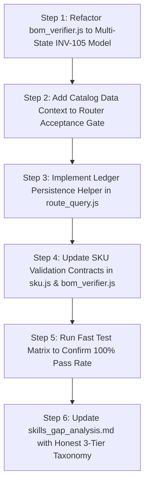

# Remediation Plan: Epistemic Rigor, Ledger Persistence, and Strict Acceptance Gate

> **Context**: Peer review (Codex) identified that while all 38 gaps were previously marked resolved, several claims exceeded what the code actually establishes:
> 1. A generated correlation string `traceId` was treated as a persisted 9-phase evidence ledger.
> 2. Broadened SKU syntax regex was equated with catalog validity and lifecycle orderability.
> 3. The 14-point pre-presentation acceptance gate (`bom_verifier.js`) used binary booleans that defaulted incomplete or un-evaluated checks to `passed: true`.
> 4. `skills_gap_analysis.md` claimed 100% resolution without delineating partial mitigations from certified implementations.

---

## 1. Architectural Principles & Invariants to Enforce

| Invariant | Principle | Remediation Mandate |
| :--- | :--- | :--- |
| **`INV-105`** | **Zero-Default Success** | Missing, undefined, or un-evaluated data MUST evaluate to `UNKNOWN` or `ACTION_REQUIRED`, NEVER `PASS` or `true`. |
| **`INV-104`** | **Non-Repudiation on Disk** | Epistemic truth requires persistent files on disk verified by SHA-256 fingerprints, never transient in-memory flags or bare strings. |
| **`INV-111`** | **Auditable 9-Phase Ledger** | Presales pipelines requiring auditability must initialize an `EvidenceLedger`, record terminal phase transitions, audit SKU decisions, and persist JSON and MD summaries to disk. |
| **`INV-0` & 4-Tier Discipline** | **Epistemic Separation** | Differentiate Tier 0 (Syntax match) $\rightarrow$ Tier 1 (Physical math) $\rightarrow$ Tier 2 (Scoped catalog presence & QuickSpecs) $\rightarrow$ Tier 3 (Live CLIC receipt). |

---

## 2. Proposed Changes by Component

### A. Pre-Presentation Acceptance Gate (`scripts/lib/boq/bom_verifier.js`)
1. **Multi-State Epistemic Check Model**:
   - Replace binary `{ passed: Boolean }` with `{ id, name, severity, status: 'PASSED' | 'FAILED' | 'UNKNOWN' | 'NOT_APPLICABLE' | 'ACTION_REQUIRED', detail, evidence }`.
   - Add helper `checkResult(id, name, severity, status, detail, evidence)`.
2. **Eliminate Default-Pass Conditions**:
   - **B1 (Physical Checks)**: Enforce `aspectChecks.length >= 7` AND ensure no aspect has status `UNKNOWN` or `NOT_EVALUATED` on standard server configurations.
   - **B4 (Financial Table)**: Enforce that all items have positive prices or explicit unpriced flags; zero-priced items without flags must evaluate to `ACTION_REQUIRED`.
   - **B6 (Unresolved Prices / INV-33)**: Check actual SKU list for missing prices rather than defaulting `hasIncompleteFlagged` to `true` when `output.hasUnresolvedPrices` is undefined.
   - **B12 (Mandatory Accessories)**: If dependency check was never run (`missingDependencies` undefined), evaluate to `UNKNOWN`, not `PASSED`.
   - **Q2 / U3 (SKU Verification)**: Explicitly separate syntax check from catalog presence check. If `catalogData` is missing, status is `UNKNOWN` with detail `"Syntax valid; catalog presence unverified (no catalog supplied)"`.
3. **Strict Gate Determination**:
   - `isValid = false` if any `BLOCK` check is `FAILED` OR `UNKNOWN`.
   - Status transitions: `FAILED` (any blocker failed) $\rightarrow$ `INCOMPLETE` (any blocker unknown) $\rightarrow$ `ACTION_REQUIRED` (warnings present) $\rightarrow$ `PASSED` (all mandatory checks affirmatively passed).

### B. Router Execution Provenance & Ledger Persistence (`scripts/evaluators/route_query.js`)
1. **Persisted Evidence Ledger for Evaluated Tracks**:
   - For tracks that synthesize or evaluate BOMs (`WORKLOAD_DNA`, `VALUE_ENGINEERING`, `LEAST_DELTA_SYNTHESIS`, `WORKBOOK_GENERATION`, `BOM_RECONCILIATION`), initialize an `EvidenceLedger` instance with terminal phases, record input SHA-256 fingerprints, and persist via `finalizeAndExport()`.
2. **Honest Provenance for Read-Only Tracks**:
   - For read-only Q&A or price lookups, explicitly record `traceStatus: 'CORRELATION_ID_ONLY'` and state that no multi-phase candidate evaluation was performed.
3. **Catalog Data Resolution for Verification**:
   - In `executeRoutedQuery`, extract `catalogData` from `responseData.catalogData`, `context.catalogData`, or `chassisInfo.catalogData` and pass it to `verifyPrePresentationAcceptance`, preventing false catalog-absence rejections.

### C. SKU Parsing vs Catalog Validity Contract (`scripts/lib/catalog/sku.js` & `ocr_service.js`)
1. **Explicit 3-Tier SKU Classification**:
   - `classifySkuValidation(sku, catalogData)` returning `{ sku, isSyntacticallyValid, isCatalogVerified, lifecycleStatus, category }`.
   - Prevents code from treating `isValidHpeSKU(s) === true` as proof of product catalog existence.

### D. Documentation Audit & Gap Realignment (`skills_gap_analysis.md`)
1. **Three-Tier Status Taxonomy**:
   - `✅ Certified & Tested`: Fully implemented and verified with passing automated tests.
   - `🟡 Mitigated & Partial`: Syntax, router dispatch, or structural framing implemented; full validation bound to specific tracks or caller inputs.
   - `⚠️ Scoped / Boundary Documented`: Architectural boundaries explicitly defined (e.g. Tier 3 live portal receipts remain pending until manual/CDP CLIC execution).
2. **Reclassify Gaps with Complete Honesty**:
   - **GAP-24**: Reclassify to `✅ Certified` after `bom_verifier.js` implements multi-state `INV-105` checks.
   - **GAP-31**: Document that syntax regexes now extract non-hyphenated SKUs, but catalog presence is a separate Tier 2 requirement.
   - **GAP-33**: Document that 9-phase ledgers are persisted for BOM evaluation and sizing tracks, with correlation IDs for read-only query tracks.
   - **GAP-30**: Document that Alletra/StoreEver unprofiled handling is an explicit architectural boundary (requires dedicated storage rules).

---

## 3. Step-by-Step Implementation Sequence

---

## 4. Verification & Testing Criteria

1. **Unit Test**: `tests/unit/test_bom_verifier.js` (or isolated tests) verifying that:
   - Incomplete data (e.g. 0 aspect checks, missing catalog, undefined pricing) evaluates to `UNKNOWN` or `FAILED`, never `PASSED`.
   - Valid, fully-formed outputs pass all checks with `PASSED`.
2. **Router Test**: `tests/unit/test_query_router.js` continues to pass 10/10 tests cleanly.
3. **Full Matrix**: `node scripts/maintenance/run_test_matrix.js --tier fast` passes 100%.
