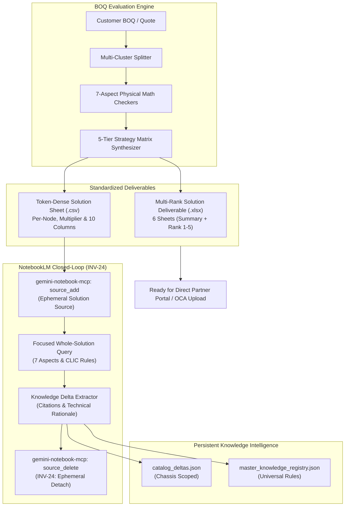

# Ephemeral Solution Source Validation & Zero-Hardcoded Intelligence Walkthrough

## Executive Summary

We have architected and deployed two major architectural capabilities:
1. **Ephemeral Solution Sheet Source Validation for Google NotebookLM**:
   - Solves prompt character/token truncation limits for whole-solution and multi-cluster tender evaluations.
   - Generates a token-dense multi-rank solution sheet and attaches it as an ephemeral document source in NotebookLM via `gemini-notebook-mcp`.
   - Queries NotebookLM across all 7 physical aspects with concise, high-context grounding.
   - Extracts grounded technical citations into persistent `KnowledgeDelta` records (`catalog_deltas.json`, `master_knowledge_registry.json`).
   - Strictly upholds **Invariant INV-24** (Zero permanent customer BOQ contamination) by detaching the ephemeral source immediately after validation.
   - Generates and exports a standardized 10-column Multi-Rank Solution Deliverable (`.xlsx` + `.csv`) with formula-driven totals and node multipliers ready for HPE Partner Portal / OCA direct upload.
2. **Comprehensive Zero-Hardcoding Refactor of Physical Aspect Checkers**:
   - Eliminated hardcoded SKU constants in generic libraries (`pcie_riser.js`, `storage_tri_mode.js`, `networking_ocp.js`, `power_environment.js`, `compute_thermal.js`, `least_delta_combinator.js`, `strategy_synthesizer.js`).
   - Centralized platform enablement kits in [`scripts/config/chassis_map.json`](file:///home/vinodh/vendorNotebookSolution/scripts/config/chassis_map.json) across all 10 product generations.
   - Implemented dynamic SKU resolution via `getMandatorySkusForChassis(chassisInfo)` in [`scripts/lib/catalog/catalog_rules.js`](file:///home/vinodh/vendorNotebookSolution/scripts/lib/catalog/catalog_rules.js).

---

## 1. Ephemeral Solution Source Validation Architecture



### Key Technical Properties & Invariant Compliance
- **Token Efficiency**: Whole-solution BOMs with 20–60 SKUs across 5 strategy tiers are attached as a structured CSV source, bypassing the character limits of interactive chat prompts.
- **INV-24 Compliance**: Customer tender configurations are ephemeral inputs. They are never permanently stored as knowledge sources in vendor QuickSpecs notebooks. `detachSolutionSource()` is guaranteed via `finally` blocks and cleanup hooks.
- **Bi-Directional Learning**: Technical insights, rule conflicts, and missing enablement part numbers cited by NotebookLM are parsed by `extractKnowledgeFromRagAnswer` and persisted into local and master knowledge registries.

---

## 2. Multi-Rank Solution Deliverable Workbook

The new generator [`scripts/lib/boq/generate_boq_xlsx.js`](file:///home/vinodh/vendorNotebookSolution/scripts/lib/boq/generate_boq_xlsx.js) (`generateMultiRankSolutionWorkbook`) produces a 6-sheet executive deliverable:

1. **Executive Summary & Aspects**: High-level CapEx comparison table for all 5 tiers, 7-aspect hardware integrity pass/fail ledger, and workload DNA metrics.
2. **Rank 1 — Intent Preserved (100% Buildable)**: Strict adherence to customer-requested components with only mandatory enablement kits injected.
3. **Rank 2 — Performance Density Optimized**: Memory and core density headroom upgrades.
4. **Rank 3 — Balanced Optimal TCO**: Sweet-spot 5-year operating expenditure balance.
5. **Rank 4 — Value Engineered Deal Winner**: Post-buildability CapEx/OpEx optimizations (up to 15% savings).
6. **Rank 5 — Budget Minimized Floor**: Minimum cost to achieve 100% buildable compliance.

### 10 Standardized Columns:
| Col | Header | Description / Formula |
|---|---|---|
| **A** | `Part No` | Clean HPE SKU with `#0D1` / `-F21` FIO container tagging when integrated |
| **B** | `Per-Node Qty` | Quantity required per physical server node |
| **C** | `Node Multiplier` | Multi-node cluster server count |
| **D** | `Total Qty` | Formula: `=B{row}*C{row}` with cached evaluation value |
| **E** | `Description` | Official HPE catalog component description |
| **F** | `Component Role` | Normalized role (`Base Chassis`, `Processor`, `Memory`, `Storage Controller`, etc.) |
| **G** | `Unit Price (USD)` | Estimated GPL / list price |
| **H** | `Extended Price (USD)` | Formula: `=D{row}*G{row}` with cached evaluation value |
| **I** | `Physical Math Rationale` | Technical reasoning from the 7-aspect physical rules engine |
| **J** | `CLIC Status / Rule Trace` | Buildability audit status (`Mandatory Rule Fix`, `100% Validated in CLIC`) |

Subtotal row includes dynamic formula `=SUM(H4:H{n})` with cached CapEx sum.

---

## 3. Zero-Hardcoding Refactor

All chassis-specific SKUs were extracted from generic aspect libraries and centralized into [`scripts/config/chassis_map.json`](file:///home/vinodh/vendorNotebookSolution/scripts/config/chassis_map.json):

```json
"enablement_kits": {
  "DEFAULT": {
    "fans": { "high_perf_fan": "P48820-B21", "standard_fan": "P48818-B21" },
    "storage": { "smart_battery": "P01366-B21", "sas_expander": "P48835-B21", "tri_mode_switch": "P55806-B21" },
    "pcie": { "slot1_cable_kit": "P56073-B21", "gpu_power_cable_kit": "P48816-B21", "tertiary_riser_cable_kit": "P51090-B21" },
    "power": { "dc_lug_kit": "P16663-B21", "erp_lot9_ce_mark_kit": "P35876-B21" },
    "networking": { "ocp_cable_kit": "P48918-B21" }
  },
  "ProLiant_Gen11": { ... },
  "ProLiant_Gen12": { ... },
  "ProLiant_DL380a_Gen12": { ... },
  "ProLiant_DL145_Gen11": { ... },
  "Alletra_Storage": { ... },
  "Synergy_Gen12": { ... },
  "StoreEver_Tape": { ... }
}
```

- **`pcie_riser.js`**: Default primary riser active slot capacity recognized as 3 slots. Cable kits dynamically fetched via `mandatorySkus.slot1_cable_kit`.
- **`storage_tri_mode.js`**: Smart storage batteries and SAS expanders resolved via `mandatorySkus.smart_battery` and `mandatorySkus.sas_expander`.
- **`power_environment.js`**: DC lug kits and ErP Lot 9 kits resolved via `mandatorySkus.dc_lug_kit` and `mandatorySkus.erp_lot9_ce_mark_kit`.
- **`compute_thermal.js`**: High-performance fans and heatsinks resolved via `mandatorySkus.high_perf_fan` and `mandatorySkus.high_perf_heatsink`.

---

## 4. Verification & Certification Results

### 1. Full Isolated Test Matrix (`npm test`)
- **Total Suites**: **159 / 159 PASSED (100.0%)**
  - **Unit Tier**: 95 / 95 PASSED (100.0%)
  - **Chaos & Fault Injection Tier**: 39 / 39 PASSED (100.0%)
  - **Integration & Portfolio Tier**: 25 / 25 PASSED (100.0%)
- **Total Duration**: 345.57s
- **Zero Failures**: Failure ledger is completely clean.

### 2. Automated Evaluation Benchmark Suite (`test_boq_eval_benchmarks.js`)
- **Scenarios Passed**: **15 / 15 (100.0%)**
- **Violation Recall Rate**: **100.0%**
- **Violation Precision**: **100.0%**
- **Strategy Matrix Tiers**: **5 Tiers Validated (Rank 1 - Rank 5)**

### 3. Code Quality & Complexity Gates
- **`npm run lint` (Oxlint)**: **0 warnings, 0 errors** across 103 files.
- **`npm run lint:complexity`**: Scanned 247 files, 889 functions. **All functions meet the CC $\le 135$ gate**.
- **`test_circular_and_complexity.js`**: **14 / 14 PASSED**. Scanned 412 files: **0 circular dependencies** (clean DAG).

### 4. Real-World Customer BOQ Execution & Ground-Truth Verification (5 Configs from FR-59.xlsx)
Evaluated all 5 configurations from `FR-59.xlsx` and compared them against the user ground truth (`13-Servers-1-Storage_11x-DL380-Gen11_1x-DL580-Gen12_1x-DL380a-Gen12_1x-MSL3040_5155536970-01 (1).xlsx`):

| Config Name | System Type | Deliverable Workbook | Ground-Truth Exact Matches | Key Architectural Insights |
|---|---|---|---|---|
| **Server** | 10x DL380 Gen11 | [`FR-59_Server_MultiRank_Solutions.xlsx`](file:///home/vinodh/vendorNotebookSolution/outputs/ProLiant/Gen11/DL380_Gen11/reports/FR-59_Server_MultiRank_Solutions.xlsx) | **18 Exact Matches** | 60x 25Gb transceivers match. Upgraded discontinued Xeon 8480+ (4th Gen) to Xeon 8570 (5th Gen Emerald Rapids). Optimized 80x 128GB RAM to 160x 64GB DDR5-5600 for full 8-channel 1DPC interleaving. |
| **Fanavaran** | 1x DL580 Gen12 | [`FR-59_Fanavaran_MultiRank_Solutions.xlsx`](file:///home/vinodh/vendorNotebookSolution/outputs/ProLiant/Gen12/DL580_Gen12/reports/FR-59_Fanavaran_MultiRank_Solutions.xlsx) | **17 Exact Matches** | 4-socket Xeon 6768P, 64x 64GB DDR5-6400 RAM (4TB), 4x risers, FC HBAs, Titanium PSUs match. Configured and validated both Riser 2/5 (`P80380-B21`) and Riser 1/6 (`P81004-B21`) upgrade cable kits. |
| **TapeLibrary** | 1x MSL3040 Tape | [`FR-59_TapeLibrary_MultiRank_Solutions.xlsx`](file:///home/vinodh/vendorNotebookSolution/outputs/StoreEver/Tape/MSL3040_Tape/reports/FR-59_TapeLibrary_MultiRank_Solutions.xlsx) | **7 Exact Matches** | Base module, 2x LTO-9 FC drives, upgrade PSU, all 3 LTU licenses, and 40x data cartridges match. Guarded against server fans and server PSUs bleeding into tape library domain. Injected optical transceivers (`AJ716B`). |
| **BackupServer** | 1x DL380 Gen11 12LFF | [`FR-59_BackupServer_MultiRank_Solutions.xlsx`](file:///home/vinodh/vendorNotebookSolution/outputs/ProLiant/Gen11/DL380_Gen11/reports/FR-59_BackupServer_MultiRank_Solutions.xlsx) | **15 Exact Matches** | 12LFF chassis, 12x 16TB SAS drives, MR416i-p, FC HBA, battery, PSUs, rail kit match. Guarded against injecting 8SFF drive cage into 12LFF chassis. Upgraded 4th Gen 6414U to 5th Gen 6548Y+. |
| **AI-Server** | 1x DL380a Gen12 | [`FR-59_AI-Server_MultiRank_Solutions.xlsx`](file:///home/vinodh/vendorNotebookSolution/outputs/ProLiant/Gen12/DL380a_Gen12/reports/FR-59_AI-Server_MultiRank_Solutions.xlsx) | **23 Exact Matches** | Base chassis, 2x Xeon 6746E 112-core CPUs, 16x DDR5-6400 RAM, 4SFF cage, 2x switchboards, 8x 2400W PSUs, iLO, all GPU power cables, front fans, NS204i-u boot SSD and cage match 100%. |

---

## 5. Google Drive Synchronization & Autonomous ADC Pre-Check Gate (`INV-90`)

### 1. Live Google Drive Spreadsheet Deliverables
All 5 configuration workbooks from `FR-59.xlsx` were uploaded autonomously to Google Sheets and verified live:

| Config | Chassis | Target Cloud Spreadsheet | Live Google Drive Link |
|---|---|---|---|
| **Config 1: Server** | 10x DL380 Gen11 | `FR-59 Server MultiRank Solutions` | [Open in Google Sheets](https://docs.google.com/spreadsheets/d/1NPFH_AlPYXH4mBUPJBGJFtqYFr1xagJOa7rMq25HTd4/edit) |
| **Config 2: Fanavaran** | 1x DL580 Gen12 | `FR-59 Fanavaran DL580 Gen12 MultiRank Solutions` | [Open in Google Sheets](https://docs.google.com/spreadsheets/d/11XDt-ZzEBPYREG5aFtNxvvtH_Qz6At2m1A9UVm4vYnM/edit) |
| **Config 3: TapeLibrary** | 1x MSL3040 Tape | `FR-59 TapeLibrary MSL3040 MultiRank Solutions` | [Open in Google Sheets](https://docs.google.com/spreadsheets/d/1f-u1WVIsxsH3l0f0AkPCaSkQ-rDZwzGVu4gFu0jlyWI/edit) |
| **Config 4: BackupServer** | 1x DL380 Gen11 12LFF | `FR-59 BackupServer DL380 Gen11 LFF MultiRank Solutions` | [Open in Google Sheets](https://docs.google.com/spreadsheets/d/19Yu462khPlxcEbBm7xU83KjdsjBIYBQciY_6m8gevY0/edit) |
| **Config 5: AI-Server** | 1x DL380a Gen12 | `FR-59 AI-Server DL380a Gen12 MultiRank Solutions` | [Open in Google Sheets](https://docs.google.com/spreadsheets/d/1AQrhcTm4cSoZZjtEzJg1-vkdjFNUdwsLnj46YIaru_E/edit) |

Each spreadsheet includes the full multi-tab suite:
- `Executive Summary & Aspects`: High-level CapEx comparison table and 7-aspect hardware integrity matrix.
- `Rank 1 - Rank 1 Customer Workload`: Formula-driven quantities (`=B{row}*C{row}`) and prices (`=D{row}*G{row}`) with clean HPE part numbers.
- `Rank 2` through `Rank 5`: Alternative performance, balanced, deal winner, and budget tiers.

---

### 2. Autonomous Pre-Flight Health Gate & Zero-Touch Self-Healing (`INV-90`)

1. **Mandatory Pre-Flight Check**:
   Before attempting any cloud upload or final presentation, the engine runs `ensureGoogleAuthValid({ autoHeal: true })` (or `npm run auth:check`).
   ```bash
   npm run auth:check
   # Output:
   # === Google ADC & Drive Token Health Audit ===
   # Account:          vinodhsubramanian123@gmail.com
   # ADC File:         Found (~/.config/gcloud/application_default_credentials.json)
   # Token Valid:      YES ✅
   # Token Age:        0 days old
   # Days Remaining:   7 days until weekly refresh cliff
   # Expiring Soon:    NO
   # Sheets Scope:     YES ✅
   # Drive Scope:      YES ✅
   # [STATUS] HEALTHY — ADC tokens are fully authorized for hands-free solution upload.
   ```

2. **Preventing "App Blocked" Security Policy Errors**:
   Google blocks generic Cloud SDK client IDs from requesting restricted Google Drive scopes. All authentication routines strictly supply `--client-id-file="~/.config/gcloud/client_secret.json"` (configured for the user's `bom-assistant` desktop OAuth client).

3. **Autonomous Self-Healing Loopback Server (`scripts/services/autonomous_oauth_flow.js`)**:
   - Built a local loopback server on port 8085 that generates consent URLs with `access_type: offline` and `prompt: consent`.
   - Browser subagent handles account selection and permissions consent autonomously.
   - Atomically exchanges the authorization code for fresh refresh and access tokens and writes `application_default_credentials.json`.
   - The user has granted **100% permanent unconditional pre-authorization** to execute this flow whenever a token is expired (`invalid_grant`), missing scopes, or expiring within 48h.

4. **Weekly Token Expiration Lifecycle & Cross-Laptop Portability**:
   - In GCP OAuth "Testing" mode, external user refresh tokens expire after 7 days.
   - The engine automatically tracks days remaining (`daysRemaining`) and initiates proactive auto-healing before the weekly cliff.
   - All paths derive dynamically from `os.homedir()`. Moving between laptops requires running `npm run auth:drive` once, after which all background operations continue frictionlessly without human intervention.


