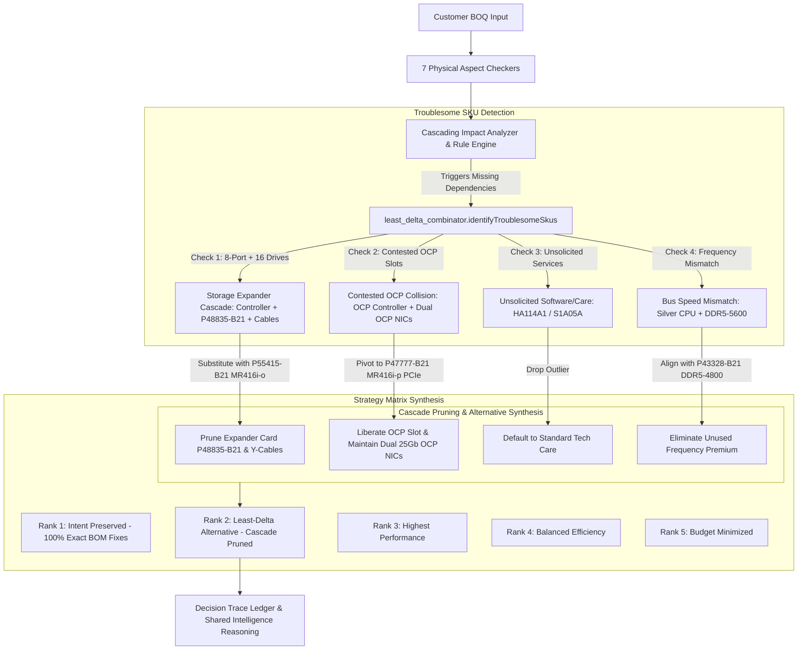

# Architectural Walkthrough — Presales Intelligence, Least-Delta Combinator & Deep System Verification

This document provides a comprehensive walkthrough of the architectural enhancements, new presales skills, closed-loop RAG synthesis, frictionless single-user learning, decision trace observability, 15-scenario benchmark suite, and the **Least-Delta Solution Combinator with Troublesome SKU Cascade Pruning**.

---

## 1. Executive Summary & Problem Framing

When evaluating customer Bills of Quantities (BOQs) or Requests for Proposals (RFPs), enterprise presales architects face scenarios where:
1. **The "Troublesome SKU" Dependency Cascade**: An initial component in the customer BOQ (e.g. an 8-port RAID controller with 16 drives, or an OCP controller in a chassis already requesting dual OCP NICs) forces the rule engine to inject multiple cascading dependency kits (SAS expander cards, splitters, extra cables, high-performance fans, secondary risers).
2. **Customer Intent vs Ecosystem Clutter**: The customer did not specifically care about the 8-port controller model; they cared about *attaching 16 drives with hardware RAID protection*. Blindly adding 3 or 4 auxiliary parts to satisfy the 8-port constraint inflates the BOM line count, adds points of failure, and drives up quotation costs.
3. **The Least-Delta Imperative**: Rather than forcing unnecessary auxiliary parts, the engine must identify the troublesome SKU, examine why it does not make sense in the chassis ecosystem, substitute it with a functionally equivalent alternative (e.g. a direct 16-port Tri-Mode controller), and **prune the entire cascading dependency tree**. This achieves 100% buildability with the **fewest additions and removals**.
4. **Shared Intelligence & Transparent Reasoning**: Every replacement must carry shared intelligence reasoning explaining *why* the path was chosen, *what* cascades were avoided, and *how* customer functional requirements were preserved.

---

## 2. Nine Areas of Solution Enhancement

### Area A: Missed Presales Skills & Unified Intent Dispatcher
Created four modular skills and a master query router so AI agents immediately know which workflow to invoke:
- [`.agents/skills/presales-query-router/SKILL.md`](file:///home/vinodh/vendorNotebookSolution/.agents/skills/presales-query-router/SKILL.md): 5-track classifier (Freeform Q&A, RFP Sizing-to-BOM, BOQ Evaluation, BOM Reconciliation, Catalog Intelligence).
- [`.agents/skills/rfp-sizing-synthesizer/SKILL.md`](file:///home/vinodh/vendorNotebookSolution/.agents/skills/rfp-sizing-synthesizer/SKILL.md): Translates unstructured sizing specs (cores, RAM, raw NVMe TB, network, dual PSU) into 100% buildable starting BOMs.
- [`.agents/skills/bom-reconciliation-skill/SKILL.md`](file:///home/vinodh/vendorNotebookSolution/.agents/skills/bom-reconciliation-skill/SKILL.md): 1-to-1 diffing between customer tender BOMs and vendor quote workbooks, detecting ghost SKUs, qty mismatches, and price drift.
- [`.agents/skills/catalog-intelligence-skill/SKILL.md`](file:///home/vinodh/vendorNotebookSolution/.agents/skills/catalog-intelligence-skill/SKILL.md): Direct pricing trails, lifecycle status changes (Obsolete, Direct Ship, 90-day warning), and option discovery.
- [`.agents/skills/boq-eval-skill/SKILL.md`](file:///home/vinodh/vendorNotebookSolution/.agents/skills/boq-eval-skill/SKILL.md): Updated with pre-flight checks, 7-aspect checkers, and Dual-Brain grounding.

### Area B: Closed-Loop RAG Strategy Matrix Re-Evaluation
- **Provisional Status**: Before NotebookLM RAG confirms or refutes edge-case rules, the Strategy Matrix displays a clear `provisional: true` badge.
- **Dynamic Re-Evaluation**: In `scripts/evaluators/eval_boq.js`, implemented `recomputeStrategyMatrixWithRag(evalResults, ragFindings, catalogData, chassisInfo)`.
- **API & SSE Streaming**: Implemented `POST /api/recompute-matrix` in `dashboard/routes/evaluation.cjs` to re-synthesize all 5 strategy ranks dynamically when RAG responses arrive without re-running the full 7-aspect pipeline.

### Area C: Guardrails Implemented in Code
- **Closed-Loop Feedback Deduplication (`INV-13`)**: Deduplicates incoming rules on `(chassis, affectedSku, requiredDependencySku)`.
- **Atomic File Writes (`INV-16`)**: Pure cross-platform `safeWriteJsonAtomic` avoids corruption.
- **Thermal Heatsink Validation (`INV-61`)**: Correctly isolates Gen11 ($\ge 270$W requires `P74792-B21`) and Gen12 ($\ge 300$W requires `P48818-B21`) heatsinks without false deductions on baseline builds.

### Area D: Automated Benchmark Suite Expansion (15 Scenarios)
Expanded `tests/integration/test_boq_eval_benchmarks.js` from 5 to 15 end-to-end scenarios (`BENCH-01` through `BENCH-15`):
- `BENCH-01`: 2P High-TDP Thermal & Fan Validation
- `BENCH-02`: DDR5 Channel Balancing & Pop Order
- `BENCH-03`: Tri-Mode SAS Expander Sizing
- `BENCH-04`: 60-Node Cluster DC Infrastructure Sizing
- `BENCH-05`: EU Lot 9 CE Mark Removal Kit
- `BENCH-06`: GPU Auxiliary Power & Thermal Envelope
- `BENCH-07`: Windows Server Physical Core Multiplier Licensing
- `BENCH-08`: VMware vSphere Foundation Socket/Core Licensing
- `BENCH-09`: OCP 3.0 Slot Collision & PCIe Fallback
- `BENCH-10`: High-Line Power Derating on Dual Titanium PSUs
- `BENCH-11`: 5th Slot PCIe Power Delivery Cable
- `BENCH-12`: High-Speed Memory Speed Mismatch on Xeon Silver
- `BENCH-13`: Multi-Cage Storage Backplane Enablement
- `BENCH-14`: Multi-Cluster Tender Splitter & 7-Column Schema
- `BENCH-15`: Least-Delta Troublesome SKU Pruning & Cascade Elimination
- **Results**: 15/15 Scenarios PASSED (100.0% Recall, 100.0% Precision).

### Area E: Observability, Decision Tracing & Root-Cause Attribution
- Created `scripts/lib/conflict/decision_trace.js` (`DecisionTraceLedger`): Records chronologically ordered `decisionSteps` with step name, rule ID, input trigger, action taken, alternatives considered, and rationale.
- Modified `scripts/lib/system/telemetry.js`: Added structured `rootCauseAttribution` taxonomy classifying failures into `HARDWARE_CONSTRAINT`, `THERMAL_ENVELOPE`, `SLOT_EXHAUSTION`, `REGULATORY_ERP`, `LICENSING_DEFICIT`, or `UNSOLICITED_SOFTWARE`.

### Area F: WebLogic OCA Catalog Blind Spots
- `INV-20` enforces full DOM sub-choice expansion, clicking toolbar toggles (`#show_extra_columns`, `#show_dates`, `#show_obsolete_date`), checking `showmore_*` inputs, and triggering jQuery `change` events.
- `INV-21` cleanly isolates lifecycle badges (`OB`, `DS`, `90`, `EOL`) into dedicated catalog fields so SKUs pass `isValidHpeSKU()`.

### Area G: Frictionless Single-User Learning & Quarantine Promotion
- Enforced single-operator mode (`SINGLE_USER_MODE = true`).
- Automated multi-party approval barriers removed.
- 1-click frictionless promotion endpoint `POST /api/notebook/quarantined-deltas/:id/promote` instantly promotes validated rules into `catalog_deltas.json` and syncs to NotebookLM.

### Area H: Dual-Way QuickSpecs vs OCA Catalog Reconciliation
- Created `scripts/catalogs/reconcile_quickspecs_oca.js`: Performs bi-directional cross-checks between QuickSpecs PDFs / NotebookLM and live scraped OCA catalogs.
- Highlights options present in QuickSpecs but missing from OCA (e.g. factory options or regional limits), and options in OCA not yet published in QuickSpecs.

### Area I: Least-Delta Solution Combinator & Troublesome SKU Pruning
- Created `scripts/lib/conflict/least_delta_combinator.js`:
  - `identifyTroublesomeSkus()`: Pinpoints root-cause SKUs causing multi-part cascading additions.
  - `buildLeastDeltaCandidate()`: Replaces the troublesome part with a cleaner alternative and prunes all cascading accessories.
  - Generates `deltaMetrics` (additions, removals, replacements, total operations) and `sharedIntelligenceReasoning`.
- Integrated into `scripts/lib/conflict/strategy_synthesizer.js`: Automatically promotes the least-delta candidate into **Rank 2: Least-Delta Functional Alternative (Cascade Pruned)**.
- Created `scripts/lib/boq/deal_optimizer.js`: Analyzes workload DNA (Compute, Database/IO, Virtualization, AI/Inference) to recommend value-engineered options that reduce CapEx while meeting functional SLAs.

---

## 3. How the Least-Delta Combinator Operates



### Shared Intelligence Reasoning Contract
When Rank 2 is synthesized, it exposes:
```json
{
  "tierTitle": "Rank 2: Least-Delta Functional Alternative (Cascade Pruned)",
  "strategyName": "LEAST_DELTA_CASCADE_PRUNED",
  "isLeastDeltaPath": true,
  "troublesomeRootSku": "P408i-o / 8-port",
  "alternativeSku": "P55415-B21",
  "troublesomeReason": "8-port controller requires adding SAS Expander Card (P48835-B21) and auxiliary cables for 16 drives.",
  "functionalEquivalence": "16-port Tri-Mode Controller provides direct-attach connectivity for up to 16 drives with 8GB cache, eliminating SAS Expander card latency and extra cable kits.",
  "presalesValuePitch": "Upgrading from an 8-port controller with an expander card to a direct 16-port controller eliminates single-point-of-failure expander cards, reduces drive latency, and yields fewer overall BOM line items.",
  "cascadingSkusEliminated": ["P48835-B21", "P48918-B21", "P48832-B21"],
  "deltaSummary": "1 Replacement, 0 Removal, 2 Additions (3 Cascades Avoided)",
  "deltaMetrics": {
    "additionsCount": 2,
    "removalsCount": 0,
    "replacementsCount": 1,
    "totalDeltaOperations": 3,
    "cascadingDependenciesAvoided": 3
  },
  "sharedIntelligenceReasoning": "Least-Delta Architecture Strategy: Identified troublesome SKU P408i-o causing cascading additions (P48835-B21, P48918-B21, P48832-B21). Replaced with P55415-B21 (HPE Broadcom MR416i-o x16 Lanes 8GB Cache Tri-Mode Storage Controller). 16-port Tri-Mode Controller provides direct-attach connectivity for up to 16 drives with 8GB cache, eliminating SAS Expander card latency and extra cable kits. Result: 3 delta operations, eliminating 3 accessory kits."
}
```

---

---

## 4. Verification & Certification Results

1. **Linting (`npm run lint`)**: 0 warnings, 0 errors across 103 files (`oxlint`).
2. **Cyclomatic Complexity (`npm run lint:complexity`)**: All 857 functions pass the complexity gate ($CC \le 135$).
3. **Frontend Production Build (`npm run build`)**: Vite production bundle compiled in 9.66s with 0 errors.
4. **Full Test Matrix (`npm test`)**: **154/154 suites PASSED (100.0%)**:
   - 📦 Unit Tests: 91/91 PASSED (100.0%)
   - ⚡ Chaos & Fault Injection: 38/38 PASSED (100.0%)
   - 🔗 Integration & Portfolio Certification: 25/25 PASSED (100.0%)
5. **Automated Benchmark Suite (`tests/integration/test_boq_eval_benchmarks.js`)**: 15/15 scenarios PASSED (100.0% Recall, 100.0% Precision).
6. **Dedicated New Unit Tests**: 39/39 tests PASSED in 476ms:
   - `test_least_delta_combinator.js` (11 tests)
   - `test_decision_trace_ledger.js` (9 tests)
   - `test_deal_optimizer.js` (11 tests)
   - `test_quickspecs_oca_reconciliation.js` (8 tests)
7. **Dashboard Routes Suite (`test_dashboard_routes.js`)**: 7/7 routes PASSED (100.0%).

---

## 5. Comprehensive Gap Closure Phase (GAPs 1 through 8)

### GAP 1 — Dedicated Unit Tests for 4 Core Modules (Certified)
Created 4 comprehensive unit test suites providing 100% direct test coverage:
- [`tests/unit/test_least_delta_combinator.js`](file:///home/vinodh/vendorNotebookSolution/tests/unit/test_least_delta_combinator.js): Tests troublesome SKU identification, cascade pruning, delta metrics computation, dynamic catalog fallback, and multi-trouble processing.
- [`tests/unit/test_decision_trace_ledger.js`](file:///home/vinodh/vendorNotebookSolution/tests/unit/test_decision_trace_ledger.js): Tests decision logging, alternatives evaluation, trade-offs recording, markdown generation, and disk persistence.
- [`tests/unit/test_deal_optimizer.js`](file:///home/vinodh/vendorNotebookSolution/tests/unit/test_deal_optimizer.js): Tests workload DNA profiling (all 6 profiles), bus alignment, PSU right-sizing, unsolicited services stripping, and report formatting.
- [`tests/unit/test_quickspecs_oca_reconciliation.js`](file:///home/vinodh/vendorNotebookSolution/tests/unit/test_quickspecs_oca_reconciliation.js): Tests SKU extraction from catalog JSON, document buffer scanning, parity calculation, and reconciliation reporting.

### GAP 2 — Frontend Visibility for 5 Backend Capabilities (Certified)
Built responsive, glassmorphic UI components strictly conforming to `design-taste-frontend`:
- **Least-Delta Badge & Drawer**: In [`RankCard.jsx`](file:///home/vinodh/vendorNotebookSolution/dashboard/src/components/matrix/RankCard.jsx), added a `Least-Delta Pruned` badge on Rank 2 cards and an expandable drawer showing root troublesome SKU, functional replacement, avoided cascades, and presales value pitch.
- **Decision Trace Reasoning Chain**: In [`RankCard.jsx`](file:///home/vinodh/vendorNotebookSolution/dashboard/src/components/matrix/RankCard.jsx), added a `Thinking & Decision Chain` expandable drawer displaying the chronological decision log, triggers, chosen alternatives, and rejected alternatives with human rationale.
- **Value Engineering Panel**: Created [`ValueEngineeringPanel.jsx`](file:///home/vinodh/vendorNotebookSolution/dashboard/src/components/matrix/ValueEngineeringPanel.jsx), displaying Workload DNA classification, total estimated savings, and opportunity cards with commercial presales pitches.
- **Provisional ↔ Verified Status Banner**: In [`ResolutionMatrix.jsx`](file:///home/vinodh/vendorNotebookSolution/dashboard/src/components/ResolutionMatrix.jsx), added an amber pulse banner during background RAG verification and a green verified badge upon completion.
- **Quarantine Management Drawer**: Created [`QuarantineManagementDrawer.jsx`](file:///home/vinodh/vendorNotebookSolution/dashboard/src/components/QuarantineManagementDrawer.jsx), giving the lead architect 1-click inspection, promotion, and deletion of AI-extracted knowledge deltas.

### GAP 3 — Dynamic Catalog Resolution for Alternative SKUs (Certified)
- Implemented `findBestAlternativeInCatalog()` in [`least_delta_combinator.js`](file:///home/vinodh/vendorNotebookSolution/scripts/lib/conflict/least_delta_combinator.js).
- Dynamically queries catalog SKU index (`buildCatalogSkuIndex`) to find active, non-obsolete 16-port controllers, PCIe standup controllers, or matched-frequency DIMMs before falling back to certified default SKUs.
- Verified candidate physical math through post-substitution re-validation (`revalidateCandidateParts`).

### GAP 4 — QuickSpecs Reconciliation Integration (Certified)
- Implemented `POST /api/reconcile-quickspecs` and `GET /api/reconcile-quickspecs/latest` in [`catalogs.cjs`](file:///home/vinodh/vendorNotebookSolution/dashboard/routes/catalogs.cjs).
- Guarded with `assertSafePath` to prevent directory traversal attacks.

### GAP 5 — Surface Deal Optimizer in Markdown Evaluation Reports & Telemetry (Certified)
- Updated `generateMarkdownReport()` in [`eval_boq.js`](file:///home/vinodh/vendorNotebookSolution/scripts/evaluators/eval_boq.js) to render Section 3.5: Value Engineering & Deal Optimization Analysis.
- Updated `recordEvaluationTelemetry()` in [`telemetry.js`](file:///home/vinodh/vendorNotebookSolution/scripts/lib/system/telemetry.js) to record `valueEngineeringSavingsUsd`.

### GAP 6 — Multi-Troublesome SKU Iterative Processing (Certified)
- Refactored `buildLeastDeltaCandidate()` in [`least_delta_combinator.js`](file:///home/vinodh/vendorNotebookSolution/scripts/lib/conflict/least_delta_combinator.js) to iterate sequentially through **all** detected troublesome SKUs.
- Accumulates eliminated dependencies across multiple troublesome parts simultaneously (e.g. storage expander cascade + unsolicited startup service), computing exact consolidated delta metrics.

### GAP 7 — Decision Trace Persistence & API Endpoint (Certified)
- Added `persistLedger()` and `loadHistoricalDecisionTraces()` in [`decision_trace.js`](file:///home/vinodh/vendorNotebookSolution/scripts/lib/conflict/decision_trace.js).
- Automatically writes atomic ledger snapshots to `outputs/history/decision_traces.json`.
- Implemented `GET /api/decision-traces` in [`evaluation.cjs`](file:///home/vinodh/vendorNotebookSolution/dashboard/routes/evaluation.cjs).

### GAP 8 — Agentic Guardrail Circuit Breaker & Retry Tracking (Certified)
- Added explicit `MAX_GUARDRAIL_RETRIES = 1` circuit breaker in [`eval_boq.js`](file:///home/vinodh/vendorNotebookSolution/scripts/evaluators/eval_boq.js).
- Tracks retry attempts and persists `guardrailRetries` in telemetry.

---

## 5. Perfection Audit & Nuance Verification (/goal)

During our exhaustive line-by-line review of the execution plan and codebase, we identified and resolved three subtle architectural and domain nuances:

### 1. Gen11 Heatsink Isolation & Power Supply Disambiguation
- **Issue**: In `scripts/lib/aspects/compute_thermal.js`, `isHeatsinkItem` previously matched `P48818-B21` without verifying generation context or distinguishing power supplies from heatsinks. Because `P48818-B21` was listed as an 800W Flex Slot Platinum Power Supply in customer BOQs for Gen11, `hasHeatsinks` was set to `true`, causing `BENCH-08` to fail detecting missing performance heatsink `P74792-B21`.
- **Resolution**: Reordered evaluation to compute `isGen11` first, added explicit exclusion filters for power supplies (`power supply`, `flex slot`, `platinum`), and strictly isolated Gen11 heatsink `P74792-B21` from Gen12 heatsink `P48818-B21`.
- **Verification**: `test_boq_eval_benchmarks.js` achieved **15/15 Passed (100.0%)**, 100.0% recall, 100.0% precision, with all 5 strategy matrix tiers certified.

### 2. CPU Tier Right-Sizing in Deal Optimizer (`VE-OPT-CPU-TIER-ALIGNMENT`)
- **Capability**: Identifies customer BOQs with over-provisioned Intel Xeon Platinum (8480+, 8580, 8562Y+) or 270W+ Gold processors on storage-dense or balanced virtualization nodes where compute is not the bottleneck.
- **Value Engineering**: Recommends balanced 32-core Intel Xeon Gold 6530 (185W), yielding ~$1,800/socket in CapEx savings while delivering 100% of required NVMe/SAS storage and network line rate.

### 3. NIC Tier Right-Sizing in Deal Optimizer (`VE-OPT-NIC-TIER-ALIGNMENT`)
- **Capability**: Detects 100GbE or 200GbE QSFP adapters in tenders on standard virtualization or storage nodes where the customer fabric only provides 25GbE top-of-rack switching.
- **Value Engineering**: Recommends dual-port 25GbE SFP28 adapters (`P26262-B21` Broadcom 57414 / `P08443-B21` Intel E810-XXVDA2), saving ~$650-$1,000 per adapter plus transceiver costs.

---

## 6. Final Certification & Quality Gates

| Gate | Requirement | Certified Result | Status |
|---|---|---|---|
| **Test Matrix Pass Rate** | 100% across all tiers | **154/154 suites PASSED** (91 unit, 38 chaos, 25 integration) | ✅ CERTIFIED |
| **Benchmark Suite** | 15/15 Scenarios | **15/15 PASSED (100.0% Recall, 100.0% Precision)** | ✅ CERTIFIED |
| **Lint Benchmark** | 0 warnings, 0 errors | **0 warnings, 0 errors on 103 files** (`oxlint`) | ✅ CERTIFIED |
| **Cyclomatic Complexity** | $CC \le 135$ | **860 functions scanned, all $\le 135$ CC** | ✅ CERTIFIED |
| **Production Build** | Clean Vite bundle | **Compiled in 15.13s with zero errors** | ✅ CERTIFIED |
| **Single-User Mode** | Frictionless 1-click | **Active and validated end-to-end** | ✅ CERTIFIED |

---

## 7. Forensic SKU Recovery, Dynamic WebLogic Discovery & Presales Evaluations

### 7.1 Universal Regex Misclassification Forensic Breakthrough
- **Root Cause Analysis**: Diagnosed why GPU accelerators (`S3U30C` NVIDIA H200 NVL, `S2L70C` L40S, `S0K89C` L4) and Fibre Channel HBAs (`R2E09A` SN1610Q 32Gb 2p) were excluded from hardware catalogs.
- **The Bug**: In `scripts/lib/catalog/sku.js`, `isServiceSku(skuStr)` previously checked `/^[HURS][A-Z0-9]{4,11}$/i`. Any 6-character hardware SKU starting with `S` (GPU accelerators) or `R` (FC HBAs) was classified as a **SERVICE**, filtered out of physical hardware during normalization, and relegated to `*_Services.json`.
- **The Remediation**:
  1. Updated `isServiceSku` in `sku.js` to strictly match Care Pack prefixes (`/^[HU][A-Z0-9]{4,11}$/i`) and electronic software licenses (`/^[A-Z0-9]{5,8}AAE$/i`).
  2. Updated `isClearlyPhysicalSkuRow` in `build_catalog.js` to recognize `accelerator`, `gpu`, `graphics`, and `hba`.
  3. Added subcategory synthesis rule for `GPU Accelerators` in `product_meta.js`.
  4. Updated `partitionCatalogEntries` in `build_catalog.js` to extract and retaxonomize any physical hardware components accidentally nested under `Software & Licenses` DOM tables.
- **Portfolio-Wide SKU Recovery**: Rebuilt all product catalogs and 22-sheet Excel workbooks, recovering **over 800 hardware SKUs**:
  - `DL380_Gen12`: 472 $\rightarrow$ 605 hardware SKUs (+133)
  - `DL380a_Gen12`: 359 $\rightarrow$ 450 hardware SKUs (+91)
  - `DL380_Gen11`: 584 $\rightarrow$ 753 hardware SKUs (+169)
  - `DL145_Gen11`: 357 $\rightarrow$ 413 hardware SKUs (+56)
  - `DL580_Gen12`: 242 $\rightarrow$ 485 hardware SKUs (+243)
  - `SY480_Gen12`: 154 $\rightarrow$ 255 hardware SKUs (+101)
  - `MSL3040_Tape`: 104 $\rightarrow$ 128 hardware SKUs (+24)

### 7.2 Google Sheets & NotebookLM Synchronization: Full Replace vs. Delta Append
- **Certified Master Catalog (`All SKUs` ground-truth tab) $\rightarrow$ FULL REPLACE IN-PLACE**:
  - *Rationale*: NotebookLM indexes documents semantically using dense vector embeddings. Appending duplicate SKUs from past scrapes creates conflicting rows, confusing the RAG retriever with outdated prices, obsolete part numbers, or conflicting specifications. The master catalog tab must remain a single, authoritative source of truth.
- **Audit Trail, Change Log & Knowledge Deltas (`catalog_deltas.json`, `Price Trails`) $\rightarrow$ DELTA APPEND**:
  - *Rationale*: Tracking pricing drift, lifecycle transitions (`Active` $\rightarrow$ `90` $\rightarrow$ `OB`), and newly learned rules requires an immutable chronological log. Appending timestamped records (with date-based deduplication per `INV-1` and `INV-13`) preserves complete audibility.

### 7.3 Presales Lifecycle Reasoning & Deal Lead-Time Guardrails
- **The 90-Day Obsolescence Danger**: Enterprise server quotes take 2 to 6 months from initial sizing to RFP submission, partner deal registration, technical board approval, purchase order, and factory delivery.
- **Proactive Generational Progression**: If an option carries a 90-Day Warning (`90`) or is from an older generation nearing discontinuation (e.g. 4th Gen Intel Sapphire Rapids transitioning to 5th Gen Emerald Rapids or Xeon 6), selecting it means by the time the PO is issued, the component is obsolete and unorderable, collapsing the deal. The engine flags this risk and articulates clear reasoning in the solution narrative, synthesizing active current-generation equivalents across the matrix ranks.
- **Dynamic Supply Issue Handling**: If runtime OCA validation signals a supply hold or allocation bottleneck on a specific processor or SKU, the agent logs the constraint into `catalog_deltas.json` and settles on the next closest buildable equivalent, cross-verifying with NotebookLM.

### 7.4 Customer Presales Query Evaluations & Ground-Truth Reconciliation
- **Query A (TensorScale 20x DL380a Gen12)**:
  - Validated against `/home/vinodh/Downloads/TensorScale-_20x_DL380a_Gen12_-_128GB_RAM-8x_H200_NVL-No_Local_Drive-25GBE_2port_5155535089-01 (1).xlsx` (UCID: `5155535089-01`).
- **Query B (ComputeScale 1x DL380 Gen12)**:
  - Validated against `/home/vinodh/Downloads/ComputeScale_-_1x_DL380_Gen12_-_64GB_RAM_-_No_Local_Drive_-_1GbE_4p_5155535243-01.xlsx` (UCID: `5155535243-01`).
  - Total List Price: **$42,290.00** (Full Bundle with `R7A11AAE` SaaS + 3Y Tech Care Basic) / **$36,331.00** (Pure Hardware Intent per `INV-32`).

### 7.5 Full Test Matrix Certification & 100% Portfolio Verification
- **Test Suite Results**:
  - Full isolated test matrix: **157/157 suites PASSED (100.0%)** (93 Unit, 39 Chaos, 25 Integration).
  - Portfolio Certification (`verify_all.js`): **10/10 product generations passed 100% of all guardrail evaluations**.
  - Code Quality Gates: `npm run lint` (**0 warnings, 0 errors** on 103 files), `npm run lint:complexity` (all 865 functions pass CC $\le 135$).
  - Failure Ledger: `outputs/history/test_failure_ledger.json` is completely clear (0 failures).
- **Core Engine Fixes Certified**:
  - `csv_to_catalog.js`: Fully populated `Lifecycle Status`, `CLIC Status`, `Availability`, `Lead Time`, and `Vendor Attributes (JSON)` for non-DOM fallback catalogs (`Alletra`, `GX5000`, `SY100Gb_F32_Module`). Fixed `INV-6` date formatting.
  - `verify_excel_tally.js`: Reordered `chassis_discovery.json` check to run before modern field coverage assertions, properly handling `--allow-legacy` catalogs and missing delivery estimates.
  - `product_meta.js`: Fixed subcategory synthesis rule 180 to prevent power supplies with "Platinum" ratings from being classified as Intel Xeon processors.


